# 新冠肺炎对美国食品配送服务的影响

> 原文：<https://towardsdatascience.com/the-impact-of-covid-19-on-food-delivery-services-in-the-u-s-47eae04655c8?source=collection_archive---------16----------------------->

## 使用谷歌移动和趋势数据来确定行业的结构变化

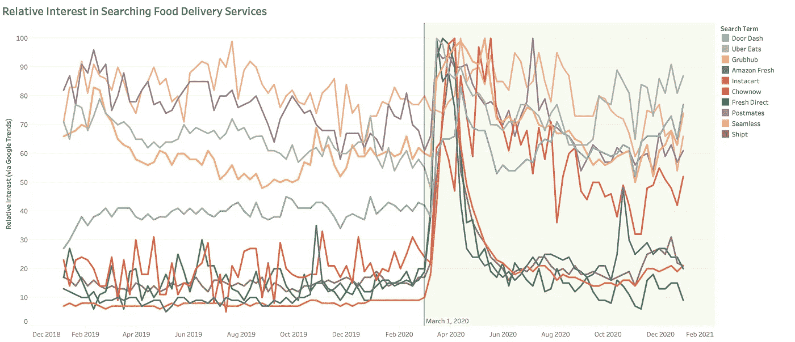

*叶夫根尼·阿列克山大罗夫、洪金和瑞恩·杨*

就在一年前，食品配送服务还在财政上苦苦挣扎。但是随着 2020 年的进展(大部分经济都在倒退)，这些公司看到了[急需的增长](https://www.marketwatch.com/story/the-pandemic-has-more-than-doubled-americans-use-of-food-delivery-apps-but-that-doesnt-mean-the-companies-are-making-money-11606340169)。

随着家庭订单的实施和全国各地不同程度的现场用餐关闭，去年春天出现了一次食品配送需求冲击。而且随着疫情的存续，对这些服务的依赖也在不断增加。

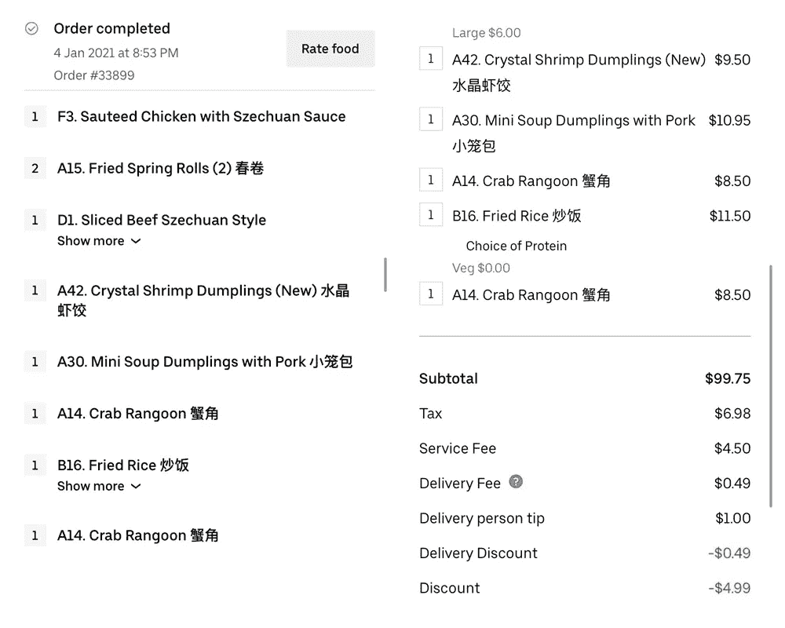

来自饥饿的杜克 MQM 学生的两个单独的订单，他们像许多在疫情的学生一样，负责任地放弃了室内用餐。请注意，六人小组将订单放在左边，三人小组放在右边。(可以理解的是，PII 被移除是为了防止食欲不振。)图片作者。

# 我们的使命

我们希望提供一份对食品配送服务、准备进入这一市场的新公司、投资者以及任何关心疫情对消费者行为的最终影响的人有用的分析。

我们想弄清楚对美国食品配送公司的需求是如何受到疫情的影响，以及人们在全国各地的不同行为方式所导致的结果。

大家心中的疑问(继“疫情何时会平息？”)就是后 Covid 世界的生活会是什么样子。因此，我们的最终目标是确定食品配送行业在 2020 年的发展是否是消费者行为真正转变的开始。

# 我们的数据

我们选择了以下品牌，这些品牌为我们提供了两种食品配送公司的良好样本:

餐馆:Door Dash，Uber Eats，Grubhub，Postmates，Seamless，Chownow

杂货:Instacart，亚马逊生鲜，Shipt，生鲜直购

在一个完美的世界里，我们应该有可访问的性能数据，如每周收入、订单或应用程序活动，但正如我们在 2020 年所了解的那样，这绝不是一个完美的世界。所以我们决定发挥创意。

**趋势数据**

我们收集了 [Google Trends](https://trends.google.com/trends/?geo=US) 数据来衡量每个州对某家公司的兴趣。Trends 记录了一段时间以来谷歌搜索词的流行程度。尽管并不完美，但我们相信这是一家公司受欢迎程度的恰当代表。当人们有兴趣使用服务时，他们通常会搜索公司名称。

为了确定趋势数据是否可以额外用作公司业绩的可接受代理，我们检查了它与公司调整后股价的相关性。

整个 2020 年唯一公开交易的食品配送公司是 Grubhub，其趋势和股价数据不相关。然而，我们认为 Grubhub 是一个不同寻常的案例，因为与 2019 年相比，2020 年的需求确实飙升，但[运营成本的上升速度](https://www.entrepreneur.com/article/363005)更快。近年来，随着这些其他服务进入美国市场，Grubhub 在美国的市场份额也在不断下降。我们的趋势数据显示了这两个因素的某种混合(在疫情开始时有显著增加，但与其他交付服务不同，相对较快地下降到疫情之前的水平)。

尽管如此，我们发现许多食品和零售公司的趋势数据与其调整后的股价相关。例如:星巴克和沃尔玛(相关系数分别为 0.483 和 0.514)。

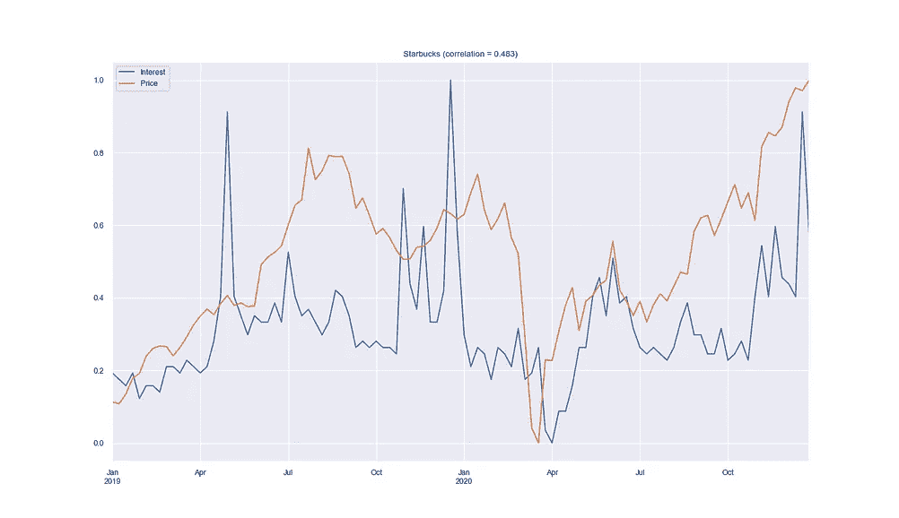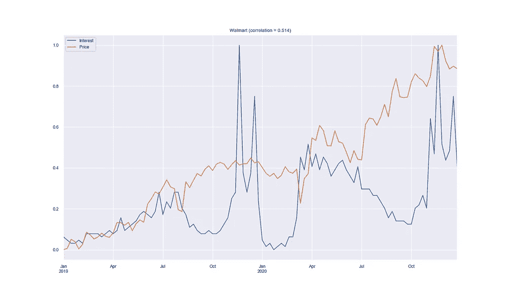

比较星巴克和沃尔玛的相对兴趣和调整后股价(标准化值)的时间序列图。

因此，看起来趋势数据可能是公司业绩的一个不错的代理，但它在对应受欢迎程度和需求方面更可靠。为了进一步证明谷歌趋势数据的信号力量，向下滚动到之前的一篇博文的[“使用谷歌数据作为信号”部分。](https://ryoung122.medium.com/exploring-covid-19s-impact-on-activity-in-new-york-city-1e162257f330)

我们设置了一个脚本来提取每个州每个公司的每周趋势值，日期可追溯到 2019 年初，另一个单独的集合仅可追溯到 2020 年 2 月中旬。我们将这些值称为“相对兴趣”,因为它们给出了兴趣值(从 0 到 100 ),其中 100 是在给定的时间段和地点内公司被搜索次数最多的一周。因此，我们在给定位置为一家公司准备的每个数据表恰好有一周的最大受欢迎度为 100。因此，我们无法比较各州之间的绝对兴趣(或搜索次数)。(例如，我们不能用我们的数据来判断 Uber Eats 在纽约还是在北卡罗来纳州更受欢迎。)

使用这些数据作为表现信号的最大问题是，有时谷歌用户搜索术语只是为了了解该公司或涉及该公司的新闻。因此，兴趣的变化通常可以归因于搜索词的“新闻价值”。我们在数据中寻找无法解释的异常，以及每家公司在 2020 年的新闻事件。我们决定，我们需要针对 12 月 6 日那周 [DoorDash 的 IPO 公告](https://www.nytimes.com/2020/12/09/technology/doordash-ipo-stock.html)以及导致 6 月 29 日和 7 月 5 日那周宣布 Postmates 被优步收购的[传言进行调整。我们通过用前后几周的平均值替换这些值来进行调整。](https://www.nytimes.com/2020/07/05/technology/uber-postmates-deal.html?smid=tw-nytimes&smtyp=cur)

虽然相对兴趣将是我们的因变量，但我们希望我们的输入能够说明 Covid 的严重性以及由此产生的行为变化。

**移动数据**

为了跟踪活动的变化，我们使用了[谷歌的社区移动报告](https://www.google.com/covid19/mobility/index.html?hl=en)，谷歌在疫情期间公开了该报告。这个数据集通过访问不同类别的地方来测量运动的变化。这些数据是从打开了设备“位置历史记录”的用户那里收集的。谷歌拥有来自世界各地的数据，但我们将使用美国的数据，其中包括国家、州和县一级的数据。

每天的数值是通过[计算“与基线](https://www.google.com/covid19/mobility/data_documentation.html?hl=en)相比，不同地方的访问次数和停留时间的变化”得出的基线计算为 2020 年前五周(1 月 3 日至 2 月 6 日)期间一周中每个相应日期的中值，当时新冠肺炎尚未影响美国的行为

我们将重点关注以下两类移动性(从 2020 年 2 月 16 日至 2021 年 1 月 2 日):

**杂货店&药房**(杂货店、食品仓库、药店等场所)

**零售&娱乐**(餐馆、购物中心、电影院等场所)

我们还使用了 [CDC 的数据集](https://data.cdc.gov/Case-Surveillance/United-States-COVID-19-Cases-and-Deaths-by-State-o/9mfq-cb36)来收集关于 Covid 病例和死亡的信息。我们汇总了数据，所以我们的值是每周一次。

为了便于分析，我们还重点关注了代表该国不同样本的 11 个州(从地理和人口统计角度):

阿拉巴马州、加利福尼亚州、佛罗里达州、佐治亚州、爱荷华州、马萨诸塞州、北卡罗来纳州、纽约州、德克萨斯州、犹他州、威斯康星州

# 探索性数据分析

在查看流动性数据时，很明显，随着疫情带来的法规和健康风险，餐馆、商店和娱乐场所的访问量减少了。以下是对 2020 年第二季度和第三季度的看法:

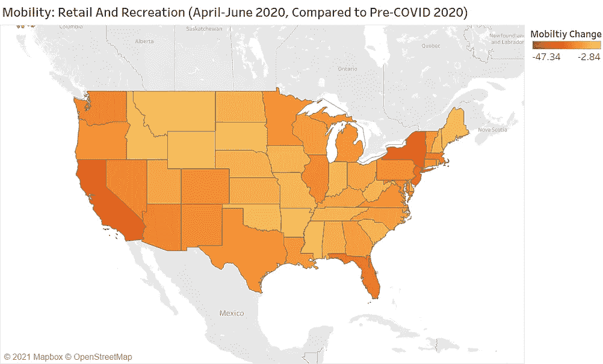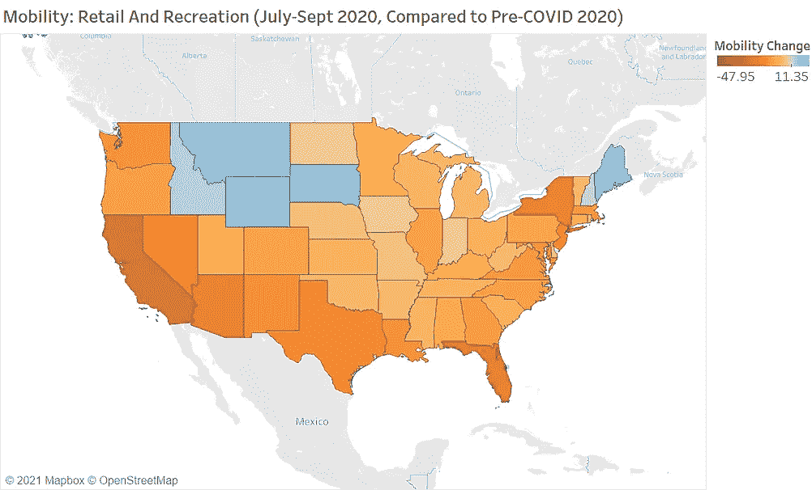

似乎限制越严格或城市人口越多的州去这些地方的次数越少。我们都不熟悉蒙大拿和怀俄明，但是似乎一些更冷的州的居民在冬天冬眠。天气可能是这些地区夏季流动性异常增加的一个因素。(第四季度的地图看起来与第二季度的地图几乎相同。)

杂货店的流动性更是一个复杂的问题。这是因为杂货店被认为是必不可少的，因此在全国范围内仍然开放，即使在家订货也是如此。因此，随着餐馆关门，杂货店之旅就像度假一样，这类场所的流动性更加多样化:

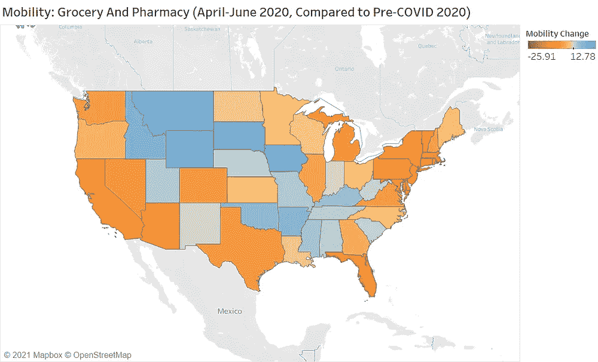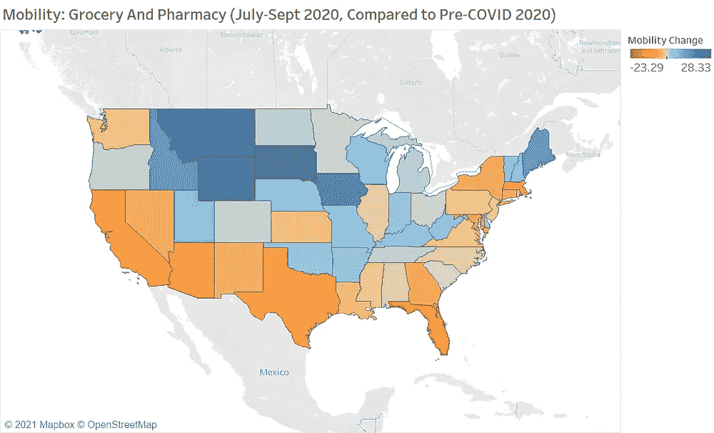

一般来说，对于两种类型的移动性，最大移动性和最小移动性状态保持不变。

这是美国每周的交通状况。

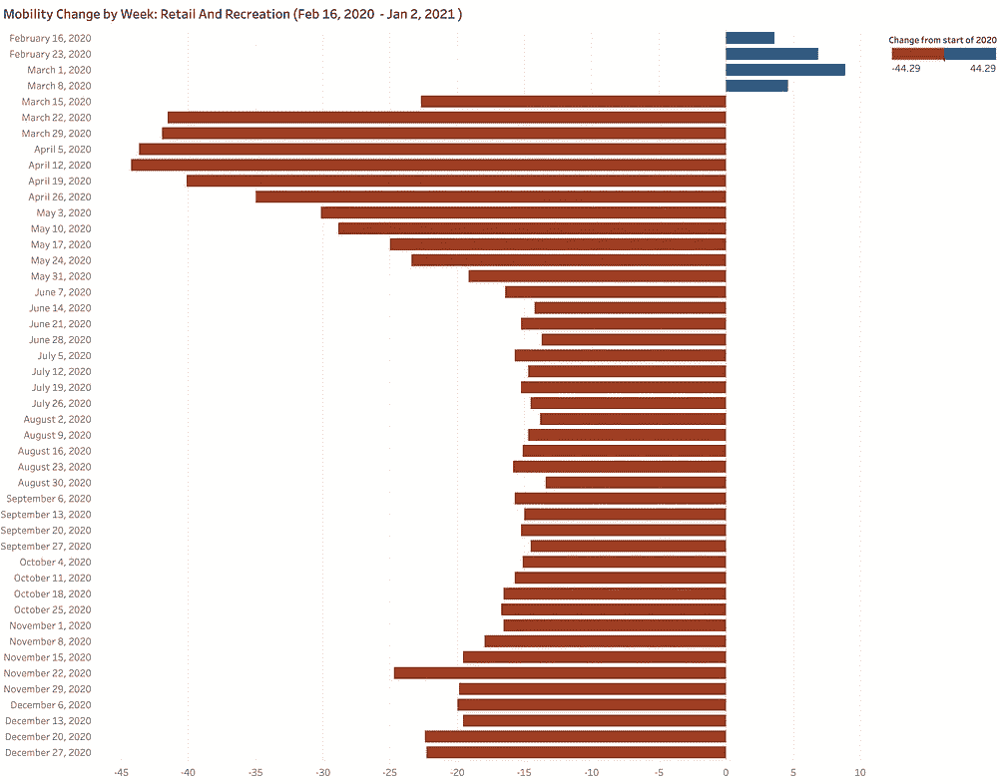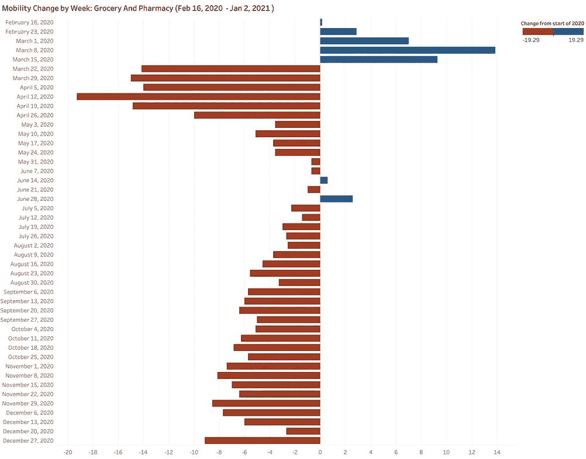

如果你需要更多的证据来证明美国人庆祝 7 月 4 日。

从最初的“Covid 休克”中，你可以看到活动的急剧下降，并且在下降中的反应与病例的增加不成比例。当我们直接将 Covid 案例与迁移率数据进行比较时,“疫情疲劳”也很明显:

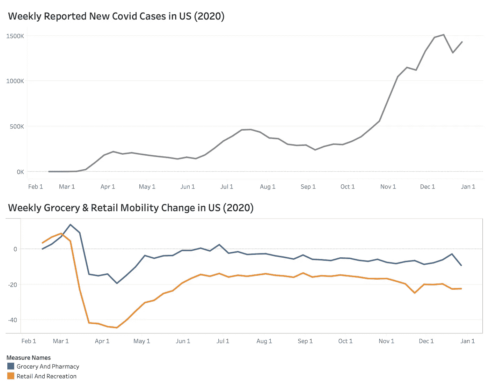

下面是各州流动性随时间的变化情况:

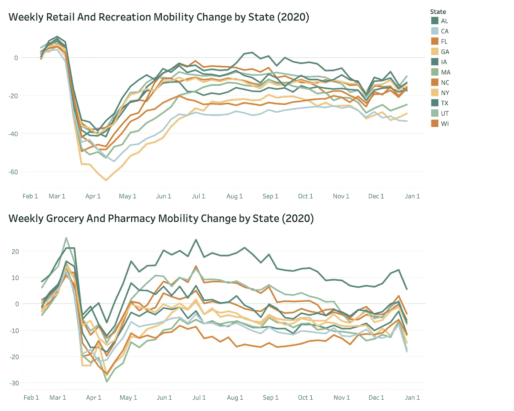

在这两种情况下，每个状态的迁移率数据遵循相似的模式。

最后，让我们看看谷歌趋势数据。以下是 2020 年各公司的相对兴趣，从 2 月的第三周开始:

三月中旬美国疫情的爆发给所有军种带来的冲击是显而易见的。我们将继续称之为“柯维德冲击”与餐馆外卖服务相比，它对 Instacart 的跨州影响要明显得多，比如 Uber Eats:

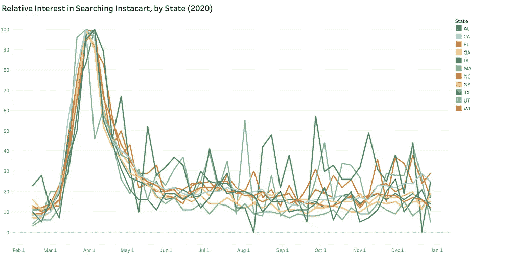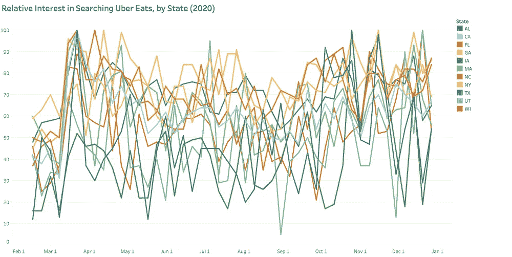

最后，当我们比较我们的趋势数据和我们的移动数据时，我们可以看到某种程度上的反向关系。(随着杂货/零售流动性降低，对送货公司的相对兴趣增加。)

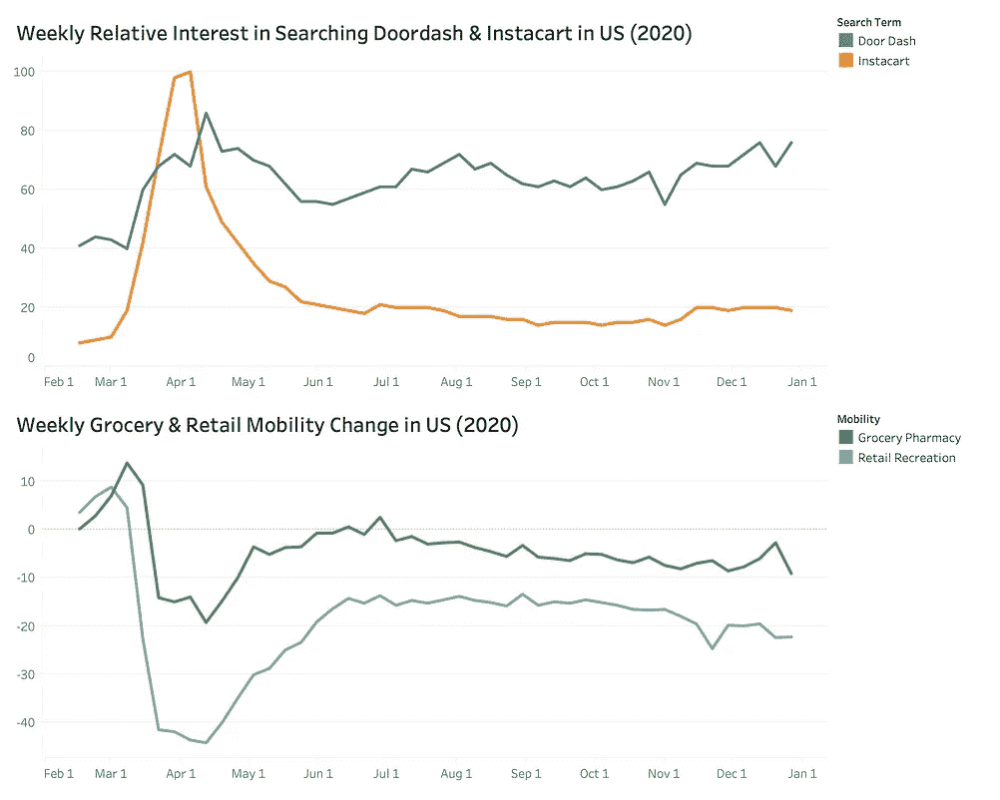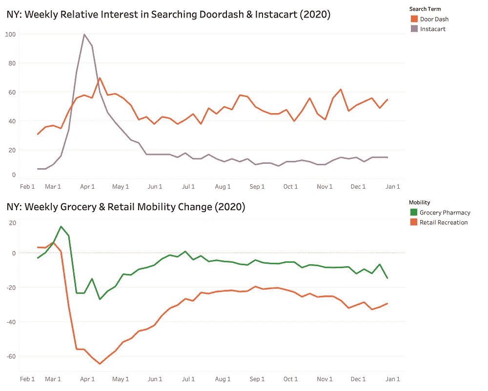

将美国和纽约的流动性与趋势数据进行比较。

我们假设随着时间的推移，这种关系可能适用于所有州和公司，但我们将进一步探讨这一点。

# 建模

在初步探索了数据之后，我们现在将调查在 3 月和 4 月疫情形成前后兴趣水平的结构变化的存在。此外，我们将探讨流动性和利息变量之间是否存在因果关系。接下来，我们将确定流动性对利息的影响，控制 Covid 案例的数量。总之，我们提出了一个基于多元时间序列的向量自回归模型，目标是预测某公司未来的相对兴趣。这种预测对各种利益相关者都很有价值，比如投资者、雇员和记者等等。

**T 检验**

我们使用 2019 年初开始的移动数据版本。这将为我们提供更多的 Covid 冲击之前的数据，为了这个模型的目的，我们将它标记为 3 月和 4 月。我们观察了美国疫情发病前后的差异

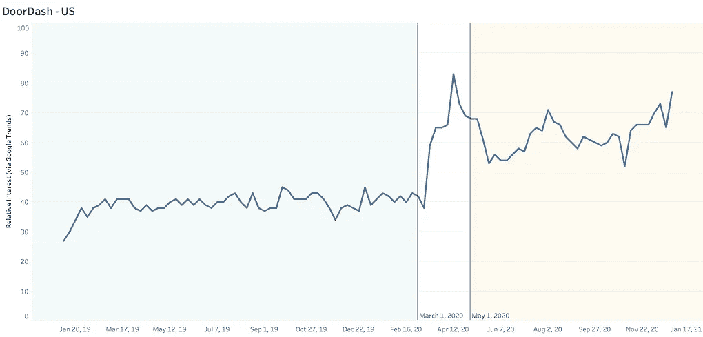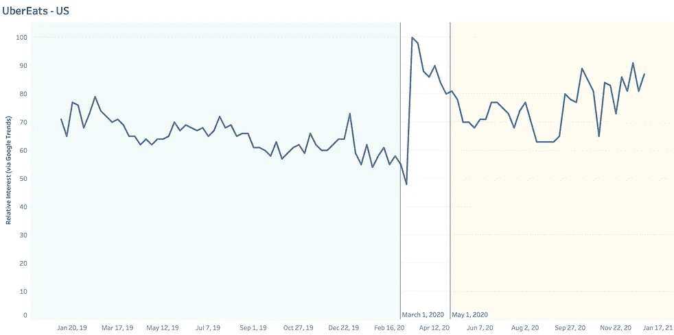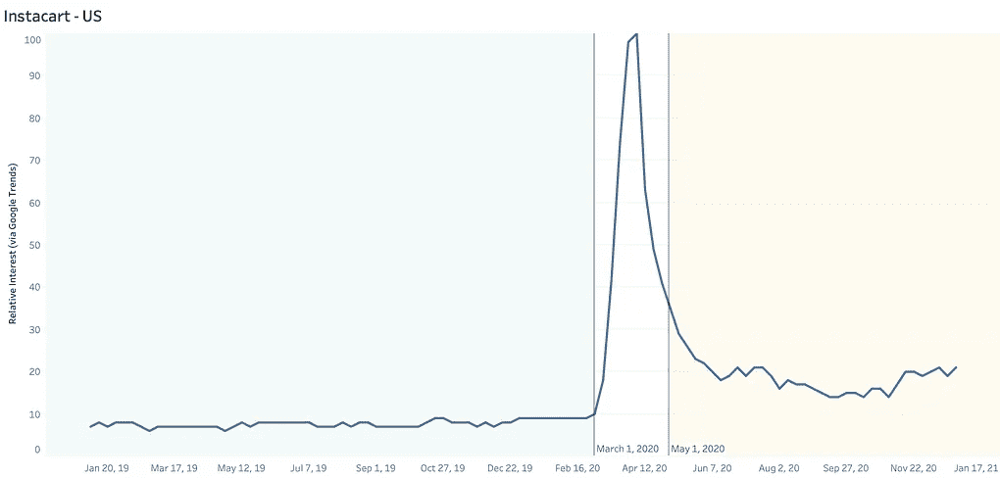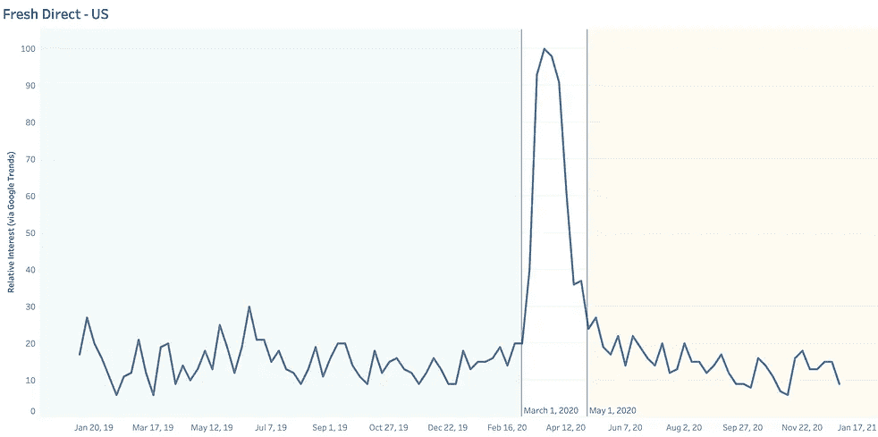

DoorDash、UberEats 和 Instacart 在 Covid 冲击前后的国家相对利益有显著差异，但 Fresh Direct 没有。

在 Covid 冲击之后，一些趋势值恢复到 Covid 冲击之前的水平，但是一些趋势值仍然比以前高。为了查看两个时期之间是否有显著差异，我们决定进行 t 检验。10 个品牌中，有 8 个(DoorDash、Uber Eats、Grubhub、Postmates、Instacart、Chownow、Amazon Fresh、Shipt)表现出了统计上的显著差异，而 Seamless 和 FreshDirect 则没有。根据我们的发现，我们能够看到人们对送货服务的整体兴趣仍然高于冲击前。

在这一点上，我们希望进一步调查这种更高的兴趣是否只是由于移动性本身或人们的行为变化。

当我们深入到州一级时，我们能够看到这种趋势在相对城市化的州(纽约、马萨诸塞州、佛罗里达州)变得更强，特别是与更多农村州(公共卫生法规较少)如阿拉巴马州、爱荷华州和犹他州相比。

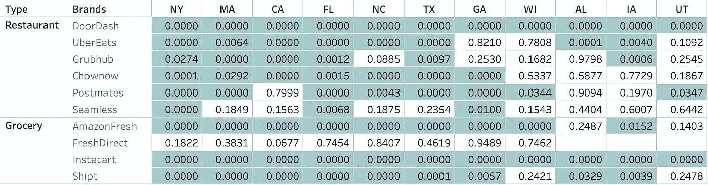

**因果矩阵**

我们都知道现在著名的成语“相关并不意味着因果关系”。想一想所有虚假相关性的荒谬例子，比如在游泳池中淹死的人数和美国核电站的发电量，或者游乐场和美国授予的计算机科学博士学位产生的总收入。因此，虽然简单和可访问的相关性不是这里要分析的理想值，但是我们想要显示相关性的东西。输入格兰杰因果关系。根据[格兰杰因果关系](http://www.scholarpedia.org/article/Granger_causality)，如果一个系列 X“格兰杰原因”一个系列 Y，那么 X 的过去值应该包含有助于预测 Y*T5 的信息，而不仅仅是 Y 的过去值所包含的信息。这是检验两个变量之间因果关系的最好和最容易使用的计量经济学方法之一。*

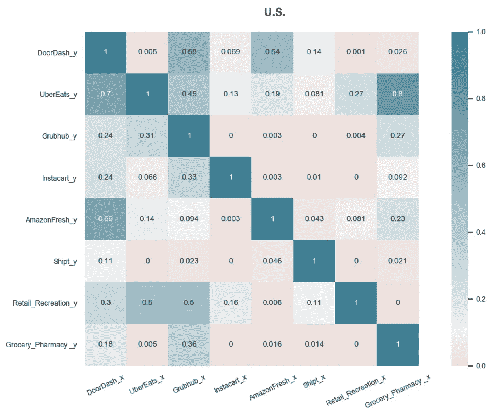

在这个图中，我们可以看到一个矩阵，用 p 值表示格兰杰因果关系检验的结果。当 p 值很小时，我们拒绝空值，我们可以说 X 变量格兰杰原因是 Y 变量。请注意，这不像相关数那样是对称的。该矩阵显示了兴趣和流动性的美国水平数据。我们可以看到，零售和娱乐移动系列往往会引起各种运输公司的相对兴趣。杂货店和药店的流动性没有这样的影响。

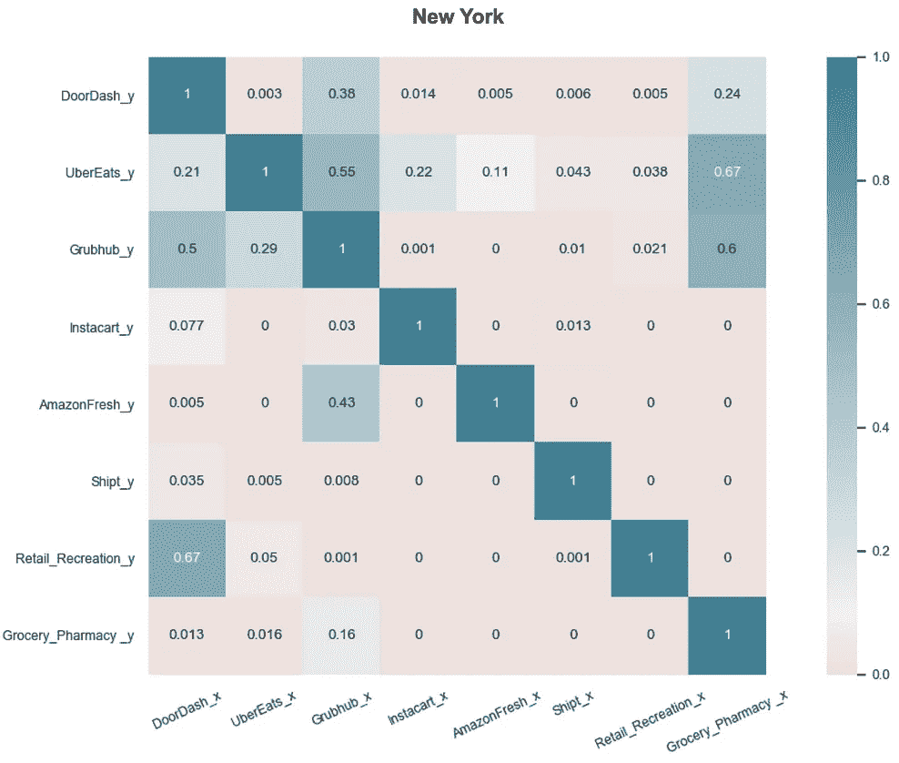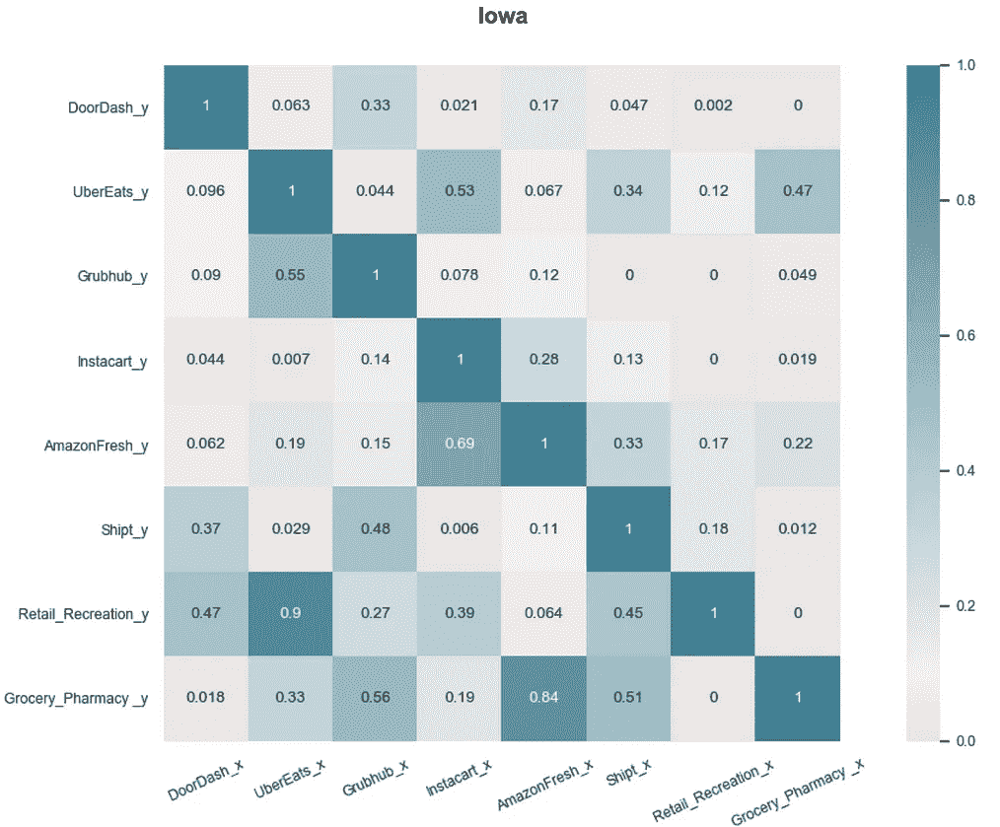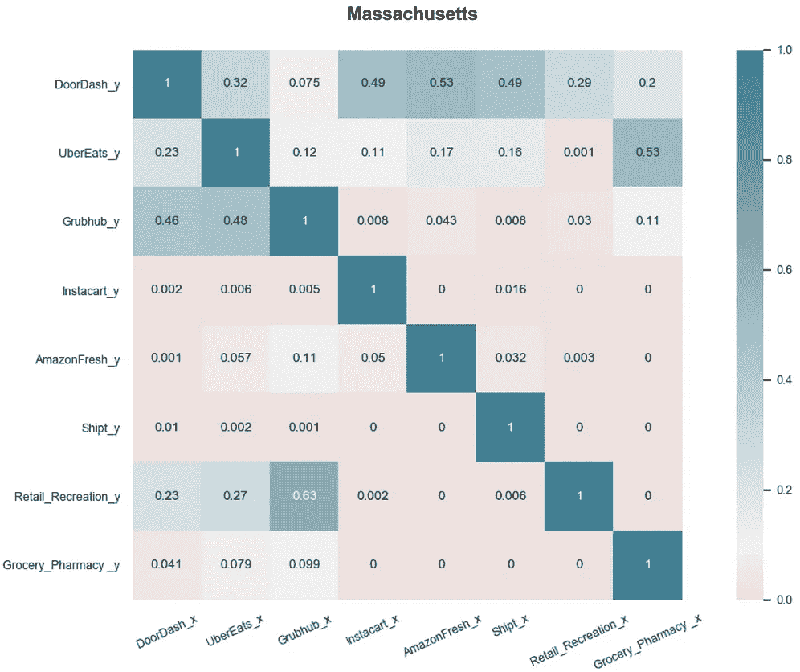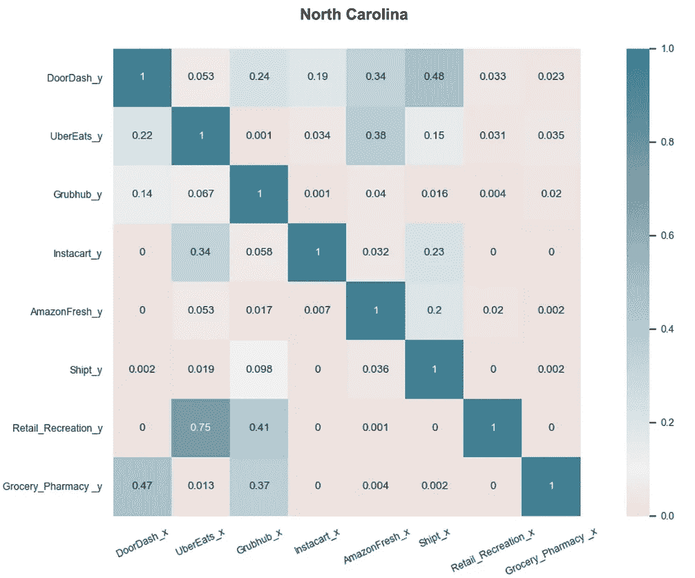

让我们进一步看看州级的因果矩阵。我们发现纽约、爱荷华和马萨诸塞州之间有一个有趣的对比。在纽约州的结果中，我们可以看到零售和娱乐移动性如何影响食品配送公司(DoorDash、Uber Eats 和 Grubhub)的利益与杂货店和药店移动性数据之间的明显区别(我们无法拒绝零因果关系)。
在爱荷华州，我们可以看到，杂货店和药店的移动性引起了人们对杂货配送公司(Instacart、Amazon Fresh 和 Shipt)的更多兴趣。对于马萨诸塞州，我们在食品配送公司、零售和娱乐流动性方面看到了相同的一般因果趋势。在一些州，例如北卡罗来纳州，对于六个公司和两种类型的移动性数据没有区别:两者分别引起六个公司的兴趣。

**滚动贝塔系数**

确定了因变量和自变量之间存在因果关系后，让我们研究流动性(任一类型)对我们正在研究的食品和杂货配送公司的相对利益的影响的大小和方向。

为此，我们将利用滚动线性回归模型，将自变量、相对利益、因变量、流动性和新冠肺炎案例作为控制变量。我们对这些情况进行了控制，以获得流动性对利息的纯粹影响，而不考虑疫情的影响。我们通过时间序列上的移动窗口递归提取迁移率的β系数。这创建了β系数的新时间序列。可以对这一时间序列进行分析，以确定流动如何影响兴趣的趋势和结构变化。

在 10 家选定的食品配送公司中，就美国而言，我们发现其中 7 家全年的趋势是积极的。这些公司是 Uber Eats、Grubhub、Postmates、Instacart、FreshDirect、Amazon Fresh 和 Shipt。对于其余的，有一个不重要的或消极的趋势。在 2020 年全年呈现积极趋势的七家公司中，年末流动性对利息的影响是积极的，并且显著高于年初观察到的影响。现实世界/商业对此的解释是，从整个美国的角度来看，新冠肺炎导致了个人行为的结构性变化，也就是说，随着我们走过 2020 年，流动性对大多数主流食品配送公司的兴趣产生了更强的积极影响。

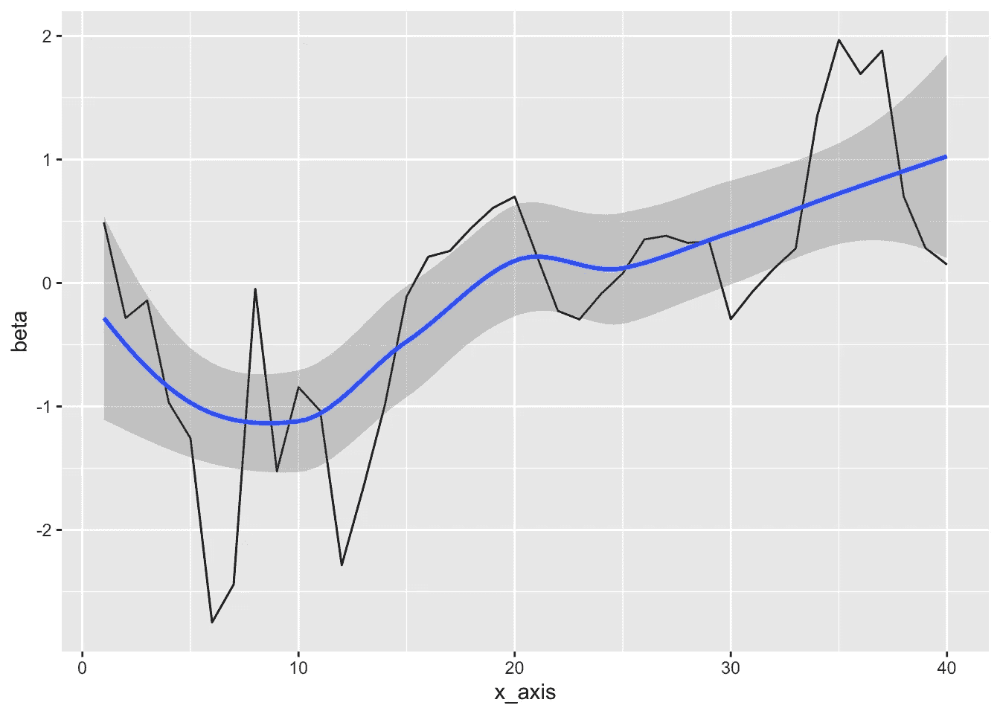

贝塔系数的正趋势示例(Instacart，美国水平)

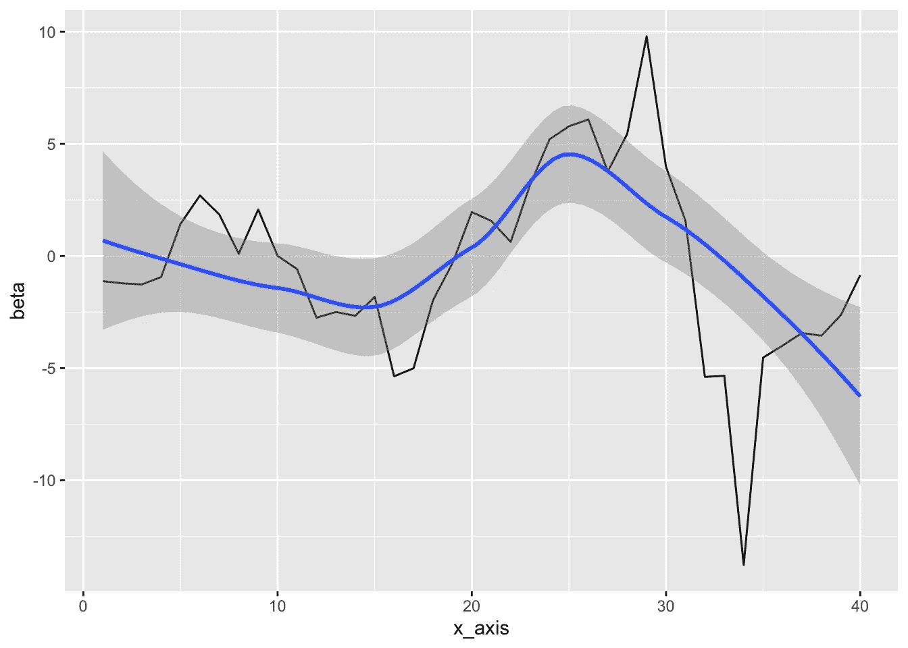

贝塔系数的负趋势示例(Chownow，美国水平)

在查看州一级的数据时，出现了一些有趣的结果。下表总结了调查结果。

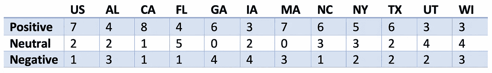

我们可以看到，在加利福尼亚州和马萨诸塞州，流动性和兴趣之间的关系出现了最积极的变化。变化最不明显的州是佛罗里达州、犹他州和威斯康星州。我们还观察到，在佐治亚州和爱荷华州，流动性和兴趣之间的历史关系有许多负面趋势。定性解释可能来自各州不同的 COVID 相关法规、各州公司的业绩和成功，以及其他一些特殊原因。例如，马萨诸塞州和加利福尼亚州拥有全国最严格的法规，而爱荷华州的措施是最弱的，这可能是这些差异的原因之一。

**预报**

在确定了决定流动性和利息之间关系的结构性变化的因素之后，理解未来会发生什么是很重要的。为了有一个积极和前瞻性的视角，最重要的是构建一个预测模型，让投资者、记者和其他利益相关者对未来有一个经验上合理的预期。当我们处理多个时间序列时，就功效和可解释性而言，最适合我们需求的模型是向量自回归(VAR)模型。该模型可被视为在单变量时间序列预测中使用的著名 ARMA 模型的扩展。

为了实现 VAR 模型，我们必须首先满足一些假设。最初，我们在我们选择的变量中检查格兰杰因果关系。平均而言，这些变量必须互为因果。这一假设得到了满足，我们已经在前一小节中探讨过了。我们必须进一步研究协整检验，以确定多个时间序列之间是否存在统计意义上的显著联系。

然后，我们为测试集保留最后四天的观察，这将允许我们衡量使用来自训练集的数据创建的预测的质量。向量自回归所需的另一个假设是我们的序列的平稳性，这通过扩展的 Dickey-Fuller 检验来检验。结果表明需要对数据进行微分，即所有数据都变成 X(t) = X(t) — X(t-1)。在我们拟合我们的模型之前，需要的最后一步是确定包含在 VAR 模型中的自回归部分的滞后量。通过 Akaike 信息标准，我们确定滞后量为 3。然后，我们将模型拟合到我们的变量的美国级子样本，即‘door dash’，‘Uber eats’，‘Grubhub’，‘insta cart’，‘Retail _ Recreation’，‘杂货店 _ 药房’，‘病例’和‘死亡’。Durbin-Watson 统计数据向我们保证，该模型被正确地指定，并且可以进行预测。

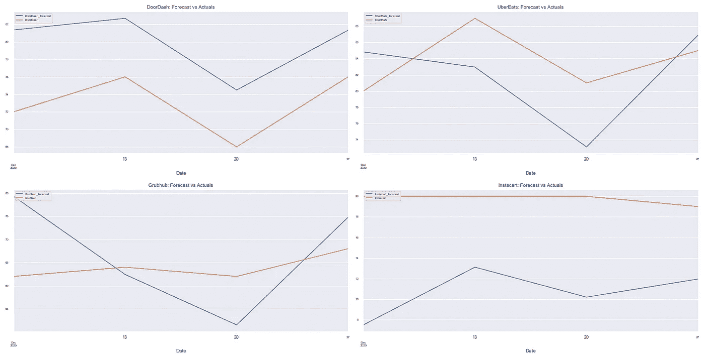

蓝线=预测；橙色线=实际结果

在上图中，我们显示了四家选定公司在美国层面的 2020 年最后四周的预测结果。我们可以看到，对于 DoorDash，Uber Eats，Grubhub，兴趣的大趋势预测是正确的。这些信息使得各种利益相关者能够开展增值活动。

# **结论**

所以总的来说，零售流动性确实对食品配送的受欢迎程度有影响，杂货店流动性对杂货店配送有影响。然而，不同州的不同行为会产生不同的影响。

在这篇文章中，我们试图了解移动性如何影响人们对送货服务的兴趣(以及需求)。通过比较流动性和利息如何随时间变化，我们看到这两个指标的趋势相反，特别是在 Covid 冲击期间。接下来，我们试图评估因果关系。基于我们最初的假设，即变量是负相关的，我们想知道活动的恢复是否会导致兴趣下降。通过因果矩阵，我们发现流动性的变化实际上引起了利息的变化。然而，当运行滚动回归时，结果与我们最初的假设大相径庭。

随着 2020 年的进展，移动性对许多州(如纽约和加利福尼亚州)的兴趣的影响从负面关系变为正面关系，这意味着即使移动性恢复，对交付服务的兴趣仍保持不变或更高。根据我们的发现，我们认为公共卫生法规和关闭不是交付应用需求增长的唯一直接驱动力。相反，我们认为，自 Covid 休克事件以来，美国消费者的看法和行为发生了实际变化。这种洞察力不仅可以应用于快递公司，而且持久的行为改变可以影响电影院、餐馆、音乐会场地等。

此外，我们建立的模型还可以用来预测未来利率的变化。我们之所以相信我们的模型是有意义的，是因为使用流动性数据预测需求是新颖而强大的。

*如果你喜欢这个帖子，请给我们的* [*Linkedin*](https://www.linkedin.com/feed/update/urn:li:activity:6757159113119043584/) *帖子一个赞！*

*在 github* *上查看这篇帖子* [*背后的完整代码。*](https://github.com/rdy122/fooddelivery)

*使用的工具:Python、R、Tableau、Excel*

*数据来源:* [*谷歌趋势*](https://trends.google.com/trends/?geo=US) *，* [*谷歌社区移动报告*](https://www.google.com/covid19/mobility/index.html?hl=en) *，*[*CDC*](https://data.cdc.gov/Case-Surveillance/United-States-COVID-19-Cases-and-Deaths-by-State-o/9mfq-cb36)*，* [*雅虎财经*](https://finance.yahoo.com/)

*预测代码来源:*[*https://www . machine learning plus . com/time-series/vector-auto regression-examples-python/*](https://www.machinelearningplus.com/time-series/vector-autoregression-examples-python/)

作者是杜克·富卡大学 MQM 项目的学生。