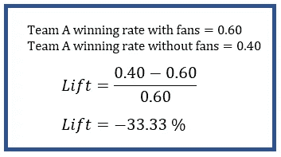
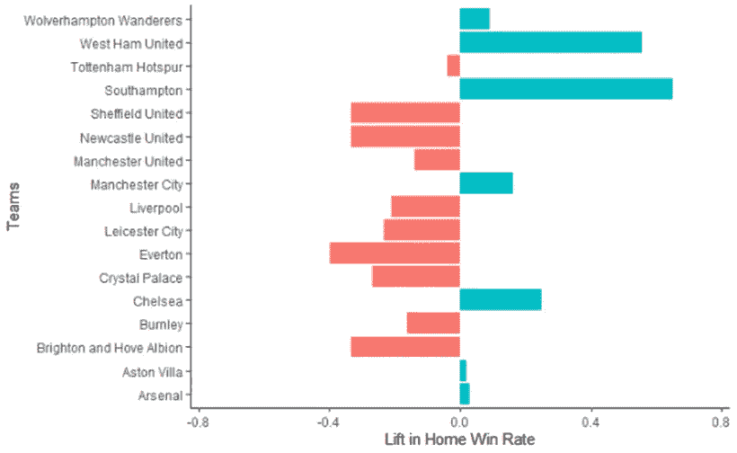
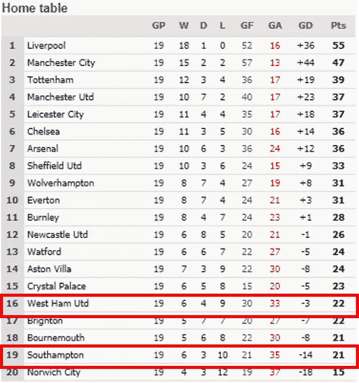
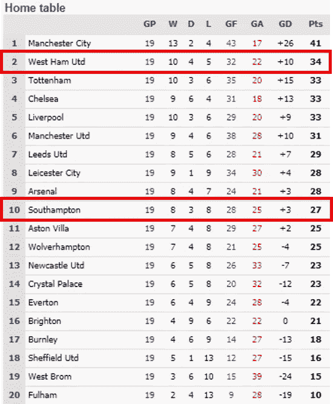
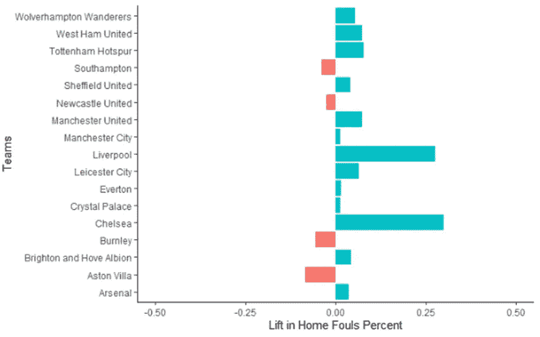
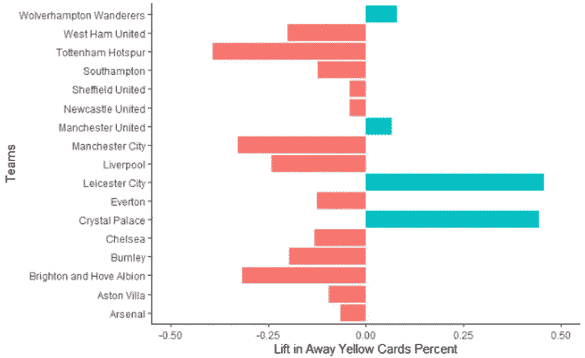
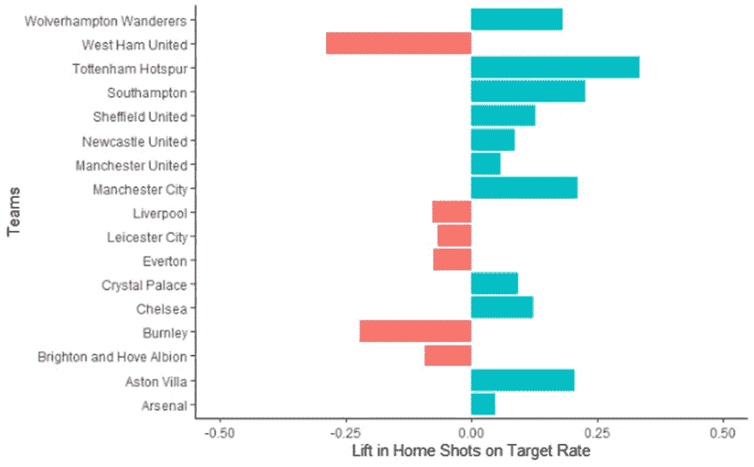

# 球迷对英超球队的影响

> 原文：<https://towardsdatascience.com/the-impact-of-the-fans-on-premier-league-teams-3423f8d8ebae?source=collection_archive---------41----------------------->

## 他们的粉丝群有多重要？数据不言自明。

布雷登·霍普金斯在 [Unsplash](https://unsplash.com?utm_source=medium&utm_medium=referral) 上的照片

像许多体育联盟一样，英格兰超级联赛的最后两个赛季受到了新冠肺炎疫情的影响，导致比赛闭门进行。换句话说，很多比赛都不允许球迷观看。这启发我分析数据，并试图理解球迷对主队的整体影响，因为球迷的存在通常被认为是为主队提供了*主场优势。*

从数百万利物浦球迷在安菲尔德球场高喊“你永远不会独行”到无数当地纽卡斯尔联队球迷感到不寒而栗，他们是最热情和最激烈的，许多人会说球迷的存在以这样或那样的方式被感受到。

之前，我对有球迷的比赛和没有球迷的比赛之间的数据和统计进行了整体分析。

 [## 主场优势:没有粉丝还存在吗？

### 疫情时代之前和期间的数据和统计

towardsdatascience.com](/home-field-advantage-does-it-exist-without-fans-a0778c5a6a29) 

然而，对于这篇文章，我想深入到具体的球队，了解球迷对他们的成功有多大的影响。为此，我们将比较 2019-2021 赛季期间有球迷和无球迷比赛的比赛结果和每支球队的统计数据。

# 包括团队

两个赛季的所有球队都包括在内，除了那些在 2019-2020 赛季结束时降级或晋级的球队。否则，我们就不会有联盟中这些球队的两组比赛的数据。

收集的数据都是 2019 赛季开始到 2021 年 3 月 15 日的比赛。这些比赛被分成两组:一组有球迷在场，另一组没有。*关于数据收集过程的更多细节，请随意参考之前的***。**

# *勘探领域*

*基于主场优势和球迷如何影响球队的一些假设或普遍信念，我想探索几个领域。这包括:*

*   *主队的总胜率，我们可以定义为总胜率占总潜在胜率的百分比*
*   *裁判向主队和客队出示的犯规或黄牌的分布，他可能会感受到来自咆哮的球迷的压力*
*   *主队的投篮命中率。他们是否拍摄更多镜头来满足粉丝，这是否会导致更高的准确性？*

# *比较标准:提升*

*为了比较两场比赛的数据平均值，我们将计算每个团队的值之间的*。**

> **Lift 就是两个值之间变化的百分比，通常用于比较 A/B 测试前后的结果。**

****

**作者创建的图像**

# **跨团队的结果**

**下面的图表和分析着眼于每支球队从有球迷的比赛到没有球迷的比赛的百分比变化或提升。换句话说，正升力表示风扇不存在时观察到的特定度量值比风扇存在时大，反之亦然。**

## **主场胜率**

****

**作者创建的图像**

**从主场胜率来看，我们可以看到大多数球队的主场胜率都出现了负增长(-20%到-40%)。然而，有两支球队的胜率明显上升，超过 40%:西汉姆联队和南汉普顿队。这两支球队是 2019-2020 赛季英超联赛中最差的五个主场记录之一，输的比赢的多。**

****

**来自 soccerstats.com[的表格](https://www.soccerstats.com/)**

**快进到最近的 2020-2021 赛季，这个赛季主要是在没有球迷的情况下进行的，两支球队都有前十名的最佳主场战绩，西汉姆联队排名第二。**

****

**表来自[soccerstats.com](https://www.soccerstats.com/)**

**最重要的是，西汉姆联在本赛季以第五名结束赛季，这使得他们能够击败更受欢迎的球队，如托特纳姆热刺队和阿森纳队，获得参加欧联杯的资格。**

## **主场犯规分布**

****

**作者创建的图像**

**当观察主队犯规的分布或细分时，大多数球队在每个方向上都有不到 0.25%的细微提升。两个例外是利物浦和切尔西，当球迷不在场时，他们的犯规率上升了 0.25%。这两支球队都是拥有庞大球迷基础的英超强队。两年前利物浦赢得了冠军联赛，今年切尔西也赢得了冠军，给你一个视角。**

**这告诉我们，要么这些球队在主场没有球迷的情况下踢得更有侵略性，要么裁判在没有球迷的情况下对他们吹了更多的犯规。这可能会给他或她在球场上的决策带来偏见。**

## **客场黄牌分布**

****

**作者创建的图像**

**同样，我们可以看看比赛中客场球队的黄牌分布情况。除了四支球队之外，所有球队都有明显的负提升，这表明当球迷缺席时，黄牌的分布更加平衡。然而，这并不是两支球队的情况:莱斯特城和水晶宫，他们在客场比赛时收到的黄牌数量增加了近 0.50%。**

## **目标命中率的本垒打**

****

**作者创建的图像**

**最后，我们还观察了在没有球迷的情况下，主队的射门命中率。令人惊讶的是，大多数球队的投篮命中率都有积极的提高，托特纳姆热刺队的命中率提高了超过 0.25%。这也许告诉我们的是，球队可能会在尖叫的球迷大喊“投篮”的压力下或为了满足球迷的兴奋欲望而投篮。然而，这并没有转化为更好的位置拍摄。**

**也就是说，并不是所有的团队都经历了积极的提升。如上图所示，西汉姆联队和伯恩利队的准确率都下降了 20%以上。**

# **最后的想法**

**虽然可能没有足够的比赛数据或实质性差异来对特定球队的表现得出任何强有力的结论，但分析确实为我们提供了在没有球迷的情况下比赛如何更加平衡的洞察力。排名较低的球队有更好的机会表现良好，无论是由于裁判的低偏见，还是体育场内尖叫的球迷对两支球队可能产生的任何影响的逆转。**

**退一步来看今年欧洲的主要足球联赛，在过去的 2020-2021 赛季发生了一些非常有趣和罕见的事情，与这里的分析类似。多年没有赢得联赛冠军的球队赢得了冠军:**

*   **西班牙的西甲联赛——马德里竞技队(7 年来的第一个冠军)**
*   **葡萄牙的西甲联赛——运动 CP(19 年来的第一个冠军)**
*   **意大利甲级联赛——国际米兰(11 年来首次夺冠)**
*   **法国法甲里尔队(10 年来首次夺冠)**
*   **苏格兰超级联赛——流浪者足球俱乐部(10 年来的第一个冠军)**

**以下是一些值得思考的问题:这一切都发生在粉丝几乎不存在的一年。**

**这到底是不是巧合？也许吧。**