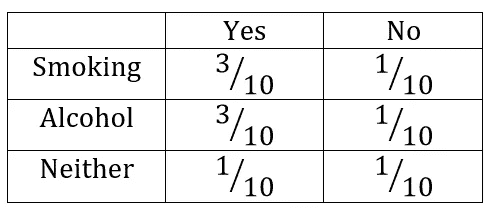

# 信息论在机器学习中的应用

> 原文：<https://towardsdatascience.com/the-implications-of-information-theory-in-machine-learning-707132a750e7?source=collection_archive---------11----------------------->

## [思想和理论](https://towardsdatascience.com/tagged/thoughts-and-theory)

## 一瞥什么是信息论，机器学习如何依赖于它。

来自 [Pexels](https://www.pexels.com/photo/light-inside-library-590493/?utm_content=attributionCopyText&utm_medium=referral&utm_source=pexels) 的 [Janko Ferlic](https://www.pexels.com/@thepoorphotographer?utm_content=attributionCopyText&utm_medium=referral&utm_source=pexels) 摄影

**信息**。这个术语在每一个可能的场景中都出现过。但是理所当然的是，世界是靠信息运行的。那是什么？解释它的最简单的方法是通过一个例子。假设你正在杂货店购物，你已经挑选了多件商品。你知道这些物品的价格；因此这是你的原始数据。稍后，当你在柜台结账时，收银员会扫描这些物品，并给你这些物品的总价。说得详细点，收银员会用每件商品的成本来处理商品的数量，给你一个固定的数字，你可以支付。在某种程度上，收银员处理原始数据(单个商品的价格)并给你信息(最终的账单金额)。所以，我可以把信息描述为有上下文意义的经过处理的数据。

再进一步，下面是两条消息:
a)我没去上班。我没去上班，因为我约了医生。很明显，第二条消息比第一条包含更多的信息。但是我如何定义“更多”是什么呢？我如何量化它？这就是信息论的用武之地！下一节将探索信息论领域和其中的重要概念。

# 信息论

自 20 世纪初以来，研究人员一直在思考量化信息，1948 年，克劳德·香农发表了一篇名为“[沟通的数学理论](http://people.math.harvard.edu/~ctm/home/text/others/shannon/entropy/entropy.pdf)”的非凡文章这篇论文诞生了[信息论](https://en.wikipedia.org/wiki/Information_theory#:~:text=Information%20theory%20is%20the%20scientific,Claude%20Shannon%20in%20the%201940s.)领域。从定义上来说，信息论是对信息的量化、存储和交流的研究。但远不止如此。它对统计物理、计算机科学、经济学等领域做出了重大贡献。

香农论文的主要焦点是通用通信系统，因为他发表这篇文章时正在贝尔实验室工作。它建立了相当多的重要概念，如信息熵和冗余度。目前，其核心基础应用于无损数据压缩、有损数据压缩和信道编码领域。

信息论中使用的技术本质上是概率性的，通常处理两个特定的量，即。熵和互信息。让我们更深入地研究这两个术语。

## 香农熵(或仅仅是熵)

熵是对随机变量的不确定性或描述变量所需信息量的度量。假设 *x* 是一个离散随机变量，它可以取集合中定义的任意值， *χ。*让我们假设这个场景中的集合是有限的。*T5*x*的概率分布将为*p(x)*= Pr {*χ*=*x*}， *x* ∈ *χ* 。考虑到这一点，熵可以定义为*

熵

熵的单位是比特。如果你观察这个公式，熵完全依赖于随机变量的**概率，而不是依赖于 *x* 本身的值。公式前面有一个负号，使它永远为正或 0。如果熵为 0，则没有新的信息可以获得。我将通过一个例子演示这个公式的实现。**

考虑抛硬币的场景。有两种可能的结果，正面或反面，概率相等。如果我们量化一下，*x*∈*{正面，反面}， *p* (正面)= 0.5， *p* (反面)= 0.5。如果我们将这些值代入公式:*

**

*在掷硬币事件中计算熵*

*因此，熵是 1 比特，也就是说，抛硬币的结果可以完全用 1 比特来表示。所以，直观地表达香农熵的概念，理解为“一条消息需要多长时间才能完整地传达其价值”。我想再深入一点，讨论一下联合熵、条件熵和相对熵的概念。*

## *联合和条件熵*

*之前我定义熵是针对单个随机变量的，现在我把它推广到一对随机变量。这是一个简单的聚合，因为我们可以将变量对( *X* ， *Y* )定义为单个向量值随机变量。*

*一对具有联合分布 *p* ( *x* ， *y* )的离散随机变量( *X* ， *Y* )的联合熵 *H* ( *X* ，*Y*定义为*

**

*相关熵*

*这也可以用[期望值](https://en.wikipedia.org/wiki/Expected_value)来表示。*

**

*联合熵(期望值形式)*

*同样，对于条件熵， *H* ( *Y* |X)定义为:*

**

*条件熵*

*直观上，这是给定 *X* 的 *Y* 的熵在 *X* 的所有可能值上的平均值。考虑到( *X* ，*Y*)~*p*(*X*， *y* )，条件熵也可以用期望值来表示。*

**

*条件熵(期望值形式)*

*让我们尝试一个例子来更好地理解条件熵。考虑一项研究，其中受试者被问及:
I)他们是否吸烟、饮酒或两者都不做。如果他们患有任何形式的癌症，我将把这些问题的回答表示为属于联合分布的两个不同的离散变量。*

**

*数据表*

*在左边，你可以看到 10 名受试者回答问题的数据表。变量 Activity 有三种不同的可能性(我称之为 X)。第二列代表受试者是否患有癌症(变量 Y)。这里有两种可能性，即是或否。由于我们还没有处理连续变量，我已经将这些变量保持离散。让我们创建一个概率表，使场景更加清晰。*

**

*上例的概率表*

*接下来我会计算 x 的所有可能值的边际概率 *p* ( *x* )的值。*

**

*X 的边际概率*

*基于概率表，我们可以在条件熵公式中插入值。*

**

*条件概率在上面的例子中*

## *相对熵*

*从随机变量到分布，相对熵有所不同。它是两个分布之间距离的度量。更本能的说法是:相对熵或 KL 散度，用*D*(*p*|*q*表示，是当真实分布是 *p* 时，假设分布是 *q* 的低效率的度量。它可以定义为:*

**

*相对熵*

*相对熵总是非负的，只有当 *p* = *q* 时才能为 0。尽管这里要注意的一点是，它不是一个真实的距离，因为它在本质上是不对称的。但是它通常被认为是分布之间的“距离”。*

*让我们举一个例子来巩固这个概念！设 *X = {0，1}* 并考虑 *X 上的两个分布 *p* 和*q**设 *p* (0) = 1 — *r* ， *p* (1) = *r* 设 *q* (0) = 1 — *s* ， *q* (1*

**

*p||q 的相对熵*

*我还要演示一下非对称性质，所以我也算一下*D*(*q*| |*p*)。*

**

*q||p 的相对熵*

*如果 r = s，*D*(*p*| |*q*)=*D*(*q*|*p*)= 0。但是我会取一些不同的值，例如， *r* = 1/2，s = 1/4。*

****

*可以看到，*D*(*p*|*q*)≦*D*(*q*|*p*)。*

*现在，既然我们已经讨论了不同类型的熵，我们可以继续讨论互信息。*

## *交互信息*

*互信息是一个随机变量包含的关于另一个随机变量的信息量的度量。**或者，它可以被定义为一个变量的不确定性由于另一个变量的知识而减少。**其技术定义如下:
考虑两个随机变量 *X* 和 *Y* ，它们具有联合概率质量函数 *p* ( *x* ， *y* )和边际概率质量函数 *p* ( *x* 和*p*相互信息*I*(*X*)； *Y* )是联合分布与乘积分布*p*(*x*)*p*(*Y*)之间的相对熵。***

交互信息

互信息也可以用熵来表示。推导过程很有趣，但我会克制自己，因为它可能会弄乱文章。

互信息 w.r.t 熵

从上面的等式中，我们看到互信息是由于 *Y* 的知识而导致的 *X* 的不确定性的减少。有一个维恩图完美地描述了这种关系。

互信息与熵的关系

让我们举个例子来更好地理解它。我可以用我在解释熵的时候用过的例子，把吸烟、饮酒和癌症联系起来。我们已经看到，*H*(*Y*| X)= 0.8184 位。为了计算互信息，我需要多一项 *H* ( *Y* )。 *H* ( *Y* )，在这种情况下，将为:

因此，交互信息的定义是:

互信息的计算

或者，我也可以用 *H* ( *X* )和 *H* ( *X* | *Y* )来计算互信息，结果也是一样的。我们可以看到，知道 X 对于变量 y 的不确定性来说意义如此之小。让我改变这个例子的段落，并引导您了解这一切在机器学习中是如何有意义的。假设 X 是预测变量，Y 是预测变量。它们之间的互信息可以是检查该特征对于预测的有用程度的很好的前兆。让我们讨论信息论在机器学习中的含义。

# **信息论在机器学习中的应用**

周围有相当多的应用程序，但我将坚持使用几个流行的应用程序。

## 决策树

照片由[安民](https://www.pexels.com/@minan1398?utm_content=attributionCopyText&utm_medium=referral&utm_source=pexels)从[像素](https://www.pexels.com/photo/silhouette-photo-of-trees-962312/?utm_content=attributionCopyText&utm_medium=referral&utm_source=pexels)拍摄

决策树(DTs)是一种用于分类和回归的非参数监督学习方法。目标是创建一个模型，通过学习从数据特征推断的简单决策规则来预测目标变量的值。这里使用的核心算法叫做 ID3，由 Ross Quinlan 开发。它采用自上而下的贪婪搜索方法，并涉及将数据划分为具有同类数据的子集。**ID3 算法通过使用熵计算样本的同质性来决定划分。**若样本同质，熵为 0，若样本均分，则熵最大。但是熵对树的构造没有直接的影响。该算法依赖于信息增益，信息增益基于数据集在属性上拆分后熵的减少。如果你凭直觉思考，你会发现这实际上是我上面提到的相互信息。在给定一个变量的值的情况下，互信息减少了另一个变量的不确定性。在 DT 中，我们计算预测变量的熵。然后，基于熵分割数据集，并从先前的熵值中减去结果变量的熵。这是信息增益，很明显，是相互信息在起作用。

## 交叉熵

交叉熵是一个非常类似于相对熵的概念。相对熵是指随机变量将真实分布 *p* 与每个样本点的近似分布 *q* 与 *p* 的差异进行比较(散度或差异)。而交叉熵直接比较真实分布 *p* 和近似分布 *q* 。现在，交叉熵是深度学习领域中大量使用的术语。**用作损失函数，衡量分类模型的性能，其输出为 0 到 1 之间的概率值。**交叉熵损失随着预测概率偏离实际标签而增加。

## KL-散度

K-L 散度或相对熵也是深度学习文献中的一个主题，特别是在 VAE。变分自动编码器接受高斯分布形式的输入，而不是离散的数据点。对 VAE 的分布进行正则化以增加潜在空间内的重叠量是最佳的。 **K-L 散度对此进行测量，并添加到损失函数中。**

K-L 散度也用于 t-SNE。tSNE 是一种降维技术，主要用于可视化高维数据。它将数据点之间的相似性转换为联合概率，并且**试图最小化低维嵌入和高维数据的联合概率之间的 Kullback-Leibler 散度。**

## 计算目标类别分布的不平衡

熵可以用来计算目标阶级的不平衡。如果我们将预测的特征视为具有两个类别的随机变量，那么一个平衡的集合(50/50 分割)应该具有最大的熵，就像我们在掷硬币的例子中看到的那样。但是，如果分裂是偏斜的，一个类有 90%的流行率，那么获得的知识较少，因此熵较低。实施计算熵的链式法则，我们可以检查一个多类目标变量在一个量化值中是否平衡，尽管一个平均值掩盖了个体概率。

# 摘要

信息论是一个激动人心的领域，对多个领域都有重大贡献。作为其中之一，机器学习并没有完全利用信息论所提供的一切。我觉得在机器学习的背景下，有许多信息理论概念有待发现，作为一名数据科学家，这让我非常热情。就此，我想结束我的文章。

我希望你喜欢我的文章，如果你真的真的喜欢，这里是我的:

1.  我的网站:[https://preeyonujboruah.tech/](https://preeyonujboruah.tech/)
2.  Github 简介:[https://github.com/preeyonuj](https://github.com/preeyonuj)
3.  上一篇媒体文章:[https://Medium . com/analytics-vid hya/aptos-blindness-challenge-part-1-baseline-efficient net-c 7a 256 da a6e 5？sk = d0e 445 f 99 DAA 71d 79 f 0452665 f1 a59 db](https://medium.com/mlearning-ai/detecting-heart-failure-using-machine-learning-part-3-3fb8ab5d595f)
4.  领英简介:【www.linkedin.com/in/pb1807 
5.  推特简介:[https://twitter.com/preeyonuj](https://twitter.com/preeyonuj)

# 参考

1.  [https://www . khanacademy . org/computing/computer-science/information theory](https://www.khanacademy.org/computing/computer-science/informationtheory)
2.  [https://web.stanford.edu/~montanar/RESEARCH/BOOK/partA.pdf](https://web.stanford.edu/~montanar/RESEARCH/BOOK/partA.pdf)
3.  [https://web.mit.edu/6.933/www/Fall2001/Shannon2.pdf](https://web.mit.edu/6.933/www/Fall2001/Shannon2.pdf)
4.  [https://www . science direct . com/topics/neuroscience/information-theory](https://www.sciencedirect.com/topics/neuroscience/information-theory)
5.  [http://staff.ustc.edu.cn/~cgong821/Wiley.interscience . elements . of . information . theory . 2006 . 7 . ebook-DDU . pdf](http://staff.ustc.edu.cn/~cgong821/Wiley.Interscience.Elements.of.Information.Theory.Jul.2006.eBook-DDU.pdf)