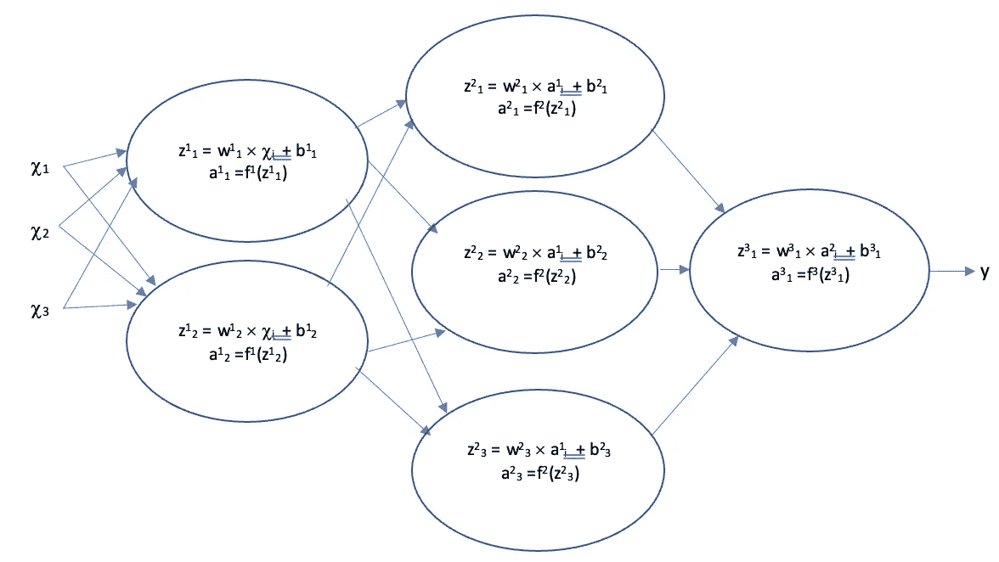
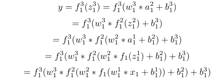
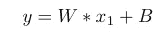
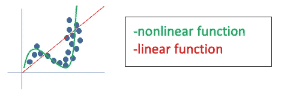
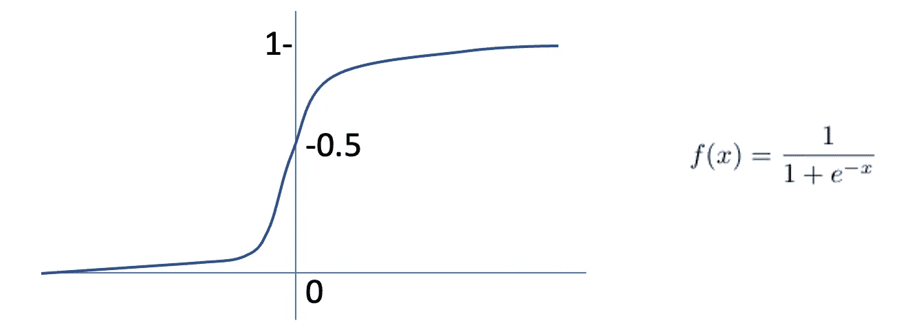
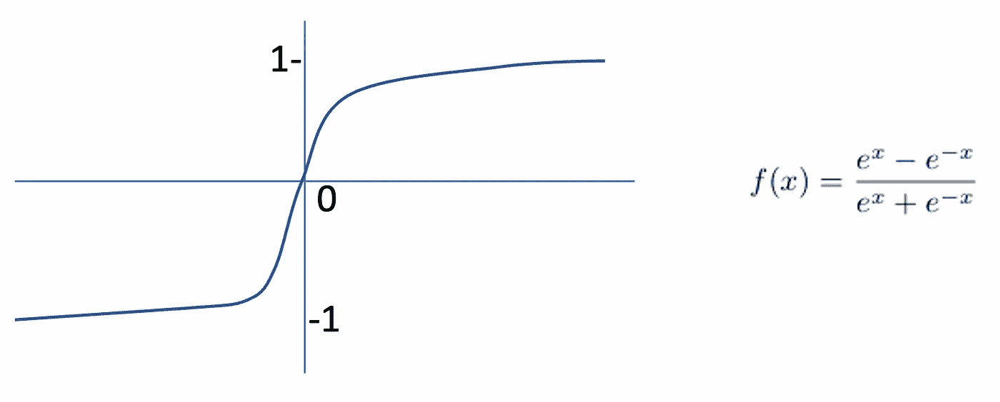
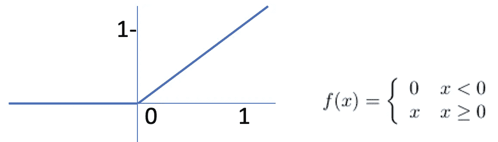
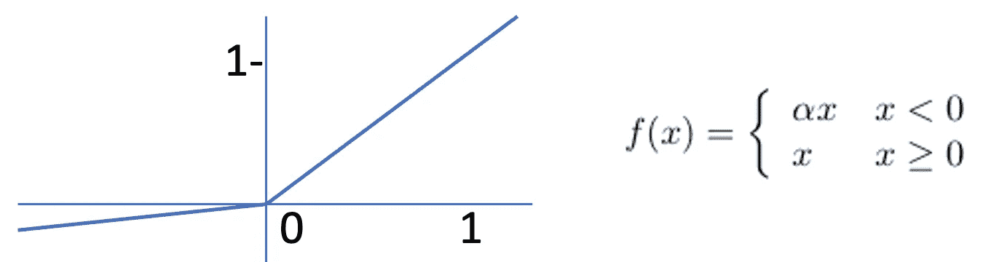

# 激活函数背后的重要性和推理

> 原文：<https://towardsdatascience.com/the-importance-and-reasoning-behind-activation-functions-4dc00e74db41?source=collection_archive---------3----------------------->

## 神经网络的一个重要组成部分

ML 工程师必须做出的最重要和最有影响力的选择之一是他们将为其网络的节点使用什么激活函数。这取决于网络的结构、数据集和目的。令人欣慰的是，对于哪些函数在哪些场景中有用，已经有了广泛的共识。

# 我们为什么需要它们？

概括地说，激活功能对于防止线性是必要的。没有它们，数据将只通过线性函数(a*x+b)通过网络的节点和层。这些线性函数的组合也是线性函数，因此无论数据经过多少层，输出总是线性函数的结果。下图解释了一个示例。

一个简单的三层网络。f 是激活函数。(图片由作者提供)

如果示例 x1 经过第 1 层的第一个节点、第 2 层的第一个节点和最后一个节点，则输出将由下式给出:

作者图片

如果所有的激活函数都是线性的，那么这就等于另一个线性函数！

作者图片

所以，我们还不如刚刚用了一层一个功能呢！为了避免这种情况，我们使用非线性激活函数。这是因为对于复杂的问题，数据无法通过线性方程很好地建模。

展示非线性函数对拟合数据模型的好处的示例。(图片由作者提供)

# 什么是常见的激活功能，为什么？

## 乙状结肠的

作者图片

这会输出一个介于 0 和 1 之间的值，这对于二进制分类问题非常有用，因为可以设置一个阈值“概率”值。高于该值，输出可归类为 1，低于该值，输出将为 0。这使得它成为网络最终输出节点的普遍选择。

不幸的是，计算指数需要大量的能量，因此会降低大型网络的速度。该函数不是以零为中心的，这使得后续层的参数优化更加困难。它还具有几乎完全平坦的大部分线，给出非常小的梯度。如果输出非常正或非常负，这使得梯度下降非常慢。这就是所谓的饱和度和消失梯度问题。在大多数情况下，下列功能远远优于乙状结肠。

## 双曲正切值

作者图片

这将输出一个介于-1 和 1 之间的值，并且由于其指数的原因，与 sigmoid 函数的功耗类似。它也遭受饱和，但是它是零中心的，这使得在它之后的层中的参数优化更容易。我们说，如果各种节点的平均输出为零，则该层更接近正常化。

## 整流线性单元

作者图片

这将输出一个介于 0 和无穷大之间的值，对于 x 的正值，梯度始终为 1。这意味着不存在会发生饱和的平坦区域，除非 x 为负，这会使梯度下降非常快。该函数的计算非常简单，正是由于这些特点，它是最受欢迎的隐藏层激活函数的选择。

一个缺点是它不是以零为中心的，因此输出没有标准化。这就产生了下一个函数，它非常类似，但更接近于平均输出为零。

## 泄漏 ReLU

作者图片

通过使用 alpha(通常很小，例如 0.01)，为负 x 添加一个浅斜率。这使 x 值为负值的节点保持活动状态。同样，这很容易计算，并且从-无穷大到无穷大，这意味着它几乎以零为中心。这使得将来的层计算更容易处理。作为隐藏层的激活函数，Leaky ReLU 也是一个非常受欢迎的选择。

# 摘要

这是一个简短的介绍当你选择激活功能时的思考过程。要考虑的要点是，该函数是否为您的问题环境输出有用的值，它能多快做到这一点，它是否会遇到消失梯度问题，以及它的平均输出是否接近零。