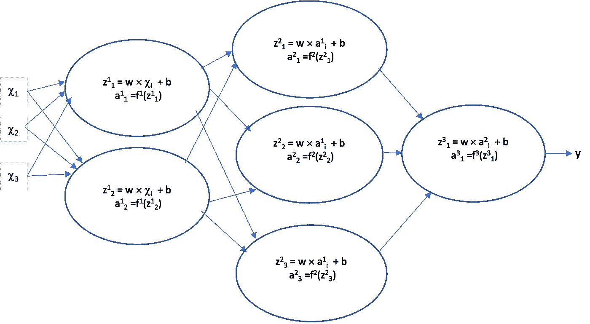
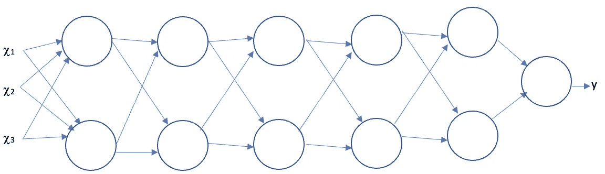
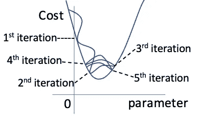
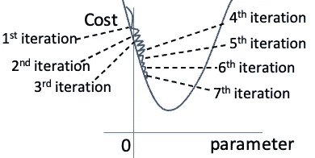
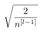
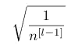

# 初始化背后的重要性和原因

> 原文：<https://towardsdatascience.com/the-importance-and-reasoning-behind-initialisation-829d8f6e9f43?source=collection_archive---------28----------------------->

## 神经网络的一个重要组成部分

神经网络通过学习哪些参数最适合数据集来预测输出。为了学习最佳参数，ML 工程师必须初始化，然后使用训练数据优化它们。你可能会考虑一些初始化的选项，尽管错误的选择会导致网络变慢甚至无用！

布拉登·科拉姆在 [Unsplash](https://unsplash.com?utm_source=medium&utm_medium=referral) 拍摄的照片

# 为什么我们不能将权重初始化为零

这是一个诱人的选择，尽管它不起作用。如果你将所有的权重初始化为零，或者任何相同的数字，网络的所有节点都以相同的方式运行。下图解释了一个例子。

具有相同初始权重的简单 3 层网络。(图片由作者提供)

这里，所有的权重和偏差已经分别初始化为相同的 w 和 b。在这种情况下，我们假设任何单层中的激活函数都是相同的。无论一个示例数据点通过什么路径到达输出，它都会产生相同的输出。因此，它将产生相同的成本。在反向传播期间，同一层中的参数将经历相同的梯度下降，并在训练后达到相同的最优值。所以每层中的节点彼此之间没有任何不同！当一个新的数据点通过网络时，无论它采用什么路径，都会产生相同的输出！我们需要“打破节点的对称性”…

# 为什么我们不能完全随机地初始化权重

虽然这将“打破对称”，但它带来了渐变消失和爆炸的问题。每个节点输出的平均值应该为零。我们说我们希望激活函数以零为中心。这在我的文章介绍激活函数中有解释，链接如下。

</the-importance-and-reasoning-behind-activation-functions-4dc00e74db41>  

考虑下面的多层网络。

作者图片

在产生输出 y 之前，数据点 X 必须经过几个节点。如果它所乘以的权重都很大(或都很小)，这将导致最终层的输出非常大(或非常小)。成本的梯度将因此爆炸(或消失)。在爆炸梯度的情况下，成本将永远不会达到它的最小值，因为它将一直错过它并围绕它振荡。这是因为每个梯度下降步骤太大。

爆炸梯度问题。(图片由作者提供)

在梯度消失的情况下，成本永远不会达到最小值，因为接近它的步骤非常小。

消失梯度问题。(图片由作者提供)

# 什么是最常见的初始化技术，为什么

为了防止梯度变得过大或过小并减缓梯度下降，我们需要确保满足两个条件。任何图层输出的平均值为 0，并且在整个图层中方差相对恒定。解决方案是随机化权重，但是将它们乘以一个值，该值取决于正在初始化的层中的节点数量。不同的激活功能的值是不同的。

## 他初始化

对于具有 ReLU 或泄漏 ReLU 激活函数的节点，我们将随机数乘以前一层中节点数量的函数。公式如下所示。

作者图片

## Xavier 初始化

对于具有 Tanh 激活函数的节点，我们使用 Xavier 初始化。这非常类似于初始化，但是我们用随机数乘以的值在分子中是 1 而不是 2。公式如下所示。

作者图片

# 摘要

这是对初始化方法的简短介绍。这两种初始化技术保持跨层的方差相同，并且如果我们使用有效的激活函数，我们可以确保每个节点的输出的平均值为零，从而保持梯度下降时间合理。