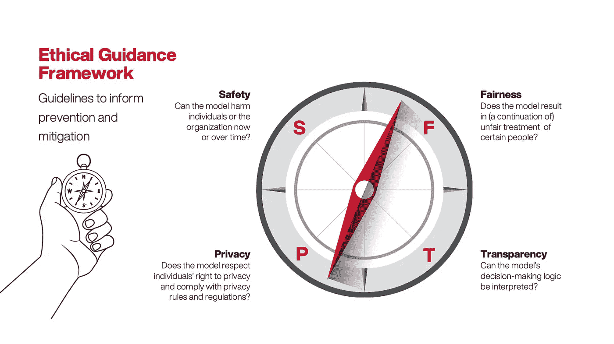
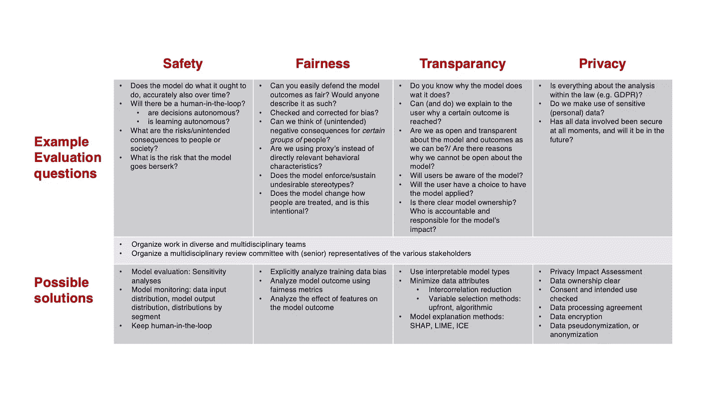

# 数据项目中以道德为中心的重要性

> 原文：<https://towardsdatascience.com/the-importance-of-ethics-centricity-in-data-projects-ea2a60e6b67?source=collection_archive---------39----------------------->

## 构建安全公平的人工智能

作者为 [IG & H](https://www.igh.com/) 创建的框架

在我的伦理数据分析博客系列的前两篇文章中，我研究了数据驱动的决策过程中可能出现的潜在伦理问题；这些问题如何影响商业、社会和消费者，以及如何避免它们。在这最后一部分中，我将深入探讨如何消除或减少数据用例中的伦理风险。

我在上一篇文章中介绍的[伦理风险快速扫描是一个在项目开始前快速评估用例伦理风险的工具。快速扫描是专门设计的，在最终解决方案和模型的许多方面尚不清楚的早期阶段非常有用。这样，伦理风险和复杂性可以在用例优先级和项目方法中考虑。](/how-to-make-your-data-project-ethical-by-design-99629dcd2443)

然而，一旦项目开始，团队将对数据、模型工作和实现需求有更好的理解。在这一点上，评估可以通过道德指导框架进入下一个层次，我将在下面进行描述。这提供了评估维度、更详细的检查问题和可能的解决方案。

该框架基于四个指导维度，为每个团队的道德指南针提供信息[1]。与快速浏览相比，指导框架最好在整个项目生命周期中持续使用，同时了解模型和实现的更多特征。

作者为 [IG & H](https://www.igh.com/) 创建的框架

每个维度都包含了示例检查问题和防止或减轻风险的方法的几个例子[2]。我将首先用一个用例来说明框架的应用，然后在这个用例之后提供一个包含检查问题和解决方案示例的表格。

# 道德指导在行动:出租车公司使用案例

我现在将在一个现实但虚拟的用例中应用这个框架。让我们以出租车服务为例，该服务以数字方式监控分配给司机的行程的许多方面(在上一篇文章中已经介绍过[)。该公司希望开发一种模型，可以对司机的表现进行评分，并相应地自动调整司机的工资。请注意，虽然这个例子代表了我为不同客户所做的工作，但它不是一个实际的客户用例。](/how-to-make-your-data-project-ethical-by-design-99629dcd2443)

当在项目开始前应用快速扫描时，快速扫描中的八个类别中的六个表示中度到高度风险。毫不奇怪，当我们为公司建立这个自动评分和决策模型[3]时，我们遇到了一些道德挑战。我们每月使用指导框架评估项目，识别的挑战都属于(至少)框架中的一个主题。

# 安全

快速扫描已经警告我们，没有人在回路中的意图是一个风险因素，特别是因为模型可能会影响生活的事情。这意味着，如果模型精度随着时间的推移而下降(模型漂移)，或者由于数据质量问题而产生意外输出，在驱动因素受到影响之前，可能没有人会注意到。考虑到我们的指导框架的“安全”维度，我们选择执行两个缓解措施:部署前的敏感性分析和模型输入和输出的统计监测的实施。

# 公平

在快速扫描中，我们指出了数据偏差的中等风险，这意味着我们可能需要额外的努力来确保我们指导框架的“公平性”。当我们分析模型测试结果时，我们发现女性驾驶员的分数偏向量表的高端，而男性驾驶员的分数偏向低端[4]。

在这一点上，我们需要了解该模型在评分时是否意外地存在性别偏见[5]。经过仔细检查，我们得出结论，该模型使用有效的客观特征进行评分。并且女性和男性驾驶员对于相同的驾驶行为得到相同的分数。所以，我们和出租车公司一起决定不需要改变。

# 透明度

正如我们在快速浏览中看到的，影响生活的事情是该用例的一个风险因素。生活事件包括可能影响一个人生活质量的事情。例如，在金融服务中，这可能是信贷的可负担性，或者在医疗保健中，这可能是获得某些治疗的机会。对于出租车公司来说，该模型的决定肯定会通过员工的薪水从财务上影响他们。

该模型也可能影响个人行为，在这种情况下，我们认为是中等风险。例如，司机可能会感到有压力，不得不开车穿过更危险的街区，或者接受可能构成威胁的人的搭车。

作为我们的缓解措施之一，我们必须向出租车司机清楚地解释该模型是如何工作的。我们还引入了一个流程来处理司机提出的任何问题。最后，我们还与模型所有者和人力资源一起确保模型对奖励分配和驾驶行为的影响得到监控。这样，出租车公司可以提供这种模式的潜在影响所证明的透明度。

我们还想在这里提到，应该始终有一个正式的公司代表，负责决策模型对人和业务的影响。在这种情况下，首席运营官在项目开始时被指定为负责任的模型所有者[6]。

# 隐私

这家出租车公司的数据集包含地理位置数据，一旦与其他公开可用的数据结合起来，就可以用来(重新)识别个人。其他敏感的个人数据元素，如“性别”和“年龄”被从模型中删除，以避免不必要的偏见，但我们确实将这些保留在我们的数据集中，以便能够测试模型的公平性。员工应该能够相信他们的隐私得到了尊重，他们的个人数据得到了安全的处理和存储。因此，我们执行数据隐私影响评估，并应用公司的所有技术和运营措施来确保其受到保护。

作者为 [IG & H](https://www.igh.com/) 创建的框架

*图 2 指导框架中每个维度的样本检查问题和可选解决方案表*

# 伦理中心主义

上面的案例表明，如果你把数据伦理放在第一位，许多潜在的问题是可以避免或减轻的。在我工作的公司，我们努力把道德和经济并列在我们所做的一切的中心。我们帮助客户像我们一样关心这个问题。在这两种看似对立的力量之间取得平衡是我日常工作中许多有趣和迷人的方面之一。

由于数据项目的伦理可能比经济学更模糊，我们创建了我们的框架作为指南。为什么？提供所需的结构和早期预警信号，帮助我们的客户遵循他们的道德指南针，并采取适当的措施。这样每个人都可以安全公平地享受数据和 AI 带来的好处。

*这篇文章和框架已经与我的同事曼多·罗特曼和楼科曼合作完成，并于早前发表到我们公司的网站***。它是一个三件套系列的一部分，其中第一部* [*在这里可以找到*](/ethical-data-analytics-what-every-business-needs-to-know-e772bf8f670c) *，第二部* [*在这里可以找到*](/how-to-make-your-data-project-ethical-by-design-99629dcd2443) *。**

*[1]SFTP 准则是从一项对 36 份著名的人工智能原则文件进行的元研究中提炼出来的。*

*[2]让我们在这里提一下，数据伦理领域正在迅速发展，我们的框架也是如此。当我们遇到新的相关话题时，会添加更多的检查问题和解决方案。*

*[3]在[即将出台的人工智能法规中，这种模型将被称为“高风险人工智能系统”,它将在未来承担额外的责任](https://www.mckinsey.com/business-functions/mckinsey-analytics/our-insights/what-the-draft-european-union-ai-regulations-mean-for-business)*

*[4]我们没有在模型本身中使用变量“性别”,但出于验证目的，我们将它保留在数据集中。通过这种方式，可以为模型收集敏感数据，但确切地说是为了防止违反这种敏感性*

*[5]即使模型中的不平等不是偏见的结果，你也可能有充分的理由消除不平等。我们选择不在本文中涉及这一点，但是偏见/不平等本身可能是一篇文章的好主题。*

*[6]首席运营官对该模式对企业和员工的影响负责，她将日常责任委托给了公司的绩效经理*