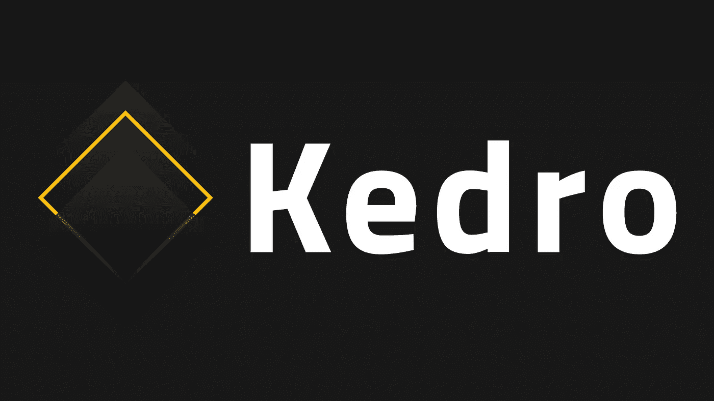
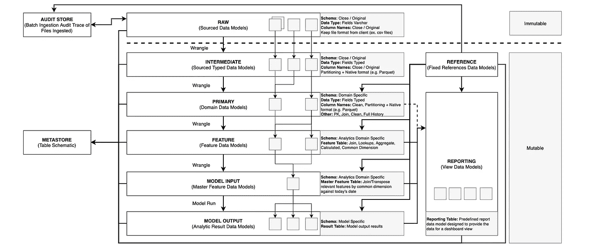
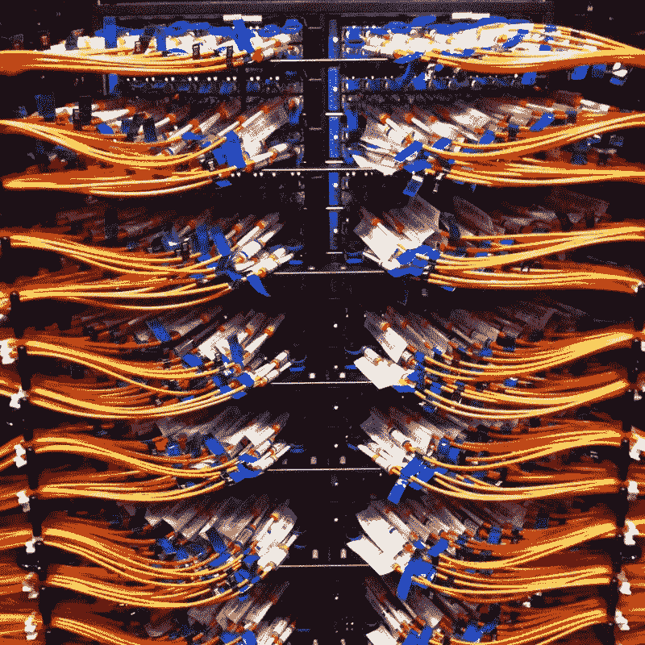

# 分层思维在数据工程中的重要性

> 原文：<https://towardsdatascience.com/the-importance-of-layered-thinking-in-data-engineering-a09f685edc71?source=collection_archive---------8----------------------->

## [行业笔记](https://towardsdatascience.com/tagged/notes-from-industry)

## 如何在机器学习(ML)用例中使用真实世界的数据

**

*看起来有点像数据湖，对吗？([Flickr 上科利·多克托罗的《纠结的电线》](https://flic.kr/p/o29b6m) (CC BY-SA 2.0))*

## *这是给谁的？*

*你是数据科学家还是数据工程师，热衷于构建可持续和健壮的数据管道？那这篇文章就送给你了！我们将通过一个真实世界的例子，到本文结束时，您将理解为什么您需要一个分层的数据工程约定来避免我们过去所犯的错误🙈。我们是 [QuantumBlack](https://quantumblack.com/) 我们将讨论我们的开源 Python 框架: [Kedro](https://kedro.readthedocs.io/en/stable/) 。*

## ***为什么我们需要一个约定？记住—数据通常是偶然存在的***

*经验丰富的数据科学家、分析师和工程师非常清楚，并非所有数据都是为分析而设计的。通常它是“偶然”存在的，是一些其他业务流程的随机副产品。*

*当这种情况发生时，数据质量差和基础设施不可靠是很常见的。*

*以下是一些在企业组织中常见的情况，它们说明了一个人是如何不可避免地陷入这种境地的:*

*   *生产线的值班经理仍然在 Excel 中维护时间表，而不是使用他们现有的花哨的企业软件，因为这是一个有效的系统，可以通过电子邮件发送，并且迁移会中断业务关键时间表。*
*   *一家跨国制药公司的库存系统实际上仍然是 20 世纪 80 年代的大型计算机(嘿，它可以工作！).它有一些基本的报告和预测功能，但它是专门为管理股票而设计的，而不是用于分析。*

*许多组织，尤其是大型组织，并不是“互联网原住民”，现在正在将机器学习追溯到他们的运营中。在这种情况下，我们必须采取灵活的迭代方法来构建 ML 用例。*

*人们不能指望数据结构整齐，随时可用。例如，你会看到像 [Monzo](https://monzo.com/) 这样的数字银行非常仔细地思考他们如何从源头将 [PII](https://en.wikipedia.org/wiki/Personal_data) 的数据从分析中分离出来。这是更传统的机构在尝试进行同类分析时，必须在不同的系统之间进行分解的事情。*

> *在现实世界中，将为某个目的设计的数据逆向工程成对分析有用的东西是构建 ML 管道的一个重要部分。*

*承认这种情况并使用标准化的项目模板是简化代码库和工作心理模型的有效机制。*

*在这个问题上，一组固执己见的最佳实践可以求助于 Cookiecutter 数据科学。他们的任务是促进数据科学的正确性和可再现性，而且，碰巧的是，他们也采用了数据工程的分层方法…*

## ***我们❤️库克数据科学***

*[*Cookiecutter*](https://github.com/cookiecutter/cookiecutter) *及关联的* [*Cookiecutter 数据科学*](https://drivendata.github.io/cookiecutter-data-science/) *项目都是该领域的领导者，有着坚如磐石的见解。*如果你还没有机会详细阅读他们的方法，[看看他们的](https://drivendata.github.io/cookiecutter-data-science/#opinions)。我们等着，没事的😀 ⏳。*

**

*嗯……([hlkljkgk](https://www.flickr.com/photos/52473526@N00)的健康巧克力曲奇获得 [CC BY-SA 2.0](https://creativecommons.org/licenses/by-sa/2.0/?ref=ccsearch&atype=rich) 授权)*

*总之，他们的想法是基于以下 6 条规则:*

> *1.数据是不可变的
> 2。笔记本是用来探索和交流的
> 3。分析是一个[DAG](https://en.wikipedia.org/wiki/Directed_acyclic_graph)4。从环境中建立起来。将秘密和配置置于版本控制之外
> 6。在更改默认文件夹结构时要谨慎*

*您可以从标准的 Cookiecutter [目录结构](https://drivendata.github.io/cookiecutter-data-science/#directory-structure)中看到，一种清晰简洁的数据工程约定形式得到了实施:*

```
*...
├── data
│   ├── external       <- Data from third party sources.
│   ├── interim        <- Transformed intermediate data.
│   ├── processed      <- The final data sets for modeling.
│   └── raw            <- The original, immutable data dump.
│
...*
```

*虽然这是一个很好的工作框架，但随着我们项目的规模和复杂性的增长，我们觉得我们的方法需要更多的细微差别。*

# *凯卓:它是什么，它有什么帮助*

**

*曾几何时，QuantumBlack 交付的每个项目看起来都不一样。人们每次都是从零开始，独立地经历相同的陷阱，再现性是耗时的，并且只有最初项目团队的成员真正理解每个代码库。*

*进入 [Kedro](https://kedro.readthedocs.io/en/stable/01_introduction/01_introduction.html) ，这是一个开源的 Python 框架，用于创建可复制、可维护和模块化的数据科学代码。如果你以前从未听说过 Kedro 框架，你可以在这里了解更多[。](https://kedro.readthedocs.io/en/stable/01_introduction/01_introduction.html)*

> *我们用疤痕组织建造了凯卓。*

*我们需要在我们自己的工作中实施一致性和软件工程最佳实践。Kedro 给了我们将人们从一个项目转移到另一个项目的超能力，这改变了游戏规则。*

**

**工程师中途加入长期运行的 Kedro 项目的现场镜头(*[【180327-N-VN 584–3279】](https://www.flickr.com/photos/36614130@N06/41073591781)由美国第七舰队[指挥官](https://www.flickr.com/photos/36614130@N06)根据 [CC BY-SA 2.0](https://creativecommons.org/licenses/by-sa/2.0/?ref=ccsearch&atype=rich) 授权)*

*在与 Kedro 合作一次后，你可以进入另一个项目，知道代码库是如何构建的，所有东西都在哪里，最重要的是你可以如何提供帮助。*

*Kedro 是一个专注于 ML 产品开发的开发和实验阶段的框架。它不是以执行“成品”为中心——那被称为“编排”，是我们视为已部署的 Kedro 项目的下游的东西。如果您对如何使用 orchestrators 感兴趣，请[阅读我们的部署指南](https://kedro.readthedocs.io/en/stable/10_deployment/01_deployment_guide.html)。*

*Cookiecutter 项目的核心观点对我们有巨大的影响，也是我们试图在 Kedro 中体现的东西。Kedro 项目结构的初始前提是扩展 [Cookiecutter 目录结构](https://drivendata.github.io/cookiecutter-data-science/#directory-structure)。此外，它还为今天的`kedro new`命令和 [Kedro 启动器](https://kedro.readthedocs.io/en/stable/07_extend_kedro/05_create_kedro_starters.html)功能提供动力。*

*如前所述，我们发现我们的开发过程需要一组稍微微妙一些的“层”:*

```
*...
├── data
│   ├── 01_raw            <-- Raw immutable data
│   ├── 02_intermediate   <-- Typed data
│   ├── 03_primary        <-- Domain model data
│   ├── 04_feature        <-- Model features
│   ├── 05_model_input    <-- Often called 'master tables'
│   ├── 06_models         <-- Serialised models
│   ├── 07_model_output   <-- Data generated by model runs
│   ├── 08_reporting      <-- Ad hoc descriptive cuts
...*
```

# *Kedro 数据层*

*下面复杂的图表代表了在 Kedro 出现之前这种思维的样子。在我们有标准化的工具来构建我们的管道之前，它是(现在仍然是)处理数据的剧本。*

*有一套定义良好的规则来确保清楚地了解每一层需要执行哪些任务。*

**

*并非所有这些都与今天的 Kedro 相关，但展示了我们更广泛的思维*

*今天，这已经被简化并转化为 Kedro 的工作模式。下面有一个表格描述了这些是如何工作的，但是我们很快也会带您看一个端到端的例子。*

*在 Kedro 项目模板中，我们生成了一个实现该约定的文件结构。这在很大程度上是为了引导用户采用这种思维方式——然而，在实践中，我们希望用户将他们的数据存储在云中或数据湖/仓库中。如果你正在寻找一个例子，[这是一个开始](https://kedro.readthedocs.io/en/stable/05_data/01_data_catalog.html)的好地方！*

*使用这种方法的另一个主要好处是能够可视化 kedro-viz 中的层，我们关于这个[的文档可以在这里](https://kedro.readthedocs.io/en/0.17.4/03_tutorial/06_visualise_pipeline.html)找到。*

```
***shuttles**:
  **type**: pandas.ExcelDataSet
  **filepath**: data/01_raw/shuttles.xlsx
  **layer**: raw*
```

*`**layer**`键可应用于任何[目录](https://kedro.readthedocs.io/en/stable/05_data/01_data_catalog.html)条目的第一级，并反映数据集将如何在 [kedro-viz](https://github.com/quantumblacklabs/kedro-viz) 中可视化。*

# ***关键概念——源与领域数据模型***

> *在 Kedro 世界中，我们称域级数据为`primary`层……但稍后会详细介绍。*

*让我们以下面的示例问题为例，讨论源数据模型和域数据模型之间的区别。*

> *工厂里的哪台机器下一步会出故障？*

*我们从两个`raw`数据来源开始:*

*   *`Inventory` -跟踪可用的设备*
*   *`Maintenance schedule` -哪个机械师工作哪个班次*

*这些数据源不是为分析而设计的，但是两个系统之间的一条线允许我们创建一个与手头问题相关的数据集。*

*这是使用 [kedro-viz](https://github.com/quantumblacklabs/kedro-viz) 建造的，它可以显示任何 kedro 管道*

*尽管两个原始数据集是以它们最初设计的任何形状接收的，但是`**Machine shutdowns**`反映了问题正在被解决。有了这个导出的数据集，我们可以开始评估我们关于停机原因的假设。*

# *将 Kedro 层与 Cookiecutter 数据科学进行比较*

*最重要的区别是我们如何将“临时”部分分成具有明确职责的不同子部分。作为参考，这里是完整的 [Cookiecutter 目录结构](https://drivendata.github.io/cookiecutter-data-science/#directory-structure)。*

**在 Kedro 中，内部和外部数据之间没有区别*

# *将 Kedro 数据工程惯例应用到一个实际的例子中*

*在这一节中，我们将把它们都集中在一起。让我们以上述*(在概念上，数据是不同的)*中的预测性维护示例为例，并将其置于机器学习用例的现实版本中。*

**

*实践中的分层思考([《TACC 大脑》](https://www.flickr.com/photos/52440453@N05/8455976261)作者[约安尼斯·n·阿塔纳西亚迪斯](https://www.flickr.com/photos/52440453@N05)授权于 [CC BY 2.0](https://creativecommons.org/licenses/by/2.0/?ref=ccsearch&atype=rich) )*

> ***在我们开始之前，需要提到两个关键点:***
> 
> *🧢:这是带着数据工程的帽子写的，因此数据科学的工作流程有些简化。所采用的建模方法也是指示性的，而不是一项强有力的工作。
> 🤷‍♀️:归根结底，这些都是建议，而不是规则——这篇文章旨在将我们的基本原理放在上下文中，但最终你应该自由地遵循这种思维方式，提出你自己的层次，或者完全无视它。*

*构建管道和整体 ML 用例所必需的数据目前分布在多个系统和业务部门，它们之间很少相互交流。*

*如果我们能够控制这些数据是如何到达的，它们将被很好地记录、打印和访问。实际上，很典型的情况是，到达的东西不是理想的格式💩。*

## *🔒 01.原始层*

> *️We 从不在这里修改数据，只在副本上工作*

*在本例中，`raw`层填充了来自大型分布式组织的数据。存在以下数据源:*

1.  *一份基于 Excel 的**维护日志**，详细记录了机器的维修时间等。*
2.  *来自 [ERP](https://en.wikipedia.org/wiki/Enterprise_resource_planning) 系统如 [SAP](https://en.wikipedia.org/wiki/SAP_ERP) 的**机器操作员**列表，描述了哪些操作员在不同时间使用不同的机器。*
3.  *来自未知的**设备清单** SQL 数据库的静态剪切，提供关于范围内各种机器的其他元数据。该导出以多个部分的形式提供。*

> *现在我们已经设置好了场景—在我们介绍数据如何在各层之间流动之前，请熟悉下面的管道。*

*使用左侧边栏滑出底部的**标签**来关注特定层。*

## *🆕 02.中间层*

> *实际上，`intermediate`层只需要是仍在“源”数据模型中的`raw`层的**类型镜像***

*   *一旦`intermediate`层存在，你永远不必接触`raw`层，我们消除了与改变原始数据相关的风险。*
*   *我们允许对数据进行较小的转换，在本例中，我们将多部分设备摘录合并到一个数据集中，但没有改变数据的结构。*
*   *清理列名、解析日期和完全删除`null`列是这个阶段通常执行的其他“转换”。*
*   *我们使用现代的类型化数据格式，比如 Apache [Parquet](https://kedro.readthedocs.io/en/stable/kedro.extras.datasets.pandas.ParquetDataSet.html) 。*
*   *如果您的数据已经被类型化和结构化**，那么从这一点开始**是可以的——但是要把它当作不可变的。*
*   *从这里而不是从`raw`层运行管道通常会有性能提升。就计算而言，键入和解析大型 CSV 或 [Excel](https://www.bbc.co.uk/news/technology-54423988) 文件可能是非常重要的活动。*
*   *此时应执行概要分析、EDA 和任何数据质量评估。*

## *⚙ 03.初级层*

> *`primary`层包含针对正在解决的问题而构建的数据集。*

*   *从`intermediate`层构建了两个领域级数据集，描述了**设备关闭**和**操作员操作**。*
*   *这两个`primary`数据集都是以这样一种方式构建的，即每行描述一个固定时间点的动作/事件，允许我们以直观的方式提出数据问题。*
*   *从**源**迁移到您的**域**模型的概念在这里非常关键。这是将数据设计成适合分析目的的结构的地方。*
*   *此外，当我们在各层之间流动时，冗余的源级数据点将被丢弃，从而简化我们的**工作心理模型**。*
*   *由此我们有了一个**平台**，我们可以用它来构建我们的`feature`层。*

## *🧩 **04。特征层***

> *要素层由位于`primary`层的输入构建而成。*

*   *从前面的`primary`层专门构建`feature`表(而不是从`intermediate`层跳转)被认为是一个好的实践。然而，与 Kedro 中的所有东西一样，这是一个建议，而不是硬性规定。*
*   *在成熟的情况下，这些将保存在[功能存储](https://eugeneyan.com/writing/feature-stores/)中，为用户提供一个版本化的集中位置，为低延迟服务做好准备。*
*   *特性通常在一致的聚合级别上进行设计(通常称为分析的'[单元](https://en.wikipedia.org/wiki/Unit_of_analysis)或表'[粒度](https://stackoverflow.com/questions/39181036/whats-the-grain-in-the-context-of-dw)')。在本例中，我们可以转换数据，使每一行都对应于一个独特的设备。*
*   *T [目标变量](https://en.wikipedia.org/wiki/Dependent_and_independent_variables)位于该层内，被视为通用特征。*
*   *在本例中，创建的 3 个特征代表了一些变量，这些变量可能是设备停机的预测因素或信号:*

> *a)上次关机和上次维护之间的天数
> b)过去 6 个月的维护小时数
> c)上次关机后的天数*

## *⚡️ 05.模型输入层*

> *我们觉得“主表”这个术语不够精确，所以选择使用这个术语*

*   *在这里，我们将所有的特性结合在一起，为我们的模型创建输入*
*   *在实践中，通常要试验多个模型，因此需要多个“模型输入”表。*
*   *这里的第一个例子是基于**时间序列的**表，而另一个表是以**设备为中心的**表，没有时间元素。*
*   *在这个例子中，我们使用一个简单的“脊柱”连接表，以便将每个输入表锚定到正确的“[颗粒](https://stackoverflow.com/questions/39181036/whats-the-grain-in-the-context-of-dw)”/“[分析单位](https://en.wikipedia.org/wiki/Unit_of_analysis)”。*

## *🧠 06.模型层*

> *这是训练好的模型被序列化的地方*

*   *在本例中，我们有两个模型，为了安全起见，我们将其保存为 [pickles](https://kedro.readthedocs.io/en/latest/kedro.extras.datasets.pickle.PickleDataSet.html) 。*
*   *与其他层一样,“模型”层是一个概念性的盒子，有助于在构建管道时组织您团队(或您自己)的思维。*
*   *在现代生产环境中，经常可以看到[模型注册表](https://ml-ops.org/content/mlops-principles)在流程的这一点上使用。*

## *🎁 07.模型输出层*

> *各种模型运行的结果在这里直播*

*   *在这个例子中，两种不同的建模方法以不同的格式输出推荐和评分结果，这些结果在下游被消费。*

## *📣 08.报告层*

*在本例中，所执行的特征工程工作也使得向企业提供以前无法获得的维护活动的描述性直升机视图成为可能。*

> *额外加分—在本例中，我们使用了一种高级的[模块化管道](https://kedro.readthedocs.io/en/stable/06_nodes_and_pipelines/03_modular_pipelines.html)模式，以便在两种模型中重用相同的数据科学管道(因此采用了镜像结构)。通过这样做，我们可以通过简单地覆盖每个管道的相关输入和输出来重用相同的代码。*

# *TL；速度三角形定位法(dead reckoning)*

*在现实世界中，数据的设计往往没有考虑到分析。它有助于建立一个框架，将您的数据转换成适合分析的格式，而且，碰巧的是，我们开发了一个框架，帮助我们理解复杂性并避免常见错误。*

*本文给出了我们如何发展我们的思维的想法，并提供了一个关于 Kedro 的数据约定是如何制定的工作示例。*

*作为读者，你用什么来指导你的数据工程呢？请在评论中告诉我们！*

*📦 [GitHub](https://github.com/quantumblacklabs/kedro)
💬[不和](https://discord.com/invite/akJDeVaxnB)不和
🐍[PyPi](https://pypi.org/project/kedro/)🤓[阅读文档](https://kedro.readthedocs.io/)*

*你是软件工程师、产品经理、数据科学家还是设计师？你想成为创新产品和技术的多学科团队的一员吗？然后查看我们的 [QuantumBlack Labs](https://www.quantumblack.com/labs/) 页面了解更多信息。*

**

*加入 [Kedro 社区](https://discord.com/invite/akJDeVaxnB)，成为一名 Kedroid*