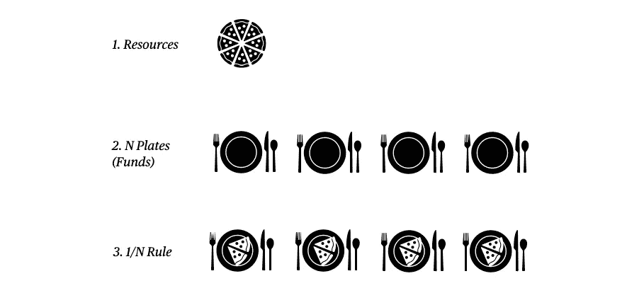
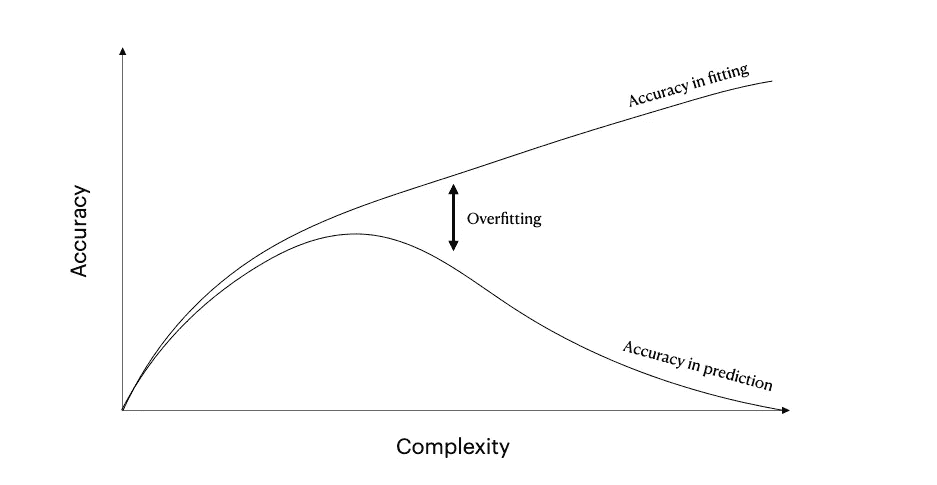
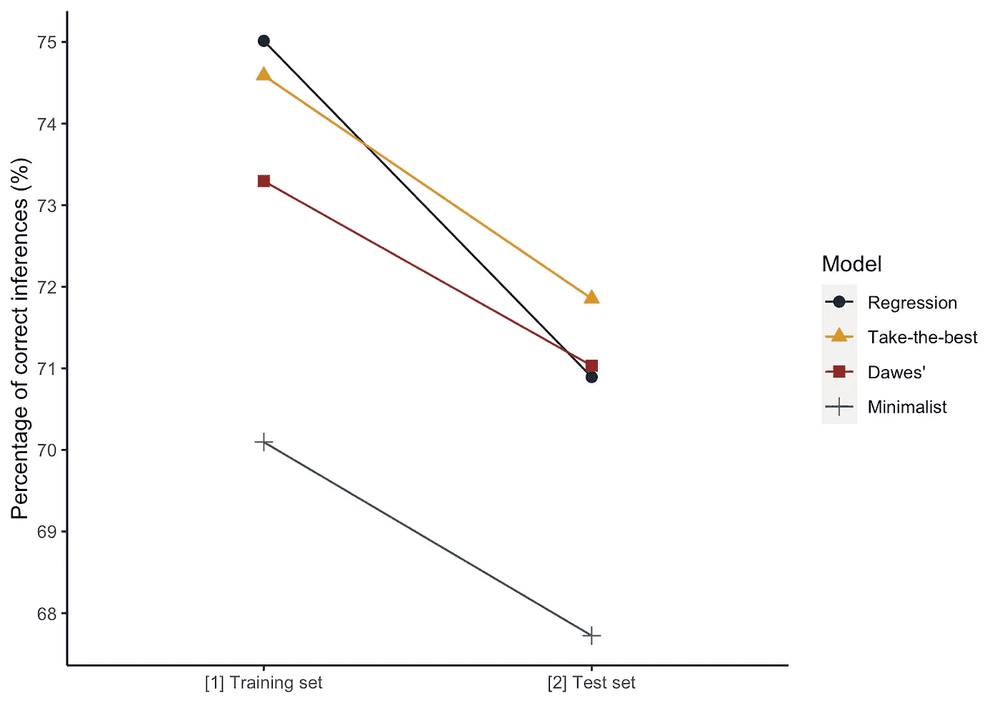
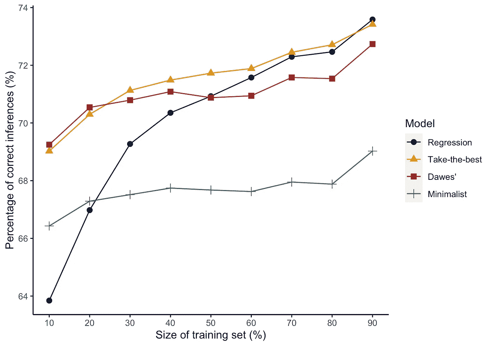

# 复杂性的劣势

> 原文：<https://towardsdatascience.com/the-inferiority-of-complexity-5f9f15da910f?source=collection_archive---------29----------------------->

## [思想和理论](https://towardsdatascience.com/tagged/thoughts-and-theory)

## 为什么快速和简单的试探法做得更好

照片由 [Renith R](https://unsplash.com/@renithr17?utm_source=medium&utm_medium=referral) 在 [Unsplash](https://unsplash.com?utm_source=medium&utm_medium=referral) 上拍摄

在诺贝尔奖得主哈里·马科维茨(Harry Markowitz)发展现代投资组合理论的七年后，均值-方差优化仍然是投资组合选择方法的基石，也是基金经理统计工具箱的关键组成部分。对于寻求最小化波动性和增加回报的当代投资者来说，多元回归和均值-方差优化的标准组合是当今的主流。复杂性带来了安慰，全球顶级商学院开发的大量统计策略为寻求理性和统计逻辑保证的基金经理提供了避难所。但投资者的水晶球被复杂性蒙上阴影了吗？

进入，快速和节俭的启发式。尽管有令人信服的计算，可靠的公式和常见但复杂的统计方法背后的基本原理，快速和节俭的试探法为这种计算昂贵的策略提供了一种令人耳目一新的替代方案。*快速*，因为它们的使用使决策能够快速做出*节俭*，因为决策通常是通过忽略除部分可用信息(预测)之外的所有信息做出的。通过将计算简化为简单透明的方法，启发式方法可以比复杂的方法更快地做出决策，并且使用更少的信息。

试探法并不新鲜，众所周知，我们在决策中经常依赖它们，这是我们有限理性的一个假设结果，即由于内在和环境的限制，我们做出理性决策的能力有限。在人类(和其他动物)中使用启发法通常是本能的，并作为次优策略被容忍，这是时间和准确性之间的必要权衡。然而，简单的试探法已经在体育、医学、金融和政治等领域取得了预测性的成功。在 2006 年，Scheibehenne 和 brder 发现使用认知启发式的业余选手比专家更能成功预测温布尔登的结果，同样，在 1997 年, [Green 和 Mehr](http://web.missouri.edu/~segerti/capstone/CCUdecisions.pdf) 发现医生使用快速和节俭的树木比复杂的替代品更能准确预测心脏病发作。

没有什么地方比吉杰伦泽、卡尼曼和特沃斯基的作品更能引起关于启发式的争论了。在这里，人类决策中的偏见被认为要么是朋友，要么是敌人，要么是一个起作用的因素，要么是一个重大的非理性影响，只有通过使用统计和逻辑才能减轻。

在我们继续之前，我将回头向精通统计学的投资者介绍一个熟悉的权衡启发法:1/NT4 法则。被称为平等启发式，它可以应用在资源分配的情况下，在 *N* 个选项之间平均分配资源，因此， *1/N* 。我在图 1 中用比萨饼和盘子表示了这一点。表面上看，这似乎是一种不合理的方法，但在 DeMigeul 等人的研究中，这种方法与 14 种备选投资策略进行了对比。使用[夏普比率](https://www.investopedia.com/terms/s/sharperatio.asp)，non 的表现始终优于 *1/N* 。事实上，当用 25 种资产的 250 年训练数据进行评估时，只有 Markowitz 的均值-方差成功。然而，这并不是说 *1/N* 应该是首选，只是说在某些环境和情况下，简单的启发法可以胜过复杂的策略。事实上，Markowitz 自己也依靠这个简单的启发式方法进行投资。注意，这里没有复杂的安慰。

图一。用披萨解释 1/N 法则。注意，这里没有复杂的安慰。

为什么简单的启发式策略能胜过更复杂的策略？答案不一定在于启发法本身，而在于它们被运用的环境的本质。

## 不确定情况下的理性

新古典经济学以理性为基础。在这种理性范式中，决策是通过考虑所有相关结果、其后果和可能性而做出的。这是商学院熟悉的逻辑世界，一个充满风险的世界，未来是确定的，优化是王道。在一个充满风险的世界里，启发式是第二好的。

在赌场之外，完美的知识和确定性的情况是罕见的。1954 年，[野人](https://blackwells.co.uk/bookshop/product/9780486623498?gC=5a105e8b&gclid=Cj0KCQjwyN-DBhCDARIsAFOELTlcvsaQalIfUF2F8YrGGIpwsLlG65oAlyRCWD-7Iud_92HBenfQew0aAlVqEALw_wcB)在*小*和*大世界中描述了这种情景对比。在小世界里，结果是可知和可解释的——想想轮盘赌；在大千世界中，未来是不确定的，尽管有信息的限制，还是必须做出决定。在 [*Incerto*](https://www.penguinrandomhouse.com/series/INO/incerto) *，*中，纳西姆·尼古拉斯·塔勒布把决策策略的应用，在我们*小世界*学术实验室里始乱终弃到大世界的情形称为*卢迪谬误。*描述不可能满足复杂预测策略的要求，并强调未知因素对此类模型造成的危险。在大千世界中，理性决策的基础是不现实的。*

所以，大世界是启发法的发源地。更少的线索和更少的数据可以带来更好的结果:启发式不是次优策略。

## 预测:少即是多

简单的启发违反了我们的理性观念。我们已经看到，至少在一种情况下，简单的东西可以做得更好，最复杂的策略不一定是最好的。为了进一步探索这一点，并扩大我们对启发法是受欢迎的决策策略的情况的理解，我试图复制心理名人 Gigerenzer 和 Todd 在 1999 年的发现，他们的书:*简单的启发法使我们聪明*。但是在我开始之前，请记住启发式(al)成功的几个条件:

*   当有很多可预测的不确定性时，试探法工作得很好；
*   当有多种选择时；和
*   学习机会少的时候。

这些条件不仅导致简单方法的成功，也导致许多复杂方法的失败。在复杂的策略中，预测的不确定性意味着准确假设的可能性很小(或者说，不准确假设的可能性更大)，大量的选择意味着需要估计更多的参数(这样做会产生更多的错误)，最后，较少的学习机会意味着较差的概括。

让我们简单地浏览一下模型复杂性。通常，复杂性可以被认为是模型中自由参数的数量；它们是我们知道的变量，量化和估计权重，取决于它们的影响。具有大量变量的复杂模型需要更多的估计，而更多的估计会产生更多的错误机会(尤其是如果我们使用的数据有一点大噪音的话)。因此，这些模型往往会过度拟合——这是偏差-方差困境的产物。如果你不熟悉，你可以在这里阅读困扰机器学习的权衡。现在，只需知道过度拟合通常等于预测不佳，产生图 2 中那种倒置的 U 形函数。节俭模型受益于它们的高偏差和缺乏方差，产生更好的预测和剔除噪音中的信号。

图二。模型精度(在拟合和预测中)与复杂性(模型中估计的自由参数的数量)。改编自[皮特和明(2002)](https://www.sciencedirect.com/science/article/abs/pii/S1364661302019642) 。

简单试探法的速度、准确性和节俭性允许创建健壮的预测策略。在本例中，我们将基于九个二元预测值来考察四种策略在拟合和预测 83 个德国城市人口时的稳健性(图 3)。

考虑的策略包括多元回归，一种典型的统计方法，以及学习更少变量和搜索更少线索的试探法:

**多元回归** *是计算开销最大的策略，我们会考虑我们的“复杂模型”。它通过寻找数据点和一个超平面(想想:线)之间的最小平方距离来创建一个函数。*

**取优** *是一种快速而节俭的启发式方法。它根据重要性对线索进行排序，并选择最好的线索(最成功地区分所有其他线索的线索)——这是一种非补偿性策略。也就是一个好理由。*

**道斯法则** *，像回归但更快。它只分配+1 或-1，而不是找到最佳的参数权重。不节俭。*

**极简主义者** *，喜欢博采众长但没有最初的排名。非常快；节俭。*

图 3。各种模型在拟合[1]和预测[2]德国城市人口时的稳健性，转载自 Gigerenzer 和 Todd (1999)。取优(FF)试探法在预测方面比回归法表现更好，线索更少。

结果(不)令人惊讶。回归法是最彻底的方法，它搜索所有的线索，分配权重，并以 75%的准确度创建最佳拟合。在预测中，回归法是第二差的，比最简方法高几个百分点，最简方法随机选择一个线索并坚持下去。两种试探法:取最佳法和道斯法则名列前茅，取最佳法的预测准确率约为 72%。*但这有什么大惊小怪的？回归预测仍然达到了可观的 71%。*

计算密集型策略是昂贵的，并且启发式算法因偏爱时间而不是准确性而声名狼藉。这些结果表明，事实并非总是如此。在某些情况下，你可以通过更少的努力做出更准确的预测。在简单策略和复杂策略一样成功的情况下，节省时间(和金钱)是有意义的！).

另一个促进使用启发式的重要环境因素是学习机会很少。在现实世界中，人们的决定会受到他们的经验的影响，他们所学到的会影响他们的行为。事实上，这在各种情况下可能意味着很多事情，并且通常被认为是一种不必要的偏见，是人类决策的易错性和局限性的典范，但现在，让我们将*学习机会*视为我们数据集的大小——这是我们为了建立模型和产生预测而必须处理的数据量。

为了了解学习机会如何影响模型的预测准确性，我再次尝试重现 Gigerenzer 和 Todd 的发现，使用与之前相同的模型，评估它们在各种规模的训练数据中的准确性(图 4)。

图 4。各种模型在不同规模训练集上预测德国城市人口的通用性。除了训练集超过 80%的可用数据之外，在所有情况下，快速而简单的启发式算法都比回归算法表现得更好。在训练集的补充上测试策略。转载自吉杰伦泽和托德(1999)。

同样，没有惊喜。我们在这里看到的是*少即是多的效果*，用更少的数据和更少的计算做出更准确的决策，而不是更多。

在训练数据超过我们可用数据的 80%之前，我们的复杂模型至少输给了一个简单的启发式算法。这是不现实的。在风险的世界里，我们知道样本空间；在这个不确定的世界里，我们知道的很少。正是在这里，启发式的简单性发挥了作用，在信息非常有限的情况下，可以快速轻松地做出准确的决策。值得注意的是，在可用数据量增加 9 倍的情况下，取最佳(我们的 A*启发式方法)只能将预测性能提高 6 个百分点。

在不确定的情况下，复杂模型的预测准确性较差，这与卡尼曼等学者的工作中理性的假定优势形成了鲜明对比，卡尼曼领导了(反)启发式辩论，声称他们的偏见和节俭是我们的非理性和有限系统的产物 1，而不是支持他们的环境成功。当然，当代计算技术的进步和对启发式的研究已经允许以前只被理解为本能和天真的策略被量化和分析。在有些情况下，复杂的策略非常成功，而在另一些情况下，忽视简单快速的启发式实现是一个代价高昂的疏忽，如果不是潜在有害的话。通过生态理性的概念可以更好地理解这些情况。

## 生态合理性

用更少的信息、更少的资源和更少的时间可以做出更好的决策。由于大世界是真实的世界，面对不确定性时启发式的有效性使它们成为必要的决策工具。但是，试探法的使用应该在适合成功结果的环境中进行，换句话说，在生态合理的环境中使用。

生态理性可以帮助我们决定是否最好选择复杂的统计策略，而不是快速和节俭的策略，反之亦然。在管理决策的背景下，他们的研究发现启发式策略并不次于理性策略。

不是所有的结果、选择和可能性都是已知的；给定最少的数据和大量的选择，快速和节俭的试探法的鲁棒性提供了一个生态理性的选择。我们都满意的一个例子是资源的分配，这里我们已经看到 1/N 是生态理性的，因为预测的不确定性，一个大的 N 和缺乏有意义的学习机会。

复杂策略长期以来饱受过度拟合之苦。在人员选择、资源分配、急救医学、政治和体育预测的情况下，启发式是有效的决策工具。这些都是不确定的情况，通常伪装成风险，预测比事后诸葛亮更重要，在某些情况下，启发式的透明度和可记忆性以一种计算昂贵的方法无法比拟的方式帮助人类决策。

## 注释、参考文献和推荐读物

我高度**推荐**我最喜欢的两本书，作为对风险、决策科学和统计学感兴趣的人的必读书: [*纳西姆·尼古拉斯·塔勒布*](https://www.penguin.co.uk/books/563/56380/the-black-swan/9780141034591.html)的《黑天鹅 (2008】和 [*思考，丹尼·卡尼曼*](https://www.penguin.co.uk/books/563/56314/thinking--fast-and-slow/9780141033570.html)的《快与慢 (2013】)。

Gerd Gigerenzer 领导了一些令人难以置信的启发式研究，但它相当沉重，所以[这里有一个链接](https://youtu.be/-Lg7G8TMe_A)到一个 TED 演讲。你会看到他讨论了 1/N，并回顾了我写过的简单启发法。

**引用我找不到链接的资源:**

Gigerenzer，g .和 Todd，P.M. (1999 年)。使我们变聪明的简单启发法。牛津大学出版社。

Gigerenzer，G. (2008 年)。凡人的理性:人们如何应对不确定性。牛津大学出版社。