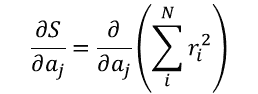
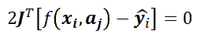

# 非线性回归的有趣世界

> 原文：<https://towardsdatascience.com/the-interesting-world-of-non-linear-regressions-eb0c405fdc97?source=collection_archive---------11----------------------->

## 或者勒文伯格和马夸特是如何超越最小二乘法的

[M. B. M.](https://unsplash.com/@m_b_m?utm_source=medium&utm_medium=referral) 在 [Unsplash](https://unsplash.com?utm_source=medium&utm_medium=referral) 上拍摄的照片

*有时我想，我是否是唯一一个在看到一堆点后试图画出一条不知何故跟随趋势的曲线的人。我想我并不孤单。每个人都有这种直觉。当只有几个点，我画的曲线只是一条直线时，这很容易。但是，每当我添加更多的点，或者当我寻找的曲线不同于直线时，它就变得越来越难。在这种情况下，一个曲线拟合过程就能解决我所有的问题。我承认输入一堆点，找到一条与趋势“完美”匹配的曲线，这是令人兴奋的。但是这是如何工作的呢？为什么拟合直线不同于拟合形状奇怪的曲线。每个人都熟悉线性最小二乘法，但是，当我们试图匹配的表达式不是线性时，会发生什么呢？我问了自己这些问题，这让我踏上了数学文章、堆栈溢出帖子[1]和一些深奥的数学表达式(至少对我来说是这样)的旅程。)，还有一个关于发现一种算法的有趣故事。这是我试图用最简单而有效的方式来解释这一切…*

# 问题是

在某些情况下，线性回归是不够的。有时有必要将一系列数据调整为非线性表达式。在这些情况下，普通的最小二乘法对我们不起作用，我们需要求助于不同的方法。我第一次遇到这种情况是在我试图将 2D 数据拟合到一个如下所示的函数时:

等式 1。非线性函数的示例

幸运的是，我有很多方法可以自动找到 Beta 的最佳值。任何熟悉 MATLAB 的 [nlinfit](https://www.mathworks.com/help/stats/nlinfit.html) 或 SciPy 的 [curve_fit](https://docs.scipy.org/doc/scipy/reference/generated/scipy.optimize.curve_fit.html) 函数的人都知道，一旦有了模型的数学表达式，这个非线性回归过程就很简单了。所有这些库的工作方式都类似，它们使用迭代算法，试图找到使观测数据和模型响应之间的差异最小化的参数或参数组合。让我们用一些等式来表达这个。

假设我们有一个函数 *f* ，它依赖于一个独立变量 *x* 和一组参数 *a* 。这就是 *y= f(x，a)* 。这个函数正在对一个我们已经知道输出 *ŷ* 的过程建模。目标是找到一组参数 *a* ，其导致最接近 *y* 的可能 *ŷ* 。测量我们有多接近ŷ的一种方法是计算残差的平方和。残差被定义为每一点上 *y* 和 *ŷ* 之间的差值。这可以表示为:

等式 2。残留的；剩余的

在这种情况下，下标 *i* 是指我们正在分析的数据点。如果我们试图调整一条有 100 个数据点的曲线，那么我们需要计算每个点的残差。最后，我们将有一个 *r1、r2、r3* 等等，直到我们在这个特定的例子中到达 *r100* 。残差的平方和对应于:

等式 3。残差的平方和

找到产生最低可能值 *S* 的参数 *a* 的组合意味着参数 *a* 是从我们的模型计算的 *y* 和 *ŷ* 值之间的最佳可能匹配。

# 显示问题的图解方式

下图用红色显示了一些数据点，用紫色显示了模型响应。如果我们想测量该模型如何调整数据点，我们可以计算数据点( *ŷ* )和模型响应( *y* )之间的差异，然后对这些差异的平方和(残差)求和。这个想法可以外推到包含多个独立变量的函数( *x1，x2，…xn* )。

残差的图形表示(作者使用 [Desmos](https://www.desmos.com/calculator?lang=es) 制作的图形)

# 解决方案(衍生品)

寻找一个函数的最小值的一个普通方法是计算它对一个特定变量的导数。在这种情况下，我们希望找到使函数 *S* 最小化的 *a* 的值。这可以写成:

等式 4。残差平方和关于参数 a 的导数

下标 j 意味着 *a* 可能有多个值，因为函数 *f* 取决于独立变量 *x* 和一个或多个参数 *a1，a2，…，aM* 。在这种情况下，我们需要对每个参数进行部分求导。一个函数的最小值是在它的导数等于零的地方找到的。所以，我们之前的等式会变成这样:

等式 5。导数等于零以找到最小值/最大值

注意我是如何展开 ri 的，只是为了提醒你这个残差是计算值和真实值之间的差。在这一点上，重要的是有一个导数的图形解释，以及为什么当它们等于零时，我们可以说我们找到了最小值(或最大值)。

# 用导数最小化函数的图解说明

一个[导数](https://en.wikipedia.org/wiki/Derivative)可以被定义为一个函数相对于它的自变量如何变化的度量。我们能找到的最简单的例子之一是类型为 *y=mx* 的函数。这个函数相对于 *x* ( *dy/dx* )的导数是 *m* 。这意味着 *x* 的每一个微小变化，输出( *y* )都会变化 *m* 次。所以这个函数的导数代表在 *x* 变化后 *y* 变化了多少。从视觉上看，这可以看作是函数中特定点处切线的斜率。

下图显示了一个与我们之前提到的直线完全不同的函数。在类型为 *y=mx，*函数中， *y* 相对于 *x* 的变化比率总是相同的，而与 *x* 的值无关。在这种情况下，该比率根据 *x* 变化。您可以看到图中所示的每个点对于切线具有不同的斜率( *m* )。这个斜率代表在特定点上计算的函数的导数。寻找函数的最小值和最大值的一种方法是寻找斜率为零的地方。在这种情况下，24.5 的 *x* 将给出最小值，而 10 的 *x* 将给出最大值。

衍生产品的图示(作者使用 [Desmos](https://www.desmos.com/calculator?lang=es) 制作的图表)

可能感觉事情开始变得复杂了，但是请耐心听我说。这并不像看起来那么难！如果你熟悉微积分和导数，你会知道推导最后一个方程的结果是:

等式 6。衍生产品的评估结果

项 *df(xi，aj)/daj* 对应于函数 *f* 相对于每个参数 *a* 的导数。在这一点上，值得记住的是，我们的模型可以包含多个参数 *a* ，我们需要找到函数 *f* 相对于这些参数的导数。

请注意，这个计算是针对数据中的每个点进行的。这就是为什么我们的函数 *f* 依赖于 *xi* 和 *aj* :我们有 *x* 的 *i* 值和 *a* 的 *j* 值。我们可以将所有这些导数汇集成一个术语，称为[雅可比](https://en.wikipedia.org/wiki/Jacobian_matrix_and_determinant)。多么奇怪的名字！雅可比矩阵是一个矩阵，它包含一个函数相对于它的每个参数的所有一阶偏导数。

记住下标 *i* 代表一个特定的数据点。如果我们的数据由 100 个点组成，那么这个雅可比矩阵将有 100 行和 3 列，因为我们有 3 个参数。

如果我们使用雅可比矩阵的概念来重写我们为 dS/da 找到的上一个等式。我们将拥有:

方程式 7。前一个方程的矩阵形式

注意我是如何用矩阵来表达这个方程的。我去掉了和，现在雅可比矩阵和残差都用矩阵表示了。请记住，所有这些方程都是针对所有数据点同时求解的，因此使用矩阵非常方便。在这一点上，我将向您展示两种方法，我们可以用这两种方法来求解这个方程，并找到更好地调整初始方程 *f* 的参数。

# 多一点数学知识

# 梯度下降

你可能听说过这个名字。[梯度下降](https://en.wikipedia.org/wiki/Gradient_descent)是一种优化算法，用于寻找函数的局部最小值。背后的想法不难理解。因为我们试图最小化的函数是可微的，所以我们知道任意点的梯度。这意味着我们知道我们需要走哪个方向才能继续走下去。在每次迭代中，我们都向函数的最小值靠近一点。梯度下降法的两个重要方面是初始猜测和每次迭代的步长。这种方法的效率高度依赖于这两点。

这和非线性回归有什么关系？嗯，我们可以用梯度下降法找到函数 *S* 的最小值。在这种情况下，我们朝着最小点采取的每一步都可以表示为:

等式 8。梯度下降步骤

这个 *hGD* 被添加到参数的初始估计中，并且这个过程被重复，直到我们找到最小值或者我们超过最大迭代次数。出现在最后一个等式中的α用于增加或减少我们正在采取的步骤的大小。正如我之前提到的，梯度下降法的性能与步长以及初始猜测有很大关系。

# 高斯-牛顿法

梯度下降法是广为人知并被广泛使用的方法，但是根据参数的数量，它可能相当慢。另一种方法是[高斯-牛顿](https://en.wikipedia.org/wiki/Gauss%E2%80%93Newton_algorithm)法，类似于梯度下降法，这是一个迭代过程，在这个过程中，我们采取多个步骤，直到我们接近正确的解决方案。在这种情况下，我们通过以下方式获得新的参数组合:

等式 9。高斯-牛顿步

其中 *hGN* 代表我们在高斯-牛顿法中所采取的步骤。如何才能知道每次迭代时 *hGN* 的值？

在高斯-牛顿法中，函数 *f* 使用一阶泰勒展开式进行近似，这意味着

方程式 10。泰勒展开

还记得我们说过，项 *dfi(a)/daj* 也被称为雅可比，所以前面的等式也可以写成:

方程式 11。用雅可比矩阵表示的泰勒展开

如果我们用这个表达式将 *f(an)* 替换为 *f(an+1)* ，我们最终得到:

方程式 12。用 f(an+1)代替 f(an)

可以重新组织为:

方程式 13。方程式 12 重新组织

并且使用以下等式来计算该步长:

方程式 14。高斯-牛顿步

下图适用于这两种方法。在这两种情况下，都需要指定参数的初始猜测以及停止标准。在这种情况下，停止标准由最大迭代次数或平方误差的最小值组成。

梯度下降和高斯-牛顿算法流程图

# Levenberg-Marquardt 方法或阻尼最小二乘法

注意 *hGD* 和 *hGN* 方程非常相似，这与 Levenberg-Marquardt 方法有很大关系。这种方法在梯度下降法和高斯-牛顿法之间切换，取决于我们离解决方案有多近。Levenberg-Marquardt 方法表示为:

方程式 15。勒文伯格-马夸特步骤

在上式中， *I* 表示单位矩阵，λ称为阻尼因子。该参数允许高斯-牛顿或梯度下降更新之间的变化。当λ较小时，该方法采用高斯-牛顿步骤，当λ较大时，该步骤遵循梯度下降法。一般来说，λ的第一个值很大，因此第一步是在梯度下降方向[2]。这背后的逻辑是高斯-牛顿法对最后的迭代更有效，而梯度下降法在算法离理想解还很远的过程开始时是有用的。

如您所见，Levenberg-Marquardt 算法是梯度下降和高斯-牛顿算法的结合。因此，Levenberg-Marquardt 算法的效率也高度依赖于初始猜测以及阻尼因子的选择[3]。此外，阻尼因子的增减也会影响算法的性能。在每次迭代中，阻尼因子乘以或除以一个因子，该因子取决于前一次迭代的好坏。一般来说，λ增加 2 倍，减少 3 倍。

Levenberg-Marquardt 算法流程图

作为一个有趣的历史旁注，Levenberg 在 1944 年提出了这种方法，但直到 19 年后，他的方法才部分由于引用了 Marquardt 的一篇论文而声名狼藉。Levenberg 在陆军弹药厂 Frankford Arsenal 工作时发表了该算法。在某种程度上，可以说马夸特重新发现了阻尼最小二乘法，这就是为什么今天这两个名字都被用作参考。Pujol [4]完整地描述了 Levenberg 和 Marquardt 所做的工作，以及他们每个人如何分别对我们今天所知的算法做出贡献。

# 代码

Levenberg-Marquardt 算法可以以多种形式实现[5]。在这种情况下，我用 Python 笔记本向[展示了一种使用这种算法的非常简单的方法。我还将我的结果与 Scipy 的 curve_fit 函数的结果进行了比较。这个函数有一个更健壮的算法实现，它将胜过我将向您展示的那个。然而，我认为这段代码是一个很好的起点，可以用来理解任何更复杂的东西，以及理解“引擎盖下”正在发生的事情。虽然本笔记本中显示的示例是指二维问题，但算法背后的逻辑可以应用于多种情况。](https://github.com/manfrezord/MediumArticles/blob/main/LM-Algorithm.ipynb)

本笔记本中包含的示例被称为偏角曲线分析(DCA ),这是石油工程领域常用的方法。笔记本包含 DCA 的简要说明和一些示例。你可以在我的 GitHub 库的这里访问这个笔记本[。](https://github.com/manfrezord/MediumArticles/blob/main/LM-Algorithm.ipynb)

# 结论

几年前可能要花很长时间才能完成的计算现在每天都变得更容易了。然而，理解所有这些计算来自哪里总是很重要的。进行线性和非线性回归是数据分析和机器学习中许多其他事情的基础。今天，当每个人都在关注这些领域，试图找到答案或更有效的执行过程的方法时，了解基础是如何工作的就很重要了。

# 参考

1.  [leven Berg–Marquardt 算法是如何以一种可理解的方式详细工作的？](https://stackoverflow.com/questions/1136416/how-does-the-levenberg-marquardt-algorithm-work-in-detail-but-in-an-understandab)。堆栈溢出 post。07/15/09
2.  加文，H. (2020)。非线性最小二乘曲线拟合问题的 Levenberg-Marquardt 算法土木与环境工程系。杜克大学。
3.  关于如何使用 Levenberg-Marquardt 算法改进摄像机校准参数的备忘录。机器人视觉实验室。普渡大学。
4.  Pujol，J. (2007)非线性逆问题的解决方案和 Levenberg-Marquardt 方法。地球物理学，第 72 卷，第 4 期
5.  豪尔赫·莫里。(1977).Levenberg-Marquardt 算法:实现和理论。苏格兰大学第 7 届邓迪数值分析双年展。