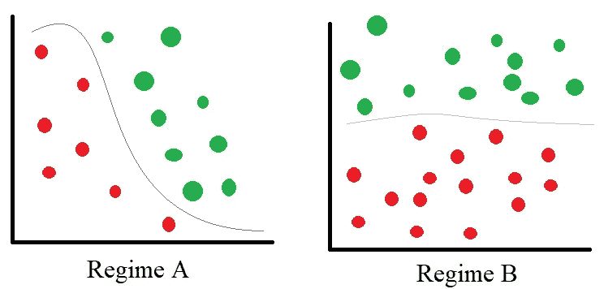

# 模型监控背后的直觉

> 原文：<https://towardsdatascience.com/the-intuition-behind-model-monitoring-bd8b5d8e540b?source=collection_archive---------34----------------------->

## 让你的机器学习系统能够适应世界的变化

在 [Unsplash](https://unsplash.com?utm_source=medium&utm_medium=referral) 上[耿玲](https://unsplash.com/@keringling?utm_source=medium&utm_medium=referral)拍照

> *世界本质上是动态和不稳定的——不断变化。*

机器学习模型的性能随着时间的推移而下降是很常见的。这随着数据分布和目标标签(“地面实况”)的发展而发生。与人相关的模型更是如此。

因此，机器学习系统的一个重要组成部分是监控和适应这些变化。

在本文中，我将介绍这种*概念漂移*或*政权变更*的想法，然后讨论处理它的三种方式以及您应该考虑的事项。

> 用于模型监控的新工具正在出现，但是理解*您想要如何*维护模型仍然很重要

# 概念漂移定义

**概念漂移**或**体制变化**是生成数据的过程中的变化。我们只关心这种改变是否会损害你的模型的性能。

从状态 A 到状态 b 的真实概念漂移。在状态 A 期间学习的函数将错误分类在状态 b 中观察到的一些数据点。

如上图所示，“概念”(红色和绿色数据点之间的区别)已经旋转并改变了形状。在方案 A 中学习了*概念*的模型在方案 b 中表现不佳。

# 如何检测和解决漂移问题？

在**模型监控**中，跟踪数据和模型结果以检测漂移。一旦检测到漂移，可以手动或自动解决。

> 解决概念漂移的一般方法是监控您的模型以检测漂移，重新训练模型，并部署新的模型版本。

有三种常见的方法来监控概念漂移:

*   监控模型性能
*   监控模型预测中置信度的统计测量
*   在线模型更新或定期模型再培训

## 监控模型性能

这是直截了当的:如果模型度量下降到某个设定的水平之下，重新评估模型。要监控模型指标，您需要做出几个决定，这些决定将影响漂移检测的灵敏度和频率。

1.在计算模型性能时，您使用了多少新的预测？

2.您评估哪些绩效指标，应用哪些阈值？

3.您多久监测一次漂移？

4.你的模型的用户有多容错？这将有助于你对(1)-(3)的回答。

5.你如何应对漂移？对你的模型进行人工评估和再培训？自动更新？

## 监控模型预测中置信度的统计测量

另一种方法是监控模型预测或残差值的分布或这些值的置信度。

与潜在的高维输入数据相比，监控模型产生的值的分布变化要容易得多。统计监视器的具体形式取决于要监视的预测的速度和数量。

除了上一节中的问题之外，要做出的一些相关决策包括:

*   [Kolmogorov–Smirnov(KS)测试](https://en.wikipedia.org/wiki/Kolmogorov%E2%80%93Smirnov_test)是否表明您的预测或残差值的分布发生了变化？为了用 KS 检验准确地比较两个分布是否相同，需要一些最小数量的例子。
*   给定的预测/残差是否落在训练期间观察到的预测/残差分布的给定置信区间内？

## 在线更新

另一个选择是定期用新的观察值更新模型权重。更新的周期可以是每天、每周或每次收到新数据时。如果你在每次收到新的标记观测值时更新你的模型，你的模型就会在线更新*。*

如果您预期增量概念漂移或不稳定的概念，这个解决方案是理想的。

这种选择并不是万无一失的，因为尽管在线更新，仍然存在模型偏离真实目标的风险。发生这种情况的原因有很多。

*   一个离群值可能对在线训练中的模型产生过大的影响，使学习到的模型进一步远离目标概念。这种风险可以通过使用成批的观察数据而不是单个数据点进行在线更新来降低。
*   学习率可能太小，从而在存在大漂移的情况下阻止模型足够快地更新。
*   学习率也可能太大，导致模型超出目标概念并继续表现不佳。

由于这些原因，监视在线更新的模型仍然很重要。

# 结论

理解和检测漂移是一项艰巨的任务。最终，选择检测和应对漂移的最佳方法通常需要对数据、模型和应用有深入的了解。

漂移检测和模型再训练的理想频率是主观的，取决于您的数据和应用。

最后，在任何解决方案中，重要的是要考虑模型性能指标的变化是否是由于样本偏差，或者感知的漂移是否是由于随机性或异常值，而不是数据分布或目标概念的变化。

## 进一步阅读

要更深入地了解概念漂移，请查看我的相关文章:

</concept-drift-can-ruin-your-model-performance-and-how-to-address-it-dff08f97e29b> 