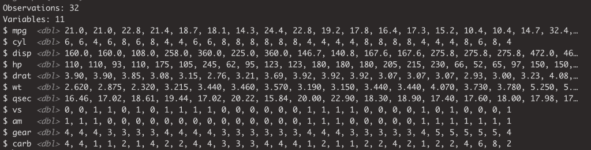
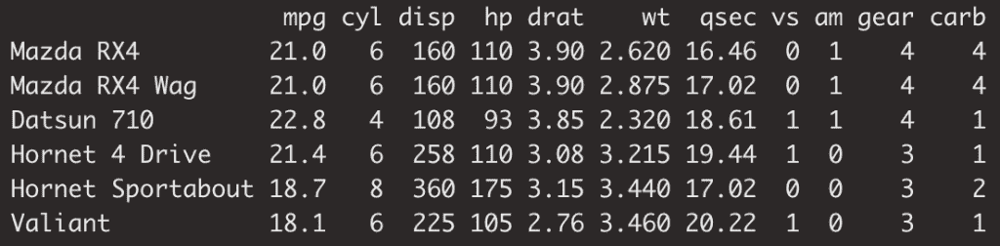
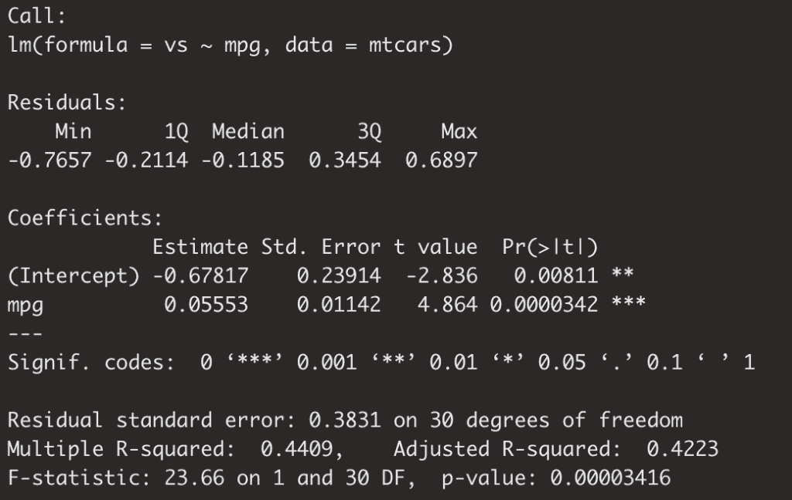
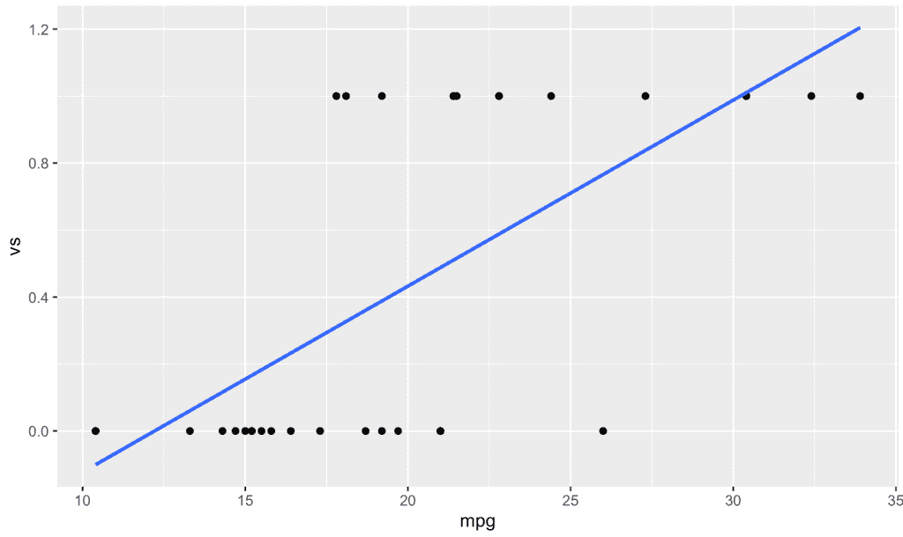
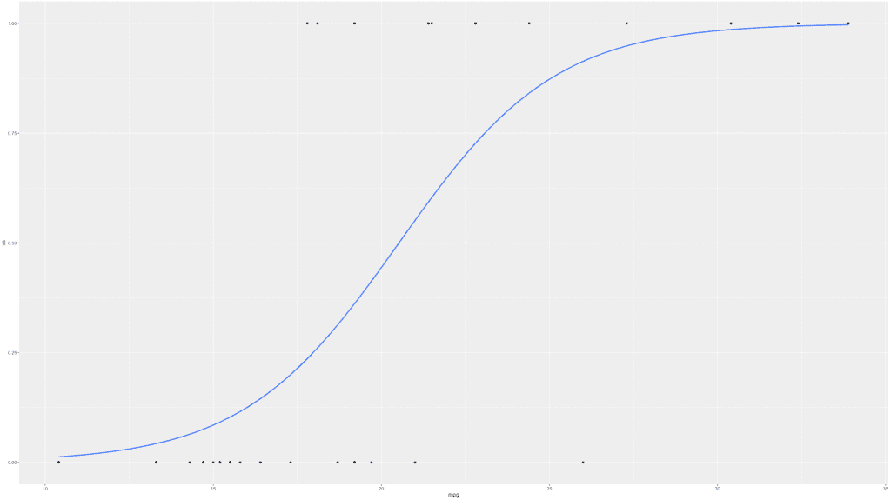
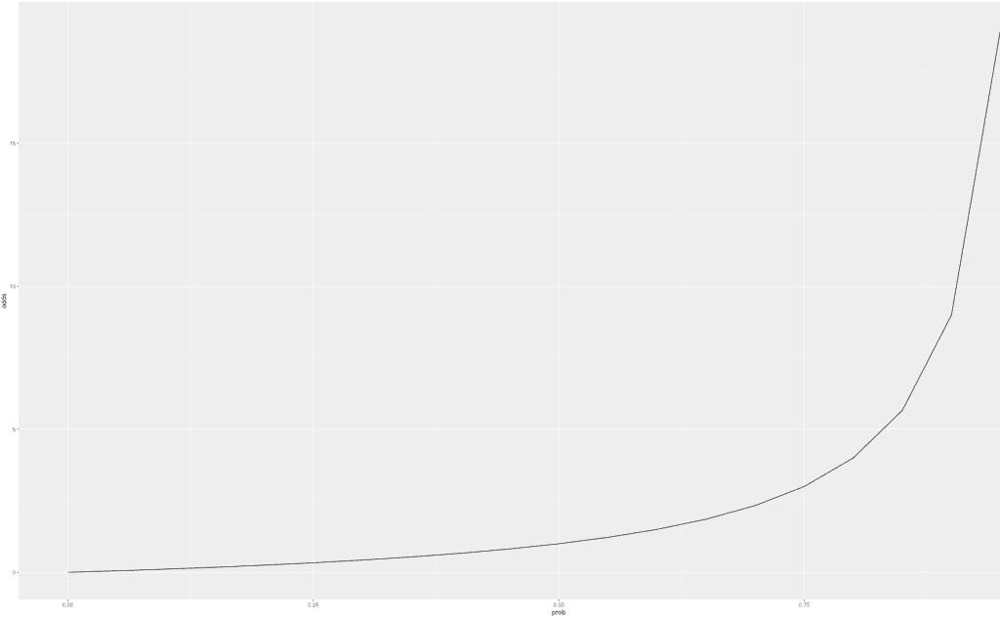
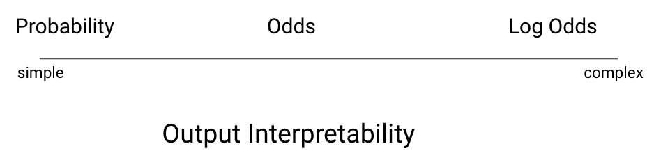
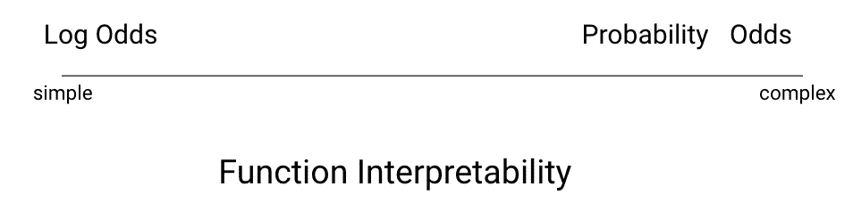
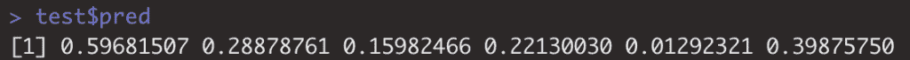
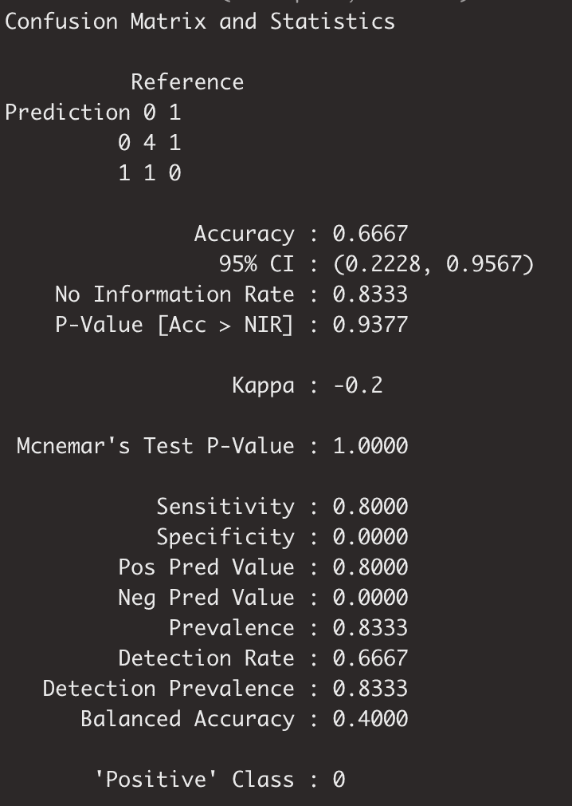

# 逻辑回归的直观解释

> 原文：<https://towardsdatascience.com/the-intuitive-explanation-of-logistic-regression-a0375b1bee54?source=collection_archive---------35----------------------->

## 深刻的基本理解是正确使用的关键


图片由皮查拜的[杰拉德](https://pixabay.com/users/geralt-9301/)拍摄

# 介绍

逻辑回归可能很难理解！因此，我对逻辑回归的原因、内容和方式做了一个非常直观的解释。我们将从一些有助于更清晰理解的构件开始，所以坚持住！通过这篇文章，我希望能引导你理解、构建和解释逻辑回归模型。尽情享受吧！

# 什么是逻辑回归？

逻辑回归是一种非常流行的预测或理解二元变量(热或冷，大或小，这个或那个——你懂的)的方法。逻辑回归属于分类的机器学习范畴。

再举一个例子来区分线性回归和逻辑回归:而不是预测某样东西会卖多少钱..你也可以预测它是否会被卖掉。不多说了，让我们开始吧！

# 将线性回归理解为前兆

让我们来讨论一个线性回归的输出。对于那些不熟悉线性回归的人来说，最好从这里开始。你可以访问这个帖子来了解一下[简单线性回归](/build-evaluate-and-interpret-your-own-linear-regression-model-in-minutes-e6a3e8253501) &这个为[多元线性回归](/multiple-regression-a-primer-on-parallel-slopes-models-137d114e314e)。

现在知道一点线性回归；您会知道线性回归输出相当于一条直线的方程。很简单..这就是我们想要的一切；只是一种重新解释一个变量的方法，借以洞察另一个变量。

知道了这些，让我们对一个二元变量进行线性回归。二进制是或否，1 或 0。这个变量将是我们逻辑回归的候选变量，但我们很快就会知道。

# 构建线性回归以理解逻辑回归

今天我们将使用`mtcars`数据集。这是一个用于数据科学学习的经典数据集，详细描述了各种汽车的油耗、发动机详细信息以及其他详细信息。

快速浏览数据集:

```
glimpse(mtcars)
```



```
head(mtcars)
```



# 二元变量的线性回归

在这个数据集中，我们有一个二元变量… `vs`。由于对汽车了解不多，我无法给你详细解释`vs`是什么意思，但高水平是它是发动机配置的代表..我也知道配置会对功率、效率等产生影响。这是我们能够通过模型梳理出来的。因此，希望这将很容易确定的差异！

让我们建立回归模型吧！我们将试图把`vs`理解为每加仑英里数的函数。

```
fit <- lm(vs ~ mpg
  ,data = mtcars)
summary(fit)
```

请随意查看下面的回归输出:



你可以看到 R 的平方是 0.44，这意味着我们可以解释 44%的 y 的变化，x 的变化。不错。我们还看到 p 值小于 0.05。竖起两个大拇指。

现在事情变得棘手了..让我们来看看 y 轴截距。我们的 y 轴截距是 0.67。看起来很奇怪，因为 vs 不是可以变负的东西…事实上，它只能是 0 或 1。这将构成对二元变量使用线性回归的一个主要问题，但稍后会有更多的讨论。首先，我们将寻求更好地理解我们正在处理的数据。

# 可视化我们的输出

让我们用散点图快速地将这两个变量形象化，并添加回归线，给我们一些额外的见解。

```
mtcars %>%
  ggplot(aes(x = mpg, y = vs))+
  geom_point()+
  geom_smooth(method = 'lm', se = FALSE)
```



首先，你可以看到 y 轴是一个连续变量，所以你会看到所有的点都在 0 或 1 上。

至于 x 轴，我们可以看到，根据因变量是 1 还是 0，分别向右和向左集中。这与我之前提到的`vs`为 1 的汽车比`vs`为 0 的汽车油耗更低是一致的。

从图表中可以非常直观地看到，直线以线性方式穿过两组。

# 明显的问题？

这里显而易见的问题是，这条线在两个方向上永远都在延伸。任何一个极端的输出都是没有意义的。

为此，我们不能原样使用线性回归。这并不意味着它是无用的，我们只是必须修改它，使我们的预测极限不是无限的。

# “一般化”线性回归

我们得到逻辑回归的方法是通过所谓的“广义线性模型”。你可以想想我们刚刚通过简单的线性回归，创建的一条线的函数或方程。通过线性模型，我们可以根据与 x 相关的函数来理解 y。对于逻辑回归，我们将该函数有效地包装在一个负责“概括”模型的附加函数中。

# 概化或概化函数的目的是什么？

我们要做的是对给定的数据点进行分类，或者换句话说，将给定 mpg 的车辆分配到两个组中的一个，v (0)或 straight (1)。

从概率的角度来考虑这个问题是有帮助的。对于任何给定的`mpg`数据点，汽车有一个给定的概率或者是 v 或者是直线。因此，一个旨在阐明这种关系的模型的输出有可能是有意义的。

总结这个想法，我们想以一种代表概率的方式来概括线性输出。

# 如何概括

我前面提到的一般化过程是将我们的线性函数包装成另一个函数。这个函数就是所谓的链接函数。正如我刚才提到的，链接函数将线性输出缩放为 0 到 1 之间的概率。对于广义线性模型的子类逻辑回归，使用了**逻辑**链接函数。

# 可视化逻辑回归

让我们看一下与之前相同的图，但这次拟合的是**逻辑** **曲线**。

```
mtcars %>%
  ggplot(aes(x = mpg, y = vs))+
  geom_point()+
geom_smooth(method = "glm", se = FALSE, method.args = list(family = "binomial"))
```

我们包含了和以前一样的代码，只是现在我们的方法是“glm ”,它指定我们想要一个通用的线性模型；其次，我们指定家庭=“二项式”。这就是调用哪个链接函数的原因。在这种情况下，“二项式”使用 logit 函数。



让我们解释一下我们的新图表。正如你所看到的，我们线的两端都变平了，所以这条线永远不会达到 0 或 1。

我们可以看到，朝向中间的线非常直，与我们的线性模型相似。

# 构建我们的第一个逻辑回归模型

让我们开始构建我们自己的逻辑回归模型。这与线性回归调用非常相似，但有两个关键区别。第一个是呼叫是`glm`，第二个是家庭是类似于你在`geom_smooth`呼叫中看到的“二项式”。这里使用它的基本原理是一样的。

```
fit <- glm(vs ~ mpg
          ,data = mtcars
          ,family = 'binomial')
summary(fit)
```

我想用 glm 函数指出的第一件事是，你必须首先将因变量编码为 1 或 0。其他分类算法可能不需要所述编码，但是在逻辑回归的情况下，重申一下，它是线性输出的包装。因此，位于我们的链接函数内部的线性模型不会对角色或因素起作用。

# 逻辑回归解释

现在该说说解读了。这也不是一个非常简单的话题，但我们会尽可能直观地探讨它。

考虑逻辑回归解释有三种方式:

*   可能性
*   可能性
*   对数概率

就可解释性而言，每一种都有不同的取舍。但是首先…定义

# 可能性

很简单，概率是用 0 到 1 表示的可能性的度量。

# 可能性

另一方面，Odds 用来表示某件事发生的频率(概率)相对于不发生的频率(1-概率)。

这个公式看起来像这样。

这里要考虑的一件事是它是指数级的。

让我们写一点快速代码，使指数标度的原因更加直观。我们将在 0 . 05 之前创建一个 0 到 1 的序列。然后，我们将根据上述公式创建一个赔率字段。最后，我们将绘制线！

```
probs_vs_odds <- data.frame(prob = seq(0, 1, by = 0.05))
probs_vs_odds <- probs_vs_odds %>% 
  mutate(inverse_prob = 1-prob,
         odds = prob / inverse_prob)
probs_vs_odds %>%
  ggplot(aes(x = prob, y = odds))+
  geom_line()
```



我还将在下面添加数据帧，以提供额外的说明。希望这能让我们清楚地思考。当概率为 5%时，你的赔率是 1/20，相反，当概率为 95%时，你的赔率是 19 比 1，而不是线性变化。


# 对数赔率

非常类似于一个变化的几率。我们采用对数来缓和指数曲线。一旦我们得到了对数几率，我们就能够再次将我们的模型可视化为一条线。这对于函数解释来说很好，但是对于输出解释来说就很糟糕了

# 权衡取舍

我下面的视觉效果旨在传达功能和输出的可解释性。概率的输出很容易解释，但是它的函数是非线性的。赔率是有道理的，但是并不是最容易在心里理解的事情&它是指数级的..作为一个函数，不太有意义。最后，对数概率几乎不可能解释，但是它的函数是线性的，这对于解释是很好的。



没有一个是绝对最好的。而对于输出，概率是最容易解释的，概率函数本身是非线性的。你可能会发现自己在用某种组合来交流预测和函数等等。

# 性能赋值

在这最后一部分，我将为您提供一些工具，这些工具将是模型性能评估的关键。

我们将使用所谓的交叉验证。所有这一切意味着，不是用你所有的数据点来训练一个模型，而是你将抽取一些数据点，等到模型被训练好，然后为它们生成预测，然后在预测和实际之间进行比较。

下面我们分解训练和测试组，并生成模型。

```
n <- nrow(mtcars)
n_train <- round(0.8 * n) 
set.seed(123)
train_indices <- sample(1:n, n_train)
train <- mtcars[train_indices,]  
test <- mtcars[-train_indices,]fit <- glm(vs ~ mpg
  ,data = train
  ,family = "binomial")
```

从这里，我们将为我们的测试组生成一个预测。如果你看一下`pred`字段，你实际上会看到是 1 的概率。



这留给我们的挑战是，不是说这些车可能有配置 1，这些有 0；我们只剩下概率了。

你会在下面代码的第二行看到我绕过了预测。. 5 及以上为 1，以下为 0。

. 5 被用作一个相当标准的分类阈值——尽管肯定存在需要更高或更低阈值的情况。

最后，我们使用`caret`的`confusionMatrix`函数来可视化混淆矩阵，并提供一些性能评估指标。诸如准确性、p 值、敏感性、特异性等等。

```
test$pred <- predict(fit, test, type = 'response')
test$pred <- as.factor(round(test$pred))
test$vs <- as.factor(test$vs)
confusionMatrix(test$pred, test$vs)
```

在我们的例子中，p 值很高，准确性中等。



# 结论

如果你已经做到了这一步，那么希望你已经了解了一两件关于逻辑回归的事情，并且会对构建、解释和交流你自己的逻辑回归模型感到舒服。

在这篇文章中，我们讨论了以下内容:

*   定义
*   模型结构
*   解释
*   性能赋值

我希望这证明有用！查看我在 datasciencelessons.com[的其他数据科学课程，或者在 Twitter](http://datasciencelessons.com) [@data_lessons](https://twitter.com/data_lessons) 上关注我。祝数据科学快乐！