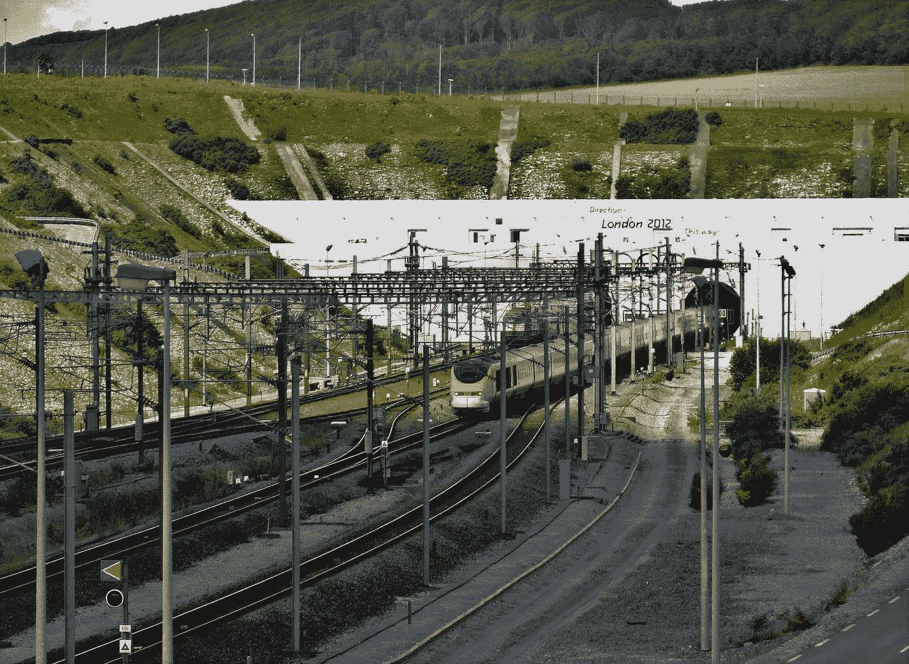
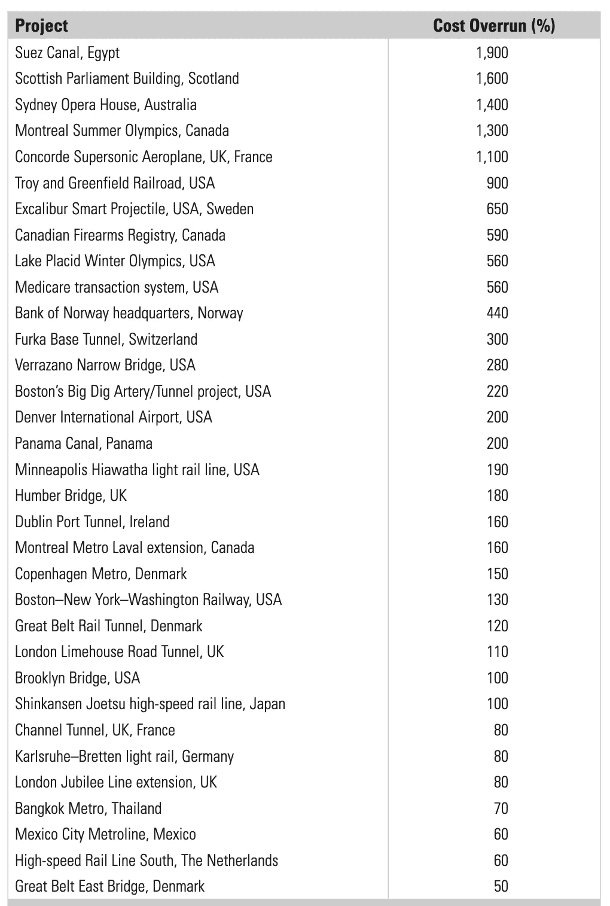

# 大型项目的铁律

> 原文：<https://towardsdatascience.com/the-iron-law-of-megaprojects-18b886590f0b?source=collection_archive---------14----------------------->

## *超出预算，随着时间的推移，收益不足，一次又一次*

照片由 Nico Callens 拍摄，[https://pix abay . com/photos/train-train-tracks-railways-station-5439799/](https://pixabay.com/photos/train-train-tracks-railways-station-5439799/)

> 大型项目的绩效数据用他们自己的语言表达

大型项目的业绩数据用他们自己的语言表达。这类项目十有八九成本超支。实际上超过 50%是常见的，超过 50%并不罕见。英吉利海峡隧道是欧洲最长的水下铁路隧道，连接英国和法国，实际成本超支 80%。丹佛国际机场，200%。波士顿的大挖掘，220%。加拿大枪支登记处，百分之 590。悉尼歌剧院，1400%(更多例子见下表)。*

来源:作者， [SSRN](https://deliverypdf.ssrn.com/delivery.php?ID=149097083081120106113088111126127091104014059082060018071001092023117017118116007064117119051059021051011086109010116001094020020070011051015027001003076020110101010062078052086006099104123084023095090124067113102026127001118015014064126124124121094087&EXT=pdf&INDEX=TRUE)

超支在私人和公共项目中都是一个问题，而且情况没有改善；在有可比数据的 70 年间，超支一直居高不下。地理位置似乎也无关紧要；有数据可查的所有国家和大洲都遭受超支之苦。同样，高达 50%的福利缺口也很常见，超过 50%也不罕见，而且随着时间和地域的推移，也没有改善的迹象。

将大量的成本超支和收益不足与商业案例、成本收益分析以及社会和环境影响评估这一事实结合起来，我们发现这类分析通常是不可信的。

> 一个大型项目很可能是技术上的成功，但却是财务上的失败，很多都是如此

例如，对于铁路项目，44.7%的平均成本超支与 51.4%的平均需求短缺相结合，对于公路项目，20.4%的平均成本超支与 50%的需求误差风险相结合。在构成商业案例、成本效益分析以及社会和环境影响评估基础的预测中存在如此大的误差和偏差，这种分析在很大程度上也会产生严重的误导。俗话说“垃圾进，垃圾出”。

作为一个恰当的例子，更详细地考虑[海峡隧道](https://medium.com/geekculture/eurotunnel-when-success-spells-disaster-6e470fe321d)。这个项目最初被宣传为在经济上和财政上都非常有利。在首次公开募股时，隧道的私人所有者欧洲隧道公司(Eurotunnel)诱惑投资者，告诉他们 10%“对于不可预见的情况对建设成本的可能影响来说是一个合理的余量。”事实上，如上所述，建设成本超出预算 80%，融资成本超出预算 140%。收入只有预测的一半，在新冠肺炎疫情之后甚至更低。

因此，该项目已被证明是不可行的，投资的内部收益率为负，为负 14.5%，给英国经济造成的总损失为 178 亿美元。也就是说，英吉利海峡隧道不但没有增加经济，反而降低了经济。

> 如果英吉利海峡隧道没有建成，英国经济会更好

当你使用这项服务时，你很难相信这一点，因为它快捷、方便，而且与其他出行方式相比具有竞争力。但事实上每位乘客都得到大量补贴。这次不是由纳税人，而是由许多私人投资者承担，当[欧洲隧道](https://medium.com/geekculture/eurotunnel-when-success-spells-disaster-6e470fe321d)破产和财务重组时，他们损失了钱。2021 年，由于新冠肺炎，第二次破产的威胁。

这说明了重要的一点:一个大型项目很可能是技术上的成功，但却是财务上的失败，而且很多都是这样。

对英吉利海峡隧道的经济和财务事后评估系统地比较了实际成本和收益，得出的结论是“如果隧道从未修建，英国经济会更好。”其他不可行的大型项目包括悉尼的莱恩科夫隧道、斯德哥尔摩和奥斯陆机场的高速铁路连接、哥本哈根地铁和丹麦的大贝尔特隧道，这是仅次于英吉利海峡隧道的欧洲第二长的水下铁路隧道。

> 延误每天将花费 330 万美元

大型信息和通信技术项目风险更大。六分之一的此类项目在成本超支方面成为统计异常值，实际异常值的平均超支为 200%。与正常情况相比，这是异常值发生率的 2000 %,与大型建筑项目相比，这是异常值发生率的 200 %,大型建筑项目也受到成本异常值的困扰。仅在美国，每年因失败和表现不佳的 ICT 项目而造成的项目浪费总额估计为 550 亿美元。

对于大型项目来说，延误是一个单独的问题，延误会导致成本超支和收益不足。例如，牛津大学基于同类最大的数据库进行的一项研究结果显示，大坝的延误率平均为 44%。因此，如果一座大坝计划用 10 年时间建造，从决定建造到大坝投入使用，实际上平均需要 14.4 年。我和我的同事基于大型建设项目的大型数据集，对成本超支和实施阶段长度之间的关系进行了建模。我们发现，平均而言，实施阶段的一年延迟或其他延长与 4.64%的百分比成本超支的增加相关。

举例来说，对于伦敦 260 亿美元的 Crossrail 项目来说，一年的延迟将额外花费 12 亿美元，即每天 330 万美元。这里的关键教训是，为了降低成本，实施阶段应该保持较短，延迟应该较小。这不应该被视为快速跟踪项目的借口，也就是说，为了尽早开始施工而匆忙做出决策。在决定是否给一个项目开绿灯或停止它之前，前端规划需要彻底。但通常情况恰恰相反。缺乏前端规划，糟糕的项目没有停止，实施阶段和延迟时间很长，成本飙升，收益和收入实现遥遥无期。

> 列出一长串失败的项目比列出一长串成功的项目要容易得多

对于债务融资的项目来说，这是一个灾难的处方，因为项目债务增长，而没有收入流来支付利息，利息随后被添加到债务中，等等。因此，许多项目最终陷入了所谓的“债务陷阱”,即建设成本不断上升、工程延期和利息支付不断增加，使得项目收入无法覆盖成本，从而导致项目不可行。这就是发生在海峡隧道和悉尼的莱恩湾隧道，以及其他项目上的事情。

这并不是说不存在那些建立在预算和时间基础上并交付了承诺收益的项目。毕尔巴鄂古根海姆博物馆是这种罕见项目的一个例子。类似地，马德里最近的地铁支线和许多工业项目一样，都是按时按预算建成的。特别重要的是研究这些项目，以了解成功的原因，并测试成功是否可以在其他地方复制。

然而，就成本超支和收益不足而言，列出一长串失败的项目要比列出一长串成功的项目容易得多。举例来说，作为正在进行的大型项目管理成功研究的一部分，作者和他的同事正试图建立一个足够大的成功项目样本，以允许统计有效的答案。但到目前为止，他们失败了。为什么？因为成功在大型项目管理中是如此罕见，以至于目前它只能作为小样本研究来研究，而失败可以通过大样本项目来研究。

> 最佳实践是离群值，一般实践是灾难

大型项目管理的成功通常被定义为按照预算、时间和承诺的收益交付项目。如证据所示，如果十个大型项目中大约有一个在预算内，十个中有一个在进度上，十个中有一个在收益上，那么大约一千个项目中有一个是成功的，定义为三个项目都达到目标。即使这些数字错了两倍——因此十个项目中有两个而不是一个分别达到了成本、进度和收益的目标——成功率仍然很低，现在是千分之八。这就说明了我们所说的“[特大项目铁律](https://deliverypdf.ssrn.com/delivery.php?ID=813098115094004093118071026064126093024068064058019036096099066030008020112022012092025021018032000121001000084065000091030017049037039013080020099098111074120101127004069000112122010008070066122020116094000081122015083021077123076122070105009090121089&EXT=pdf&INDEX=TRUE)”:*超预算，超时间，超效益，周而复始*。

在这个有趣且成本高昂的管理领域，最佳实践是一个离群值，平均实践是一场灾难。

…………………

*)铁律[见来源及解决方案此处](https://deliverypdf.ssrn.com/delivery.php?ID=813098115094004093118071026064126093024068064058019036096099066030008020112022012092025021018032000121001000084065000091030017049037039013080020099098111074120101127004069000112122010008070066122020116094000081122015083021077123076122070105009090121089&EXT=pdf&INDEX=TRUE)。