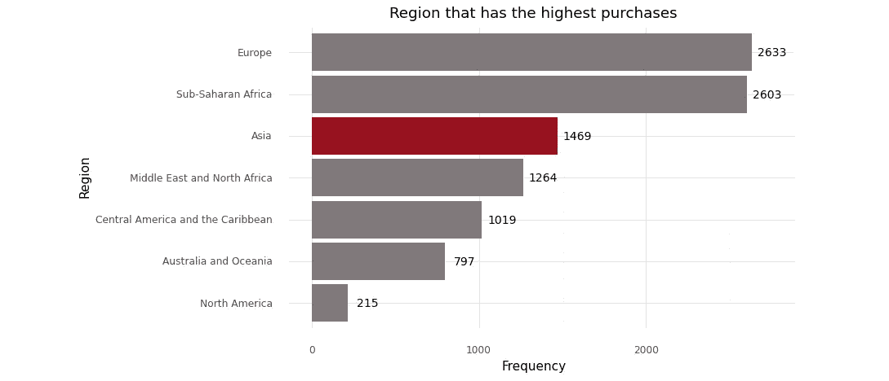
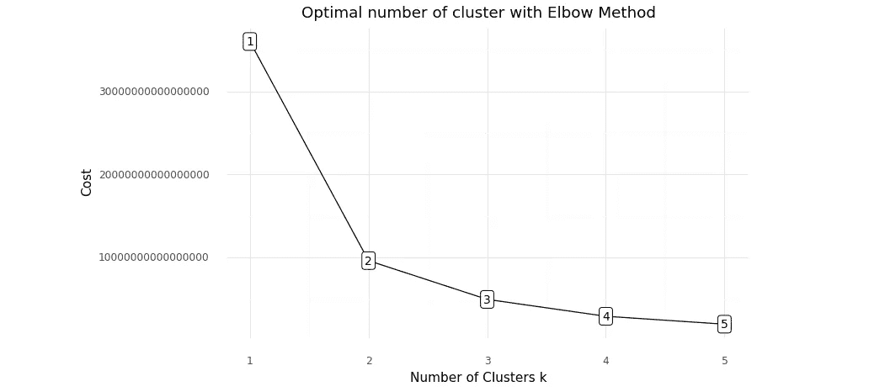

# k-prototype 作为混合数据类型(分类和数值)的聚类算法

> 原文：<https://towardsdatascience.com/the-k-prototype-as-clustering-algorithm-for-mixed-data-type-categorical-and-numerical-fe7c50538ebb?source=collection_archive---------1----------------------->


照片由 [Nareeta Martin](https://unsplash.com/@splashabout?utm_source=medium&utm_medium=referral) 在 [Unsplash](https://unsplash.com?utm_source=medium&utm_medium=referral) 上拍摄

## [动手教程](https://towardsdatascience.com/tagged/hands-on-tutorials)

## 理论解释及其在实际问题中的应用

## K 原型的基本理论

OK-Means 算法是聚类技术中常用的一种传统聚类方法，可有效用于大数据。但是，它的方法不好，不适合包含分类变量的数据。当使用仅适用于数值数据的欧几里德距离来计算 K-Means 中的成本函数时，会出现这个问题。而 K-Mode 只适合分类数据，不适合混合数据类型。

面对这些问题，黄提出了 K-Prototype 算法来处理混合数据类型(数值型和分类型)的聚类算法。K-Prototype 是一种基于划分的聚类方法。该算法是对 K-Means 和 K-Mode 聚类算法的改进，用于处理混合数据类型的聚类。

阅读完整的 K-Prototype 聚类算法 [***此处***](https://citeseerx.ist.psu.edu/viewdoc/download?doi=10.1.1.15.4028&rep=rep1&type=pdf) ***。***

从数据中充分了解秤的测量非常重要。

> **注意:** K-Prototype 具有优势，因为它不太复杂，能够处理大量数据，并且比基于层次的算法更好


K 原型聚类算法的数学公式(图片由作者提供)

## K 原型的应用

在这一部分，我们将使用 Python 演示 K-Prototype 的实现。在此之前，首先使用终端或 Anaconda 提示符安装`**kmodes**`模块是很重要的。

有几个模块用于演示。分别是用于数据操作的`**pandas**`，用于线性代数计算的`**numpy**`，用于数据可视化的`**plotnine**`，以及用于 K 原型聚类算法的`**kmodes**`。

```
# Import module for data manipulation
import pandas as pd
# Import module for linear algebra
import numpy as np
# Import module for data visualization
from plotnine import *
import plotnine
# Import module for k-protoype cluster
from kmodes.kprototypes import KPrototypes
# Ignore warnings
import warnings
warnings.filterwarnings('ignore', category = FutureWarning)
# Format scientific notation from Pandas
pd.set_option('display.float_format', lambda x: '%.3f' % x)
```

数据可以在这里下载<https://raw.githubusercontent.com/audhiaprilliant/audhiaprilliant.github.io/master/assets/docs/10000%20Sales%20Records.csv>**或者你可以通过访问 [***这个网站***](http://eforexcel.com/wp/downloads-18-sample-csv-files-data-sets-for-testing-sales/) 轻松生成这个数据。完全免费。尽情享受吧！**

```
**# Load the data
df = pd.read_csv('data/10000 Sales Records.csv')
# The dimension of data
print('Dimension data: {} rows and {} columns'.format(len(df), len(df.columns)))
# Print the first 5 rows
df.head()**
```

**该数据实际上是 [**国家销售数据**](http://eforexcel.com/wp/wp-content/uploads/2017/07/Country-Sales-Data-Generator.xlsm) **。**该数据有 10，000 行和 14 列，具有混合数据类型(数字和分类)。它记录了世界各国的销售交易。**

****

**MS Excel 为 K-Prototype 生成的国家销售数据(图片由作者提供)**

**为了确保每一列的数据类型被正确映射，我们必须使用`**df.info()**`命令手动检查它们的类型。如果我们发现有错误的映射，我们应该将其更正为正确的数据类型。**

```
**# Inspect the data type
df.info()**
```

****

**国家销售数据列的数据类型(按作者分类的图像)**

**幸运的是，所有的列都有正确的数据类型。请忽略`**Order ID**`，因为我们不会使用它，稍后会将其删除。**

**数据集中有七个分类变量。具有 185 个唯一值的`**Country**`、具有 2691 个唯一值的`**Order Date**`和具有 2719 个唯一值的`**Ship Date**`将从聚类分析中移除，因为它们具有大量的唯一值。其余的列将被保留。它们是具有 7 个唯一值的`**Region**`、具有 12 个唯一值的`**Item Type**`、具有 2 个唯一值的`**Sales Channel**`和具有 4 个唯一值的`**Order Priority**`。**

```
**# Inspect the categorical variables
df.select_dtypes('object').nunique()**
```

****

**销售国家数据中的分类变量(作者图片)**

**其余的列是数字变量。它们是`**Order ID**`、`**Units Sold**`、`**Unit Price**`、`**Units Cost**`、`**Total Revenue**`、`**Total Cost**`和`**Total Profit**`。**

```
**# Inspect the numerical variables
df.describe()**
```

****

**国家销售数据的数字数据的汇总统计(图片由作者提供)**

**进行数据探索和分析之前的最后一项任务是确保数据不包含缺失值。**

```
**# Check missing value
df.isna().sum()**
```

****

**国内销售数据缺失值的数量(图片由作者提供)**

**在进行聚类分析之前，我们应该做描述性分析的数据探索。它旨在找出一个有趣的点，该点对于报告生成和捕捉数据中的现象是有用的。**

**我们假设每个地区的购买数量与总利润有很强的线性相关性。为了总结这一点，我们有两个选择，描述性分析和推理分析。对于这一部分，我们将选择第一个选项。让我们看看！**

```
**# The distribution of sales each region
df_region = pd.DataFrame(df['Region'].value_counts()).reset_index()
df_region['Percentage'] = df_region['Region'] / df['Region'].value_counts().sum()
df_region.rename(columns = {'index':'Region', 'Region':'Total'}, inplace = True)
df_region = df_region.sort_values('Total', ascending = True).reset_index(drop = True)
# The dataframe
df_region = df.groupby('Region').agg({
    'Region': 'count',
    'Units Sold': 'mean',
    'Total Revenue': 'mean',
    'Total Cost': 'mean',
    'Total Profit': 'mean'
    }
).rename(columns = {'Region': 'Total'}).reset_index().sort_values('Total', ascending = True)**
```

****

**销售国家数据中每个地区的销售分布情况(按作者分类的图片)**

**从上述结果中，我们可以得出结论，北美是销量最低的地区，但在某些栏目中，如`**Units Sold**`、`**Total Revenue**`、`**Total Cost**`和`**Total Profit**`，他们的表现优于所有地区。与其他地区不同，北美同时进行多项采购。而购买次数最多的欧洲对总利润的贡献并不大。这意味着购买次数与总利润没有很强的线性相关性。**

```
**# Data viz
plotnine.options.figure_size = (8, 4.8)
(
    ggplot(data = df_region)+
    geom_bar(aes(x = 'Region',
                 y = 'Total'),
             fill = np.where(df_region['Region'] == 'Asia', '#981220', '#80797c'),
             stat = 'identity')+
    geom_text(aes(x = 'Region',
                   y = 'Total',
                   label = 'Total'),
               size = 10,
               nudge_y = 120)+
    labs(title = 'Region that has the highest purchases')+
    xlab('Region')+
    ylab('Frequency')+
    scale_x_discrete(limits = df_region['Region'].tolist())+
    theme_minimal()+
    coord_flip()
)**
```

****

**销售国家数据中每个地区的销售数量(图片由作者提供)**

**对于数据探索，我们将在`**Region**`和`**Item Type**`之间创建一个交叉列表，以查找任何模式。**

```
**# Order the index of cross tabulation
order_region = df_region['Region'].to_list()
order_region.append('All')
# distribution of item type
df_item = pd.crosstab(df['Region'], df['Item Type'], margins = True).reindex(order_region, axis = 0).reset_index()
# Remove index name
df_item.columns.name = None**
```

****

**各地区购买的商品类型分布(图片由作者提供)**

**数据预处理的目的是去除不使用的列`**Country**`、`**Order Date**`、`**Order ID**`和`**Ship Date**`。它们与 K 原型聚类算法无关。我们需要删除这些列有两个原因，如下所示:**

*   **`**Country**` —它有很多独特的值，增加了计算量。信息太多，无法处理，变得毫无意义**
*   **`**Order Date**`和`**Ship Date**` —聚类算法需要假设数据中的行代表在某个时间段观察到的唯一观察值**
*   **`**Order ID**` —对聚类分析没有意义的信息**

```
**# Data pre-processing
df.drop(['Country', 'Order Date', 'Order ID', 'Ship Date'], axis = 1, inplace = True)
# Show the data after pre-processing
print('Dimension data: {} rows and {} columns'.format(len(df), len(df.columns)))
df.head()**
```

****

**没有特定列的国家销售数据(图片由作者提供)**

**`**kmodes**`模块中的 K 原型聚类算法需要分类变量或列在数据中的位置。该任务旨在保存那些在给定变量`**catColumnsPos**`中的数据。它将被添加到聚类分析的下一个任务中。分类列位置在数据的前四列中。**

```
**# Get the position of categorical columns
catColumnsPos = [df.columns.get_loc(col) for col in list(df.select_dtypes('object').columns)]
print('Categorical columns           : {}'.format(list(df.select_dtypes('object').columns)))
print('Categorical columns position  : {}'.format(catColumnsPos))**
```

****

**国家销售数据中分类变量或列的位置(作者图片)**

> ****重要！**在实际情况下，数字列将具有不同的刻度，因此您必须使用适当的技术对其进行归一化，例如最小-最大归一化、Z 分数归一化等**

**接下来，将数据框中的数据转换为矩阵。它帮助`**kmodes**`模块运行 K-Prototype 聚类算法。将数据矩阵保存到变量`**dfMatrix**`。**

```
**# Convert dataframe to matrix
dfMatrix = df.to_numpy()**
```

****

**K-Prototype 聚类算法的国家销售数据矩阵(图片由作者提供)**

**我们使用肘方法来确定 K 原型集群的最佳集群数量。K-Prototype 没有使用欧几里德距离计算平方和误差(WSSE ),而是提供了一个成本函数，该函数结合了数值变量和分类变量的计算。我们可以研究肘部来确定集群的最佳数量。**

```
**# Choose optimal K using Elbow method
cost = []
for cluster in range(1, 10):
    try:
        kprototype = KPrototypes(n_jobs = -1, n_clusters = cluster, init = 'Huang', random_state = 0)
        kprototype.fit_predict(dfMatrix, categorical = catColumnsPos)
        cost.append(kprototype.cost_)
        print('Cluster initiation: {}'.format(cluster))
    except:
        break
# Converting the results into a dataframe and plotting them
df_cost = pd.DataFrame({'Cluster':range(1, 6), 'Cost':cost})
# Data viz
plotnine.options.figure_size = (8, 4.8)
(
    ggplot(data = df_cost)+
    geom_line(aes(x = 'Cluster',
                  y = 'Cost'))+
    geom_point(aes(x = 'Cluster',
                   y = 'Cost'))+
    geom_label(aes(x = 'Cluster',
                   y = 'Cost',
                   label = 'Cluster'),
               size = 10,
               nudge_y = 1000) +
    labs(title = 'Optimal number of cluster with Elbow Method')+
    xlab('Number of Clusters k')+
    ylab('Cost')+
    theme_minimal()
)**
```

****

**使用肘方法的成本函数的 scree 图(图片由作者提供)**

****重要！更多阅读** [***此处***](https://github.com/nicodv/kmodes/blob/master/README.rst#faq)**

**根据上面成本函数的 scree 图，我们考虑选择集群的数量`**k = 3**`。这将是 K-原型聚类分析的最佳聚类数。更多肘法 [***在这里***](/10-tips-for-choosing-the-optimal-number-of-clusters-277e93d72d92) 阅读。**

```
**# Fit the cluster
kprototype = KPrototypes(n_jobs = -1, n_clusters = 3, init = 'Huang', random_state = 0)
kprototype.fit_predict(dfMatrix, categorical = catColumnsPos)**
```

**该算法有 7 次迭代来收敛，它的成本为 4，960，713，581，025，175.0(这是一个相当大的权利？！).我们可以使用`**kprototype.cluster_centroids_**`打印星团的质心。对于数值变量，将使用平均值，而分类变量使用众数。**

```
**# Cluster centorid
kprototype.cluster_centroids_
# Check the iteration of the clusters created
kprototype.n_iter_
# Check the cost of the clusters created
kprototype.cost_**
```

****

**通过 K 原型聚类质心(图片由作者提供)**

**需要对集群进行解释。解释是使用每个聚类中的质心。为此，我们需要将聚类标签附加到原始数据上。对聚类标签进行排序将有助于安排基于聚类标签的解释。**

```
**# Add the cluster to the dataframe
df['Cluster Labels'] = kprototype.labels_
df['Segment'] = df['Cluster Labels'].map({0:'First', 1:'Second', 2:'Third'})
# Order the cluster
df['Segment'] = df['Segment'].astype('category')
df['Segment'] = df['Segment'].cat.reorder_categories(['First','Second','Third'])**
```

****

**包含分类信息的国家销售数据(按作者分类的图片)**

**为了解释聚类，对于数值变量，将使用平均值，而分类变量使用众数。但是也有其他方法可以实现，例如对分类变量使用中位数、百分位数或值组合。**

```
**# Cluster interpretation
df.rename(columns = {'Cluster Labels':'Total'}, inplace = True)
df.groupby('Segment').agg(
    {
        'Total':'count',
        'Region': lambda x: x.value_counts().index[0],
        'Item Type': lambda x: x.value_counts().index[0],
        'Sales Channel': lambda x: x.value_counts().index[0],
        'Order Priority': lambda x: x.value_counts().index[0],
        'Units Sold': 'mean',
        'Unit Price': 'mean',
        'Total Revenue': 'mean',
        'Total Cost': 'mean',
        'Total Profit': 'mean'
    }
).reset_index()**
```

****

**国家销售数据中聚类的质心(图片由作者提供)**

**下面列出了完整的示例。**

**K 原型聚类算法的完整 Python 脚本**

## **结论**

**K-Prototype 是黄提出的 K-Means 和 K-Mode 相结合的聚类算法。为了实现它的算法，研究者需要仔细地过滤列，特别是分类变量。分类变量必须与分析相关，并且不是无意义的信息。此外，输入(数据)的质量会影响聚类结果(聚类初始化)以及算法如何处理数据以获得收敛结果。作为研究者，对于最后的任务，解释，我们需要考虑用于数字和分类变量的度量。**

## **参考**

**[1]黄政道。[*对聚类的 k-Means 算法的扩展
具有分类值的大型数据集*](https://citeseerx.ist.psu.edu/viewdoc/download?doi=10.1.1.15.4028&rep=rep1&type=pdf) (1998)。数据挖掘和知识发现。2(3): 283–304.**