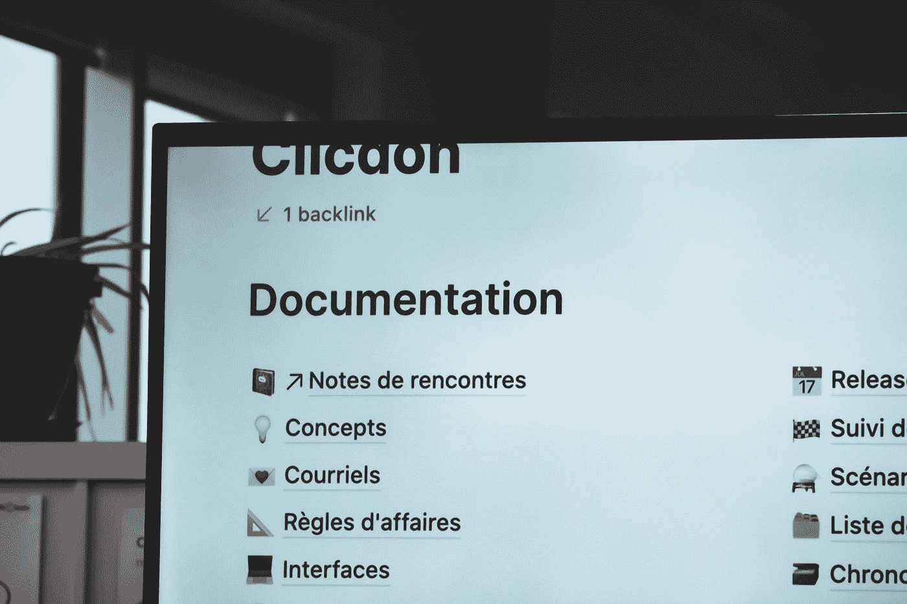

# 运送数据科学项目的最后一公里

> 原文：<https://towardsdatascience.com/the-last-mile-in-shipping-data-science-projects-well-c4fb73c35af3?source=collection_archive---------30----------------------->

## 参考书目

## 数据科学文档的最佳实践是什么？

照片由[西格蒙德](https://unsplash.com/@sigmund?utm_source=medium&utm_medium=referral)在 [Unsplash](https://unsplash.com?utm_source=medium&utm_medium=referral) 上拍摄

数据科学项目越来越多地使用复杂的技术堆栈，当项目转手时，省略重要信息的文档可能会成为失败点。我在数据科学实习期间亲身经历了这一点。我们的团队在生产中改进和扩展了现有的机器学习模型。我们负责大量的数据清理工作，因为数据集很脏，而且缺少数据字典。我们从前一个团队继承了一个重要的代码库——没有他们的过程或假设的任何文档。

我们最终从零开始。这比努力找出每一行代码要容易得多。对于我们这些当时对数据科学相对陌生的人来说，这是一次有益的经历，我们把自己保存详细的文档作为优先事项。诚然，随着我们的代码库变得越来越复杂，保持在文档之上是令人厌烦的，但是这是我们能够确保项目的结果对于继承我们项目的下一个团队来说是可重复的和清晰的唯一方法。

文档通常不是我们在课程中学到的东西，而是通过工作实践或在导师的指导下获得的。这可能会让学生意识不到适当和广泛的文件的重要性。然而，当我梳理 TDS 档案时，我发现几个 TDS 作者花时间来分享这个行业的最佳实践。这些帖子教您如何创建清晰准确的文档，为您的项目在团队过渡和移交期间的持续成功提供坚实的基础。

你如何建立一种“文档优先的文化”？ [Prukalpa](https://medium.com/u/38a5ef6ab673?source=post_page-----c4fb73c35af3--------------------------------) 分享 Atlan 的数据团队如何应对这一挑战。这不是一个一夜之间的过程；团队集思广益，设定目标，不断迭代，并实现对文档框架的修复。他们成功地将文档整合到日常工作流程中，这表明其他数据团队也有可能采用他们的方法。

</data-documentation-woes-heres-a-framework-6aba8f20626c>  

当您探索一个新的开源工具或希望了解一个项目如何工作时，自述文件通常是您首先要看的东西。Navendu Pottekkat 撰写 kickass 自述文件的指南将关键部分分解为有用的自述文件。他认为，“如果人们不知道你的软件是做什么的，那么他们就不会使用它或为它做贡献，他们很可能会在开源软件的海洋中找到更清晰和简洁的东西。”Navendu 的文章非常详细，这对于 README 指南来说是不寻常的；他还注意加入一些技巧，让它们看起来更有吸引力。

</how-to-write-an-awesome-readme-68bf4be91f8b>  

[亚当·加伊特科夫斯基](https://medium.com/u/ca8e382fc78a?source=post_page-----c4fb73c35af3--------------------------------)分享了使用 R Markdown 和 LaTeX 编写专业数据科学文档的简短指南。对于那些不经常使用它的人来说，LaTeX 可能会有一个陡峭的学习曲线。尽管如此，学习 LaTeX 是一项值得的投资，因为它提供了文本和数学公式的一致格式。

</writing-professsional-data-science-documentation-1141737836fa>  

如果你仍然不相信文档是必不可少的，[阿德蒙德·李](https://medium.com/u/7cfb1b8791bb?source=post_page-----c4fb73c35af3--------------------------------)为数据科学家证明了它的重要性。他认为文档确保了可再现性和项目的完成，并建议同行为了可读性而仔细阅读它总是一个好主意。

</why-you-should-document-your-work-as-a-data-scientist-a265af8a373>  

在编写更好的文档方面，你有最喜欢的资源吗？你的团队使用的一些最佳实践是什么？删除一些链接，我想在评论中了解更多！