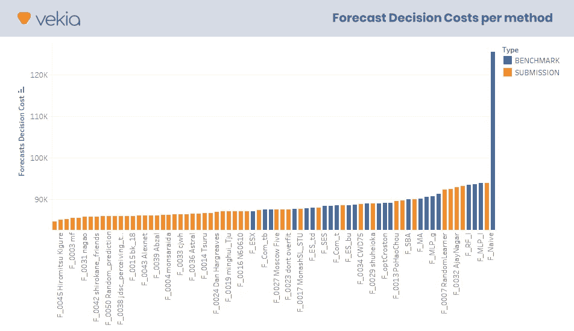
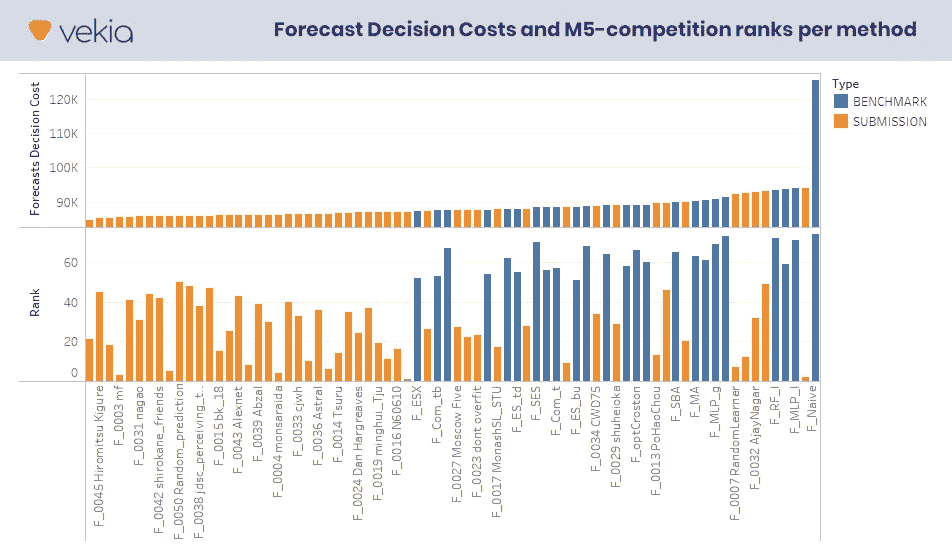
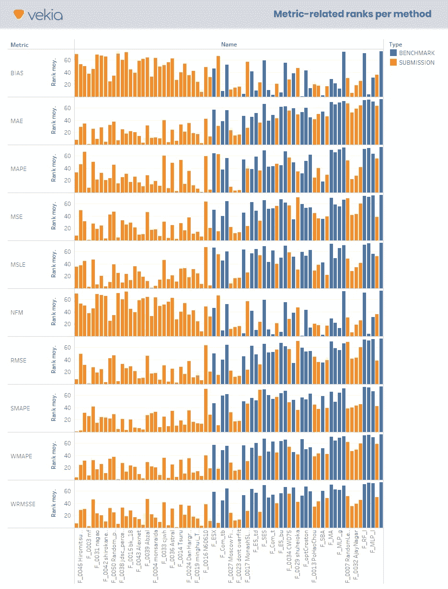
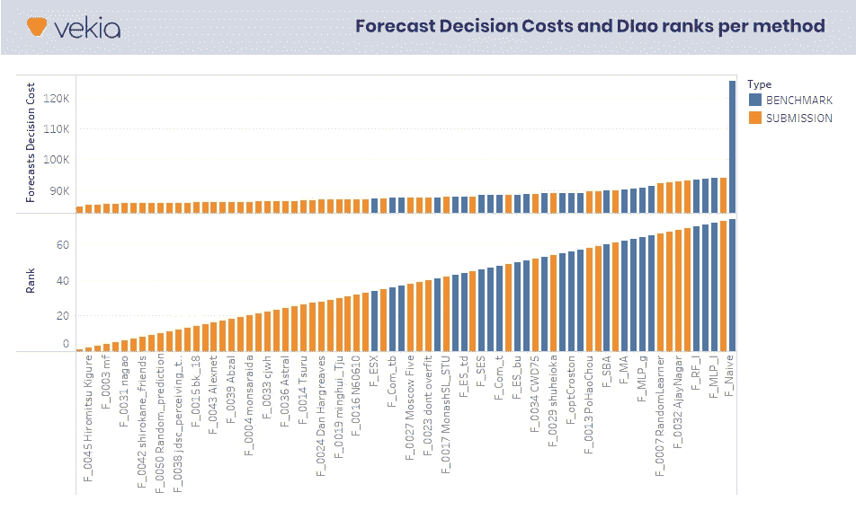
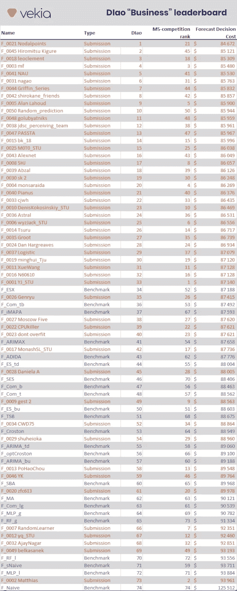

# “后来者居上，先者居后”……来自 M5 竞赛的感悟

> 原文：<https://towardsdatascience.com/the-last-will-be-first-and-the-first-last-insights-from-the-m5-competition-f0b9290dc45?source=collection_archive---------35----------------------->

## 在大多数供应链中，预测准确性规则。这也是你的北极星度量吗？那么，这篇文章很可能会改变你的观点…

[GR Stocks](https://unsplash.com/@grstocks?utm_source=unsplash&utm_medium=referral&utm_content=creditCopyText) 在 [Unsplash](https://unsplash.com/s/photos/win?utm_source=unsplash&utm_medium=referral&utm_content=creditCopyText) 上拍照

在之前的一篇文章中，我大力支持由 [Vekia](https://www.vekia.fr/en/homepage/) 开发的新一代指标，该指标关注预测的业务影响，而不是其准确性/精确度。

对于那些错过这篇介绍性文章的人来说，这里是[“决策影响”的执行摘要:实现新一代面向业务的指标的 10 个理由](https://www.linkedin.com/pulse/decision-impact-10-reasons-implement-new-generation-johann-robette-/) [1]。

*   预测的目的不是(也从来不是)提供有史以来最好的预测！其目的是做出最佳决策。
*   然而，现有的指标只能衡量预测的内在准确性。没有一个考虑到它的实际用途和它所带来的价值。
*   通过利用“以成本为导向”的数字双胞胎，从业者可以从一系列关注预测的“决策影响”的新指标中受益。
*   这组新的所谓“决策影响”(DI)指标开辟了新的视角，不仅有利于需求规划者，也有利于整个公司。

这篇介绍性的文章收到了从业者、学者和软件供应商的大量反馈、支持和建设性的批评。我真的要感谢他们所有人！

几乎每个人都对应用程序的例子非常感兴趣——我称之为概念验证(POC)。*开始了！*

这篇新文章是系列文章**的第一篇，旨在通过真实世界的用例**来展示这种方法的价值。

这一系列是从不同的角度审视现有实践的机会。所以，请随意分享，评论和批评！我总是把这种接触看作是减少错误和不断改进的机会。

# 对我有什么好处？[剧透警报]

*   这篇文章提供了许多关于**有效实施“决策影响”(DI)指标**的细节
*   DI 指标的第一个用例证明了**准确性指标会导致选择从业务角度来看绝对不合适的预测方法**。事实上,“最好的”方法可能会引发最糟糕的决策！

# 作为游乐场的“沃尔玛”M5 竞争数据集

由[法比奥·布雷特](https://unsplash.com/@bracht?utm_source=unsplash&utm_medium=referral&utm_content=creditCopyText)在 [Unsplash](https://unsplash.com/s/photos/walmart?utm_source=unsplash&utm_medium=referral&utm_content=creditCopyText) 上拍摄的照片

在 [Vekia](https://www.vekia.fr) ，我们利用“决策影响”指标为各行业(电信、制药、零售、能源、维护等)的客户造福。).但是很容易理解，我们重视他们的隐私，不会分享任何关于这些内容的信息(至少在没有事先授权的情况下)。

然后让我们切换到一个既相关又公开的数据集。我很确定我们选择的这个会让这个系列更加有见地！

在潜在的面向预测的数据集当中，最令人兴奋的一个数据集于 2020 年发布，以支持第五届 Madrikakis 竞赛。

我很肯定你已经听说过这个由[马克里达基斯开放预测中心](https://mofc.unic.ac.cy/) (MOFC)组织并在[Kaggle.com](https://www.kaggle.com/c/m5-forecasting-accuracy)举办的全球预测竞赛。这项竞赛以尼科西亚大学教授斯皮罗斯·马克里达基斯博士的名字命名，他对预测实践做出了(并且一直在做出)令人印象深刻的贡献。如果你想更多地了解 M5 竞赛，这里是了解它的地方:[https://www.kaggle.com/c/m5-forecasting-accuracy](https://www.kaggle.com/c/m5-forecasting-accuracy)

让我们回到数据集。

# 这个数据集中有什么？

照片由 [Myriam Jessier](https://unsplash.com/@mjessier?utm_source=unsplash&utm_medium=referral&utm_content=creditCopyText) 在 [Unsplash](https://unsplash.com/s/photos/data?utm_source=unsplash&utm_medium=referral&utm_content=creditCopyText) 上拍摄

这个数据集是由世界上收入最大的公司沃尔玛提供的，用来预测未来 28 天的日销售额。该数据涵盖了美国三个州(加利福尼亚、德克萨斯和威斯康星)的 10 家商店，包括商品、部门、类别和商店的详细信息。此外，它还包含解释变量，如价格、促销、星期几和特殊事件。

拥有 30，490 家产品 x 商店的情侣，这个数据集是我们实验的绝佳场所。

蛋糕上的樱桃是:来自世界各地的数百名预测者利用这个数据集生成了可能的最佳预测。竞赛结束后，商务部宣布了竞赛结果，发布了“待预测”销售额，以及 24 个“基准”预测和前 50 名“提交”。

因此，通常情况下，我们不仅有描述商店、产品和销售的数据，而且还有 74 个预测，我们可以利用这些预测来基准测试我们的“决策影响”指标。

就其完整性而言，该数据集包含不少于 6300 万个每日预测。*牛逼！*

> 10 家店
> x 3049 产品
> x 28 天
> x 74 预测
> = 63175280 日预测

# 这个数据集中没有什么？

Madrikakis 竞赛就是关于预测的。不出所料，它没有为这些预测旨在支持的决策提供线索。

但是，如您所知，“决策影响”指标需要考虑消耗预测的决策过程。因此，我们需要一些额外的数据来模拟一个现实的补货过程和一个成本函数。

*接下来让我们做一些假设！如果您对这些细节不感兴趣，可以随意跳到下一节“让我们开始使用这个数据集”。*

## 补给策略

*   **交付周期**
    我们不知道创建补货订单和有效商店补货之间所需的交付周期。让我们假设 3 天是必要的。
    *给定订单在第 1 天触发，我们将只考虑从第 4 天开始的需求。*
*   **订货周期**
    你也知道，零售店不是一个月才补货一次。订单周期通常因产品类型、销售速度、存储容量等而异。但是为了简单起见，让我们选择每周订单周期。我们的补货流程旨在覆盖一周的销售。第 1 天触发的决策涵盖第 4 天到第 10 天的销售。第 8 天触发的决策涵盖第 11 天到第 17 天的销售。在第 15 天触发的决策涵盖第 18 天到第 24 天的销售。
*   **补货政策**
    让我们实施一个*动态(T，S)【定期审查，逐级订购】*补货政策。
    该政策考虑了预测、初始库存、安全库存和包装尺寸。由于包装尺寸允许不同的订单数量(取决于应用的舍入函数)，我们的政策将评估每个场景的经济成本(如下所述),以最终选择利润最高的一个。
*   **安全库存**
    让我们配置安全库存，以达到 95%的服务水平。

## 价值函数

成本函数用于根据每个补充决策的真实业务影响对其进行评分。尽管成本可以用不同的单位来表示，但是用货币值来表示给定决策的成本还是很方便的。

为了评估这些成本，我们将再次丰富现有的数据集并做出一些假设:

*   **订购、运输和处理成本**
    履行订单会产生订购、准备、考察、运输等成本。这些通常被称为“固定成本”。让我们假设这些成本代表每 1000 美元购买价值范围的 40 美元。
*   **持有成本**
    持有成本与未售出存货的存储相关联。让我们假设年持有成本是存货价值的 10%(按购买价格估价)，即。每周 0.19%。
*   **短缺成本**
    当需求超过可用库存时，需求和客户商誉都可能丧失。这个成本通常被称为**短缺成本**。随着零售商推出大量类似产品，一部分需求被转移到其他产品上。让我们假设实际上只有一半的销售额会流失。短缺成本可以用每笔销售毛利损失的 50%来衡量。

然后，总决策成本被计算为这三个基本成本的总和。

## 附加产品描述

*   **毛利率**
    数据集提供每种产品的销售价格，但毛利率未知。由于需要这些数据，因此根据 Statista.com 基准[2]假设了以下值:食物:56.77% /爱好:50.37% /家庭:43.29%。
*   **包装尺寸** 显然，在杂货零售中，很少有产品是单独补充的。然而，包装尺寸不是这个数据集的一部分。然后，我们将根据描述杂货零售中常用包装尺寸的专有数据集，为每种产品指定一个定制包装尺寸。

作者图片

*   **初始库存**
    补货发生时，货架希望不是空的。显然，剩余库存仍在，应予以说明。
    由于我们的补货政策旨在保证覆盖期结束时的安全库存，我们将此数量作为初始库存。

# 让我们开始研究这个数据集

照片由[动力赖](https://unsplash.com/@welipower?utm_source=unsplash&utm_medium=referral&utm_content=creditCopyText)在 [Unsplash](https://unsplash.com/s/photos/play-area?utm_source=unsplash&utm_medium=referral&utm_content=creditCopyText)

基于上述假设，数据集能够分析由 74 种不同预测方法支持的 6，860，250 个补充决策。现在让我们看看我们能从他们身上学到什么。

作为第一个分析，我建议集中计算每种方法的成本，并将它们与它们的准确度等级进行比较*。*

*如果传统的预测准确性指标本身就能提升最佳方法，那么就没有必要在此基础上添加新的指标。但是，如果不是这样，“决策影响”指标就有意义了……*

## 74 种预测方法

该数据集提出了 74 种不同的预测方法，由 24 种“基准”方法和 M5 竞争者“提交”的前 50 种方法组成。这些方法从最简单的“天真的方法”到最先进的基于人工智能的方法。

## 评估成本

这些方法中的每一种都会触发自己的决策。之前定义的 digital twin 支持模拟这些补货决策和测量成本。

我们得到的结果显示了各种各样的成本，从 77.2k 美元到 116.5k 美元不等！3.92 万美元的差额并非轶事，因为它代表不少于 1.4%的期间营业额。

下图显示了每种方法及其相关成本。方法按从最便宜到最贵的顺序排列。

作者图片

这里是我们可以得到的第一个见解:最便宜的解决方案碰巧大多是竞争对手的“提交”。但是……并不是所有的提交都优于基本基准，即使它们在超过 5，507 个团队的“前 50”方法中。事实上，超过三分之一的公司(17 家)的表现低于“F_ESX”基准！

## M5-竞赛排行榜

现在让我们将这些成本与 M5 官方排行榜[3]进行比较。

M5 组织根据一种称为加权均方根标度误差(WRMSSE)的预测准确性指标对每种方法进行评分[4]。

*更新 27/05/2021:正如*[*Nicolas vande put*](https://www.linkedin.com/in/vandeputnicolas/?originalSubdomain=be)*所指出的那样(非常感谢)，M5 官方排行榜是建立在每种方法的平均 WRMSSE 的基础上，在各个级别(从 L1“全球”到 L12“项目 x 站点”)计算得出的。*

下图将每种方法的准确度等级添加到之前的显示中。

作者图片

提交等级平均低于基准等级。但很明显，M5 竞争排名与商业成本关联不大。最差的例子是 Matthias 的方法，它在竞争中排名第二，而从商业角度来看，它是仅次于 Naive benchmark 的第二昂贵的方法。

*竞赛排行榜与成本的相关性很差。这是事实。但是其他准确性指标呢？它们会有更强的相关性吗？让我们对此进行评估！*

## 其他指标排行榜

为了评估其他指标在捕捉业务成本方面有多好，我们计算了 MAPE、wMAPE、sMAPE、MSLE、MAE、MSE、RMSE、WRMSSE、bias、NFM *(最后两个是 BIAS 指标)*以及它们各自的方法排名。

下图显示了这些排名。这些方法总是按照从最便宜到最贵的顺序排列。

作者图片

尽管大多数指标认为上半年的排名低于下半年，但从业务角度来看，这种相关性还远远不够好。一些表现不佳的方法仍然会被分配到很低的级别！

## 决策影响指标

现在，让我们把新引入的指标放入测试平台。

我们的新指标包括迪奥、迪诺和迪娜。刁衡量的是错误预测的财务成本。然后，它可以很好地与准确性指标相比较。

那么它与成本有什么关系呢？下图显示了各种方法的成本及其相关的 DIao 等级。

作者图片

根据设计，决策影响指标在计算时会考虑成本。因此，毫不奇怪，**刁指标与成本密切相关。**

这一指标在确定最合适的业务预测方法方面表现出色！

## 决策影响排行榜

*哎呀…我正要结束这篇文章，却没有分享“业务”排行榜！在这里！*

“后来者居上，先者居后”……我们祝贺:

*   之前排名第 21 位的希腊雅典
*   Hiromitsh Kigure (日本)，之前排名 45
*   莱奥克莱门特(法国巴黎)，之前排名 18

完整的 DIao“业务”排行榜在这里，包括新的 DIao 排名和原来的 M5 竞赛排名:

作者图片

话虽如此，人们可能仍然会问:“为什么我们应该关注 DIao(它需要模拟实际和 oracle 决策成本)，而预测决策成本可能是一个更简单和最直接的指标？”

简短的回答是:“因为 DI 指标比预测决策成本有更多的用途。”

我们将在本系列的下一篇文章中逐一介绍它们。

本文旨在阐明当前的实践、局限性和可能的改进。它肯定不是完美的，并且受到限制。

*如果你觉得这很有见地，请分享和评论…但是，也请随时挑战和批评。如果你想进一步讨论这个问题，请联系我！*

*无论如何，敬请关注下一篇文章！同时，请访问我们的网站*[*www . vekia . fr*](http://www.vekia.fr)*了解我们在为供应链提供高价值方面的专业知识和经验。*

*Linkedin:*[*www.linkedin.com/in/johann-robette/*](https://www.linkedin.com/in/johann-robette/)
*Web:*[*www . vekia . fr*](https://www.vekia.fr/)

# 参考及更多

[1] Vekia，J. Robette，[“决策影响”:实施新一代面向业务的指标的 10 个理由](https://www.linkedin.com/pulse/decision-impact-10-reasons-implement-new-generation-johann-robette-/)，2021

[2]Statista.com，[截至 2018 年全球零售商店平均毛利率，按零售部门划分](https://www.statista.com/statistics/1012308/average-retail-store-gross-profit-margin-by-category-worldwide/)，2018 年

[3]Kaggle.com， [M5 预测——准确率，排行榜](https://www.kaggle.com/c/m5-forecasting-accuracy/leaderboard)，2020

[4]商务部， [M5 参与者指南](https://mofc.unic.ac.cy/wp-content/uploads/2020/03/M5-Competitors-Guide-Final-10-March-2020.docx)，2020 年

[+]弗蒂奥斯·彼得罗保罗斯，王迅，斯蒂芬·m·迪斯尼，[预测方法的库存绩效:来自 M3 的证据-竞争数据](https://www.researchgate.net/publication/323830425_The_inventory_performance_of_forecasting_methods_Evidence_from_the_M3_competition_data)，2018

[+] Nikolaos Kourentzes，Juan R. Trapero，Devon K. Barrow，[优化库存规划预测模型](https://www.researchgate.net/publication/338054539_Optimising_forecasting_models_for_inventory_planning)，2019 年