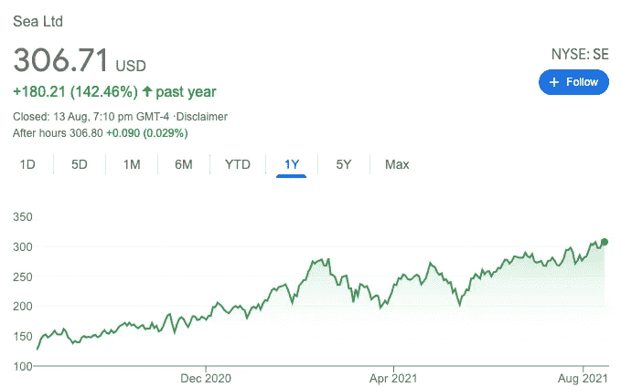
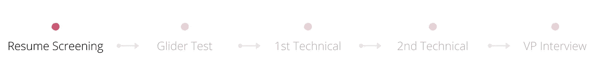
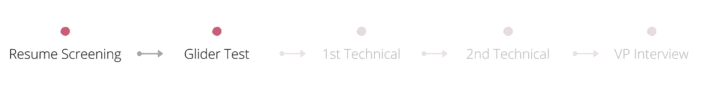
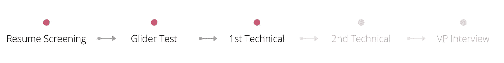
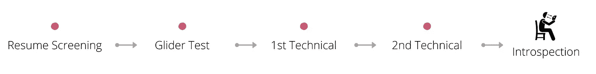
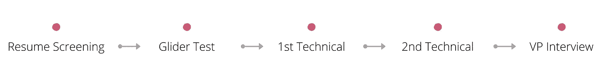
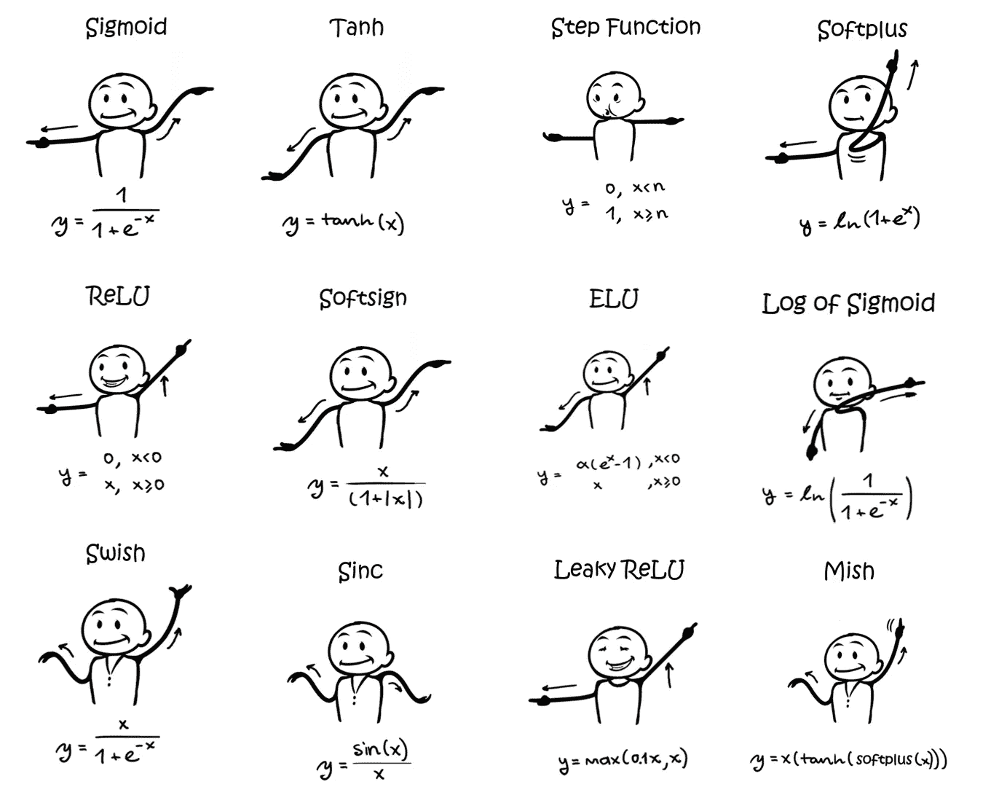

# Shopee Singapore 的数据科学面试流程

> 原文：<https://towardsdatascience.com/the-lessons-i-learned-from-failing-the-job-interviews-at-shopee-singapore-dd24b9f2bf3d?source=collection_archive---------5----------------------->

## [办公时间](https://towardsdatascience.com/tagged/office-hours)

## 经过两次失败的尝试，我成功了。以下是为下一次数据科学面试做准备的一些提示。

商店总部。作者由[the greats ' rean](https://commons.wikimedia.org/wiki/User:TheGreatSG%27rean)根据[Creative Commons](https://en.wikipedia.org/wiki/en:Creative_Commons)[Attribution-Share like 4.0 International](https://creativecommons.org/licenses/by-sa/4.0/deed.en)许可。

这篇文章包括了我从新加坡 Shopee 公司的求职面试失败中吸取的教训。三次面试之后，我开始了一份新工作，在 Shopee Singapore 担任数据科学家。

# 你能从这篇文章中期待什么？

您会发现关于如何申请 Shopee Singapore 数据科学家职位的最全面的概述。我将提到一些资源，您可能会发现这些资源有助于准备任何公司的数据科学家面试。

# 什么样的读者应该读这篇文章？

学生或没有经验的数据科学家将能够从这篇文章中受益，因为他们准备参加 Shopee Singapore 数据科学职位的面试。如果你已经是一名数据科学家，你将会学到在面试中会遇到什么，如何准备技术面试，以及如何给面试官留下深刻印象。

# 写这篇文章的目的是什么？

2019 年以来，我参加了许多 Shopee Singapore 数据科学家职位的面试。每一次失败的面试都迫使我认清自己的弱点。为了增加我获得面试的机会，我尝试了各种媒体来收集别人的经验，并寻找有经验的人来帮助我做准备。第一轮，让简历通过很容易；你在接下来的面试中犯的任何错误都可能让你失去最后一份工作。为了不经历我过去代价高昂的失败，我希望你能避免它。

虽然我不能保证你会遇到和我一样的情况，但你可以用我做的事情来检验你的知识，让你的面试朝着正确的方向准备，以提高你的接受率。

事不宜迟，我先解释一下我申请 Shopee 的原因。

# 为什么 Shopee 这么受欢迎，为什么我选择加入这家公司？

当您考虑数据科学时，Shopee 是新加坡少数几家顶级上市公司之一。在我看来，它如此出名有三个原因:

*   Shopee 是东南亚家喻户晓的电子商务平台。
*   Shopee Code League 是一项地区性竞赛，涵盖数据分析、数据科学和算法问题，是该地区最大的学生和专业人士技术竞赛之一。这场比赛无疑提高了 Shopee 在数据科学领域的声誉。

来源:https://www.youtube.com/watch?v=3IZAspRMRsY

*   Shopee 是 Sea 集团的一部分。如果你持有 Sea 股票，你就知道它们有多值钱。自去年病毒爆发以来，该公司的股价飙升超过 300 美元。Shopee 最近击败 MercadoLibre，成为巴西月用户数排名第一的[购物应用](https://twitter.com/jamesjho_/status/1368954100822384642)，这证明了 Shopee 的股价将比现在更有价值。股东肯定会从如此高的增长中受益。因此，如果你作为一名数据科学家获得股票期权，对你来说可能是一笔可观的收入。

作者图片

## 是什么让 Shopee 成为我想为之工作的公司？

来源:https://www.youtube.com/watch?v=wgQUkza0vSM

由于 Shopee 的快速增长，你可以期待事情发展得非常快。换句话说，如果你喜欢挑战自己，这绝对是一家你应该为之工作的公司。与其他购物应用不同，Shopee 不仅仅让你购物。如果你喜欢在 Shopee 上购物，你会注意到该应用程序有许多功能，包括 Shopee Live、Shopee Live Chat、Shopee Feed 等等。因此，您将有机会了解如何将数据科学应用于这些您经常使用的功能，以提高公司的盈利能力。这些都是宝贵的经验，可以帮助你发展成为一个具有商业思维的技术思想领袖。最后但同样重要的是，公司文化是充满活力和年轻的。在你职业生涯的早期阶段，你不会想呆在一个被那些满脑子都是过去的人包围的公司里。置身于正确的文化中肯定会激励你走进办公室，享受你的工作。作为 Shopee 的前实习生，我仍然很欣赏那里的文化。

所以现在就说说我的面试经历吧。

# **我的第一次面试尝试**

我的职业生涯始于一名机械工程师。我决定将我的职业生涯转向软件开发。在我完成深度学习 Coursera 专业化后，我爱上了数据科学。我为一家跨国公司做过几个数据科学项目。在 LinkedIn 上看到一个空缺后，我申请了 Shopee Singapore 的数据科学家职位。

作者图片

在第一轮中，你将接受 Shopee 招聘人员的面试。为了确定我是否是合适的候选人，她审查了我在数据科学方面的背景和经验。之后，她把我的简历发给了招聘经理，他们会决定你是否适合数据科学团队。

作者图片

然后，我收到了进入下一轮的 offer，这是一个由 [Glider](https://glider.ai/) 在线进行的编程测试。我准备考试的时间太少了，只有时间在考试前通读 LeetCode 的一些简单问题。结果我第一次面试尝试失败了。

作者图片

我发现我仍然缺乏编程基础。为了准备我的下一轮申请，我做了以下事情:

1.  经历了尽可能多的 Leetcode 问题。话虽如此，只是盲目地通读所有的问题是非常徒劳的。提高我的弱项的更有效的方法是花更多的时间练习它们。例如，递归不是我的强项。所以我试着理解所有和递归话题相关的技巧和中等问题。
2.  利用他人的经验。你可以谷歌搜索一下，看看面试中问了哪些问题。举个例子，这个[网站](https://www.nowcoder.com/)对懂中文的人来说会很有用。之前考过的，在这里分享一下遇到的问题。当我阅读帖子时，我了解到 Glider 的大多数问题都是中等水平的。为此我在备考的时候比较关注中级 Leetcode 题。如果你是说英语的人，那么 [Glassdoor](https://www.glassdoor.sg/Interview/Shopee-Data-Scientist-Interview-Questions-EI_IE1263091.0,6_KO7,21.htm) 网站是一个从其他面试官那里获得建议的好地方。即使大多数在 Glassdoor 上留下评论的人最终都没有被录用，我仍然知道如果我成功通过在线测试，剩下的面试将会如何进行。这有助于我提前准备技术面试。
3.  跟师傅学的。我是一名视频学习者，我发现当我看视频教程时，我学得很快。所以我去了 YouTube，搜索我想了解更多的话题。使用下面的 YouTube 视频作为例子，我能够学习递归的基础。此外，它还展示了各种例子，在这些例子中，您可以以一种实用的方式使用所学的概念。看了两遍视频，我能够自信地回答 Leetcode 上的递归问题。虽然我无法回答所有的问题，但在看到答案后，我能够向自己解释其中的诀窍。在[哔哩哔哩](https://search.bilibili.com/all?keyword=leetcode&from_source=webtophistory_search)上也有很多免费资源供中国读者使用，包括最常见的 Leetcode 面试问题指南，以及如何学习这些问题的视频教程。他们解决问题的方法真的对我很有启发。一旦你学会了这些方法，我就能轻松地将它们应用到类似的问题中。

编程中的递归。来源:https://www.youtube.com/watch?v=IJDJ0kBx2LM

由于这次失败的尝试，我认识到我需要彻底理解基本的编程概念，并在下一次申请相同的角色之前练习至少 100 个 Leetcode 问题。

# **我的第二次面试尝试**

Shopee 正在招聘，我再次申请了同样的数据科学家职位。

作者图片

一位招聘经理接受了我的简历，给了我一个滑翔机测试的链接。这次我更有信心，设法在规定时间的一半内完成了考试。在完成测试后的一天内，我收到了同一位招聘人员的电子邮件，邀请我参加第一轮技术面试。

作者图片

当我接受采访时，面试官问我关于我的项目经历，我可以从他的反应中看出，他对我的项目非常感兴趣，因为这些项目对他来说很新。为了口头解释它们，我花了大约 30 分钟。之后，他问了我两个 Leetcode 问题(一个简单，一个中等)，我被要求在我自己喜欢的编辑器中对它们进行编码。以下是我从这次技术访谈中获得的收获:

*   两个问题取自 Leetcode，我必须为每个数据结构构建自己的类。举个例子，我被要求解决反转链表的问题。他让我构建一个链表类，并通过处理 2 -> 4 -> 6 这样的序列来解决反转问题。过去，我曾经使用我的编辑器解决过类似的问题，所以我非常熟悉如何创建 ListNode 类。此外，他希望将链表打印成一个字符串(例如 6 -> 4 -> 2)，这样他就可以检查结果。我强烈建议任何准备技术面试的人都应该了解如何编写数据结构，如何回答问题，以及如何展示他们的结果。
*   我的面试官允许我在开始编码之前询问所有可能的限制。要构建一个数据科学项目，我们总是需要在构建产品之前考虑用户的需求。因此，这是您展示数据科学产品经验的绝佳机会。通过提问，你也可以获得更多的时间去思考解决编码问题的算法。
*   当我在编码答案时，面试官让我阐明我的思维过程。他这样做的原因是为了测试我的沟通能力和编程效率。如果你想让面试官明白你的思路，有两个办法:一是你可以一边编码一边告诉他你的做法；第二，你可以先写你的代码，收集你的想法，然后解释你的推理。就我而言，我更喜欢第二种方法，以防任何中间谈话打断我的思考过程。第二种方法的优点是，在编码之后，你可以检查你的代码，并在与面试官讨论之前以更全面的形式构建你的思维过程。无论您选择哪种方法，让他们能够理解您的代码是至关重要的。

问题在限定时间内完成(2 个问题 30 分钟)。整个技术面试花了大约 1 个小时完成。

面试 3 个小时后(Shopee HR 团队真的很有效率)，通知我通过了第一次技术面试，三天后会有第二次技术面试。

作者图片

在我的第二次技术面试中，我讨论了我的项目经验的技术方面。面试官问我对过去项目所做工作的理解，以及我对项目成功的贡献。例如，在解释我的图像字幕项目时，他问我如何评估我的模型的准确性。我在回复中告诉他我用 BLEU 做评测。然后他继续问我为什么不使用 Meteor 或苹果酒进行评估。然而，我告诉他，我对 Meteor 和 CiDER 很熟悉，但我无法回忆起它们的算法。这会对他对我的学科知识的看法产生负面影响。

最后，他似乎对我的工作感到有点困惑，但他不想花太多时间，因为在结束一个小时的技术面试之前，他有许多问题需要问。接下来，他问我的制作经验。例如，我如何扩展我的数据科学项目，我使用了什么工具，以及一般流程是什么样子的。由于我过去的大部分项目都专注于模型构建，所以我没有参与产品代码的部署。所以，我无法回应。在这个阶段，我被拒绝了，正如你所料。

作者图片

我只差一次面试就能拿到最后的工作机会了。因此，我在第二次技术面试中的表现让我很沮丧，但我很快站起来，做了如下反省:

*   当我解释我的数据科学项目时，准备演示幻灯片至关重要。由于面试官可能不熟悉我解释的项目，我注意到他很容易在解释过程中迷失方向。因此，整个管道应该在流程图中显示出来，让他确切地知道正在发生什么。
*   如果我进行了广泛的研究，情况会更好，即使我没有考虑项目中的一些指标。必须理解项目中的每一个术语不是一件容易的事情，但是至少我应该能够记住那些常见的术语。为此，我列出了我之前参与的所有重要项目，并阅读了几篇文章(包括不同公司的数据科学案例研究)和论文，以了解其他人是如何完成相同任务的。写下我错过的任何术语，并确保我很好地理解它们，这将是一个好主意。
*   我的重点应该是整个过程，包括如何将项目生产化。除了上 Udemy 的课程，我还和制作组聊了聊，向他们学习。此外，我还问了一些有生产环境工作经验的朋友，他们曾经面临过什么问题，以及他们是如何克服这些问题的。最后，我开发了一个自己的小项目，并将其公开。在我的演示中，我展示了 Kubernetes 如何自动处理负载，以及 Redis 和 Celery 如何高效地批处理传入的推理请求。

有些人可能很难理解为什么数据科学家需要学习如何部署应用程序。我相信大多数公司会希望你自己管理整个数据科学产品管道，除非你在一个专门的团队中工作，在那里你会被给予一个特定的管道来关注。此外，了解一切是如何工作的有助于我们快速识别流程中的任何问题。因此，如果你想保持竞争力，你应该熟悉整个数据科学管道。

# **我的最后一次面试尝试**

大约六个月后，我接到了 Shopee 招聘人员的电话，邀请我参加数据科学家职位的面试。当我接到电话时，我很惊讶。然而，我记得招聘人员在我第二次面试失败后告诉我，我的简历会被保存在系统中，如果未来有任何符合我的简历的职位空缺，我会收到通知。换句话说，如果你申请一份工作，你应该在每一次面试中都表现良好。即使面试失败，你的表现也会决定你将来是否被考虑。

作者图片

在电话中，招聘人员检查了我的现状，还回顾了我之前面试中的类似问题。幸运的是，我的简历被一位招聘经理接受了。距离上次面试已经过去了六个月，我被要求再次经历整个过程。

作者图片

这次滑翔机的测试有点不同。这些问题难度适中。第一个问题可以在 Leetcode 上找到。然而，第二个问题有点棘手。他们提出了一个动态编程问题，作为发生在 Shopee 的一个问题。因此，当时的情况感觉很真实，但实际上相当于 Leetcode 上的一个中等水平的问题。我的建议是，备考的时候不要过度记忆编码题，但是要保证把概念理解透彻。

作者图片

在我成功通过 Glider 的测试后，我的下一次面试是由一个数据科学项目负责人进行的。在这些问题中，他问我过去的项目是如何完成的，以及我为什么对 Shopee 感兴趣。我最后的 20 分钟是用来回答 leetcode 上的一个中级问题的。与我上次采访不同，我被问了两个 Leetcode 问题，由于时间限制，他决定不问第二个问题。尽管我担心这会影响我的表现，但面试官向我保证不会。考虑到他想评估我的编码能力，他认为一个问题就足够了。幸运的是，我被邀请进入下一轮。

作者图片

正如我之前提到的，我准备了幻灯片来演示我的项目流程。只有 40 分钟来展示我的项目，我只选择了我最喜欢的两个。当我介绍项目时，有人问了以下问题:

*   我如何收集和使用数据
*   我所做的数据预处理
*   我试验过哪些型号，为什么我选择这些型号用于最终生产
*   我如何选择指标，为什么
*   我做了什么来部署模型
*   我如何进行错误分析，如何改进模型
*   最终用户的反馈是什么样的
*   我做了什么来设计我的 MLOps

当面试官看到我的幻灯片时，她非常感动。她问我为什么项目管道是这样设计的，我是如何解决边缘案例的。在准备你的技术面试时，我强烈建议你仔细看看你的项目，了解每一个相关的元素。解释为什么每个流程都包含在管道中是很重要的。举个例子，面试官问我，如果预测中出现一个低俗的词会怎么样，流程的哪一部分是为了防止这种情况的发生。

在接下来的采访中，她给了我两个与 Shopee 数据科学团队相关的业务场景。我被要求概述如果由我来处理这项任务，我将如何解决这个问题。可以肯定的是，每个受访者都会有不同的业务问题。为了做好适当的准备，你必须知道 Shopee 是如何工作的，以及你在 Shopee 可能会遇到什么类型的问题。偶尔看一些国内最大的电商分享的[篇文章](https://zhuanlan.zhihu.com/p/163256192)，让我更容易回答这些问题。因此，我知道他们处理某个问题的方式，并给出了一些可能的解决方案。此外，你必须有很强的这方面的知识。假设你申请的是 NLP 数据科学家。至少，您需要了解如何使用不同的增强技术来增强您的训练数据。

作者图片

完成第二轮技术面试后，30 分钟后人力资源部通知我，我已经成功通过了。再过不到一个小时，我就要进行最后一次面试了。(招聘人员在同一天为我安排了 2 次面试。如果我通过了第二次面试，我将被允许进行最后一次面试。我真的很感谢这样的安排，因为我不必再为了参加面试而申请一天的假期。)

在我等待最后一次面试的时候，我在想会被问到什么样的问题。我找到了一篇[文章](https://forthright48.com/interview-with-shopee-garena/)，讨论了最终面试将会如何进行。一般来说，最后一次面试只是形式上的。如果你到了这个阶段，这个机会很可能会找上你。然而，对我来说却不是这样。

在最后一次面试中，部门主管要求我做一个简单的自我介绍。然后他质疑我的工作经验和技能。在面试的第二部分，他给了我两个需要解决的商业问题。它们与前一轮面试的不同之处在于，它们是一组完全不同的业务问题。然而，所有的商业问题都与 Shopee 的日常运营有关。由于我没想到会出现这样的问题，我有点不知所措。尽管我设法提出了一些简单的解决办法，但我并不满意。

面试总共花了 15 分钟，比预定时间短了很多。面试一结束，我就让招聘人员给部门领导发一条信息，让他知道有几个比提供的解决方案更好的解决方案。希望这至少会给我的表现增加一些价值。

# 提供

来源:https://tenor.com/view/yes-happy-excited-gif-13936939

我认为我在上次面试中的表现不足以获得这份工作。令我惊讶的是，我第二天就拿到了工作邀请(还是那句话，Shopee HR 的效率高得令人难以置信)。

# 准备第一次技术面试的附加材料

当我准备我的第一次技术面试时，我在网上搜索，看看是否有人有机会分享他们的经历。结果，我发现这个[媒体帖子](https://desmondyeoh.medium.com/my-interview-experience-at-shopee-singapore-data-scientist-31f281f55d84)非常有帮助，因为它慷慨地分享了整个面试过程和他在面试中遇到的问题。根据我对编码问题的搜索，我为自己的准备准备了以下问题:

1.  [蒙特卡洛模拟](/monte-carlo-simulations-with-python-part-1-f5627b7d60b0)
2.  [高级蒙特卡罗模拟(Bytedance 的问题)](https://medium.com/@barberal/bytedance-monte-carlo-interview-question-revisited-882ea89eca0)
3.  [霍夫曼编码](https://www.youtube.com/watch?v=dM6us854Jk0)

# 给学生的建议

对于正在最后几年学习并考虑毕业后从事数据科学职业的学生，或者正在寻找数据科学实习机会的三年级学生，我强烈建议为您的学校项目准备一份演示文稿。理想情况下，这些项目最好是与数据科学相关的。

当你使用一个算法时，了解它的工作原理和整个项目是如何组合在一起的是很重要的。一定要准备好告诉面试官你是如何做实验的，你用了什么方法。例如，如果您在项目中使用朴素贝叶斯算法，它的约束是什么？有时，数据科学问题可能需要您使用神经网络来解决。如果你决定展示你在深度学习方面的知识，你需要知道激活功能是什么，以及如何区分它们。

来源:[https://sef iks . com/2020/02/02/dance-moves-of-deep-learning-activation-functions/](https://sefiks.com/2020/02/02/dance-moves-of-deep-learning-activation-functions/)(CC BY 4.0)

为了获得最好的结果，请在面试前重温你的基本知识并彻底了解你的项目。

# 结论

我知道这篇文章很长。然而，我希望你能从我的错误中吸取教训，并有足够的信心准备你的工作面试。

如果你能把这篇文章分享给你的朋友，并给我一个赞，如果你觉得这篇文章对你的求职有帮助的话，我将不胜感激。如果您对学习如何构建数据科学项目感兴趣，请关注我！在接下来的文章中，我一定会分享更多关于我的数据科学经验。

如果您有兴趣申请 Shopee 数据科学家的职位，请不要犹豫，通过 alotofdata0000@gmail.com[联系我。我很乐意给你准备面试所需的任何建议，并推荐你去应聘这个职位。](mailto:alotofdata0000@gmail.com)

## 关于作者

Woen Yon 是新加坡的一名数据科学家。他的经验包括为几家跨国企业开发先进的人工智能产品。

他喜欢交朋友！欢迎在 [LinkedIn](https://www.linkedin.com/in/woenyon/) 和 [Medium](https://laiwoenyon.medium.com/) 上与他联系

 [## 赖文渊-媒体

### 阅读赖文渊在媒体上的文章。数据科学家，TDS 特约撰稿人。我喜欢结交来自世界各地的朋友…

laiwoenyon.medium.com](https://laiwoenyon.medium.com/)