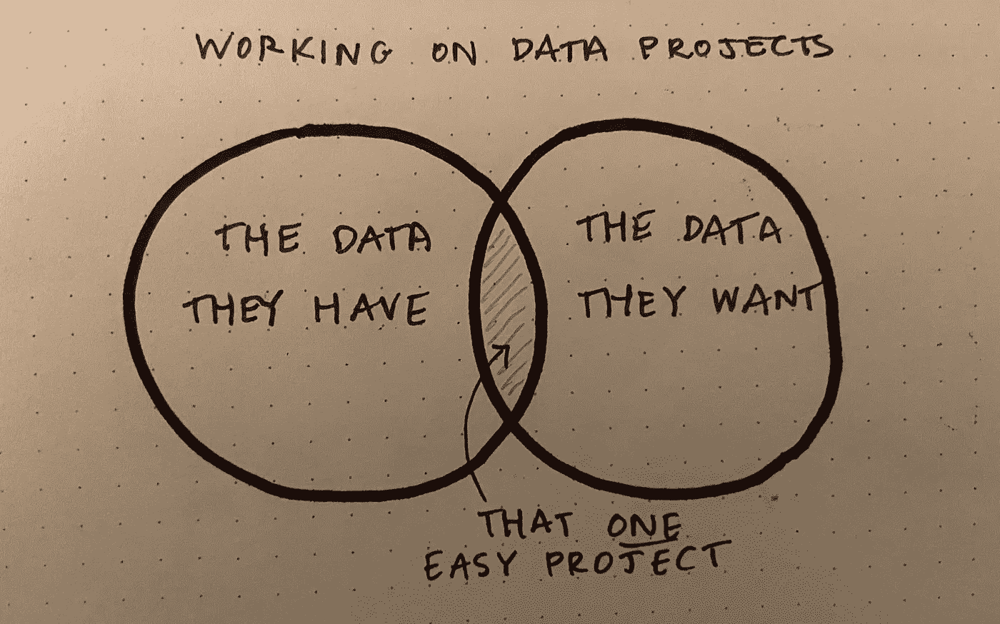
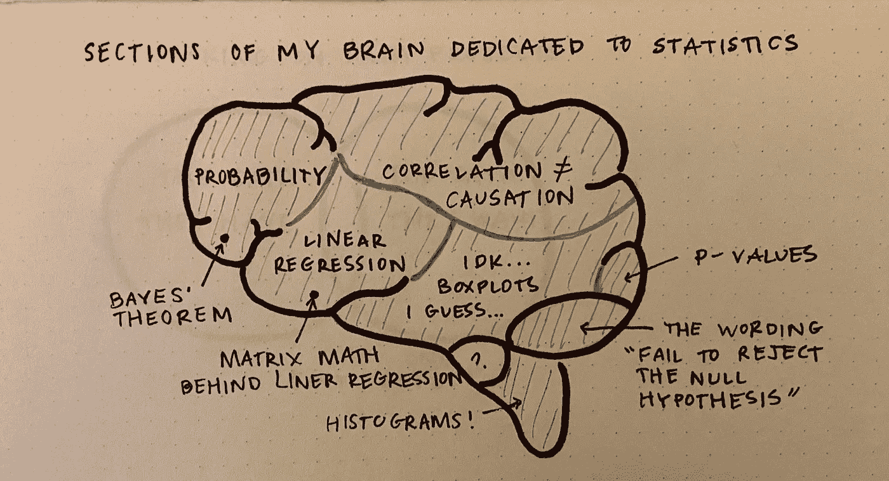
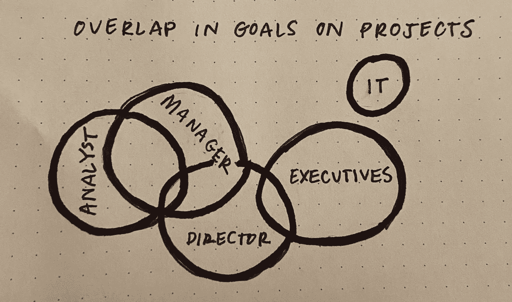
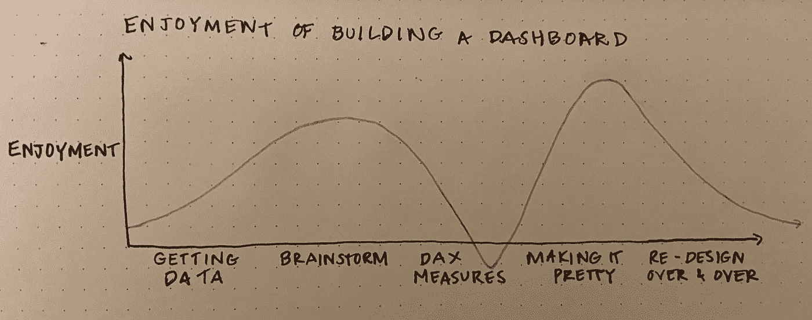

# 数据分析师的生活

> 原文：<https://towardsdatascience.com/the-life-of-a-data-analyst-263050370272?source=collection_archive---------0----------------------->

## 如图纸所示

这些天来，edium 是我的创意出口。作为一名数据分析师，我可以有点创造力，比如当我设计一个仪表板或解决一个有趣的问题时，但这并不是我工作的大部分。

因此，我没有对成为数据分析师的艰难部分感到沮丧，而是决定用文字来说明它们。

## 数据可用性和数据质量的挑战

作者图片

对于大多数处理大量数据的项目来说，这绝对是最大的难题:每个人想要的数据都不容易获得。这是数据工程师和数据分析师存在的部分原因，然而，有时如果一个简单的查询— select * from… —就可以获得项目的数据，那就好了！

## 我对大学毕业后统计学的看法…

老实说，我把学过的大部分统计学都忘了。(我甚至差点辅修了 stats！)出于某种原因，除非我每天都在使用这些概念，就像在课堂上一样，否则它就不适用。因此，下面是我作为一名数据分析师工作了一年多之后，大概掌握了多少统计知识。

作者图片

尽管如此，我永远不会说“我接受零假设”出于某种原因，这真的让我难以忘怀。

## 政治和协作挑战

作者图片

这在所有类型的公司工作中可能更常见，但当它被外包时，感觉就像是在他们自己的岛上。他们可能很难共事，通常在很远的地方，他们的目标似乎和我的完全不同。

为什么我们不能只做朋友？？

## 不同层次的项目享受

作者图片

对我来说，构建仪表板最有趣的部分是头脑风暴和设计视觉效果，然后让它看起来很漂亮。其他所有方面都不那么令人兴奋(虽然非常重要)。如果我在 Power BI 工作，构建 DAX 指标是最难的部分，需要大量的谷歌搜索。

## 最后

不要误解我，我喜欢做数据分析师。我认为这是一份我非常适合的工作，我喜欢不断学习新的概念、技术和策略。

对于工作中我不喜欢的部分，制作图表和可视化来表达我的厌恶难道不合适吗？:)

p.s .我把这个变成了一个系列！请查看下面的第 2 部分:

</the-life-of-a-data-analyst-part-2-2c5a8e9ecc1f> 