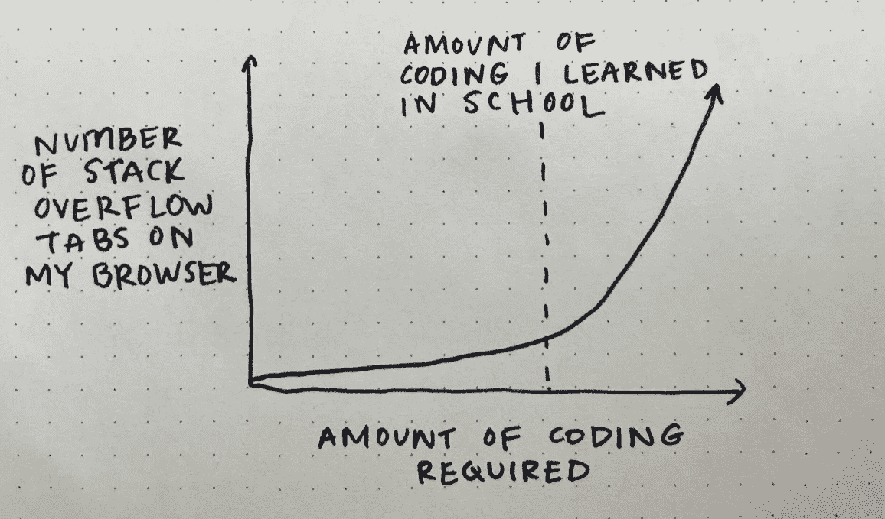
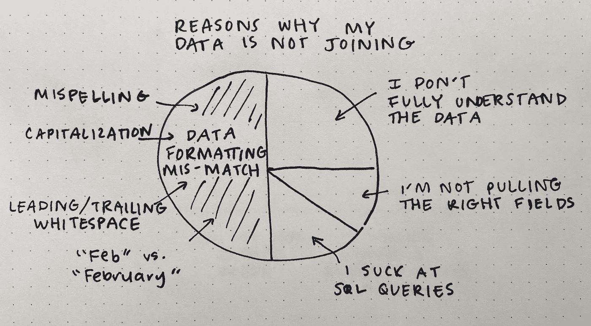
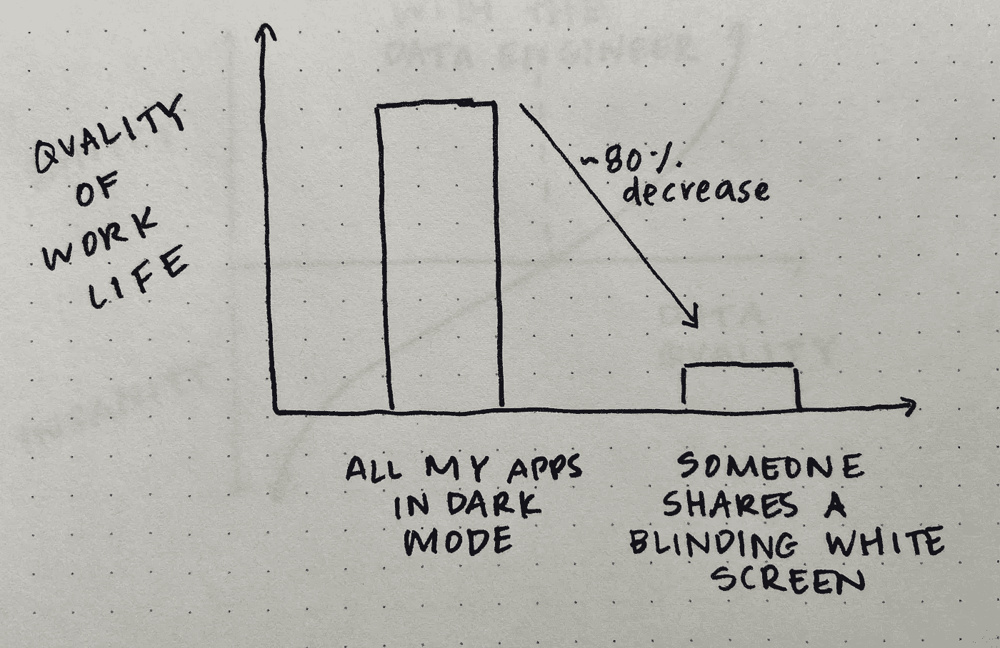
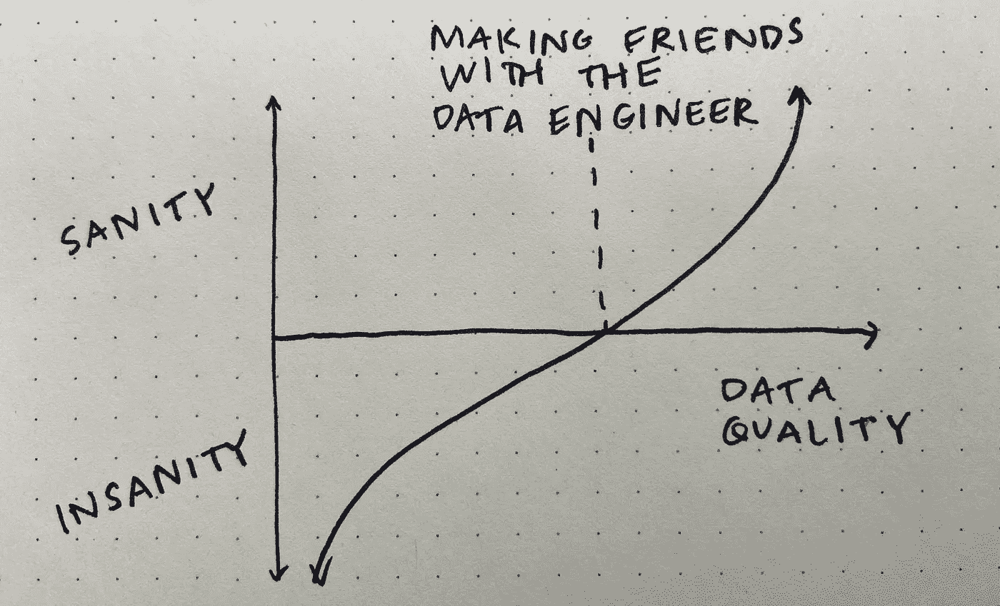
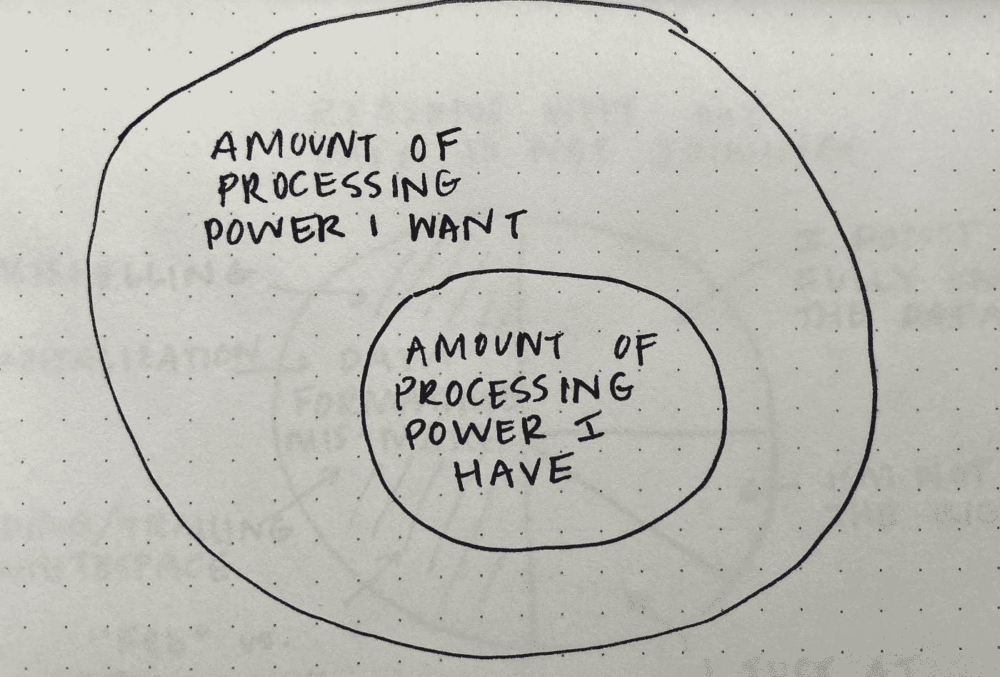

# 数据分析师的生活—第二部分

> 原文：<https://towardsdatascience.com/the-life-of-a-data-analyst-part-2-2c5a8e9ecc1f?source=collection_archive---------5----------------------->

## 如(更多)图纸所示

朋友们好！我把我的“[数据分析师的生活](/the-life-of-a-data-analyst-263050370272?source=your_stories_page-------------------------------------)”故事做成一个系列，因为:

1.  我喜欢画画
2.  我的经历产生了许多想法
3.  第一篇文章很受欢迎

因此，请坐好，放松，滚动浏览以找到相关的内容——无论您是数据分析师、数据科学家，还是其他广泛使用数据和代码的人。

## 关于编码和堆栈溢出

如果你正在编码并且没有使用[栈溢出](https://stackoverflow.com/)，那么你要么是一个天才，要么真的错过了……老实说，这就是我要说的。

作者图片

此外，完成一个项目或一段代码并结束所有这些标签的感觉不是很好吗？

## 为什么我的数据集没有加入

不正确的数据连接经常发生，并且是正常数据处理工作流的一部分。然而，当您不能快速找出为什么两个或更多数据集没有按照您预期的方式连接在一起时，情况就变得很糟糕了。

作者图片

我敢说最令人沮丧的情况是文本字段相似但不完全相同——在这种情况下，需要进行模糊匹配。

## 在黑暗模式下

这可能只是个人喜好，但我会尽可能在电脑上的每个应用程序中打开暗(视图)模式。然后，当一个同事分享他们刺眼的白色屏幕时，这有点像对眼睛的鞭打。

作者图片

## 论数据质量

作为数据分析师，我的经验越多，我就越意识到数据质量的重要性。如果您不能始终如一地依赖您的源数据的准确性，您如何能够获得任何有价值的见解呢？你不能。

作者图片

与 IT 和/或数据工程师的联系改变了我的游戏规则。非常感谢他们帮助我在数据分析过程中减少了眼泪。

## 论处理能力

除了让你的笔记本电脑更大或更重，我不明白为什么任何处理数据的人不想要一台更强大的电脑。如果你想到一个理由，让我知道。

作者图片

我也很抱歉，我显然不会画圈圈——好在这不在我的工作范围内。

感谢阅读！如果您没有看到我在这个系列中的第一篇文章，您可以在这里找到它:

 [## 数据分析师的生活

### 如图纸所示

towardsdatascience.com](/the-life-of-a-data-analyst-263050370272) 

如果您不想错过本系列的下一篇文章，请注册我的电子邮件列表！

*如果你转贴我的任何图片，请引用这篇文章作为你的来源。*