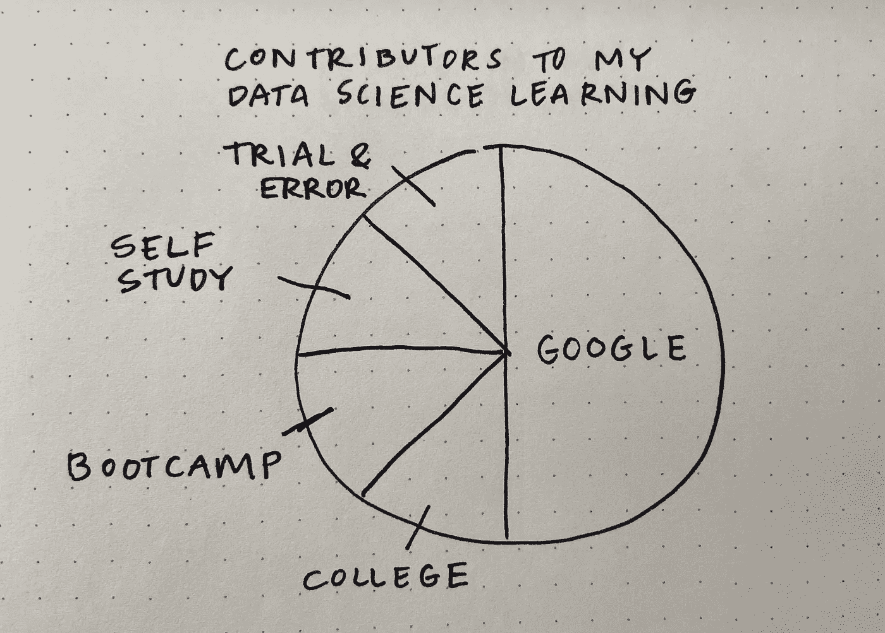
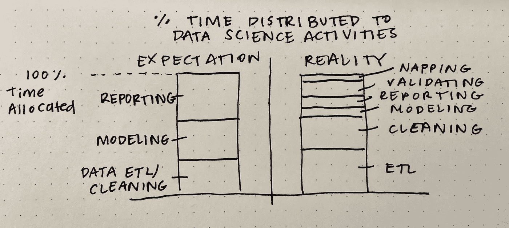
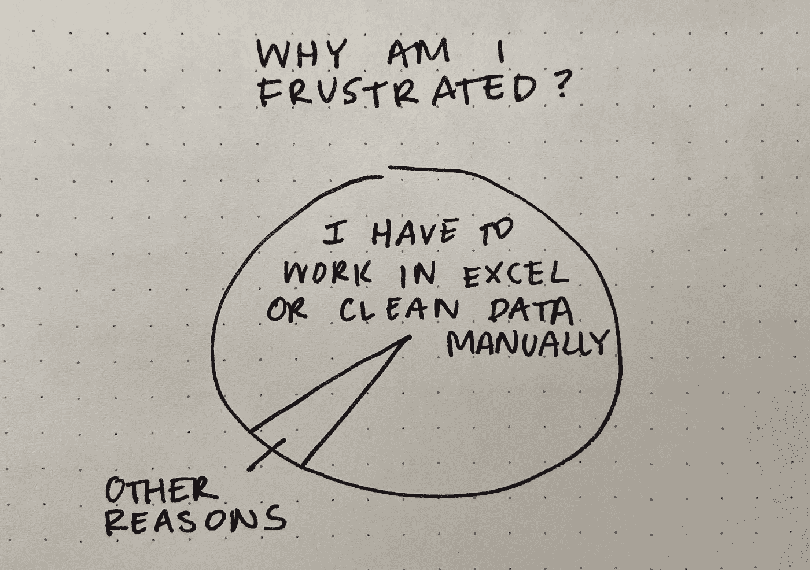
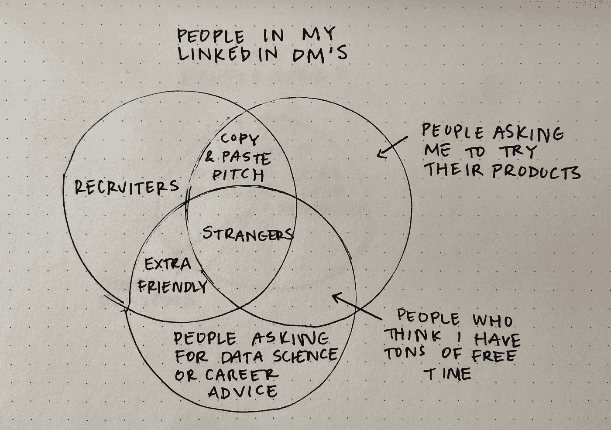

# 数据分析师的生活——第三部分

> 原文：<https://towardsdatascience.com/the-life-of-a-data-analyst-part-3-8ee4d573d21c?source=collection_archive---------14----------------------->

## 如(甚至更多)图纸所示

你认为我用完了关于数据分析/数据科学的插图了吗？不可能。下面是我的“数据分析师的生活”系列的第 3 部分。如果你错过了，以下是第 1 部分& 2:

 [## 数据分析师的生活

### 如图纸所示

towardsdatascience.com](/the-life-of-a-data-analyst-263050370272)  [## 数据分析师的生活—第二部分

### 如(更多)图纸所示

towardsdatascience.com](/the-life-of-a-data-analyst-part-2-2c5a8e9ecc1f) 

## 我如何学习数据分析/数据科学

我大学学的是工业工程专业，所以从一些课堂和项目中学到了一点数据分析的知识。大学毕业后，我参加了一个为期 6 个月的在线数据科学项目(即 [Thinkful 数据科学训练营](https://www.thinkful.com/bootcamp/data-science/#introduction))。现在，正如我反思的那样，我在项目中学习和实现的一切至少有一半要归功于谷歌搜索技能。

作者图片

## 数据科学时间管理:期望与现实

当我在研究数据科学时，我一遍又一遍地听说我大约 80%的时间将花在收集和清理数据上。虽然关于[是否有这么高](https://blog.ldodds.com/2020/01/31/do-data-scientists-spend-80-of-their-time-cleaning-data-turns-out-no/)还存在争议，但对我来说，它一直是这个项目的至少一半。当我开始做数据分析师时，我也严重低估了验证数据所需的时间。

作者图片

此外，我知道小睡从技术上来说不是数据科学活动……但是我觉得强力小睡应该得到一些认可，因为它帮助我在大项目中生存下来。

## 我为什么会沮丧？

不确定这个需要更多的解释…让我们说这是由真实事件激发的。

作者图片

现在，我使用 Alteryx 来自动化或至少加速数据清理，当我不得不打开 Excel(我亲切地称之为*exhell*)来手动浏览数据时，这是一个很大的遗憾。我也倾向于在 Excel 中犯很多错误，因为我不经常使用它。

## 谁在我的 LinkedIn DM 里？

写关于数据科学的文章和活跃于 LinkedIn 会带来一些副作用，包括在平台上获得更多的 DM。但不知何故，它们从来都不是我想要的样子(也就是说，来自朋友或同事)。

作者图片

我终于有了在这个上使用圆形模板的想法，因为否则，它会太混乱。

一如既往，感谢阅读:)如果你不想错过我的下一篇文章，请注册我的电子邮件列表！

如果你转贴我的任何图片，请引用这篇文章作为你的来源。