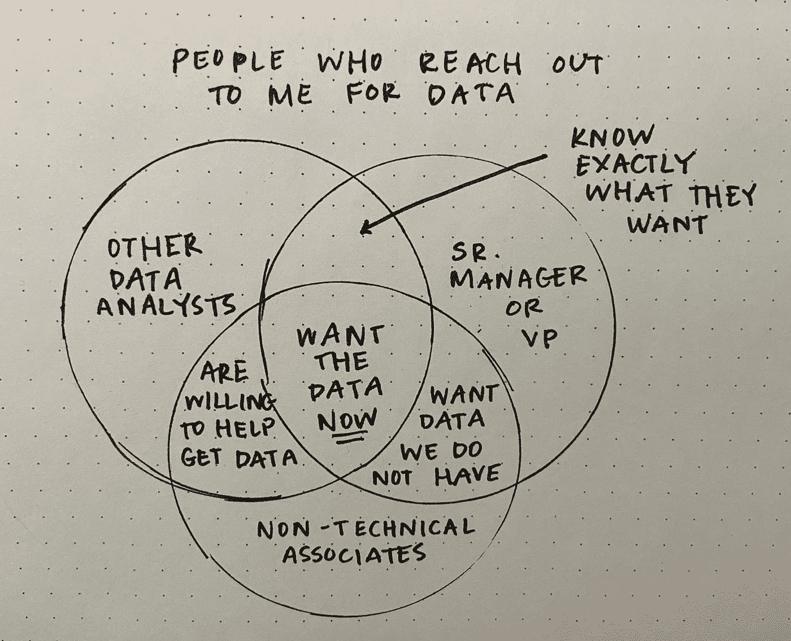
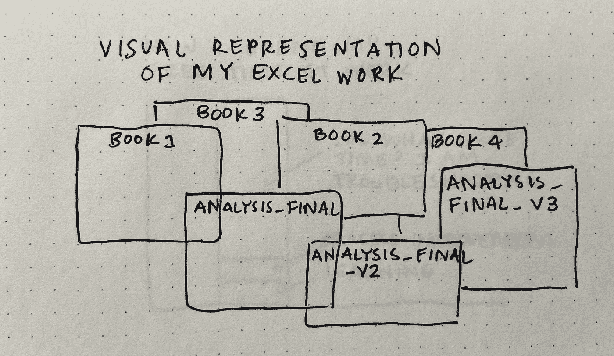
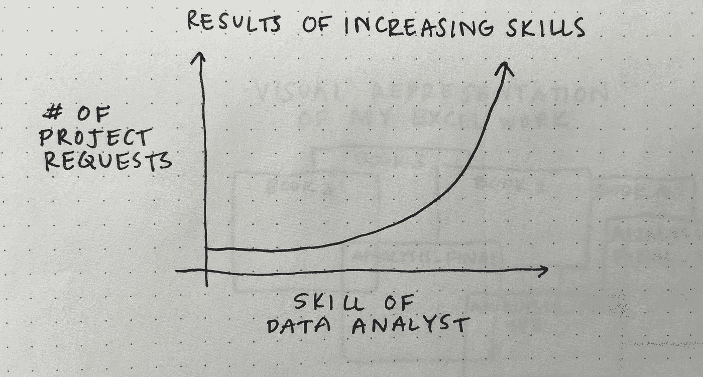
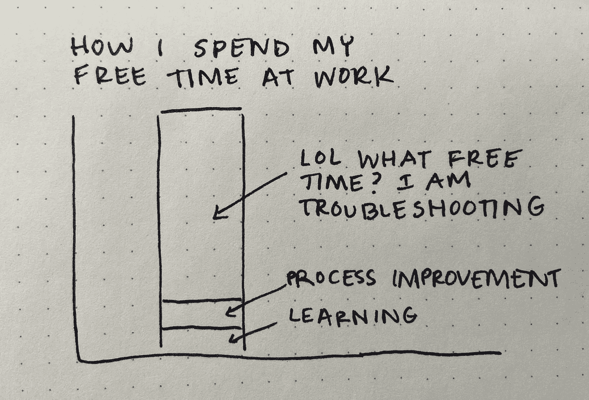

# 数据分析师的生活—第 4 部分

> 原文：<https://towardsdatascience.com/the-life-of-a-data-analyst-part-4-1bba34e69737?source=collection_archive---------8----------------------->

## 正如梅根·迪布尔在她的涂鸦中所描述的

你好！自从开始我的数据分析师系列*生活以来，我已经获得了许多新的关注者，所以我想简单介绍一下我自己。我叫 Megan Dibble，是一名高级数据分析师。当我第一次开始从事数据工作时，我的目标是成为一名数据科学家。但是说实话，我喜欢做一名数据分析师(尽管我的一些画可能暗示了什么)。

我感谢每一个对我在这份工作中遇到的某些困难做出回应的人。**我只想花一分钟时间说，如果你正在挣扎，处理冒名顶替综合症，困惑，或对数据分析感到沮丧，你并不孤单！**这是写这个系列教会我的最重要的事情之一。

**点击此处阅读* [*第一部分*](/the-life-of-a-data-analyst-part-2-2c5a8e9ecc1f) *，* [*第二部分*](/the-life-of-a-data-analyst-263050370272) *，或* [*第三部分*](/the-life-of-a-data-analyst-part-3-8ee4d573d21c?source=user_profile---------2-------------------------------)

好了，现在进入第四部分！给你提个醒——这些插图中的大部分都与我现在的感受有关，那就是**忙**。

## 当人们寻找数据时

作者图片

联系我获取数据的同事有一个共同点，那就是他们现在都想要这些数据。(或者他们“昨天就需要”，这是我最不喜欢的短语，除了语法上的混乱。)

我会说，我很感激当人们都 1。知道他们想要的确切数据。确信我们的组织拥有这些数据。

## 当我在 Excel 中工作时

作者图片

欢迎来到命名不当的 Excel 文件的丛林！我越忙，事情就越乱。哦，还有一个建议:永远不要用后缀“_final”来命名东西我认为可能有一个 Excel 仙女对所有这样的命名分析下了诅咒，因为它永远不会是最后一个。

## 当我的工作变得更好的时候

作者图片

至少，技能和项目的增加(通常)也会带来收入的增加。没什么可抱怨的！如果我能画 3D 图，我会把薪水作为我的 z 轴。

## 当我有“空闲时间”时

作者图片

所以。很多。故障排除。

如今，当事情第一次进展顺利时，我甚至不知道该怎么办，因为我不相信自己。我再次检查我的工作，以确保我没有遗漏任何东西。如果我以某种方式爬出了故障排除的炼狱，那么我喜欢学习一些新的东西或着手改进已经平庸了太久的流程。

一如既往，感谢您的阅读——特别是如果您也是一位忙碌的数据分析师:)如果您不想错过我的下一篇文章，请注册我的电子邮件列表！

如果你转贴我的任何图片，请引用这篇文章作为你的来源。