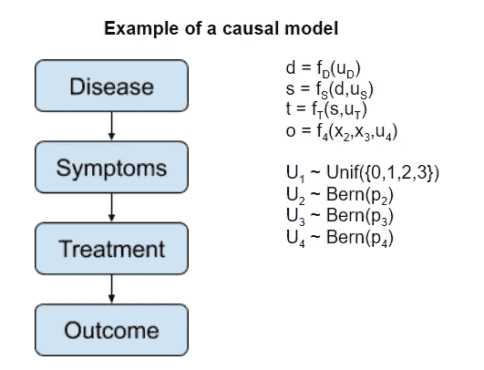
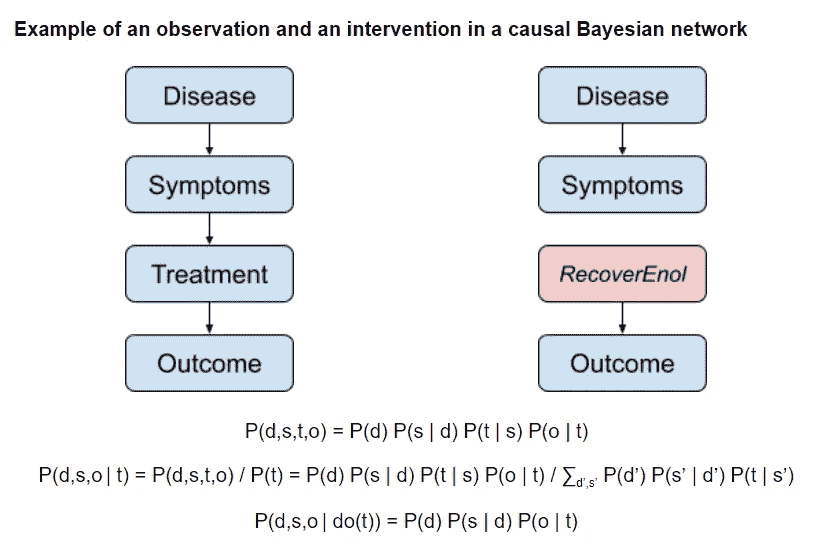
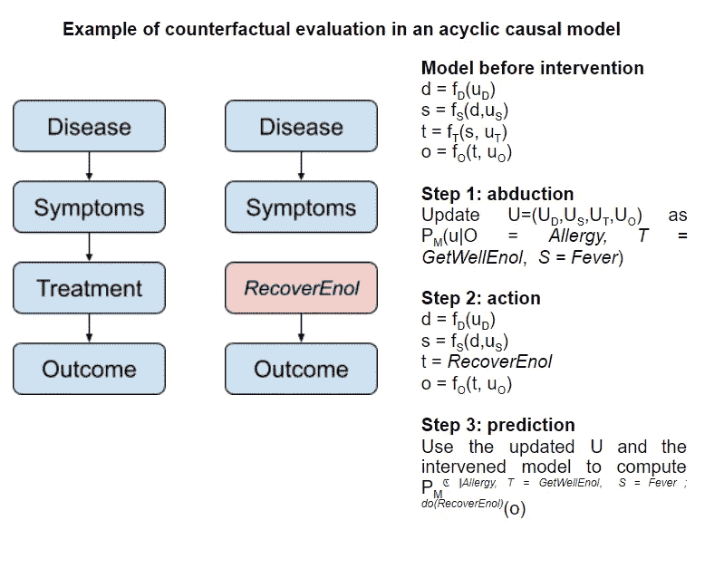
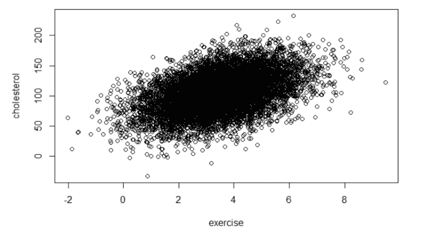
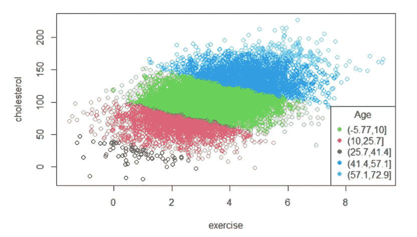
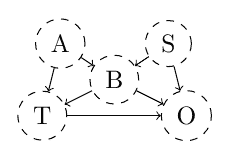

# 图形因果发现的局限性

> 原文：<https://towardsdatascience.com/the-limits-of-graphical-causal-discovery-92d92aed54d6?source=collection_archive---------22----------------------->

## [入门](https://towardsdatascience.com/tagged/getting-started)

我花了六个月的时间研究因果发现，希望找到可行的见解，可以转移到其他领域(特别是计量经济学和医学)，以改善我们的观察研究方法。

我的推理如下:

*   从观察数据进行因果推断对于许多不同的领域来说是一个非常重要的课题；更好的因果推理概念和工具可以帮助我们理清诸如经济增长的长期因素或什么样的生物学指标是生物学年龄的准确追踪者等主题
*   在过去的 20 年里，已经有很多关于用因果图来表示因果关系的原创性研究，这在其他领域显然还没有太多的应用
*   从远处看，因果图的想法很吸引人，因为它是简化因果关系研究的新视角
*   尽管人们对因果图议论纷纷，而且“为什么之书”成功地普及了这个概念，但我遇到的人中似乎很少有人对因果图有清晰的理解
*   鉴于我的数学和计算机科学背景，因果图的数学相对简单易懂
*   思想的阐述有差距，一头是非常基础的、不完整的通俗读物，一头是学术研究论文；很少有介绍性的教程和教科书给那些想赶上艺术发展水平的人

因此，通过因果图进行的因果推理具有一个主题的吸引力，这个主题很重要，显然容易处理，但相对来说被忽视了。我让自己扮演普罗米修斯的角色，沿着因果关系往上跑，窃取已完成的研究成果，并把它交给世界各地的应用科学家。

然而，在对这个话题进行了六个月的研究后，我认定我最初的方法是一条死胡同。在这里，我解释了这个方法到底是什么，我遇到的死胡同是什么，以及这个研究项目可能的延续。

**什么是因果图？**

首先简单介绍因果图/结构因果模型。

结构因果模型是变量 X1，…，Xn 和与这些变量相关的随机方程的集合，其形式为 Xi = fi(X，Ui)，其中 Ui 是随机变量，通常假设是相互独立的。

作者图片

这些方程隐含地定义了一个有向图，将每个变量与它们直接依赖的其他变量联系起来。这个因果图通常被认为不包含任何循环。

结构因果模型隐含地指定了其变量的联合概率分布；在这个意义上，我们可以把它们理解为一个[贝叶斯网络](https://en.wikipedia.org/wiki/Bayesian_network#:~:text=A%20Bayesian%20network%20(also%20known,directed%20acyclic%20graph%20(DAG).)。

结构因果模型支持三个关键操作:观察、干预和反事实。

**观测值**是典型的贝叶斯更新；我们知道一个节点的值，我们需要通过网络将该信息传播给它的后代和它的父母。在上面的例子中，如果我了解到患者已经接受了某种药物的治疗，这将影响他们可能表现出的症状以及最终的健康结果。

**干预**是我从外部影响系统时发生的事情。如果我决定自己用一种药物来治疗病人，那就会改变最终健康结果以某种方式出现的可能性。但关键的是，它不会改变患者症状的概率。更新向下流动，但不向上流动。

我们可以通过我们的结构因果模型的局部修改来表示这一点，这删除了变量 WET 的所有依赖性。为了正式表示这一点，图形因果模型上的标准符号是使用语法 P(y | do(x))来表示设置 X=x 后 Y=y 的概率。

作者图片

反事实在概念上更难理解。他们的主要思想是代表在特定的情况下，干预足以实现改变的机会有多大。

例如，假设有一个发高烧的病人来找我们，我们用 GetWellEnol 治疗他们，病人不幸出现过敏反应，病情恶化。如果我们给病人服用康复液，会发生什么？嗯，它的结果可能已经改变，因为它是治疗的因果下游。但是它的症状，以及我们不能直接观察到的背景变量的值，如病人的疾病，不能有反事实的改变，因为那些是在治疗之前发生的。所以我们不能仅仅用一个干预来表现这一点。为了确保背景变量保持不变，我们需要一种新型的反事实操作。

作者使用的符号如 p*ℭ|过敏，T = GetWellEnol* ， *S =发烧；do(RecoverEnol)* (o)参考结果的反事实概率分布如果我们用 *RecoverEnol* 治疗患者，而不是实际上我们用 *GetWellEnol* 治疗他们，我们观察到*发烧*并且患者有*过敏*反应。

作者图片

**学习因果图**

到目前为止，我们已经看到因果图作为一种工具，代表三种类型的推理:观察，干预和反事实。

但是，这些图表是从哪里来的呢？我们如何从数据中学习它们？

这就是事情变得混乱的地方，因为这个过程有两个部分:学习图形本身和学习图形的参数。

对于可行的系统，我们可以进行随机控制实验来了解变量对之间的直接因果关系。但是我们经常不能做这样的实验(例如，随机选择一种治疗可能是不道德的，或者我们可能正在研究一个我们不能复制的历史事件)。

事实证明，我们可以学习，如果不是所有的东西，至少是一些关于因果模型的东西，而根本不需要进行干预。

我对这一点很困惑，因为关于这一主题的流行读物对我们能从因果模型中学到什么以及如何学习非常不清楚。

理解题目的关键是，过程可以理解为先学习因果图(我见过的叫**因果发现**)，然后学习结构因果模型的参数(我见过的叫**因果识别**)。

**因果鉴定**

我们先把重点放在因果识别上，因为后面会介绍因果发现需要的概念。

这两个过程的关键在于**综合控制**的概念和我称之为**的信息路径**。我将依次解释这两个问题。

首先，**综合控制**是关于我们如何模拟一个观察，就好像一个给定的变量保持不变。这不是一个新的想法，但它将有助于这个概念的基础。

假设我们想研究运动对胆固醇的影响。我们召集了一些受试者，调查他们的日常锻炼，并测量他们的胆固醇水平。我们看到了这个:

使用虚构的数据，假设胆固醇和运动之间的相关性。图片作者。

根据这张图表，我们可能会得出结论:运动导致胆固醇；毕竟，它们看起来是高度正相关的。

但没那么快，因为可能有一个混杂因素——第三个变量既影响胆固醇又影响锻炼，并使我们对一个变量对另一个变量的因果影响的估计产生偏差。

事实上，如果我们将不同年龄组的受试者分组，我们会看到:

胆固醇和运动之间的假设相关性，其中颜色代表年龄组。图片作者。

在每个年龄组中，锻炼和胆固醇之间的相关性是负相关的。我们可以通过**控制**的年龄来表达运动对胆固醇的总体因果影响。

控制一个变量听起来很神秘，但这意味着你需要通过保持变量不变来研究每个群体内的相关性，例如将研究限制在 20-24 岁的人群。

如果你不能物理地操纵变量来保持它不变，或者我们想使用所有病人的数据，那该怎么办？然后我们可以分别研究不同的年龄段，最后汇总结果。这被称为**综合控制**。

例如，为了研究胆固醇 c 和控制年龄 a 的锻炼 e 之间的因果关系，我们研究了平均条件相关性⍴C,E|A =σa p(a = a)⍴C,E|A=a。如果我们假设该系统可以通过高斯线性结构模型精确建模，那么⍴c,e|a=a 等于独立于 a 的条件值的固定偏相关⍴c,e|a，我们可以使用多元线性回归来测量。

对上述例子的标准解释是，在从观察数据中得出因果结论之前，你需要控制所有的混杂因素。

很容易得出这样的结论:你控制的变量越多越好。控制更多的事情不会让事情变得更糟，对吗？

不对！

假设我们正在研究年龄和疾病易感性之间的关系。我们随机给人们打电话，询问他们的年龄以及是否感染了这种疾病。这种设置的问题是，也许年轻人更可能拿起电话，而病人不太可能拿起电话。这会使我们的样本产生偏差。这种偏差通常被称为“选择偏差”，但我们可以将其视为人们在拿起电话时的无意控制。控制一个额外的变量会使我们的结果有偏差。

你可能想知道因果图与所有这些有什么关系，因为它们已经有一段时间没有出现了。联系在于因果图提供了一个非常方便的抽象概念来推理在观察分析中**应该控制哪些变量。**

让我们假设我们知道与一个系统相关的因果图，并且我们想要测量一种新的治疗(T)对患者结果(O)的因果效应。有一些背景变量，包括患者是否有心律失常(A)，他们的血压(B)和患者的疾病类型(S)。

医生检查患者是否有心律失常和患者的血压，建议治疗并测量结果。他们的实际疾病会影响血压和结果。我们可以用图表来表示这些因果关系:

作者图片

我们想找到对哪些变量进行综合控制来衡量 T 对 o 的因果影响。

第一步:我们枚举两个变量之间的路径。在上面的例子中，我们有直接(因果)路径 T→O 和间接(因果)路径 T←B→O，T←A→B→O，T←B←S→O，T←A→B←S→O。我把这些**信息路径称为**——这些是纠缠链，可以导致 O 的值响应于观察到的 T 值的变化而更新

根据我们控制的变量，我们可以认为这些路径是开放的、部分开放的或封闭的。开放路径让信息沿边缘流动，并有助于 T 和 o 之间的总相关性。部分开放(也称为部分开放)路径仍有助于总相关性，但会发生失真。闭合路径对最终关联没有贡献。

并且检查路径是否被阻塞是相对容易的。我们需要查看问题路径上三个连续节点(子路径)的每个序列，并确定它们是开放的、部分阻塞的还是阻塞的。如果每个子路径都是开放的，则路径将是开放的；如果每个子路径都被部分阻塞或开放，则路径将被部分阻塞；如果至少一个子路径被阻塞，则路径将被阻塞。

为了判断子路径是开放的、部分开放的还是封闭的，我们应用两个标准:

1.  只要中间节点不受控制，具有非冲突箭头的子路径就不会被阻塞。例如，当且仅当 B 被控制时，子路径 T←B→O 和 A→B→O 将被阻塞。如果我们控制 B 的后代，这将导致 B 被部分控制，因此子路径将被部分阻塞。如果两种情况都没有发生，则子路径是打开的。
2.  当控制中间节点时，信息只能通过相互冲突的箭头流动。例如，当且仅当 B 被控制时，子路径 A→B←S 打开。如果 B 的后代被控制，那么这将导致子路径部分打开。如果两种情况都没有发生，子路径就关闭了。

请记住，控制一个变量意味着分别研究该变量具有相似值的组，然后汇总结果。

第一个标准非常直观。因为季节= >雨= >湿，在得知是否下过雨后，季节与地板是否潮湿没有关系。

第二个标准更奇怪；不明显的是，控制一个共同的结果应该在原因之间建立一种关联。这里的直觉是，排除一件证据的一种解释应该会增加我们对其他可能性的信任。例如，如果血压高，那么它可能是因为病人有心律不齐或因为他们的疾病。如果我们后来知道病人没有心律不齐，那么疾病的解释就更有可能了。这种现象被称为文学上的“解释”效应。

信息路径概念的一个直接应用:两个变量是条件独立的当且仅当它们之间的所有信息路径都是封闭的。这通常被称为 **d 分离**属性。

这很好，但是我们不想让治疗(T)和结果(O)相互独立。我们想分离出一个对另一个的因果影响。事实证明，我们可以扩展这条线的推理来做到这一点。

我们将把所有的因果信息路径放在一边(如 T→O)，把非因果信息路径放在另一边(如 T←B→O)。

现在的目标是找到一组控制，关闭所有因果信息路径，同时让因果信息路径完全打开。比如，仅仅为了 B 而控制是不够的；虽然它阻断了路径 T←B→O，但信息仍然可以必然地流经路径 T←A→B←S→O。但是控制 eg A 和 B 确实足以隔离 T 对 O 的因果影响。

于是我们得出结论:P(O = O | do(T = T))=σA，b P(A=a，B=b | do(T=t)) P(O=o | do(T=t)，A=a，B=b)=σA，b P(A=a，B=b) P(O=o | T=t，A=a，B = B)

使上述公式有效的关键技巧是认识到 P(O=o | do(T=t)，A=a，B=b) = P(A=a，B=b) P(O=o | T=t，A=a，B=b)，这是因为 A，B 阻塞了 T 和 O 之间的所有因果路径。

请注意，虽然公式的左边部分涉及干预，但右边部分只涉及条件——我们已经成功地将因果效应的估计减少到测量条件相关性。

对观察数据中哪些干预是可模拟的进行了更仔细的研究，这给了我们 **do-calculus** :一种尽可能找到如上身份的系统方法。

对于因果识别的适当介绍，读者可能会对[统计学中的因果推断:初级读本](http://bayes.cs.ucla.edu/PRIMER/) [(Pearl 2016)](https://www.zotero.org/google-docs/?9VhLrF) 感兴趣，我在那里举了胆固醇锻炼的例子。如果你想从图表中识别因果关系，微软的库 [DoWhy](https://github.com/microsoft/dowhy) 用 python [(Sharma 和 Kiciman 2020)](https://www.zotero.org/google-docs/?RCiiul) 实现了整个 do-calculus。

**因果发现**

如果你和我一样，现在你会想知道这些图表是从哪里来的。

简而言之:是我们编造的。

在某些时候，我们需要指定我们的模型。do-calculus 允许我们不指定模型的一些参数，而是可以从数据中学习。但是建立因果关系网是留给读者的一个练习。

我们能做得更好吗？特别是，我们能从观察数据中学习因果图吗？

民间智慧说没有——“没有操纵就没有因果关系”。

事实证明，常识本质上是正确的，但他们的推理是有缺陷的。在某些情况下，我们可以从观察数据中学习(部分)因果图。但是还不清楚这些条件是如何满足的，目前已知的程序可能比询问专家的最佳猜测更加嘈杂。

我一头扎进去，试图更好地理解这一点。对于感兴趣的读者来说，这是一个很好的起点[基于图模型的因果发现方法综述](https://www.frontiersin.org/articles/10.3389/fgene.2019.00524/full)、【Glymour、Zhang 和 Spirtes 2019】，它描述了从数据中学习因果图的三种主要方法:

1.  利用 d-分离隐含的条件独立性
2.  寻找优化损失函数的贝叶斯网络类(通常是 BIC)
3.  利用异方差性(即预测误差和独立变量之间的相关性)通常只发生在回归一个原因的影响时，而不是相反

我重点研究的是基于条件独立的方法，因为它们是更好研究的方法。

基于条件独立性的因果发现有着丰富的学术历史，其顶峰是[张的因果发现算法](https://www.sciencedirect.com/science/article/pii/S0004370208001008)，即使我们不能假设不存在我们未能测量的隐藏的共同原因，该算法也保证有效。

这一系列方法的问题在于，它们依赖于大量的条件独立性测试——这在概念上是困难的，在统计上也是有噪声的。

从这里，有两条路可以走:a)试图量化从这些嘈杂的条件独立性测试中得出的不确定性，或者 b)试图减少任何给定推断中包含的嘈杂的条件独立性测试的数量

前者的一个例子由 [Claansen 和 Heskes](https://arxiv.org/abs/1210.4866)(cla assen 和 Heskes 2012) 给出，他们开发了一种算法，能够量化他们对算法输出中出现的每条边的置信度。

[和强毅](https://proceedings.neurips.cc/paper/2015/hash/fcdf25d6e191893e705819b177cddea0-Abstract.html) [(高和纪 2015)](https://www.zotero.org/google-docs/?E8Gl13) 给出了后者的一个例子，他们研究局部因果推断，以推断目标变量与其直接因果邻近的变量之间的因果关系，这减少了几个数量级所需的条件独立性测试的数量。

我的同事亚历山德拉·梅恩和我选择了两种抽象方法的结合。在我们即将发表的论文中，我们描述了一种将统计估计转化为贝叶斯因子的启发式方法，试图验证给定的控制集是否足以隔离给定暴露对给定结果的因果影响。这种方法将因果发现和因果识别步骤合二为一，试图在不需要绘制因果图的情况下，将条件独立性测试的数量减少到最低限度。

具体来说，我们建立在[y-结构](https://arxiv.org/abs/1206.6853) [(Mani，Spirtes，和 Cooper 2012)](https://www.zotero.org/google-docs/?O32Tm2) 的概念之上，这是一个无需假设任何隐藏变量的因果发现原则。y 型结构在可能找到潜在原因的两个条件独立原因的情况下识别因果关系。我们的贡献是提出一个启发，放松这种条件独立性的要求。然而，在具有线性关系和高斯噪声的环境之外，启发式算法是不可靠的。

不管这个小小的贡献，我仍然对因果发现感到失望；我期望找到一个已经精炼的产品，锁在一堵学术术语的墙后面。现在，我开始相信，在基于图形模型的因果发现变得实际有用(如果曾经有用的话)之前，在这个领域还有很多工作要做。

这方面研究的未来步骤可包括:

*   通过在事先已经知道因果关系的数据上进行试验，对不同的因果发现算法何时可能起作用有更细致的理解
*   开发贝叶斯条件独立性测试，这可以帮助我们量化在一个给定的因果推断中涉及的所有条件独立性测试都是正确的概率
*   试图在当前的因果发现算法和其他领域(如计量经济学或医学)常用的著名因果推断方法之间进行类比
*   扩展结构因果模型和相应的因果发现算法，以适应更一般的一类因果模型，如循环模型

鉴于我的情况和专业知识，我对这两者都不太感兴趣——如果出现一种情况，我可以在真实数据上尝试更多的当前算法，我可能会接受，但我认为我的努力可能会更好地花在其他地方。

**因果图的利弊**

至此，我们可以了解因果图有什么用处，以及它们的局限性。我认为这将帮助我们认识到什么时候使用这个概念是合适的，以及它在什么地方与我们想要的有差距。

对我来说，从因果图中得到的关键信息是，它们围绕因果推理提出了三个清晰的核心问题:

*   观察和干预的区别
*   因果可识别性的概念
*   从观察结果进行因果推断的限度

他们明确区分被动观察系统和作用于系统。这突出了因果推理的关键问题:创建灵活的推理抽象，可以适应干预性的变化。这是 AI 的一个关键问题。它甚至是分布变化问题的超集，其中“干预”正从训练数据变为部署数据。

信息路径的概念为控制一组变量是合适的(或不合适的)情况提供了一个生动而清晰的例证。因果图中的因果可识别性很好地统一了混杂偏倚和选择偏倚等问题。在研究因果图之前，我不会想到有“控制太多”这种事情——现在我知道得更多了。为了说明这种方法的威力，我引用了[《好坏控制速成班》](http://causality.cs.ucla.edu/blog/index.php/2019/08/14/a-crash-course-in-good-and-bad-control/) [(西内利、福尼和珀尔 2019)](https://www.zotero.org/google-docs/?Adm5pH) ，用玩具例子说明了其中一些见解。

最后，因果发现的进展挑战了我天真的理解，即我们不能从纯粹的观察数据中获得任何因果信息。在某些条件下，在一些玩具模型中，我们可以从原始观察数据中做出一些因果推断，而无需任何因果假设。

在这里，我们需要进入我所看到的因果图概念的极限。

简而言之，这些是:

*   因果发现的局限
*   因果图的本体约束
*   惨痛的教训

首先，尽管从观察数据中学习因果关系在理论上是可能的，但我发现实践是不发达和缺乏的。我不清楚这是一个基本问题(例如，观察数据噪音太大，或者潜在的因果系统不够稀疏，无法进行清晰的推断)还是一个缺乏完善和实践的问题。

接下来，因果图给我的印象是，它对它们要建模的系统有一些硬编码的假设，这些假设似乎经常被违反。

研究界已经成功地放宽了其中的一些限制。例如，因果充分性假设(即不存在隐藏的共同原因)已经通过引入祖先因果图和相关算法而被成功导航[(张 2008)](https://www.zotero.org/google-docs/?gaMvJM) 。

其他一些制约因素似乎有望得到更好的理解和放松；周期性[想到](https://arxiv.org/abs/1611.06221) [(Bongers et al. 2020)](https://www.zotero.org/google-docs/?UN6c4v) 。

但是还有其他一些我没有深入讨论过的限制，这些限制在我看来是根本性的。

首先，因果图任意地将可能性空间分割成具有清晰定义值的变量——鉴于人类模糊、灵活的思维，这让我感到非常奇怪。

第二，因果图不能用来表达上下文无关性——例如，只有当律师没有被分配到案件中时，它们才不能表达审判的结果与律师的性情无关。

解决这两个问题的形式主义是[链事件图](https://www.sciencedirect.com/science/article/pii/S0004370210000810) [(Thwaites，Smith 和 Riccomagno 2010)](https://www.zotero.org/google-docs/?0k1Bgt)；这可能是该领域概念未来的前兆。

第三，围绕因果图的实践隐含地假设了所处理的模型的绝对稀疏性——变量之间有许多硬条件独立性。然而，现实似乎更多的是关于相对稀疏性——少量的联系解释了变量之间的大部分关系，但其余的联系并不是字面上的零。

我看到一些稀疏的工作试图解决这第三个限制，但没有什么特别深刻的印象。

最后，对于基于因果图的理论如何利用增加的计算能力来提高性能，我没有一个清晰的理论。

这意味着，根据[惨痛的教训](http://www.incompleteideas.net/IncIdeas/BitterLesson.html) [(Sutton 2019)](https://www.zotero.org/google-docs/?BkiCZC) ，基于因果图的因果发现系统不太可能具有竞争力。

这对我来说并不意外；我进入这个领域时，完全期望因果网络从长远来看不会成为 ML 方法的竞争性替代方案，就像贝叶斯网络不如它们的深度学习表兄弟那样强大一样。但这值得一提。

也就是说，他们不一定要有竞争力才是有用的；可以说，与深度学习相比，线性回归没有竞争力，但它仍然是有用的，有助于传达一些关于学习和从数据推断的核心见解。

简而言之，关键的一点是，我已经将因果图作为因果发现的潜在工具的观点转变为因果图作为一种语言的观点，以通过一些引人注目的玩具模型来说明关于因果关系的一些问题。

我确实认为还有许多进步要做。但是我不再有这样的印象，即在图形因果发现领域已经有许多见解在其他地方会非常有用(除了我上面提到的例外)。

**致谢**

感谢我的上司 Nava Tintarev 和 Ehud Reiter 的深刻反馈。我还要感谢我的同事 Sumit Srivastava 和 Ettore Mariotti 通读了草案并分享了他们的印象。

本文作者 Jaime Sevilla 是 NL4XAI 项目的早期研究员，也是阿伯丁大学的博士生。

**参考书目**

[邦格斯、斯蒂芬、帕特里克·福雷、乔纳斯·皮特斯、伯恩哈德·舍尔科夫和乔里斯·穆伊杰。2020.有周期和潜在变量的结构因果模型的基础。 *ArXiv:1611.06221 [Cs，Stat]* ，10 月。http://arxiv.org/abs/1611.06221.](https://www.zotero.org/google-docs/?98zpdH)

西内利、卡洛斯、安德鲁·福尼和朱迪亚·珀尔。2019.“理论与实践中的因果分析:好与坏控制速成班”。2019 年 8 月 14 日。http://causality . cs . UCLA . edu/blog/index . PHP/2019/08/14/a-crash-course-in-good-and-bad-control/。

克拉森、汤姆和汤姆·赫斯克斯。2012.基于约束的因果推理的贝叶斯方法。*ArXiv:1210.4866【Cs，Stat】*，10 月。http://arxiv.org/abs/1210.4866.

[高、田、强姬。2015.直接原因和结果的局部因果发现。《神经信息处理系统进展》28 ，C. Cortes、N. D. Lawrence、D. D. Lee、M. Sugiyama 和 R. Garnett 编辑，2512–20。Curran Associates，Inc . http://papers . nips . cc/paper/5974-local-causal-discovery-of-direct-cause-and-effects . pdf](https://www.zotero.org/google-docs/?98zpdH)

格雷穆尔、克拉克、张坤和彼得·斯皮特斯。2019.基于图模型的因果发现方法综述。遗传学的前沿。https://doi.org/10.3389/fgene.2019.00524.

马尼、苏布拉马尼、彼得·l·斯皮特斯和格雷戈里·f·库珀。2012.因果发现 Y 结构的理论研究。*ArXiv:1206.6853【Cs，Stat】*，6 月。http://arxiv.org/abs/1206.6853.

[珠儿，朱迪亚。2016.*统计学中的因果推断:入门*。西萨塞克斯郡奇切斯特:威利。](https://www.zotero.org/google-docs/?98zpdH)

[夏尔马、阿米特和埃姆雷·基西曼。2020.DoWhy:因果推理的端到端库。*ArXiv:2011.04216【Cs，Econ，Stat】*，11 月。http://arxiv.org/abs/2011.04216.](https://www.zotero.org/google-docs/?98zpdH)

理查德·萨顿。2019.痛苦的教训。2019 年 3 月 13 日。http://www.incompleteideas.net/IncIdeas/BitterLesson.html.

斯韦茨、彼得、吉姆·史密斯和伊娃·里科马格诺。2010.用连锁事件图进行因果分析。*人工智能*174(12):889–909。https://doi.org/10.1016/j.artint.2010.05.004.

[张，姬姬。2008.存在潜在混杂因素和选择偏差时因果发现定向规则的完整性。*人工智能*172(16):1873–96。https://doi.org/10.1016/j.artint.2008.08.001.](https://www.zotero.org/google-docs/?98zpdH)