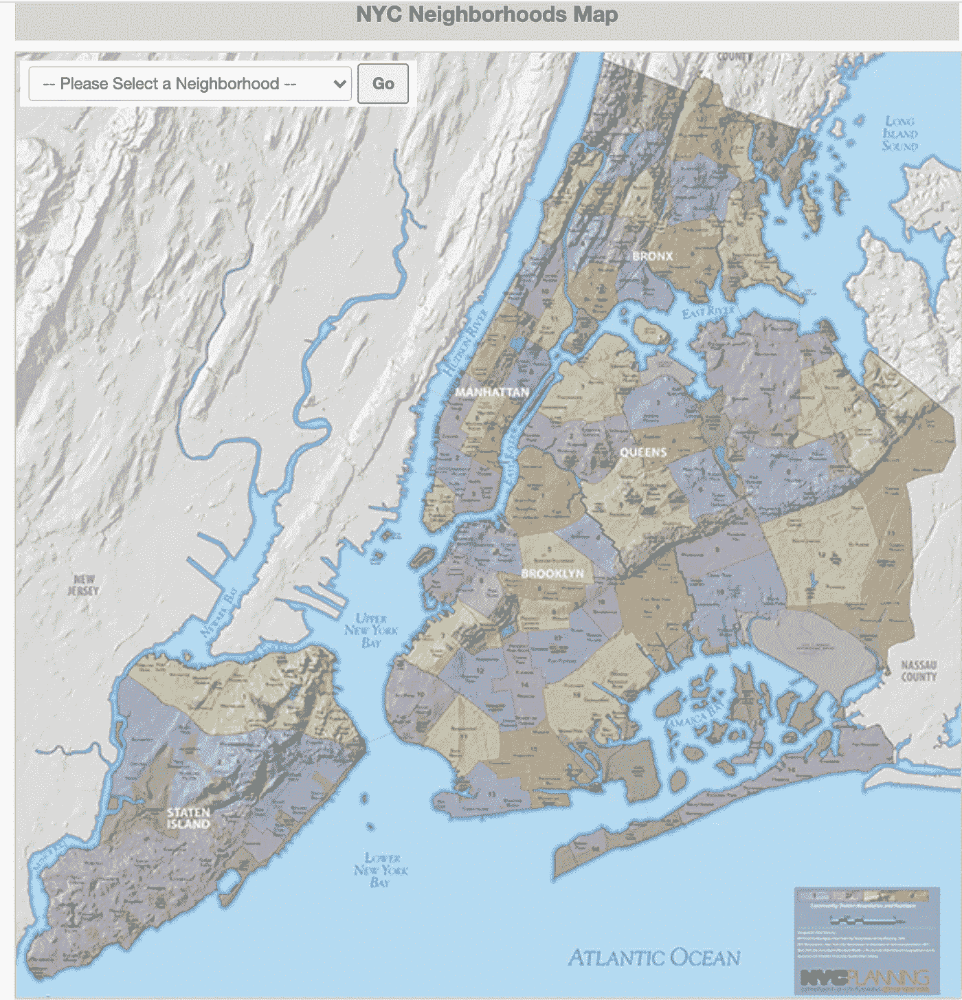

# 位置分析的“思维过程”

> 原文：<https://towardsdatascience.com/the-location-analytics-thought-process-a05720a9ba3f?source=collection_archive---------21----------------------->

## 进行位置分析时，您需要如何思考

由 [Unsplash](https://unsplash.com/s/photos/location?utm_source=unsplash&utm_medium=referral&utm_content=creditCopyText) 上的 [Element5 数码](https://unsplash.com/@element5digital?utm_source=unsplash&utm_medium=referral&utm_content=creditCopyText)拍摄

想象你是一个“生死”鱿鱼游戏(网飞秀)风格游戏的一部分。你只需要选择我们周围大部分数据中存在的两个数据字段。我可以肯定地说，位置数据的两个字段——纬度和经度——可以拯救你。

好了，现在你已经幸存下来了，让我们继续位置分析这个非常有趣的话题。在这个故事中，我将描述您在使用位置分析时需要的思维过程。

通常情况下，作者会以漂亮的视觉效果来吸引读者的注意力。但是，请原谅，因为我是从一个混乱的想象开始的。

Airbnb 在纽约的位置(图片由作者使用谷歌地图提供)

所以你可能会问，这到底是什么可视化？我先来回答这个问题。这个可视化显示了 Airbnb 在纽约的所有位置。目的是分析 Airbnb 地点在纽约市的分布情况。

即使这种分析的目的是合理的，并且已经涉及了许多编程技术，如 Google Map API/Javascript/Node-JS，结果看起来仍然很混乱。更糟糕的是，加载这个可视化需要很长时间，并且可能会使浏览器崩溃。

让我们看看位置分析如何帮助避免混乱。提醒一下，我们的目标是分析 Airbnb 地点在纽约市的分布情况。这是一个思维过程，在进行位置分析时非常有用。

# **懂地理**

使用位置分析时，理解地理很重要。这有助于你理解上下文。这可能还需要在互联网或其他来源上一堂地理课。

在我们的例子中，我们想要分析的地理位置是纽约。这里有一个关于纽约的速成班。从地理上看，纽约是一个拥有 5 个区、59 个社区和数百个街区的城市。

来源—[https://www1 . NYC . gov/site/planning/data-maps/city-neighborhoods . page](https://www1.nyc.gov/site/planning/data-maps/city-neighborhoods.page)

可以去纽约市网站，了解一下这个城市的地理。这次投资学习地理将有助于你以有效和吸引人的方式展示你的成果。

# 用数学术语思考地理

现在你对地理有了大致的了解，你需要开始从数学的角度来看待它。如果你仔细看上面的地图，你会看到数学形状，称为多边形。在所有的数学形状中——正方形、长方形、三角形等等——多边形是神奇的。因为它们实际上可以用来表示地球上的任何地理区域。

让我们以晨边高地为例。在下图的左边，你可以在谷歌地图上看到这个社区。在右手边，你会看到一个数学多边形，它与邻居 Morningside Heights 的形状相同。

多边形的地理区域(来源谷歌地图)

现在，您可以将多边形定义转换为纬度和经度。邻区晨边高地的多边形定义应该是这样的。

邻近晨边高地的多边形定义(图片由作者提供)

有各种来源可以让你得到地球上任何地理的多边形定义。例如，纽约市所有社区的多边形定义都可以在市政府网站上找到。一旦你有了所有的多边形信息，你就可以在谷歌地图上绘制多边形。

下图是纽约每个街区的多边形地图。

纽约市多边形地图(来源谷歌地图+作者)

一旦你实现了任何地理的多边形地图，你将开始感觉在任何位置分析问题的控制。

# **应用位置分析算法**

好了，到现在为止，你已经理解了地理，掌握了它的数学定义。所以，你现在才处于可以想到位置分析算法的阶段。

这也是倒回并回忆我们的目标的恰当时机，我们的目标是分析 Airbnb 的位置在纽约市是如何分布的。分解一下，就是哪个部分(或街区)的 AirBnB 位置比其他地方多。在分析术语中，这意味着哪个面与其他面相比具有更多的经纬度点。这将需要为多边形指定一个经纬度点。

多边形中点法是一种非常有用的位置分析算法。它将找到包含经纬度点的多边形。这是一个不同经纬度点如何分配给不同多边形的动画

点多边形算法(图片来源—作者)

# 选择正确的可视化

几乎所有的位置分析最终都表现为地图可视化。然而，它们不仅仅是我们在等待优步之旅时看到的简单地图。它们更加复杂，因为它们需要包含由位置分析算法计算出的所有智能。

在我们的例子中，多边形中的点算法的输出是邻域多边形定义和多边形中 Airbnb 位置的数量。这些数据可以帮助我们在地理地图上叠加一个热图。好吧，这不是文字游戏，但两种可视化(热图和地理图)都有“地图”这个词。

这就是地理地图上叠加的热图的样子。

地理地图上的热图(来源谷歌地图+作者)

漂亮！比我们开始时混乱的视觉化要好得多。这样，我们就可以清楚地看到哪些社区的 AirBnB 位置(红色)比其他社区(绿色)多。举个例子，你可以看到曼哈顿的 Airbnb 位置更少。这可能是因为该地区有更多的办公楼，而不是住宅区。

所以总而言之，

*   位置分析不只是使用纬度和经度，而是将它们与一些智能算法一起使用。
*   为了有效地使用位置分析，花时间了解相关的地理是很重要的。
*   将地理转化为数学术语需要您搜寻多边形定义数据。
*   只有在掌握了地理学及其数学定义之后，才应该选择位置分析算法。
*   大多数位置分析都需要可视化，而不仅仅是简单的地图显示。

# 额外资源

# 网站(全球资讯网的主机站)

你可以访问我的网站进行零编码分析。[https://experiencedatascience.com](https://experiencedatascience.com)

请**订阅**每当我发布一个新的故事时，请及时通知我。

<https://pranay-dave9.medium.com/subscribe>  

你也可以通过我的推荐链接加入 Medium。

<https://pranay-dave9.medium.com/membership>  

https://www.youtube.com/c/DataScienceDemonstrated 的 YouTube 频道
这里是我的 Youtube 频道
[的链接](https://www.youtube.com/c/DataScienceDemonstrated)