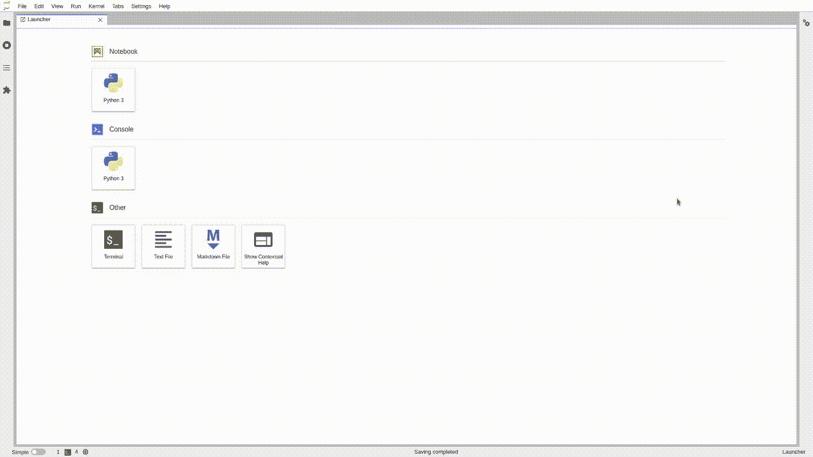

# 期待已久的 JupyterLab 3.0 终于来了

> 原文：<https://towardsdatascience.com/the-long-awaited-jupyterlab-3-0-is-finally-here-3b6648b3a860?source=collection_archive---------15----------------------->

## Jupyter 项目发布了 JupyterLab 版本`3.0`,作为给数据科学家的圣诞礼物

[雪莉·胡利](https://unsplash.com/@sherihoo?utm_source=unsplash&utm_medium=referral&utm_content=creditCopyText)在 [Unsplash](https://unsplash.com/s/photos/gift?utm_source=unsplash&utm_medium=referral&utm_content=creditCopyText) 拍摄的照片

[Jupyter 笔记本](https://jupyter.org/)一直是软件思想增量开发的工具。数据科学家使用笔记本记录他们的工作，探索和试验新算法，快速勾画新方法，并立即观察结果。

> 把一个程序当作一篇文学作品，写给人类而不是计算机。
> 
> 唐纳德·克努特

JupyterLab 是为了解决 Jupyter 笔记本的一些缺点而开发的，是该项目的下一代用户界面。除了终端、简单的文本编辑器和新的文件浏览器之外，它还提供了熟悉的笔记本体验，这是最受欢迎的笔记本功能。JupyterLab 最终将取代经典的 Jupyter 笔记本。

为此，圣诞节前一天，2020 年 12 月 24 日，Jupyter 发布了 JupyterLab 的版本`3.0`，作为送给数据科学家和机器学习工程师的礼物。这个故事研究了这个版本中的新特性，并探索了如何将它用作您的主要开发环境。

> [学习率](https://www.dimpo.me/newsletter)是我每周给那些对 AI 和 MLOps 世界好奇的人发的简讯。你会在每周五收到我关于最新人工智能新闻、研究、回购和书籍的更新和想法。在这里订阅！

# 新功能亮点

现在让我们浏览一下`3.0`版本的新特性。有几个面向用户的变化，以及一些改进或为开发人员量身定制的新功能。

**国际化:**新的 JupyterLab 接口支持多种语言。例如，按照官方[文档](https://jupyterlab.readthedocs.io/en/latest/user/language.html)中的教程将显示语言更改为简体中文。

**可视化调试器:**调试器前端在三月份作为一个独立的扩展推出，现在默认为支持新调试协议的内核提供。阅读下面关于如何使用它的故事。

 [## Jupyter 现在是一个成熟的 IDE

### 通过 nbdev 和 Jupyter 新的可视化调试器，有文化的编程现在已经成为现实。

towardsdatascience.com](/jupyter-is-now-a-full-fledged-ide-c99218d33095) 

**简单界面模式:**关注单个文档或活动而不关闭主工作区中的其他选项卡通常很有用。简单界面模式(以前的单文档模式)使您能够做到这一点。

简单界面模式——作者图片

目录: ToC 是最有用的 JupyterLab 扩展之一。几乎每个人都安装了它，并且它出现在每个 Jupyter 扩展列表中。因此，该团队将其作为核心 Jupyter 的一部分。

**文件浏览器过滤器:**在 JupyterLab 中浏览的文件现在更加有用，因为它现在集成了用于命令面板的相同模糊匹配机制。

文件浏览器过滤器-按作者分类的图像

**命令面板:**命令面板遵循 VS 代码的设计语言，现在它是一个浮动窗口，出现在您的 JupyterLab 工作区的顶部。现在，您可以在保持侧边栏关闭或切换侧边栏面板的同时快速调用命令。

命令调板-按作者排序的图像

**扩展:**一种新的发布 Jupyter 扩展的方式，即`pip`或`conda`包，现在可以使用了。安装这样的扩展不需要重新构建 JupyterLab，也不需要安装 NodeJS。

Jupyter server:Jupyter lab`3.0`现在依赖于 Jupyter Server，这是一个基于经典笔记本服务器的新 Jupyter 项目。有关更多信息，请浏览 [Jupyter 服务器](https://jupyter-server.readthedocs.io/en/latest/)的文档。

# 结论

故事呈现了 JupyterLab `3.0`的新功能亮点。新版本关注于国际化，向 Jupyter 服务器和预建扩展的过渡，新的可视化调试器和 ToC 扩展的集成，以及消除一系列错误。更多细节，请看[变更日志](https://jupyterlab.readthedocs.io/en/stable/getting_started/changelog.html)。

想了解如何生产您的笔记本电脑，或者如何将它们用作您的主要开发环境？阅读下面的故事。

 [## Jupyter 准备生产；原样

### 无需编写一行代码，即可将您的笔记本草稿转化为生产就绪的 Kubeflow 管道。

towardsdatascience.com](/jupyter-is-ready-for-production-as-is-b36f1d1ca8f8)  [## AWS 上的 Mini Kubeflow 是您的新 ML 工作站

### 通过 AWS 上的 MiniKF 加速您的机器学习模型开发

towardsdatascience.com](/mini-kubeflow-on-aws-is-your-new-ml-workstation-eb4036339585)  [## Kubeflow 是您完美的机器学习工作站

### 将您的笔记本电脑变成网飞流媒体设备，在云上工作！

towardsdatascience.com](/kubeflow-is-your-perfect-machine-learning-workstation-91c5d26d4790) 

> [学习率](https://www.dimpo.me/newsletter)是我每周给那些对 AI 和 MLOps 世界好奇的人发的简讯。你会在每周五收到我关于最新人工智能新闻、研究、回购和书籍的更新和想法。订阅[这里](https://www.dimpo.me/newsletter)！

# 关于作者

我的名字是[迪米特里斯·波罗普洛斯](https://www.linkedin.com/in/dpoulopoulos/)，我是一名为[阿里克托](https://www.arrikto.com/)工作的机器学习工程师。我曾为欧洲委员会、欧盟统计局、国际货币基金组织、欧洲央行、经合组织和宜家等主要客户设计和实施过人工智能和软件解决方案。

如果你有兴趣阅读更多关于机器学习、深度学习、数据科学和数据操作的帖子，请关注我的 [Medium](https://towardsdatascience.com/medium.com/@dpoulopoulos/follow) 、 [LinkedIn](https://www.linkedin.com/in/dpoulopoulos/) 或 Twitter 上的 [@james2pl](https://twitter.com/james2pl) 。

所表达的观点仅代表我个人，并不代表我的雇主的观点或意见。