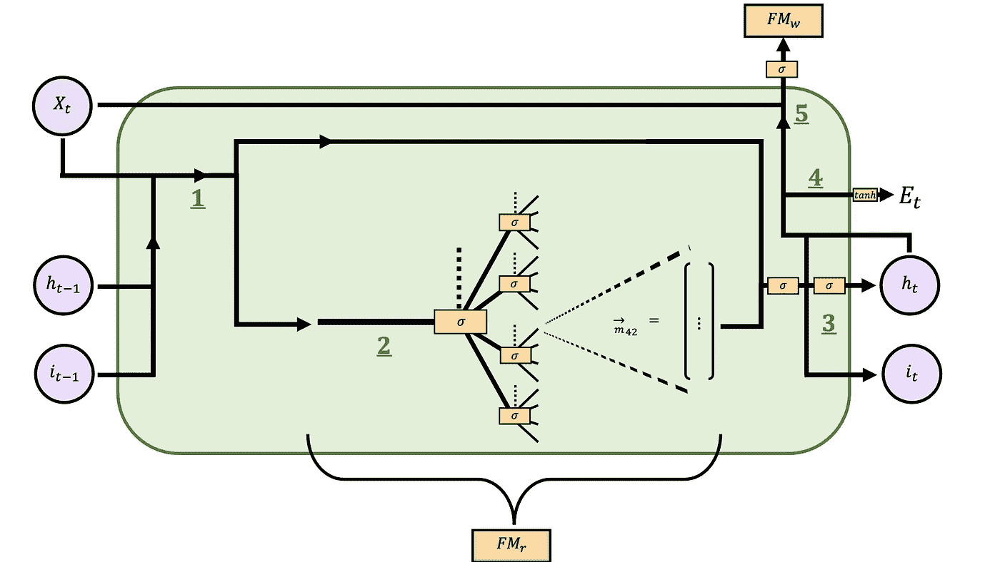

# 智力的丧失功能

> 原文：<https://towardsdatascience.com/the-loss-function-of-intelligence-44bf9913733e?source=collection_archive---------27----------------------->

## [思想和理论](https://towardsdatascience.com/tagged/thoughts-and-theory)

## 这篇文章建议如何模拟一般智力。有人认为进化方法是一种可能的选择。

作者图片

> *这篇文章提出了一种模拟类似一般智力的事物的新方法。有人认为，一个固定的自然框架住房代理人与固定弱物理属性和灵活的'大脑'架构可以演变与遗传算法遵循简单的规则。此外，嵌入在智能体基因中的是决定它们自己的奖惩功能的网络，这些功能被单独用来学习。写入和读取的分形记忆系统被结合到代理的大脑架构中，其中大脑设计还模仿长短期记忆循环神经网络的一些特征。*

## 目录

1.  [简介](#3540)
2.  [定义](#dcbf)
3.  [模拟](#44df)
4.  [框架](#a17f)
5.  [物理属性](#59c5)
6.  [模拟约束](#b2e8)
7.  [大脑](#fa03)
8.  [结束语](#4d80)

# 1 导言

模拟人工智能似乎比以前想象的更困难:机器学习领域的进展已被证明不足以完成这一挑战。这篇文章提出了一种模拟“智力”的方法，认为进化方法至少是一种选择。

# 2 定义

我们人类对智力的定义很难用语言来表达。如果你四处询问，看看人们是如何定义这个术语的，逻辑上他们会得到不同的答案，可能所有的概念都是如此。不过，与其他概念相比,“智力”这个词是一个相对宽泛的概念。如果没有一个统一的定义，人们就很难人工模拟智力，让所有的观众都同意这一点:通常，我们都认为人类行为的不同方面可以归因于“智力”，尽管它们可能是相似的[ [2](#c6e6) ]。然而，请注意，是人类的行为嵌入了一些我们通常与智力联系在一起的东西。当我们称其他生物为智慧生物时，比如大象或海豚，通常是因为我们认为它们有类似人类的行为。因此，似乎人们通常把“智力”这个词归因于人类所拥有的，而其他生物所拥有的要少得多。很明显，没有非凡体能的人类能够生存下来，很大程度上是因为他们的智力[ [3，第 23 页](#c6e6) ]。

# 3 模拟

如果考虑这个定义，那么逻辑上可以得出这样的结论:通过反过来模拟数字生物来模拟智能也是可能的。也就是说，在自然界中，生物具有某些特征的原因可能是自然选择和性选择中的一种或两种，这些过程很容易人工复制。为了生成这样的代理，原则上可以从头开始对这些代理进行编码。然而，这相当于试图从头开始构建智能，这意味着您应该理解它是如何工作的(这在某种程度上违背了试图模拟它的目的)。

接下来，人们可以让进化来做这项工作，并使用自然模拟来尝试开发智能数字“生命”。对于这一选择，也有复杂之处。也就是说，在复制我们的自然系统中以数字方式进化智能生命首先在科学上是不可能的，因为这需要对自然有一个完整的了解，而人类目前还没有做到这一点。其次，要达到智能生命能够发展的模拟状态，将需要大量的时间步骤，因此需要惊人的计算能力，即使使用我们理解并可以用代码表达的自然部分的轻微抽象，这无疑是一个计算上不可行的任务。

虽然人们可以尝试使用一种相对高级的自然表示，其目的在计算上是可行的，但似乎不可能开发出本文中定义的智能生命，因为其根本的神经过程只能从低级模拟中专门找到的小积木中构建。除非对模拟过程的某些部分进行某些调整，否则这种实验可能没有可接受的成功概率。

这篇文章提出的一个调整是将人工神经进化从存在于智能体周围的自然框架的进化中分离出来，同时也固定智能体的物理属性。让围绕代理的自然框架进化也没有用，至少不足以使其与计算成本的权衡变得值得。药剂的物理性质也是如此，但后面会有更多的解释。

# 4 框架

如前所述，由于计算负担相关的原因，能够模拟这种情况的框架应该首先包含现实中自然的相对高级的表示。第二，它应该允许用精神属性代替对生存重要的物理属性。为了节省时间，进行拟议实验的人可以利用现有的实验。

一个符合这些先决条件的环境就是游戏《《我的世界》》。从游戏的运作来看，这两个条件都满足了。也就是说，《我的世界》的一个重要部分是玩家通过制作某些工具、建造庇护所和收集食物来增强他们在游戏中的基础能力，从而提高他们原本很低的生存机会，只要身体属性支持他们[ [4](#c6e6) ]。标准的游戏模式字面上叫做‘生存’模式。有更多的候选人也符合要求，比如游戏 Rust，但《我的世界》被推荐，因为这款游戏有太多的方面可以促进玩家行为的相当大的创造力和复杂性。

# 5 个物理属性

因此，代理应该能够在精神上进化，但从一开始就有它们虚弱的固定物理属性，因为实验的目的不是观察受约束函数约束的物理组合在局部最优，这需要计算成本。由于这些属性是固定的，现在必须为所有与代理的物理特性相关的事情建立一个框架(暂时不考虑常规的玩家控制和他们的结果)。

关于生殖，我们可以说，选择这个选项是为了保持模型最接近人类物种，因为生殖会有一个相反性别的先决条件。请注意，这不一定是最佳选择。例如，也可以说存在任意 n 个性别，并且需要通过某种遗传繁殖规则来繁殖自己。不清楚这些选项的效果如何，或者不同规则的无限集合的效果如何，所以应该考虑使用哪个规则。

关于药剂的外观，可以通过给予每个药剂一个由亲代基因确定的 RGB 颜色的皮肤，并在肢体周围带有对应于年龄和性别的一些色带(带有轮廓的色带是明显的要求，其中轮廓具有标准颜色以阻止这些色带与药剂的皮肤颜色混合)，来结合诸如外观遗传以及可见的年龄和性别线索之类的特征。希望这些能引起更深层次的社会互动和由代理人形成的结构。

# 6 模拟约束

顾名思义，这篇文章主要讲的是智力的丧失功能。关于这一点还会有更多的讨论，但是现在，一个好的总结是，智力的损失函数是由模拟中的代理人自己决定的。通过选择，模拟被选择在代理物种灭绝之前它们已经运行了多长时间。由于特工们的体能很弱，精神体能对生存至关重要。这些心理能力越好，模拟运行的时间就越长，因此，开始的基因越有可能被用于下一批模拟。然而，当涉及到基因繁殖的这个方面时，应该有灵活性，所以这个选择规则可以改变。如果大多数模拟没有在运行时间内以灭绝结束，模拟环境本身也可以调整为对代理更苛刻。然后，一个选择是在香草《我的世界》中释放代理，但是这可能会导致问题，因为它可能足以让代理生存而不形成前面提到的复杂的精神能力。因此，它应该被强加在环境上，对于没有心智能力帮助你的代理人来说，生存几乎是不可能的。

毕竟，如果没有他们的心智能力，人类也不会走这么远[ [3，第 23 页](#c6e6) ]。人们还认为，尼安德特人，一个来自人类基因树另一分支的身体更强壮的物种，灭绝了，因为他们有更好的身体特征，这意味着自然选择没有推动他们发展智人发展的精神结构。人类甚至可能利用了这一优势，迫使他们灭绝。因此，数字物种应该变得越来越虚弱、饥饿，并有更多的暴民来保护自己。此外，为了限制计算负担，可以使用一个旧的、相对简单的游戏版本，可能会删除或添加一些方面(以刺激某些行为)。一个合乎逻辑的折衷方法是将世界的大小限制在相对较少的游戏块中。

在每次模拟中，在开始时应该产生固定数量的代理，这个数量限制了计算负担，但仍然允许自然和性别选择以及社会互动。这篇文章的一个建议是，代理也有一个固定的有限寿命，当种群灭绝时，模拟将重新开始。如前所述，皮肤上环绕肢体的带子会动态显示显示年龄的颜色图案，以便代理可以检索这些信息。

# 7 大脑

## 7.1 模块化架构

对于代理的“大脑”,一种可能性是在模拟开始时没有单一的设计，而是由几个人工神经网络组件组成的随机结构，并符合一些约束条件，如它有一个输入和输出向量。例如，可以采用 CNN、LSTM RNN 和变压器中也使用的某些组件。如果进化可以决定(通过自然选择和遗传算法)这些模块应该如何组合和排序，那就太好了，但这并不是一个用代码表达的简单任务。当然，随机生成任何特定代理人的大脑都是可能的，但如何将父母的两个“大脑”结合起来，以创建孩子的神经网络呢？此外，这种方法可能会花费很长时间，因为明显弱的组合也会试图接近局部最小值，并且有许多可能的组合。因此，这种方法需要大量的计算能力，所以本文建议使用人性化设计的模型。这可能会影响模拟的成功，因为模块化实现是产生惊人结果的重要因素之一。

## 7.2 感官

这篇文章提出了一种新颖的结构，精确地反映了人脑的一些特征。首先，必须确定人脑有哪些特征可能需要整合。首先，我们从大脑接收的输入开始。通常，视觉、听觉、味觉、嗅觉和触觉等五种基本感觉会很快浮现在脑海中。

在《我的世界》，前两个肯定合二为一才有意义。为了节省计算成本，可以观察到的世界可以做得比常规游戏中的不那么清晰。听觉可以以立体声的形式传送给代理人，也可能因为与视觉相同的原因而被压缩。

在现实生活中，味觉和嗅觉通常是必要的，它们可以提供关于所吃食物是否健康的线索。在《我的世界》，随便吃点东西不健康的可能性很小。除了少数几个项目之外，精确度和计算负担之间的权衡可以在这样一个点上进行，即当吃或喝健康的东西时给出一个信号，而当吃或喝不健康的东西时给出另一个信号，而不是所有项目都具有独特的“味道”。也许甚至没有必要做出这样的权衡，因为没有明显的理由认为为什么这一方面对心智能力的发展至关重要。

关于触摸，在《我的世界》，似乎很难实现类似我们人类接收触摸信号的东西。然而，一个计算和节省时间的折衷方案是，在最接近代理的 4 x-y 块坐标区域中，给代理关于块表面在它们周围的位置的信息。这一方面也可能被排除在外，原因与味觉和嗅觉相同。内部信号，如疼痛、饥饿、温度和快乐的感觉也可以在很大程度上被整合。

在接收输入的两个实例之间，健康状况的变化可以用来将疼痛信号前馈到大脑。对于饥饿来说，情况也是如此，但是这个水平本身也包含了重要的信息，就像它对于健康一样。因此，这些也应该用作模型的输入。其次，温度似乎很难实施，因为在《我的世界》没有这种东西，而且似乎对智力的发展也不是必要的。

最后，分别与运动和身体位置相关的前庭感觉和本体感觉可以通过使用网络的输出作为输入而被合并，但是现在在模型输出的讨论中对此有更多的讨论。

## 7.3 产出

该模型的输出应该包括所有常规的玩家控制，但也包括声音，这或许有助于声波通信的发展。此外，它应该包括选择交配的代理人看着和接近。如果另一个代理在看着另一个代理的时候也输出信号一段时间，那么再现应该发生，但是不是“免费的”。由于代理将在一段固定的时间后死亡，所有其他条件相同，根据手头的规则，最好的模拟将简单地是所有代理发送复制“按钮”的模拟。因此，繁殖后代应该要花费类似饥饿棒的一部分，后代开始时没有足够的饥饿来繁殖。

最后，由模型决定的幸福水平应该既是一个输入，也用于学习。假设有一个网络使用输出和另一个输入向量来确定与时间步长相关的奖励或惩罚，例如使用双曲正切激活函数。不过，请注意，反向传播这种奖励将导致从输出节点到奖励和惩罚节点的网络的权重和偏差接近无穷大，而不会以有意义的方式调整大脑中的其他权重和偏差，以优化生存机会。因此，建议该奖惩节点的值仍然通过网络馈送输入和输出向量来确定，但是该网络的权重和偏差根本不能被轻推。相反，在输出节点被随机梯度下降推动之前，只有网络中的权重和偏差。

灭绝前按时间分别模拟的遗传算法将有助于优化这个网络，以提高生存机会。如前所述，主体的任何时间步长的快乐或奖励或惩罚也应被视为输入，因为人类似乎也有这种能力，在一定程度上感受快乐或悲伤。这就是智力丧失功能的要旨。在许多模拟和选择之后，人们期望幸福的决定将被构建成通过培养强大的心智能力来最大化生存的机会。

## 7.4 内存

既然已经讨论了输入和输出，那么在讨论它们之间的联系之前，这里可以看作是最后的一部分，那就是存储器。这篇文章提出，由神经网络读取和写入的分形树状存储器包括短期、长期存储系统以及两者之间的所有能力。对于每个关节的一个示例性的 *m* 层的分形和大小为 *n* 的分割将是从入口点开始，并且可以到达任何一个 *n^m* 存储的存储向量。在分形的每一步，也可以选择一条空路径，返回一个空向量。这种分形树状记忆系统的原因是因为它类似于一个类别系统，在这个系统中查找特定的项目是快速和结构化的。例如，在罗马单词词典中，查找单词也可以以类似分形树的方式显示，其中每一层有 26 个字母，一条路线指示所形成单词的结束路径。这个网络的层数将对应最长的罗马字。直觉上，字典是以这种方式构建的，因为单词的随机排序在查找相关单词时效率会大大降低。类似地，一个巨大的神经网络用于从许多存储的向量中挑选一个，实际使用时将需要更多的计算能力。类似的结构可能也适用于大脑。所建议的记忆系统将输入向量提交给在到达的给定交叉点处的唯一神经网络(权重&偏向),然后该神经网络将通过输出所有 *n+1* 类别的数字来对向量进行分类。然后，要走的路将由所有选项中的最高输出值和空路径来确定。最后，系统将到达将被读取的指定存储器向量。

现在，当模型的奖励或惩罚被反向传播时，与记忆向量的所有元素相关的奖励或惩罚将被累加，以帮助确定用于挑选记忆的所有权重和偏差的真实梯度的替代，因为该记忆构造是不可微分的。对于所有未使用的权重和偏差，使用的梯度将简单地为零。假设平均来说，记忆分形中较高的每一层都要经过大约 *n* 次以上(如果不经常采用空路径)，那么对于树中较高的每一层，来自向量的奖励或惩罚将除以 *n* ，从而确定相关权重和偏差的“梯度”。
这些内存是前面讨论的分形内存读取网络能够读取的内存。请注意，内存系统也可以选择不将任何向量写入系统或从系统中读取任何向量。

很明显，分形内存读取树中的一些端点可能会被更频繁地用来写入。对于人类来说，这可以比作我们长时间记住一些事情(这些端点很少被写入)和一些较短的时间(端点更经常被覆盖)。由于书写网络不是通过反向传播而是通过遗传算法来调整的，所以经常被回忆起的记忆不一定经常改变。

## 7.5 神经架构

接下来是大脑网络的图示，但首先介绍使用的图标及其含义:

图 1(按作者):图标

建立这些网络后，总的代理网络如下所示:

图 2(作者):人工神经架构

At [1](#0fb6), the current input vector is concatenated with the output vector of the previous time step and a vector that will be named the interpretation vector, so that all external signals comparable to those that a human brain receives are fed through the network along with something that sort of serves as a cell state that can be found in LSTM RNNs. After this concatenation, the vector is copied and sent two ways.

At [2](#0fb6), one of those copies arrives at the fractal memory reading system, where at each joint a separate simple neural network classifies the direction the vector is to be propagated. ReLU could be chosen as the activation function because of lower computational costs, but the sigmoid function is chosen here. As the highest output is to be used in the determination of which direction to continue the propagation of the memory reading system, a sigmoid or hyperbolic tangent activation function will more likely have a strictly ordered list of preferences and not have to choose randomly between all elements if all are attributed an activation of *0* returned by the ReLU. The position that the memory system ultimately arrives at will contain a stored vector of equal size to the concatenated vector at [1](#0fb6).

At [3](#0fb6), the memory vector is concatenated to the input signals vector that then first converts this long vector into one vector of equal size to senses vector and output vector together. This vector is called the interpretation vector and will be copied to be used in the next time step.

The hope of using this interpretation vector is that the network will interpret the input signals and memory vector in a way like we humans do, too. When one is concentrated on a particular task like watching a circus performer breathing fire, much of the neural information coming from our senses feel to be prominent in the determination of our outputs. When one is closing their eyes, though, and trying to sleep, memories of the man breathing fire might arise. Although less spectacular than in real life, memories can be very vivid, allowing you sometimes to recall what somebody looks like you met and visualising them in your mind. Occasions in between, occur too, probably a lot more often. Suppose you are drawing a person breathing fire. You probably will think back to the man that spit fire for some moments, then continue drawing. While you are memorising the man, your eyes still feed your brain all signals relating to the environment around you, because you never closed your eyes. But were you really aware at the moment of memorisation of your surroundings? Was it not as if a man spitting fire had blended in with your periphery and took up some of the neural space that relates to your brain’s visual perception? Many more examples like this can be given relating to sound, smell, feeling and taste, but the point of this explanation is that we do not directly react to the literal external signals our brains receive, but to its interpretation of those signals.

Thus, at step [3](#0fb6), before the determination of outputs, an interpretation of all external signals is constructed by means of the sigmoid activation function. The outputs of the model will also be determined with the sigmoid activation function.

At step [4](#0fb6), the input, output and interpretation vector at the current time step are concatenated. This vector is then used to determine the total reward or punishment of the network, denoted here as *E* for evaluation. The weights and biases of this network can not be nudged, for reasons mentioned before. This network will thus also be optimised by the genetic algorithm of the simulations.

At [5](#0fb6), before this vector is fed forward in the memory writing network, a neural network will select the properties that it thinks are helpful to save. The memory vector is then saved or not, depending on if it is kicked out or not at any joint of the fractal tree to not be saved at all and discarded like previously explained. The reason why this fractal memory tree is outside of the green box is that it is not subject to optimisation by reward or punishment of the network. All networks inside of it though, are.

Why it is chosen that this network is not subject to optimisation was previously highlighted but one can also elaborate on this explanation by supposing for a moment it was. If the agent puts out a reward signal that is backpropagated the same route through both the fractal memory reading and writing network, not only will the particular path be chosen more often when retrieving memories, it will also be chosen more often to save memories in. Now, it can be the case that the memory vector saved at that position is perfect for helping the agent make decisions in certain situations, so retrieving the memory more often when it has been beneficial to the output values seems fine. However, when a vector is more likely to be saved in that particular position, that precious memory might get lost. A similar argument can be made for the case when there is a punishment that is backpropagated through the memory network.

Thus, it is chosen that the fractal memory writing network is optimised subject to the genetic algorithm of the simulation. It should be noticed, though, that the fractal memory network used for writing could also include a network that decides how to combine the submitted vector with the vector previously saved in the endpoint in question, so this should be considered.

As a visual aid, the recurrent form of this network could be displayed like this:

图 3(作者):循环形式的架构

为了说明为什么有人认为这种类型的网络能够发展智能行为，我们举了几个例子，说明这种模型在理论上如何执行以下任务。

1。**常规言语交流:**假设模拟中的一个智能体接收到输入信号，它感到有说些什么的冲动。这种冲动将如何产生相应的输出序列，组成一个其他代理人可以理解的声音信息？要回答这个问题，最好从传达这个信息的冲动开始。当一个智能体处理输入信号时，它的大脑可能以这样一种方式构造，通过创建一个代表要执行的动作的心理地图来做出响应。作为一个例子，一个简单的抽象是，代理人可以用一个白色像素来显示黑色网格，网络通过输出音频来响应。这可以作为信息包含在体系结构中使用的解释向量中。在下一个时间步骤中，由于先前的输出向量和解释向量被用于确定新的解释向量，所以这个具有一个白色像素的黑色网格可能被转换成完全黑色的网格，代理通过输出另一个声音频率来响应该网格。尽管在这个例子中使用了两种音调来交流，但是很容易想象更高级的解释向量可以使代理做什么。嵌入在解释向量中的思维导图的概念有许多用途。接下来，将讨论执行算术。

2.**算术:**假设一个智能体觉得有必要计算如果它有两倍的食物它会有多少。可以将思维导图嵌入到所构建的对应于多个垂直条的解释向量中。下一个时间步骤(具有前馈的非激励的新输入和输出向量),处理解释向量的网络可能识别出该模式被复制，从而现在在解释向量中有两倍多的棒被可视化。然后，该向量可用于下一个时间步或写入分形记忆网络。有人可能认为代理不可能知道它是否完成了动作，但是这个信息也可能包含在思维导图中。例如，可能有这样的情况，在棒的心理地图转换为它的双重表示时，有一个红色像素将变成绿色。

尽管如此，这种架构不应被视为唯一可能的架构。例如，也可以进行试验，将在特定时间步骤使用的内存向量连接到提交给内存写入网络的向量，因为这可能包含有用的信息，或者可以进行实验，以查看 attention 和其他实现与本文中提出的实现相比如何。

# 8 结束语

最后，需要进行实验，以便能够显示本文建议的一些结果是否能够实现。在本文提出的完整实验将被选择进行之前，也许最好在需要较少计算能力的环境中用分形存储系统或者甚至全脑架构和遗传算法进行实验。由于本文中提出的想法并不是一成不变的，这些实验可能会在这些基础上进行改进，以便最终获得更好的结果。

尼克·博斯特罗姆。*超智能*。牛津大学出版社，2014 年 19 日至 20 日。
【[2](#c459)】肖恩莱格和马库斯哈特。*智力定义集锦*。17–24, 2007.
[ [3](#c459) ]尤瓦尔·诺亚·哈拉里。*智人:人类简史*。复古图书伦敦，2014。
【[4](#8d64)】乔希·米勒-瓦特。*《我的世界》初学者指南*。游戏雷达，2012。