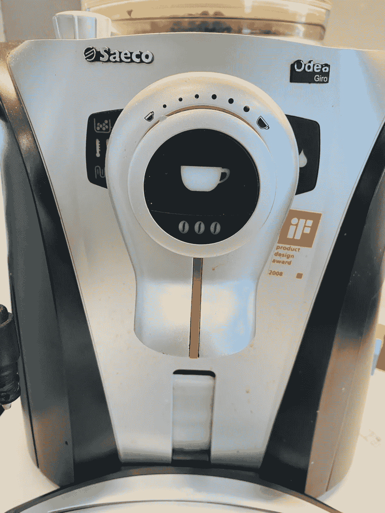
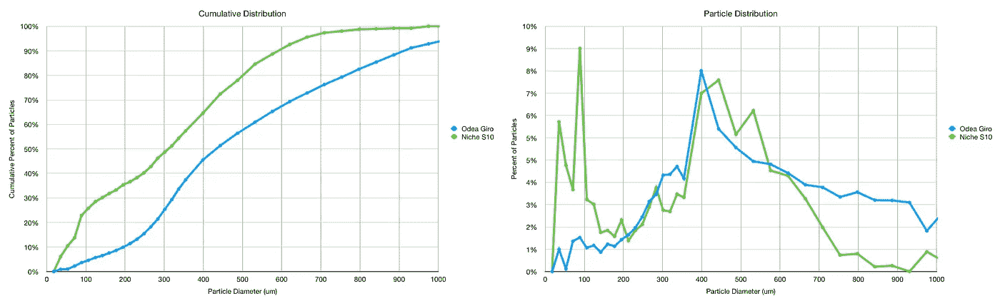
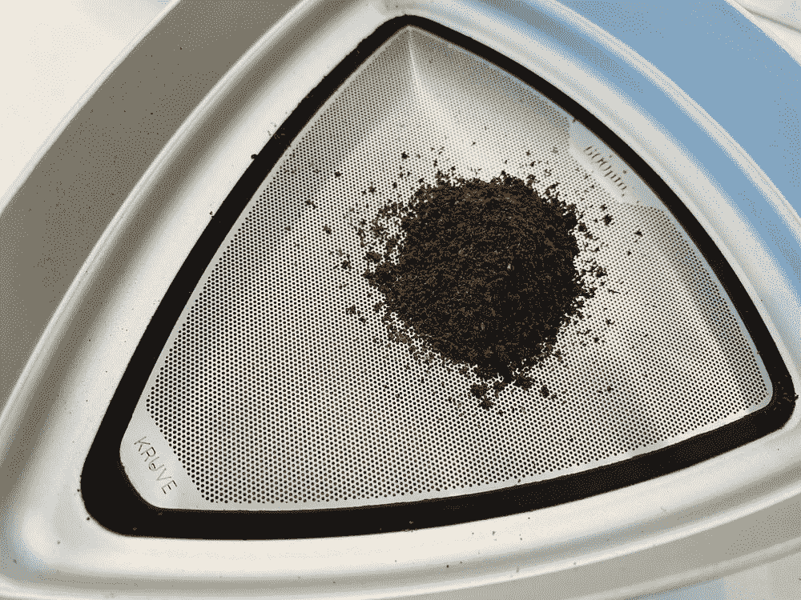
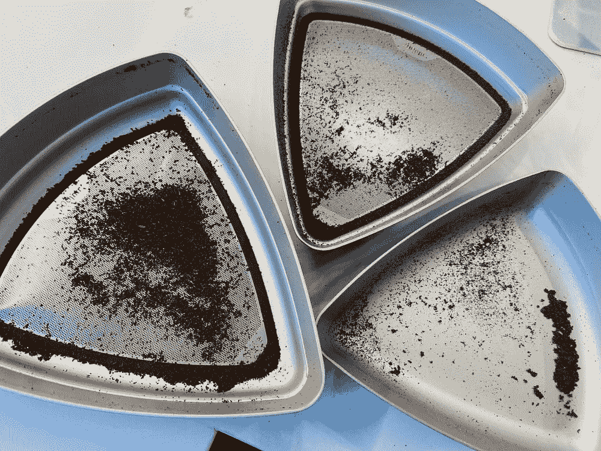
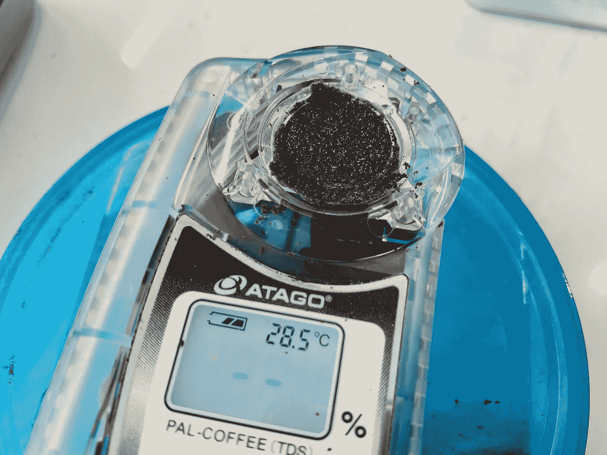
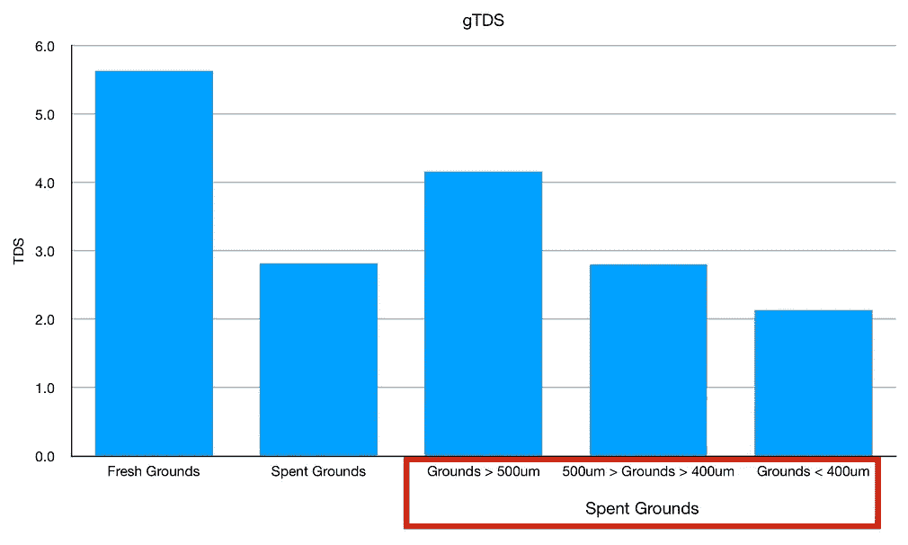
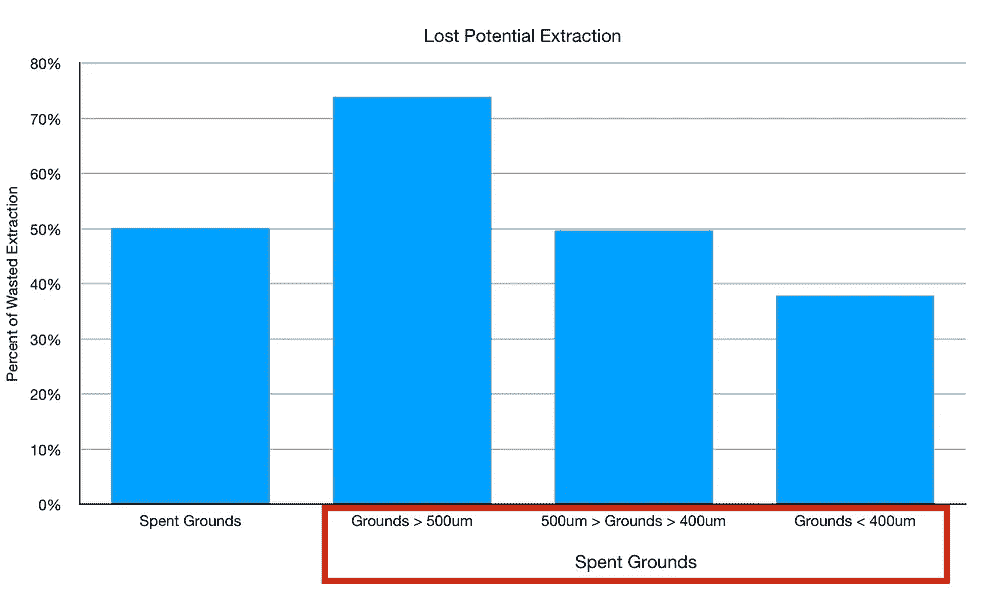

# 失去潜力的超自动咖啡

> 原文：<https://towardsdatascience.com/the-lost-potential-for-super-automatic-coffee-3d3376e6038?source=collection_archive---------36----------------------->

## 咖啡数据科学

## 对便利效率的一次短途旅行

十年前，我得到了我的第一台超级自动咖啡机。它有助于生产非常好的咖啡，而且它一直是一键解决方案的价值所在。然而，我一直很好奇它在咖啡提取方面的效率如何，所以我收集了一些数据。

我使用了一种叫做[研磨总溶解固体(gTDS)](/other-coffee-measurements-using-a-refractometer-85d0fb28d3d7) 的指标来评估拉球前后的效率。这个度量是使用折射仪测量的，但是将研磨物直接放在折射仪上并加水。

这一指标表明了在土壤中有多少是易溶的，这是衡量提取效果的一个指标。我测量了一个镜头的 TDS，然后计算提取率，结果是 12%左右。地面 TDS 是另一种方式来看待它。

# 数据

我特别好奇的是，如果提取率低的话，这些粉末中的一些是否可以以某种方式重新利用。看着研磨分布，我知道 Odea 有许多粗颗粒。

我曾试图修改 Odea 中的研磨机，把它拆开，把最好的设置改为最粗糙的。然后我可以做得更好一点，但是如果我做得再好一点，机器就会堵塞。

所以我拿了一个用过的冰球，用 400 微米和 500 微米的筛子筛选。

然后我测量了每个人的 GTD。

我测量了未举起的球和新鲜地面的 gTDS。作为参考，当我从我的杠杆机拉一杆，一个典型的 gTDS 读数低于 0.5。所有这些读数都非常高。

所有这些读数都表明大量的咖啡将被浪费掉，尤其是对于较大的颗粒(> 500 微米)。为了方便起见，我喜欢超级自动的，但我想确保我的下一个在煮浓缩咖啡时不会这么低效。不过，我怀疑让一台机器自动制作真正好的浓缩咖啡是下一个层次的挑战。

如果你愿意，可以在 [Twitter](https://mobile.twitter.com/espressofun?source=post_page---------------------------) 和 [YouTube](https://m.youtube.com/channel/UClgcmAtBMTmVVGANjtntXTw?source=post_page---------------------------) 上关注我，我会在那里发布不同机器上的浓缩咖啡照片和浓缩咖啡相关的视频。你也可以在 [LinkedIn](https://www.linkedin.com/in/robert-mckeon-aloe-01581595?source=post_page---------------------------) 上找到我。也可以在[中](https://towardsdatascience.com/@rmckeon/follow)关注我。

# [我的进一步阅读](https://rmckeon.medium.com/story-collection-splash-page-e15025710347):

[浓缩咖啡系列文章](https://rmckeon.medium.com/a-collection-of-espresso-articles-de8a3abf9917?postPublishedType=repub)

[工作和学校故事集](https://rmckeon.medium.com/a-collection-of-work-and-school-stories-6b7ca5a58318?source=your_stories_page-------------------------------------)

[个人故事和关注点](https://rmckeon.medium.com/personal-stories-and-concerns-51bd8b3e63e6?source=your_stories_page-------------------------------------)

[乐高故事启动页面](https://rmckeon.medium.com/lego-story-splash-page-b91ba4f56bc7?source=your_stories_page-------------------------------------)

[摄影启动页面](https://rmckeon.medium.com/photography-splash-page-fe93297abc06?source=your_stories_page-------------------------------------)

[使用图像处理测量咖啡研磨颗粒分布](https://link.medium.com/9Az9gAfWXdb)

[改进浓缩咖啡](https://rmckeon.medium.com/improving-espresso-splash-page-576c70e64d0d?source=your_stories_page-------------------------------------)

[断奏生活方式概述](https://rmckeon.medium.com/a-summary-of-the-staccato-lifestyle-dd1dc6d4b861?source=your_stories_page-------------------------------------)

[测量咖啡磨粒分布](https://rmckeon.medium.com/measuring-coffee-grind-distribution-d37a39ffc215?source=your_stories_page-------------------------------------)

[咖啡萃取](https://rmckeon.medium.com/coffee-extraction-splash-page-3e568df003ac?source=your_stories_page-------------------------------------)

[咖啡烘焙](https://rmckeon.medium.com/coffee-roasting-splash-page-780b0c3242ea?source=your_stories_page-------------------------------------)

[咖啡豆](https://rmckeon.medium.com/coffee-beans-splash-page-e52e1993274f?source=your_stories_page-------------------------------------)

[浓缩咖啡滤纸](https://rmckeon.medium.com/paper-filters-for-espresso-splash-page-f55fc553e98?source=your_stories_page-------------------------------------)

[浓缩咖啡篮及相关主题](https://rmckeon.medium.com/espresso-baskets-and-related-topics-splash-page-ff10f690a738?source=your_stories_page-------------------------------------)

[意式咖啡观点](https://rmckeon.medium.com/espresso-opinions-splash-page-5a89856d74da?source=your_stories_page-------------------------------------)

[透明 Portafilter 实验](https://rmckeon.medium.com/transparent-portafilter-experiments-splash-page-8fd3ae3a286d?source=your_stories_page-------------------------------------)

[杠杆机维修](https://rmckeon.medium.com/lever-machine-maintenance-splash-page-72c1e3102ff?source=your_stories_page-------------------------------------)

[咖啡评论和想法](https://rmckeon.medium.com/coffee-reviews-and-thoughts-splash-page-ca6840eb04f7?source=your_stories_page-------------------------------------)

[咖啡实验](https://rmckeon.medium.com/coffee-experiments-splash-page-671a77ba4d42?source=your_stories_page-------------------------------------)