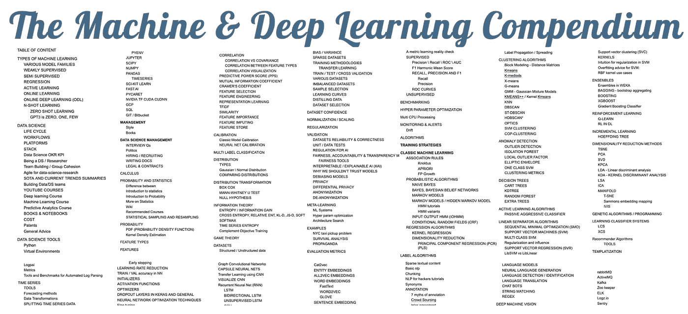

# 机器和深度学习纲要开卷

> 原文：<https://towardsdatascience.com/the-machine-deep-learning-compendium-open-book-7e7bd77fbc4f?source=collection_archive---------7----------------------->

来自机器和深度学习纲要的部分主题列表

## 数据科学家和 ML 工程师的综合资源。

大约一年前，我公布了《机器与深度学习概要》,这是一份在谷歌私人文档中整理的个人资源列表。为了支持这个新的接口，这个文档现在被废弃了。我决定把它作为一种教育工具来分享，以便让人们学习和联系我总结、引用和参考的所有伟大的作者。ML 概要包含 500 多个主题，在它的文档版本中，有 400 多页长。

> 请注意:我正在重组概要。我之所以做出如此巨大的努力，是因为该简编最初是我个人的资源列表，供我个人使用，没有任何标准化，也没有向公众开放的意图，目的是让读者轻松找到主题，并让参考作者从社区获得支持。如果你觉得某些内容需要改变，请联系我，我们会一起努力实现。我的意图是支持社区和作者，并教育人们。

Ori Cohen 博士拥有计算机科学博士学位，主要研究机器学习。他是《ML & DL 纲要》和《StateOfMLOps.com》的作者。他是 TLV 新遗迹公司的首席数据科学家，在 AIOps & MLOps 领域进行机器和深度学习研究。

联系人:[领英](https://www.linkedin.com/in/cohenori/) | [中](https://medium.com/@cohenori)|[OriCohen.com](https://www.oricohen.com/)|[book.mlcompendium.com](https://book.mlcompendium.com)