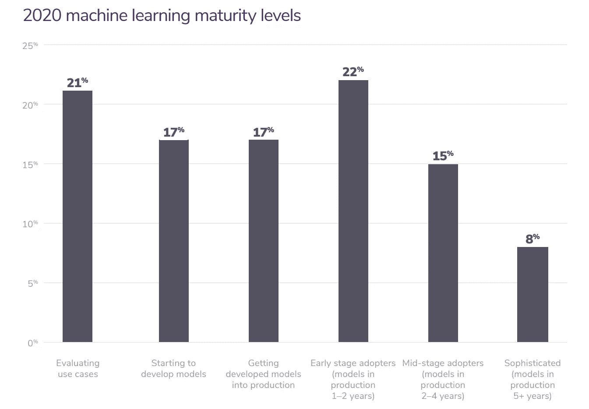
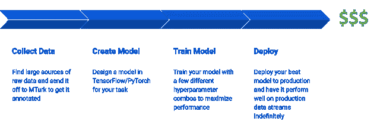
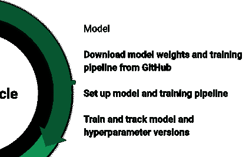
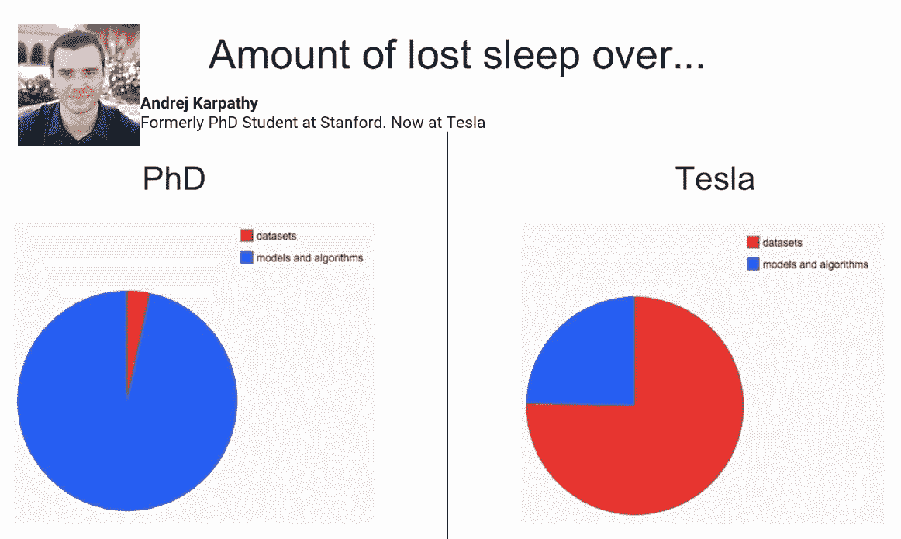
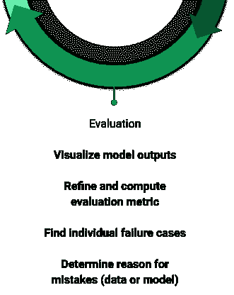
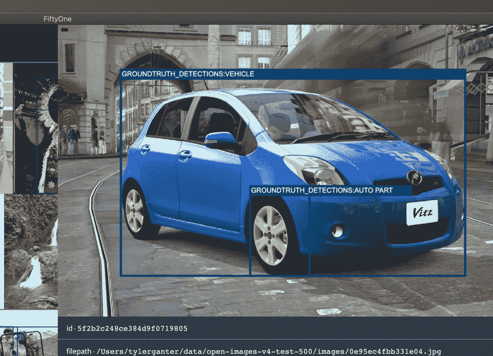
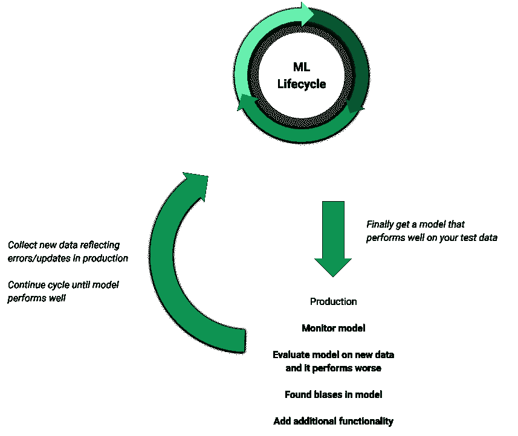
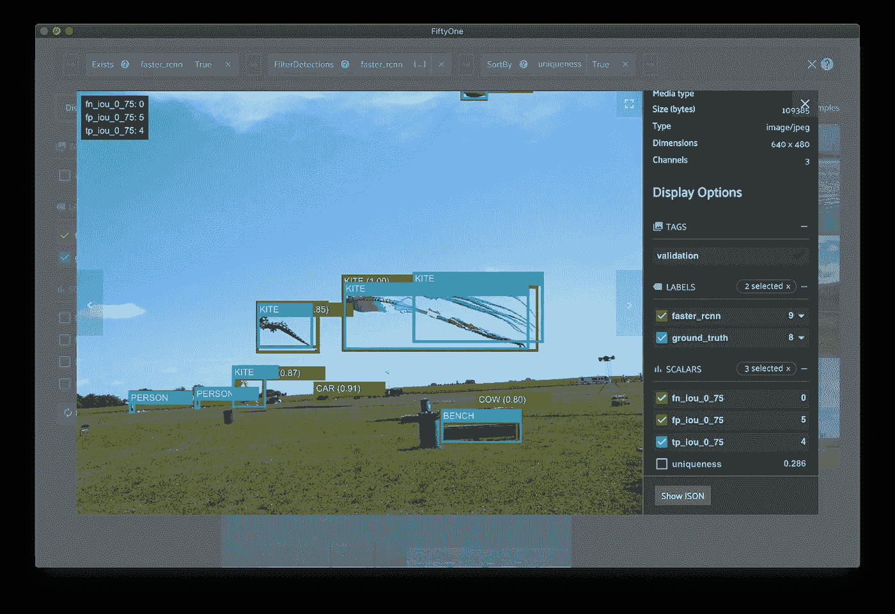

# 2021 年的机器学习生命周期

> 原文：<https://towardsdatascience.com/the-machine-learning-lifecycle-in-2021-473717c633bc?source=collection_archive---------5----------------------->

## 你实际上如何完成一个机器学习项目，有哪些工具可以帮助你完成每一步？


托尔加·乌尔坎在 [Unsplash](https://unsplash.com?utm_source=medium&utm_medium=referral) 上拍摄的照片

在这个时代，每个人[和他们的母亲](https://www.geekwire.com/2019/diy-ai-one-moms-quest-use-machine-learning-help-others-detect-rare-fetal-condition/)都在研究机器学习。似乎每个正在收集数据的公司都在试图找出一些方法来使用人工智能和人工智能来分析他们的业务，并提供自动化的解决方案。

> 到 2027 年，机器学习的市场价值预计将达到 1170 亿美元— [财富商业观察](https://www.globenewswire.com/news-release/2020/07/17/2063938/0/en/Machine-Learning-Market-to-Reach-USD-117-19-Billion-by-2027-Increasing-Popularity-of-Self-Driving-Cars-to-Propel-Demand-from-Automotive-Industry-says-Fortune-Business-Insights.html)

这种在 ML 中流行的涌入导致许多没有正式背景的新人进入这个领域。虽然越来越多的人对这个领域感到兴奋和学习是件好事，但需要清楚的是，在生产环境中整合一个 ML 项目并不是一件容易的事情。



图片来自基于 750 家企业的[算法 ia](https://algorithmia.com/) 得出的 [2020 年企业 ML](https://info.algorithmia.com/hubfs/2019/Whitepapers/The-State-of-Enterprise-ML-2020/Algorithmia_2020_State_of_Enterprise_ML.pdf) 状态

> 55%从事 ML 模型工作的企业尚未将其投入生产— [Algorithmia](https://info.algorithmia.com/hubfs/2019/Whitepapers/The-State-of-Enterprise-ML-2020/Algorithmia_2020_State_of_Enterprise_ML.pdf)

许多人似乎认为，如果您拥有训练模型所必需的数据和计算资源，那么 ML 项目是相当简单的。他们大错特错了。这种假设似乎会导致大量的时间和金钱成本，而无需部署模型。



ML 生命周期的天真假设(图片由作者提供)

在这篇文章中，我们将讨论 ML 项目的生命周期实际上是什么样子，以及一些帮助解决它的工具。

# 机器学习生命周期

事实上，机器学习项目并不简单，它们是在改进数据、模型和评估之间的循环迭代，永远不会真正完成。这一循环在开发 ML 模型中至关重要，因为它侧重于使用模型结果和评估来优化数据集。高质量的数据集是训练高质量模型的最可靠的方法。这个循环迭代的速度决定了你的成本，幸运的是有一些工具可以帮助你在不牺牲质量的情况下加速这个循环。


ML 生命周期的现实例子(图片由作者提供)

就像任何系统一样，即使部署的 ML 模型也需要监控、维护和更新。你不能只是部署一个 ML 模型，然后忘记它，期望它在余下的时间里像在真实世界的测试集上一样工作良好。部署在生产环境中的 ML 模型将需要更新，因为您会发现模型中的偏差，添加新的数据源，需要额外的功能，等等。这将您带回到数据、模型和评估周期。

截至 2021 年，深度学习已经突出了十多年，并帮助将 ML 带到了市场的前沿和中心。ML 行业经历了一个繁荣期，无数的产品被开发出来帮助创建 ML 模型。ML 生命周期的每一步都有一些工具，你可以使用它们来加速这个过程，而不会像那些 ML 项目永远见不到天日的公司一样结束。

接下来的部分将深入 ML 生命周期的每个阶段，并强调流行的工具。

# 阶段 1:数据


ML 生命周期中的数据(图片由作者提供)

虽然最终目标是一个高质量的模型，但训练一个好模型的命脉在于传递给它的数据的数量，更重要的是数据的质量。

ML 生命周期中与数据相关的主要步骤有:

**数据收集** —不管质量如何，尽可能多地收集原始数据。最终，只有一小部分数据会被标注，这也是大部分成本的来源。当模型性能出现问题时，根据需要添加大量数据是非常有用的。

*   [公共数据集列表](https://medium.com/towards-artificial-intelligence/best-datasets-for-machine-learning-data-science-computer-vision-nlp-ai-c9541058cf4f)

**定义你的注释模式**——这是生命周期中数据阶段最重要的部分之一，但经常被忽视。构造不良的注释模式将导致不明确的类和边缘情况，这使得训练模型更加困难。

例如，[对象检测模型](https://dhoiem.web.engr.illinois.edu/publications/eccv2012_detanalysis_derek.pdf)的性能很大程度上取决于大小、定位、方向和截断等属性。因此，在注记过程中包含对象大小、密度和遮挡等属性可以提供创建模型可以学习的高质量训练数据集所需的关键元数据。

*   [Matplotlib](https://matplotlib.org/) ， [Plotly](https://plotly.com/) —您的数据的绘图属性
*   [Tableu](https://www.tableau.com/) —分析平台，更好地了解您的数据

**数据注释**—注释是一个单调乏味的过程，需要连续几个小时执行相同的任务，这就是注释服务蓬勃发展的原因。结果是注释者可能会犯很多错误。虽然大多数注释公司保证最大误差百分比(例如 2%最大误差)，更大的问题是定义不良的注释模式导致注释者决定不同地标记样本。注释公司的 QA 团队很难发现这一点，这是你需要自己检查的事情。

*   [秤](https://scale.com/)、[标签盒](https://app.labelbox.com/signin)、[神童](https://prodi.gy/) —流行的注释服务
*   [土耳其机器人](https://www.mturk.com/) —众包注释
*   [CVAT](https://github.com/openvinotoolkit/cvat) — DIY 计算机视觉标注
*   [Doccano](https://github.com/doccano/doccano) — NLP 专用注释工具
*   [Centaur Labs](https://www.centaurlabs.com/) —医疗数据标签服务

**改进数据集和注释** —在尝试改进模型性能时，您可能会将大部分时间花在这里。如果你的模型正在学习但表现不好，罪魁祸首几乎总是一个包含偏见和错误的训练数据集，这些偏见和错误[为你的模型](/i-performed-error-analysis-on-open-images-and-now-i-have-trust-issues-89080e03ba09)创造了一个性能上限。改进您的模型通常涉及类似于[硬样本挖掘(添加与模型失败的其他样本相似的新训练数据)](https://youtu.be/hx7BXih7zx8?t=514)的事情，基于您的模型学习到的偏差重新平衡您的数据集，以及更新您的注释和模式以添加新标签并改进现有标签。

*   [DAGsHub](https://dagshub.com/) —数据集版本化
*   [第五十一](https://voxel51.com/docs/fiftyone/) —可视化数据集并发现错误

# 第二阶段:模型



ML 生命周期中的模型(图片由作者提供)

尽管这个过程的输出是一个模型，但理想情况下，您在这个循环中花费的时间最少。



在工业界，花在数据集上的时间比花在模型上的时间多。感谢安德烈·卡帕西([来源](https://medium.com/voice-tech-podcast/how-do-you-know-that-your-nlp-model-is-production-ready-2c6724e16de)，[原话](https://www.youtube.com/watch?t=512&v=y57wwucbXR8&feature=youtu.be))

**探索现有的预训练模型** —这里的目标是重用尽可能多的可用资源，为您的模型生产提供最佳开端。迁移学习是当今时代深度学习的核心租户。您很可能不会从头开始创建模型，而是对一个已经在相关任务中进行过预训练的现有模型进行微调。例如，如果您想创建一个面具检测模型，您可能会从 GitHub 下载一个预训练的人脸检测模型，因为这是一个更受欢迎的主题，有更多的前期工作。

*   [51 个模型动物园](https://voxel51.com/docs/fiftyone/user_guide/model_zoo/index.html)——在一行代码中下载并运行模型
*   [TensorFlow Hub](https://www.tensorflow.org/hub) —已训练的 ML 模型的存储库
*   [modelzoo.co](https://modelzoo.co/)—针对各种任务和库预训练深度学习模型

**构建训练循环** —您的数据可能在某些方面与用于预训练模型的数据不同。对于影像数据集，在为模型设置训练管道时，需要考虑输入分辨率和对象大小等因素。您还需要修改模型的输出结构，以匹配标签的类和结构。 [PyTorch lightning](https://github.com/PyTorchLightning/pytorch-lightning) 用有限的代码提供了一种扩大模型训练的简单方法。

*   [Scikit Learn](https://scikit-learn.org/) —构建并可视化经典的 ML 系统
*   [PyTorch](https://pytorch.org/) ， [PyTorch Lightning](https://github.com/PyTorchLightning/pytorch-lightning) ， [TensorFlow](https://www.tensorflow.org/) ， [TRAX](https://github.com/google/trax) —热门深度学习 Python 库
*   [Sagemaker](https://aws.amazon.com/sagemaker/) —在 Sagemaker IDE 中构建和训练 ML 系统

**实验跟踪**——整个循环可能需要多次迭代。你将最终训练许多不同的模型，所以在你跟踪模型的不同版本和超参数以及它所训练的数据时要小心谨慎，这将极大地有助于保持事物的条理性。

*   [张量板](https://www.tensorflow.org/tensorboard)，[权重&偏差](https://wandb.ai/)， [MLFlow](https://mlflow.org/) —可视化并跟踪模型超参数

*边注*:即使你认为你的任务是完全独特的，这里也有一些训练前的技巧可以考虑。我建议寻找方法，以无监督或半监督的方式预训练你的模型，仍然只使用总原始数据的一小部分进行微调。根据您的任务，您还可以查看合成数据来预训练您的模型。我们的目标只是获得一个已经学习了数据的良好表示的模型，以便您的微调数据集只需要用于训练几层模型参数。

# 第三阶段:评估



ML 生命周期中的评估(图片由作者提供)

一旦你设法得到一个已经学习了你的训练数据的模型，是时候深入研究一下，看看它在新数据上的表现如何。

评估 ML 模型的关键步骤:

[**可视化模型输出**](https://voxel51.com/docs/fiftyone/index.html) —一旦你有了一个训练好的模型，你需要立即在几个样本上运行它，并查看输出。在对整个测试集运行评估之前，这是发现您的培训/评估管道中是否有任何 bug 的最好方法。它还会显示是否有明显的错误，比如你的两个类是否被贴错了标签。

*   [OpenCV](https://opencv.org/) ， [Numpy](https://numpy.org/) ， [Matplotlib](https://matplotlib.org/) —编写自定义可视化脚本
*   [第五十一](https://voxel51.com/docs/fiftyone/) —将计算机视觉任务的输出可视化在图像和视频上

**选择正确的指标** —提出一个或几个指标有助于比较模型的整体性能。为了确保您为您的任务选择了最好的模型，您应该根据您的最终目标开发度量标准。当您发现想要跟踪的其他重要品质时，您也应该更新指标。例如，如果您想开始跟踪您的对象检测模型在小对象上的表现，请使用带有边界框< 0.05 的[对象贴图作为您的度量之一。](https://medium.com/datadriveninvestor/small-objects-detection-problem-c5b430996162)

虽然这些总数据集指标在比较多个模型的性能时很有用，但它们很少帮助理解如何提高模型的性能。

*   [Scikit Learn](https://scikit-learn.org/) —提供通用指标
*   [Python](https://www.python.org/) ， [Numpy](https://numpy.org/) —开发定制指标

**看看失败案例**——你的模型所做的一切都是基于它被训练的数据。因此，假设它能够学习一些东西，如果它的表现比你预期的更差，你需要看一看数据。查看模型运行良好的情况可能会很有用，但查看模型预测错误的假阳性和假阴性也很重要。在浏览了足够多的样本后，你会开始发现你的模型中的失败模式。

例如，下图显示了来自开放图像数据集的样本，其中一个误报显示为后轮。这个误报被证明是一个丢失的注释。验证数据集中的所有车轮标注并修复其他类似错误有助于提高模型在车轮上的性能。



泰勒·甘特([来源](/i-performed-error-analysis-on-open-images-and-now-i-have-trust-issues-89080e03ba09))的图片

*   [五十一](https://voxel51.com/docs/fiftyone/)、[水族馆](https://aquarium.gitbook.io/aquarium/)、[秤核](https://scale.com/nucleus) —数据集调试找错误

**制定解决方案** —识别失败案例是找出改进模型性能的方法的第一步。在大多数情况下，它会返回到添加训练数据，类似于您的模型失败的地方，但它也可以包括像更改管道中的预处理或后处理步骤或修复注释这样的事情。不管解决方案是什么，你只能通过理解模型的失败之处来解决问题。

# 第 4 阶段:生产



部署模型(图片由作者提供)

终于！您已经得到了一个在您的评估指标上表现良好的模型，在各种边缘情况下没有重大错误。

现在，您需要:

**监控模型** —测试您的部署，以确保您的模型在测试数据上仍然按照您的评估指标和推理速度等方面的预期执行。

*   [厚皮动物](https://www.pachyderm.com/)，[算法 ia](https://algorithmia.com/) ，[数据机器人](https://www.datarobot.com/)， [Kubeflow](https://www.kubeflow.org/) ， [MLFlow](https://mlflow.org/) —部署和监控模型和管道
*   [亚马逊网络服务](https://aws.amazon.com/machine-learning/)、[谷歌 AutoML](https://cloud.google.com/automl) 、[微软 Azure](https://azure.microsoft.com/en-us/) —基于云的 ML 模型解决方案

**评估新数据** —在生产中使用模型意味着您将频繁地通过从未测试过的模型传递全新的数据。执行评估和深入研究特定样本以查看模型在遇到任何新数据时的表现非常重要。

**继续理解模型** —您的模型中的一些错误和偏见可能根深蒂固，需要很长时间才能发现。您需要不断地测试和探测您的模型，寻找各种边缘情况和趋势，如果它们被客户发现，可能会导致问题。

**扩展能力**——即使一切运行完美，也有可能这种模式并没有像你希望的那样增加利润。从添加新的类、开发新的数据流，到使模型更有效，有无数种方法可以扩展您当前模型的功能，使它变得更好。任何时候你想改进你的系统，你都需要重启 ML 生命周期来更新你的数据，模型，并评估它以确保你的新特性如预期的那样工作。

# 五十一

以上是相当普遍和公正的，但我想告诉你一点点关于我一直在工作的工具。

许多工具存在于 ML 生命周期的不同部分。然而，有一个非常明显的工具缺乏帮助我在这篇文章中强调的一些要点。诸如可视化复杂数据(如图像或视频)和标签或编写查询来查找模型性能不佳的具体情况等工作通常通过手动脚本来完成。

我一直在 [Voxel51](https://voxel51.com/) 工作，开发 [FiftyOne](https://voxel51.com/docs/fiftyone/) ，这是一款开源数据可视化工具，旨在帮助调试数据集和模型，填补这一空白。FiftyOne 允许您在本地或远程的 GUI 中可视化您的图像和视频数据集以及模型预测。它还提供了强大的功能来评估模型，并为数据集或模型输出的任何方面编写高级查询。

FiftyOne 可以在笔记本上运行，所以请使用这款 [Colab 笔记本](https://colab.research.google.com/github/voxel51/fiftyone-examples/blob/master/examples/quickstart.ipynb)在您的浏览器中尝试一下。或者，您可以使用 pip 轻松安装它。

```
pip install fiftyone
```



来自[五十一](https://voxel51.com/docs/fiftyone/index.html)中对象检测模型和数据集的样本(图片由作者提供)

# **总结**

在所有试图将机器学习(ML)融入其业务的公司中，只有一小部分能够将模型实际部署到生产中。ML 模型的生命周期并不是一帆风顺的，而是需要在数据和注释改进、模型和训练管道构建以及样本级评估之间不断迭代。如果你知道自己在做什么，这个循环最终会导致一个生产就绪的模型，但它也需要随着时间的推移进行维护和更新。幸运的是，在这个过程的每一步都有无数的工具可以帮助你。