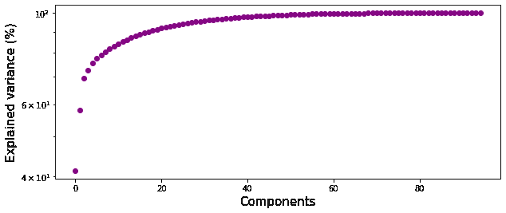
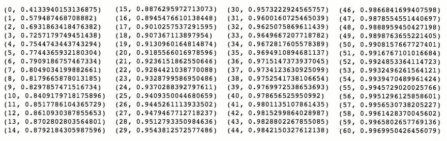
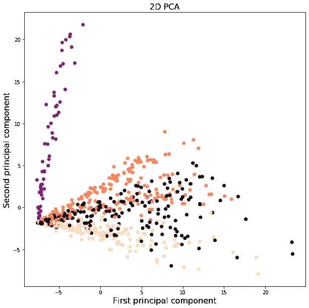
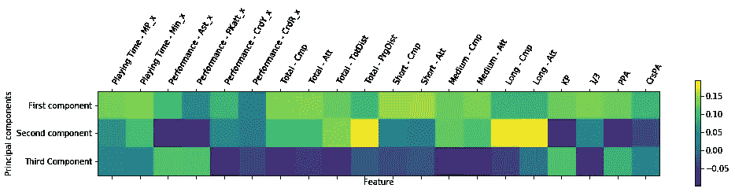
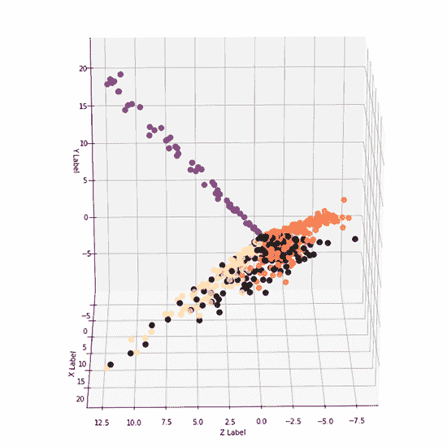
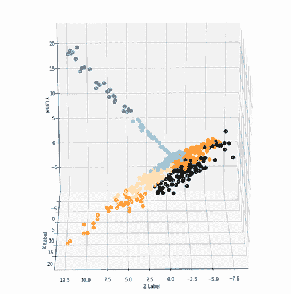

# 机器学习足球专家

> 原文：<https://towardsdatascience.com/the-machine-learning-soccer-pundit-b154c910f7eb?source=collection_archive---------60----------------------->

## 基于 PCA 和 K-Means 的大联盟球员聚类

Feo con Ganas 在 [Unsplash](https://unsplash.com/?utm_source=medium&utm_medium=referral) 上拍摄的照片。

最近，在 12 月，美国职业足球大联盟 2020 赛季在经历了艰难的一年后结束了。尽管如今我与这项运动有着遥远的关系，但作为一名巴西人，这个话题对我来说是非常自然的。自从我回到美国生活，我开始对这个国家的足球发展感兴趣，看到了作为一项运动和商业的巨大潜力。

读了关于总决赛的报道，我意识到我对球员们知之甚少，并决定探索一些，以了解更多关于联盟、球队、球迷和球员的信息。然而，我的目标不是肤浅的分析，只是熟悉基本的统计数据。为了更广泛地覆盖这个主题，我想创建一个模型来分析玩家并开发集群，同时基于几个标准，根据他们的游戏特征对他们进行分组。

我开始这个项目是从 sports-reference.com 那里获取数据，这个网站有很多可用的统计数据，并且允许非商业用途的抓取。我手动选择必要的 URL 并迭代它们，通过请求捕获，并用 BeautifulSoup 进行分析。虽然这些表不在页面的“正文”中，但是很容易在“评论”中找到它们，从而开始清理过程。使用 pandas，我为每个表创建了一个 dataframe，并将其全部合并为一个，涵盖了所有 680 名参加冠军赛的球员的数据。

从*标准统计、射门、传球、传球类型、射门、进球和射门创造、防守动作、控球、*和*守门员*表格中获取数据。

起初，我忽略了守门员数据，因为这些表不包含其他球员的数据，这与“射门”表不同，后者也包含守门员的数据。经过清理工作，包括删除也出现在表格中间的标题行，删除重复的列(例如，姓名、国家、位置、球队出现在所有原始表格中)，并固定位置列(具有双重位置的球员，如“MF，FM”留在列表中的第一个位置，在这种情况下是“MF”)，我添加了守门员数据。这些数据对于聚类阶段是必不可少的，提供了必要的材料来区分守门员和其他人。

之后，我选择了必要的列。我选择只选择与技能相关的统计数据，去掉诸如预测值、平均值或完全基于对手行动的数字等统计数据。我也没有使用年龄和出生地数据。我感兴趣的是最后一个赛季，而不是球员的未来。我选择分析他们在球场上的表现。

总的来说，我选择了 97 个特征，一些是明显的进球，助攻和传球完成，其他的则较少分析，如中场三分之一的传球和进攻传球的总距离。

累积方差和分量数。

累积解释方差:几乎 100%只有 50 个特征

在数据框架完成之后，主要是清理之后，我开始了集群阶段。我选择了两种方法:都使用 PCA(主成分分析)和 K-Means。我想执行可视化分析，并利用 Plotly 的悬停功能，该功能允许您将鼠标光标放在标记上，并获得图表上的点数据(我没有在这里上传文件，因为它们太大了)。我的想法是旅行的点，了解每个球员的主要特点。有 93 个特征，那是不可能的。这时候 PCA 就能帮上忙了。

由于每个要素都有自己的取值范围，因此有必要对这些要素进行缩放。由于数据是正态分布的，所以我使用了 StandardScaler。我还使用 sci-kit learn 的传统过程，创建一个管道来简化这个过程。

穿紫色的守门员；橙色的辩护人；身穿黑衣的中场队员；米色向前。

我检查了累计解释方差。通过将 93 个特征压缩成两个，有可能获得 69%的方差。有三个成分的，73%。对于我提出的想法，这就足够了。首先，我绘制了组件，用播放器数据中指示的标准字段位置来分隔颜色。有趣的是看到这三个组成部分的公式是如何考虑不同的特征，给与攻击、防御和决定性移动相关的特征赋予不同的值。

20 个特征及其在每个操作系统中的权重。

我还绘制了包含三个元素的 PCA。

从 K-means 开始，要做的第一件事是定义要构建的理想聚类数。“肘”和“轮廓得分”方法都显示了最小值，如 2 个集群(正如预期的那样，指示是在守门员和其他球员之间进行区分)。我对四个位置(守门员、后卫、中场和前锋)不感兴趣。于是，我再深入一点，选了六组。

形成的集群有:

1.  **前锋**——他们负责大部分进球，偷几个球，踢很多。他们的向前传球量相对较小，因为他们经常在靠近球门的地方接球，几乎没有前进的空间。他们很果断，很少触球就能取得很好的进攻效果。

例如:格亚西·扎尔德斯、劳尔·鲁伊迪亚斯、罗伯特·贝里

**2。伟大的防守者**——是玩得最多的一组，在所有组中累积最高分钟数。他们在前三分之一给对手施加压力，赢得许多铲球，使用空中游戏和头球——这些球员非常重要。

例如:弗朗西斯科·卡尔沃，贾德森，埃迪·塞古拉

**3。有一定攻击力的后卫**——一个包括很多边后卫，很少前锋的群体。他们利用场地的两侧，防守，也制造进攻动作。他们在大多数统计数据中表现平平，仅在助攻次数上表现突出。总的来说，这个小组非常同质，有几个亮点球员。

前:亚历山大·比特纳，迭戈·帕拉西奥斯，阮

**4。不是伟大的防守者**——另一个很少有前锋的群体，他们经常触球，并且有宁静以小速度比赛。从他们在防守场地接球开始，累积良好的前进距离。他们进了几个球。然而，他们不是很突出，有离散的统计数据。

例如:伦佐·詹布拉诺、盖迪翁·泽拉勒姆、伊富纳亚奇·阿查拉

**5。替补球员**——替补多的群体，主要是门将。他们在现场只积累了几分钟，由于参与有限，统计数据很差。

**6。普通组**——一个集合了各个位置球员的组，有很多不太突出的中场。在这个集群中，规则是不要突出。球员甚至进了几个球，但丢球多，收益少。

这项工作很有趣，因为它考虑到了球员的几个素质。只看偶像化统计中的领导人可能会扭曲解释。在各个领域表现出色的球员对于打造一支有竞争力的球队至关重要。例如，这种类型的工作可以扩大，考虑到更有经验的球员的工资和年轻球员的潜力。

[*访问我的 Github repo，获取使用的代码。*](http://github.com/banquinho) *你也可以看到我是如何使用层次聚类开发出同样的聚类过程的。*