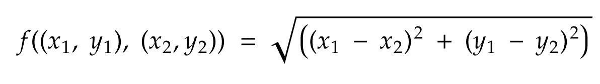

# 机器学习网络——姿态和动作估计器——第 1 部分

> 原文：<https://towardsdatascience.com/the-machine-learning-web-pose-and-actions-estimator-3203a0cf5f60?source=collection_archive---------9----------------------->

## 实时姿态估计 web 应用程序

我想我们都同意 2020 年是疯狂的一年。为了保持头脑清醒，我决定恢复一个老项目，这个项目是我很久以前和 [Omer Mintz](https://medium.com/u/4a54c45de2a6?source=post_page-----3203a0cf5f60--------------------------------) 一起使用 PoseNet 进行姿态估计的。

在恢复这个项目时，我想实现的目标变得很清楚:一个姿势和动作估计 web 应用程序，它依赖于机器学习能力来“学习”新动作，而不牺牲性能。

结果呢？嗯，你可以[看到自己](https://boostup-app.herokuapp.com/)。

代码也在这个 [Git 仓库](https://github.com/o-b-one/pose-estimator)上共享。

# TL；速度三角形定位法(dead reckoning)

我们使用由 PoseNet 预训练模型提供的数据输出，并应用一些数据工程。借助于一些数据探索，我们发现 KNN 机器算法可以很好地对结果进行分类。最终结果——一个评估参与者正在进行的锻炼的系统。

# 目标

*   一个 web 应用程序，知道如何估计参与者发现什么姿势(站，蹲，俯卧撑)。
*   计算参与者重复做了多少次。
*   高性能-渲染周期之间的延迟应该最小。
    应用程序的交互性不应受到影响。
*   易于扩展——可以学习新的动作，只需很少的改动
*   文本到语音转换—附加功能

# 堆栈

*   使用 TensorFlow 和 NumPy 的 Python 我们需要一种应用 ed a 和训练模型的方法。
*   React —用于渲染和交互式 web 应用程序。
*   张量流。JS—在浏览器上运行训练好的模型和 ML 算法。
*   画布—图像渲染和修改。
*   Web Workers—为了提高性能，以免主线程过载。

为了进行姿态检测，我使用了基于 RestNet50 架构的预训练模型 [PoseNet](https://www.tensorflow.org/lite/examples/pose_estimation/overview) 。

这个预先训练好的模型允许我们从图像中捕捉人的部分，稍后，它将被用于估计动作。

# 波塞尼特

PoseNet 是在计算机视觉下建立的用于姿势估计的预训练模型。
pose net 模型检测图像和视频中的人物，并提供确定在帧中发现的人的不同部分的能力。

PoseNet 库处理以下内容:

*   数据预处理(裁剪和调整大小，缩放像素值)
*   使用 TensorFlow 对给定数据应用模型。
*   从结果中解码关键点。
*   计算每个部分和整个姿势的置信度得分。

## 输入

PoseNet 模型将经过处理的摄像机图像作为输入。
为了更好的性能，我们将使用 224 X 224 像素的帧，这将允许我们处理和处理更少的数据。

*提醒 PoseNet 库将应用另一个大小调整(如前一节所述)。*

## 输出

具有以下内容的对象:

1.  分数——姿势的总体置信度分数
2.  关键点—17 个元素的列表，每个元素确定不同关键点(零件)的结果，这些关键点由 x 和 y 位置、零件名称和分数标识

```
{
  score: float;
  keypoints: Array<{ // Array of the 17 keypoints identified
    position: {x: float, y: float};
    part: EBodyParts; // the keys of the enum
    score: float;
  }>
}enum EBodyParts {
  nose,
  leftEye,
  rightEye,
  leftEar,
  rightEar,
  leftShoulder,
  rightShoulder,
  leftElbow,
  rightElbow,
  leftWrist,
  rightWrist,
  leftHip,
  rightHip,
  leftKnee,
  rightKnee,
  leftAnkle,
  rightAnkle
}
```

## 配置

我为 PoseNet 使用的配置是

```
architecture: 'ResNet50'
outputStride: 16
quantBytes: 4
inputResolution: {width: 224, height: 224}
```

*   架构— ResNet50 或 MobileNet v1
*   输出步幅—输出步幅决定了我们相对于输入图像大小缩小输出的程度。它影响层的大小和模型输出。输出跨度越大，网络和输出中各层的分辨率越小，相应地其精度也越低。在该实现中，输出步幅可以具有 8、16 或 32 的值。换句话说，输出步幅为 32 时，性能最快，但精度最低；输出步幅为 8 时，精度最高，但性能最慢。我的配置中的
    `Resolution = ((InputImageSize - 1) / OutputStride) + 1` `Resolution = ((224- 1) / 16) + 1 = 14.9375`


## ResNet50

PoseNet 允许我们使用两种模型架构之一:

1.  Mobilenet v1
2.  ResNet50

PoseNet 官方文档提到，Mobilenet v1 比 ResNet50 架构更小更快，精度更低，resnet 50 架构更大更慢，但精度更高。

为了更好地理解这两篇文章之间的区别，我强烈建议回顾这两篇文章:

*   [移动互联网 V1 架构](https://iq.opengenus.org/mobilenet-architecture/)
*   [ResNet50 架构](https://iq.opengenus.org/resnet50-architecture/)

# 从姿势到动作

为了将这些关键点(X 和 Y 坐标)转化为行动，我们将需要在这里应用更多的统计能力，因此，我决定使用聚类算法。更准确地说，是 KNN 算法

## 数据

*“信息是 21 世纪的石油，分析是内燃机。”SVP 高德纳公司的彼得·桑德加德在 2011 年说道。*

我们被数据平台所包围。
数据就躺在那里，等着我们去拾起、清理和使用。

当然，这个“捡起来”和“清理掉”的任务并不那么简单，工程师和数据科学努力获取好的数据来训练他们的模型。
我喜欢把它比作使用金属探测器的沙滩寻宝；你周围有许多金属物品，但在极少数情况下，你会发现一个真正的宝藏。

我的海滩是 youtube。更具体地说，youtube 上的个人训练视频，你可以和教练一起用同样的姿势训练。如此多的姿势，现在所需要的就是将视频分解成帧，并将它们分类成正确的姿势(例如，站立、蹲下、俯卧撑、下推)

为了将视频分解成帧，我使用了以下简单的 python 代码:

```
import os
import cv2def video_to_frames(video_path: str, destination: str):
    if not os.path.exists(os.path.join(os.getcwd(),'output')):
        os.mkdir(os.path.join(os.getcwd(),'output'))
    if not os.path.exists(destination):
        os.mkdir(destination) vid = cv2.VideoCapture(file_path)
    success,image = vid.read() # read the first image
    count = 0
    while success: # in case there are more images - proceed
        cv2.imwrite(os.path.join(destination,f'frame{count}.jpg'), image) # write the image to the destination directory
        success,image = vid.read() # read the next image
        count += 1
```

在我们提取帧之后，我们可以做一些分类工作。这项工作主要要求我们将文件移动到姿势的正确目录中——是“蹲”还是“站”的姿势。

现在我们已经完全准备好了我们的训练集，是时候训练我们的模型了。

对图像进行分类后，我们现在可以继续进行模型训练阶段。但是首先，我们需要考虑如何处理这些数据。

我们知道我们有一个分类问题，我们有一组想要输出到单个类的要素。

这些选项包括:

1.  深度学习分类:
    使用深度学习进行分类是现在的趋势，我们可以设置训练-测试集来识别姿势。像 YOLO 模型这样的东西可以帮助我们识别图像是蹲下、站立、俯卧撑，例如
    这里的主要问题是，它需要我们大量的图像来训练，非常高的计算能力，并且可能会导致我们的预测置信度较低(对于 F1 &的准确性分数)。
2.  PoseNet 结果之上的机器学习聚类算法:
    我们已经有了一个非常坚实的模型来识别参与者的不同身体部位。在这种情况下，我们可以获取一个图像，并将其转换为表格模型，但身体部位的 X 和 Y 位置并不那么有用，但它仍然是一个开始。

我们将进行第二种选择。
现在我们需要为聚类算法准备我们的特征。这意味着，我们需要角度，而不是用不同身体部位的 X 和 Y 位置。
这需要将基本的三角学公式从我的脑海中唤醒:

*   将 x 和 y 点转换为线条



*   计算线的顶角:

**左腋窝角** —利用左肩、左肘、左臀
**右腋窝角** —利用右肩、右肘、右臀
**左肩角** —利用左肩、右肩、左臀
**右肩角** —利用右肩、左肩、右臀
**左肘角** —利用左肘、左肩、 和左腕
**右肘角度** —利用右肘、右肩、右腕
**左臀角度** —利用左臀、右臀、左肩
**右臀角度** —利用右臀、左臀、右肩
**左腹股沟角度** —利用左臀、左膝、左脚踝
**右腹股沟角度** —利用右臀、右 右脚踝
**左膝盖角度** —使用左膝盖、左脚踝和左臀部，
**右脚踝角度** —使用右膝盖、右脚踝和右臀部


*   以弧度计算一个人姿势的斜率，这将有助于我们识别这个人是处于垂直位置还是水平位置。


最小斜率(斜率 1，斜率 2)被发现可以识别人的真实状态——整个身体的斜率，而不仅仅是身体的一部分

这使得我们能够得到这个数据集。

## 培训

在我们准备好数据集后，我们可以使用 PCA 进行一些分析，以获得主成分的可视化，这将有助于我们更加确定分类过程的成功率，并确定哪种算法最适合。

这里是 PCA 的 [google colab 项目，感谢](https://colab.research.google.com/drive/1LXxPzKJ37bA4Ptdb0Re-OGrqnX9ePGqN) [Ethel V](https://medium.com/u/940dad46ae8f?source=post_page-----3203a0cf5f60--------------------------------) 帮助设置和微调功能。


正如我们所看到的，集群是非常明显的分类(除了蹲和站在有一些工作要做的地方)。
我决定和 KNN 一起去应用分类。

KNN-k-最近邻，一种适用于分类和回归问题的监督统计算法，用于机器学习。

## KNN 流

1.  加载数据并初始化 K 个邻居
2.  对于数据中的每个示例:

*   计算数据集中的当前记录与查询示例之间的距离。
*   将示例的距离和索引添加到集合中

3.按距离从小到大对距离和索引集合进行排序。

4.从排序的集合中挑选前 K 个条目

6.获取所选 K 个条目的标签

7.结果:

*   在回归的情况下—返回 K 个标签的平均值。
*   在分类的情况下—返回 K 标签的模式。

KNN 符合我们的感谢:

*   清晰的类别分组——在大多数情况下，我们可以很容易地识别类别组。
*   一些异常值需要更复杂的处理——KNN 比其他分类算法(如 SVM)更好地处理更复杂的数据结构，尤其是非线性的数据结构。
*   我们数据集中的少量记录—基于神经网络的解决方案将需要
*   计算复杂性——与神经网络相比，KNN 在训练/评估时间上需要更少的计算能力。
    此外，由于我们可以选择的类数量很少，数据集中只有几百条记录，因此我们的性能不会大幅下降。

## 使用案例

使用 KNN，我们将使用角度和斜率对正确的动作进行分类。
稍后，通过 web 应用程序，我们将使用不同的动作组合来确定参与者进行的练习。

我们将在下一章回顾这一点以及更多。

希望你喜欢这篇文章，敬请关注😊

## 链接

*   [演示应用](https://boostup-app.herokuapp.com/)
*   [Git 仓库](https://github.com/o-b-one/pose-estimator)