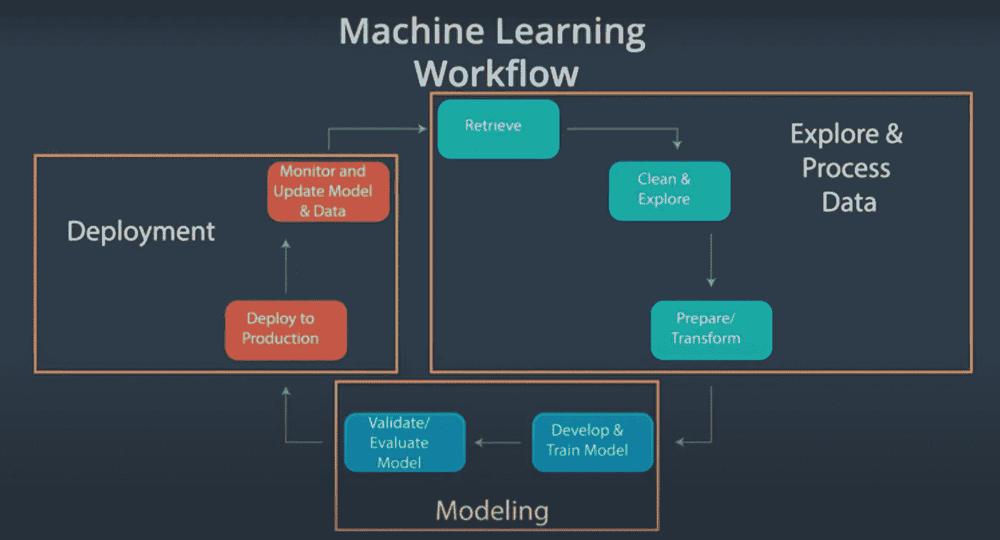

# 机器学习工作流程

> 原文：<https://towardsdatascience.com/the-machine-learning-workflow-1d168cf93dea?source=collection_archive---------27----------------------->

## 从开始到生产

[活动发起人](https://unsplash.com/@campaign_creators?utm_source=medium&utm_medium=referral)在 [Unsplash](https://unsplash.com?utm_source=medium&utm_medium=referral) 上的照片

## 介绍

第一次独自接近一个机器学习项目可能会非常困难。当你已经参加并通过了大量的在线评估时，你可能会很困惑，为什么在你开始解决问题的那一刻，你仍然觉得好像还缺少什么——这往往会导致一个恶性循环，一门又一门课程，却没有获得多少实际经验。

课程很棒，当我想提高某个领域的技能时，我喜欢参加课程，但随着时间的推移，我意识到课程只能做很多事情。我个人的看法是，机器学习领域的大多数课程都不能让你在现实世界中工作。这并不是因为这些课程不好，而仅仅是因为在实践环境中复制真实世界的场景非常困难。

学习环境和真实世界之间的内在差异通常是阻碍许多初学者学习机器的原因。出于这个原因，我非常强调在项目中工作，但在这个过程中努力复制行业的期望，因为这可以让你更好地准备好迎接行业的发展。

## 机器学习工作流

也就是说，我将向您介绍机器学习工作流，您可以使用它来处理您的项目。一定要注意，机器学习的工作流程可能会各不相同，因此，我将使用来自*成为机器学习工程师 Nanodegree* 【见下图】的一个，它受到了亚马逊、谷歌和微软等大公司的启发。

**来源**:成为机器学习工程师 Nanodegree

上图显示了我们将在本文中探索的机器学习工作流由 3 个组件组成；1)数据探索和处理 2)建模 3)部署。让我们介绍一下每个组件，以便更好地了解正在发生的事情。

## 数据探索和处理

如果你给一个机器学习模型喂垃圾，你应该期待收到垃圾作为回报。因此，需要做大量的工作来确保数据的高质量，因为这将为建模提供一个良好的起点。在机器学习工作流程中，这个过程往往会占用最多的时间。

**数据检索**

在我们开始任何类型的机器学习项目之前，我们首先需要获得高质量的数据。有几种方法可以获取数据，如利用公共数据集、数据搜集、产品干预、不同获取策略的组合等。

</always-remember-data-comes-before-the-science-681389992082>  

**数据清理** **&探索**

数据很少处于干净的状态，例如，一些要素可能有很大一部分缺失值，或者可能存在应该处理的异常值。与这一过程相结合的是数据探索，它用于获得对数据的更深入的理解。

<https://medium.datadriveninvestor.com/what-do-data-scientists-even-do-fb5d3bef30fc>  

**数据准备/特征工程**

准备数据集以使用机器学习模型是困难的，因为它需要直觉、数据操作技能和领域专业知识。此外，没有两个数据集是完全相同的，这意味着可能在一个项目中有效的技术不一定在另一个项目中有效(尽管它可以用作参考点)。

</5-best-practices-for-feature-engineering-in-machine-learning-projects-e0a4e74fc4fa> [## 机器学习项目中特征工程的 5 个最佳实践

towardsdatascience.com](/5-best-practices-for-feature-engineering-in-machine-learning-projects-e0a4e74fc4fa) 

## 建模

这可能是 ML 工作流程中最令人兴奋的部分，如果我们参加了 Kaggle 竞赛或类似的活动，我们中的许多人都会接触到它。

**模型开发/培训**

模型开发/训练阶段涵盖了向机器学习模型输入其可以学习的数据的任务。机器学习模型处理大量数据的能力使企业能够为过去一度无法解决的问题提出解决方案。

<https://github.com/kurtispykes/ml-from-scratch>  

**模型验证/评估**

我们使用一个实数来评估我们的机器学习模型的性能(即 RMSE、MAE、准确度)。一旦完成这些，我们就可以决定模型是否如我们所愿地执行，或者它是否需要更多的工作来从模型中获得期望的行为-这个过程将包括查看模型所犯的错误，并判断如何改进它们。

</systematically-improving-your-machine-learning-model-41d327adf347>  

## 部署

出于这样或那样的原因，我参加的许多课程都没有涉及到部署——我不得不明确地参加非常关注这个主题的课程来学习它。我参加的课程有:

*   [成为机器学习工程师(Udacity)](https://www.udacity.com/course/machine-learning-engineer-nanodegree--nd009t)
*   [部署机器学习模型(Udemy)](https://www.udemy.com/course/deployment-of-machine-learning-models/)

**模型部署**

部署仅仅是让用户可以访问机器学习模型。在生产环境中，模型可以接收输入，然后将输出返回给使用系统的最终用户。例如，用户可能会传入他们看到的某处房产的详细信息，模型会处理这些输入并返回价格估计。

</serving-a-machine-learning-model-via-rest-api-5a4b38c02e90>  

**模型监控&更新模型和数据**

模型监控包括密切跟踪机器学习模型在生产中的表现。这样做是为了让人工智能团队能够在潜在问题对业务造成影响之前发现并处理它们。

此外，模型和数据在整个生产过程中都需要更新。这是在数据模式突然改变的情况下完成的，这可能损害模型的性能。

<https://blog.datatron.com/model-management-for-machine-learning/>  

## 包裹

行业标准与课程中所教授的内容之间存在巨大差距，这是完全可以理解的，因为在实践中复制真实世界的环境可能非常具有挑战性。然而，这并不意味着你的发展应该受到影响。我鼓励每个从业者投身于他们感兴趣的项目，但也要了解工作环境中到底发生了什么，这样他们就可以复制在行业内工作的感觉。

感谢您的阅读！

如果你喜欢这篇文章，请通过订阅我的**免费** [每周简讯](https://mailchi.mp/ef1f7700a873/sign-up)与我联系。不要错过我写的关于人工智能、数据科学和自由职业的帖子。

## 相关文章

</essential-skills-for-machine-learning-engineers-720938c6e12b>  </how-to-create-a-compelling-github-portfolio-a229e7472a92> [## 如何创建引人注目的 Github 产品组合

towardsdatascience.com](/how-to-create-a-compelling-github-portfolio-a229e7472a92)