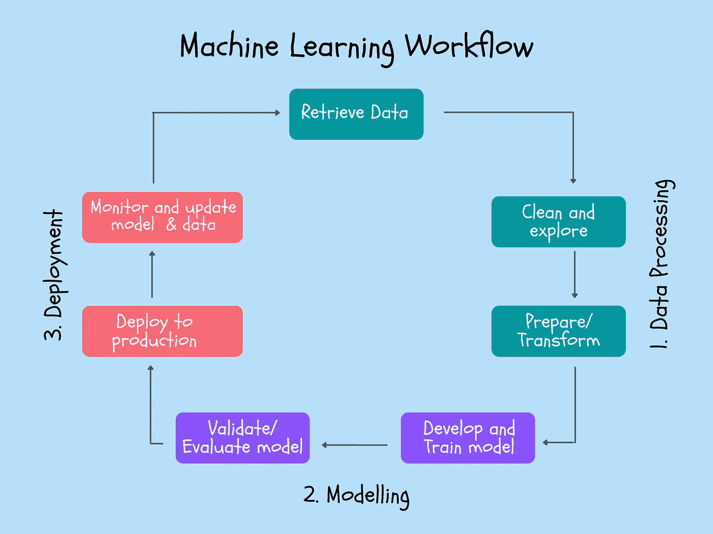

# 机器学习工作流程解释(以及你现在如何实践它)

> 原文：<https://towardsdatascience.com/the-machine-learning-workflow-explained-557abf882079?source=collection_archive---------9----------------------->

## 这三个组成部分，包括大多数 ML 课程遗漏的部分

茱莉亚·M·卡梅隆摄于 Pexels

大部分新手在闯入 AI 行业的时候都很纠结。为什么？在那之前，他们所学的一切都来自于旨在教授理论和一些玩具项目的机器学习课程。

这场斗争主要是因为现实世界中的期望与他们所学到的东西之间的差距。可悲，但却是事实。

不要误会我的意思，那些课程很重要，而且当我还是初学者的时候，我已经完成了我的一份工作。但更重要的是尽早与行业预期保持一致。

机器学习工作流程可能因公司而异，因此为了获得最准确的工作流程，让我们看看几家科技巨头是如何定义它们供自己使用的。

# 借用这三家科技巨头的专业知识

亚马逊、谷歌和微软是三大科技巨头，它们在其产品中率先推出了机器学习。这三家公司都有云平台，可以帮助其他公司和个人用户充分利用机器学习。

在我目前的工作中，我们使用微软 Azure 作为我们的生产环境。类似地，大多数公司使用这些平台中的任何一个。他们的平台是最接近真实生产环境的可用资源。

为了了解这些公司的典型工作流程，让我们来看看他们自己的文档:

1.  亚马逊网络服务讨论了其对[机器学习工作流程](https://docs.aws.amazon.com/sagemaker/latest/dg/how-it-works-mlconcepts.html)的定义:它概述了从获取、清理、准备数据、训练模型到最终部署模型的步骤。
2.  谷歌云平台讨论他们对[机器学习工作流程](https://cloud.google.com/ml-engine/docs/tensorflow/ml-solutions-overview)的定义。Google，除了上面的步骤，还谈到了管理模型的版本。
3.  微软 Azure 讨论了他们对[机器学习工作流程](https://docs.microsoft.com/en-us/azure/machine-learning/service/overview-what-is-azure-ml)的定义。微软虽然类似于亚马逊和谷歌的典型工作流程，但强调 ML 生命周期管理。

我们可以得出结论，对于这三家公司来说，典型的工作流或多或少是相同的，因此我们使用他们的工作流的组合来派生我们的工作流。

让我们深入研究这些组件，好吗？

作者创作的插图

# 1.数据处理

你可能听说过，如果你有正确的数据，80%的战斗就胜利了。

我可以证实那是真的。

在我们处理的大多数初学者问题中，数据是放在银盘上交给我们的(阅读 Kaggle 数据集)。因此，我们从来没有经历过获取它们的麻烦。

有时候你很幸运，客户一直维护着一个高效的数据库系统。抱歉戳破了泡沫；我还没遇到过这样的客户。

该组件可进一步分为:

*   **检索数据** —数据不断流入业务；数据工程师将设计数据库，并建立一个有效的系统来存储和检索用于建模目的的数据。
*   **清理和探索数据** —原始数据需要清理。探索数据中的模式可以帮助数据科学家确定模型的特征。必须从数据中剔除异常值和异常值。
*   **准备数据—** 大多数 ML 模型都需要标准格式的数据，因此必须对数据进行转换，然后拆分成训练、验证和测试数据集。

## 你现在可以如何练习:

您已经从课程和其他博客帖子中听到了这些步骤。差距仅在于**检索数据。跳过这一步很有诱惑力，但如果你从事这项工作，你会很快在所有有抱负的数据科学家和机器学习工程师中脱颖而出。**

*   **至少尝试一次数据网络搜集。这个网页抓取课程会给你一个好的开始。浏览 Twitter、Reddit、Wikipedia 或任何可能的网站的经历可以给你获取数据所急需的信心。**
*   **学会给图像做注解。**录制视频或通过 YouTube 获取它们相当容易。然后视频可以转换成一系列图像，但是每个人都应该至少经历一次[图像注释过程](/how-to-label-images-for-object-detection-step-by-step-7ee317f98583)。每当轮到你做计算机视觉项目时，它都会很有帮助。
*   **调查收集数据。下次你的朋友让你填写调查问卷时，注意一下问卷是如何设计的。你需要了解如何用更少的问题收集最重要的数据点，照顾受访者的隐私。**

其中一些是令人沮丧和乏味的经历，但是，嘿，如果你自己从来没有做过，你怎么能从别人那里得到呢？

这些是我为熟悉数据组件而采取的一些步骤，但是您永远不会局限于这些建议；我知道你明白了。

# 2.系统模型化

这不是你的强项吗？

大多数人认为工作流程的这个阶段最有趣，我也不例外。我喜欢训练、调整和验证模型。即使在谷歌、亚马逊和微软，这些仍然是工作流程的重要组成部分，这并不奇怪。

建模组件可以进一步分为:

*   **开发和训练模型—** 我们使用各种算法，在训练数据集上建立多个模型。scikit-learn、TensorFlow 和 PyTorch 等常见库几乎为每种算法都构建了函数，但这不应该阻止您了解幕后发生的事情。
*   **验证和评估模型—** 我们使用验证数据集来验证和调整我们构建的模型。同样，我们使用测试数据集来评估和选择手头问题的最佳模型。

你可能已经完成的课程为你进入这个行业做了很好的准备，我甚至没有看到差距。

## 你现在可以如何练习:

如果你学过一些课程，我相信你会很清楚这些。老实说，除了吴恩达在他的课程里教的东西，我没有什么可补充的[。](https://bit.ly/courseraDLV2)

这里没有绒毛；让我们继续讨论大部分课程遗漏的部分。

# 3.部署

我曾经认为作为一名新生，我不需要知道这些概念，但结果是我的老板让我在新工作几周内就开始部署工作。

事实是，95%的课程都忽略了这一部分。也许教授部署并不容易，但我们应该付出额外的努力来理解和学习这些概念。

你建立的高度精确的模型——没有人会使用它，除非你部署它们。这应该激励你学习和掌握机器学习工作流程的最后一个组成部分。

这一部分可以进一步细分为:

*   **部署到生产** —部署就是通过 web 或软件应用程序向用户提供模型。
*   **监控和更新数据** —久而久之，数据中的模式可能会出现季节性或突发性变化，从而导致模型性能下降。在这种情况下，需要更新模型，回到检索数据阶段，从而完成工作流的循环。

## 你现在可以如何练习:

大多数初学者，包括我过去的自己，都很难接触到部署，因为我们无法在家里复制业务生产环境。

唯一的出路是采用云计算。大多数公司使用云，这是我整个工作流程背后的动机。

*   **学习使用像 streamlit 这样的简单库来构建最终用户友好的机器学习应用**。[这几乎不会花你一天的时间。](https://pub.towardsai.net/how-i-build-machine-learning-apps-in-hours-a1b1eaa642ed)
*   **随便挑个云平台。**如果没有什么偏好，就挑 Google 云平台。我使用它们是因为除了免费等级之外，它们还提供 300 美元的免费积分。使用这些来让自己熟悉这个平台。
*   **在云中重做一些旧项目。**特别要尝试通过云部署让您的项目对最终用户可用。
*   **从平台上提供的课程和文档中获取基于云的部署技能**。如果你选择了谷歌云，这里有[一个贯穿整个平台的数据工程和机器学习的优秀专业](https://bit.ly/courseraGCPV2)。

# 最后的想法

当我最终进入数据科学领域时，我努力跟上行业的期望。甚至几年后，我看到大多数初学者都在类似地挣扎。

出现这种情况的主要原因是课程中教授的内容和行业中使用的内容之间的差距。因此，我们研究了谷歌、亚马逊和微软等科技巨头的工作流，以得出行业中实践的典型机器学习工作流。

这些组件是:

*   检索数据
*   浏览和清理数据
*   准备数据
*   开发和训练模型
*   验证和评估模型
*   部署到生产环境
*   监控和更新模型

我们进一步深入研究了如何练习这些步骤。当你经历工作流程时，你可能已经意识到你的弱点；我唯一的要求是尽快开始研究它们。

我希望这篇文章对你有用。我希望你喜欢读这篇文章，就像我喜欢为你写这篇文章一样。我很感谢 LinkedIn 上的各种反馈[，所以请在这里随意打招呼或](https://www.linkedin.com/in/arunn-thevapalan/)[关注我。](https://arunnthevapalan.medium.com/)

我迫不及待地想看到你成功！

*作为披露的提示，这篇文章可能会有一些附属链接来分享我用过的最好的资源，而不会给你带来额外的费用。感谢您的支持！*

*如果你想获得更多关于数据科学、真实体验和学习的有用见解，可以考虑* [***加入我的电子邮件好友私人名单*** *。*](https://friends.arunnthevapalan.com/)