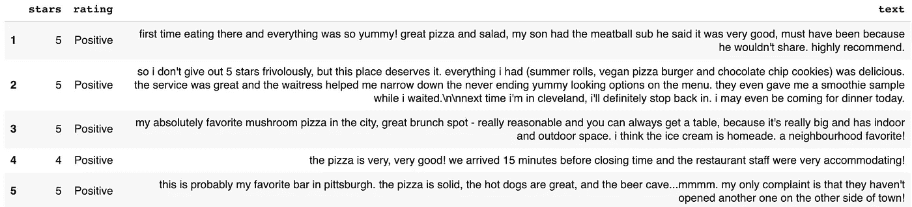
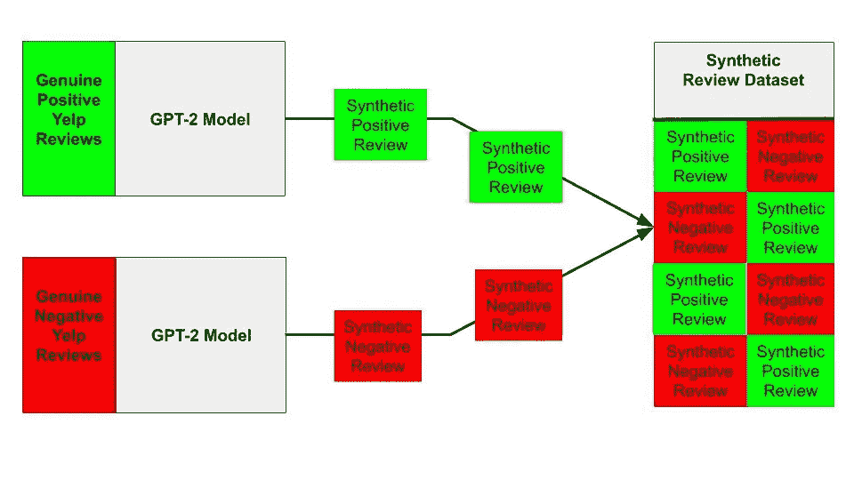
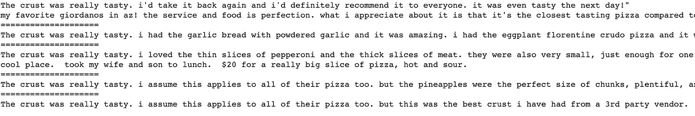
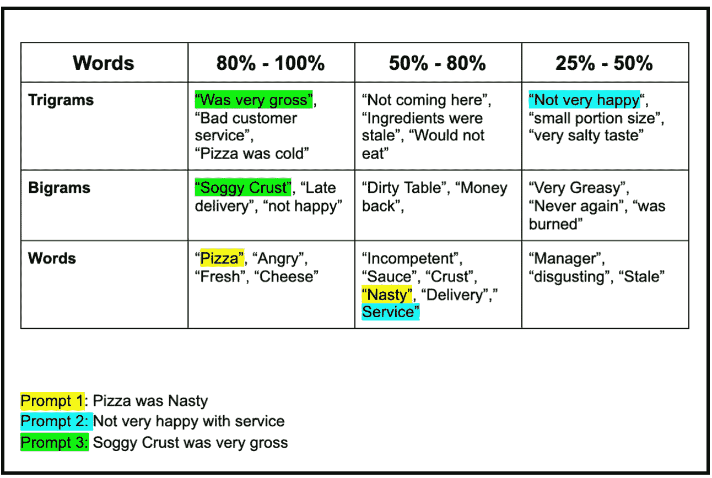
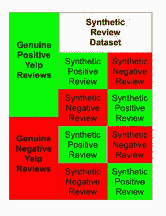
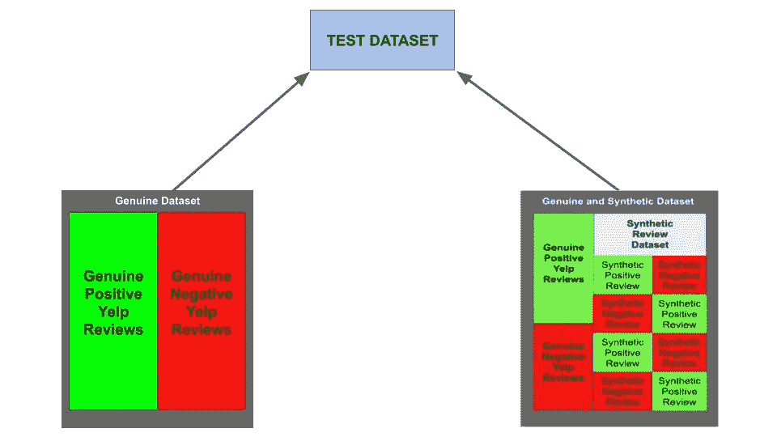
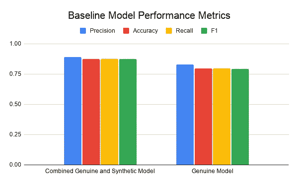
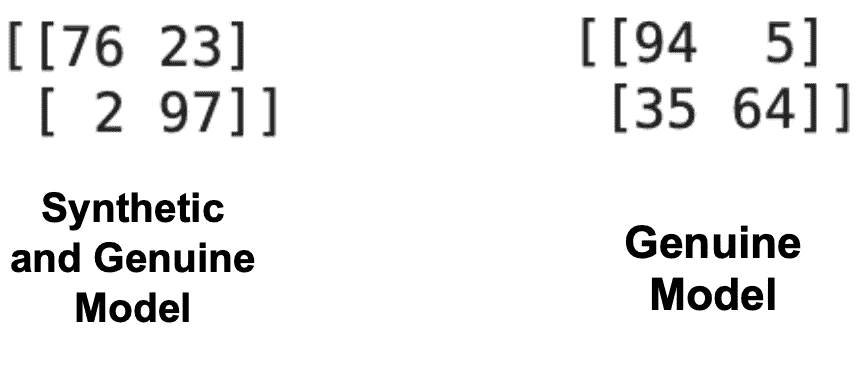

# 合成数据的魔力

> 原文：<https://towardsdatascience.com/the-magic-of-synthetic-data-using-artificial-intelligence-to-train-artificial-intelligence-with-cebe0d50a411?source=collection_archive---------20----------------------->

## 用人工智能训练人工智能用 GPT-2


马库斯·沃利斯在 [Unsplash](https://unsplash.com/s/photos/lights?utm_source=unsplash&utm_medium=referral&utm_content=creditCopyText) 上的照片

最近在做一个 NLP 项目时，我遇到了一个问题。我没有足够的数据。分类模型使用输入数据来预测后续输入数据落入预定类别的可能性。为了执行有效的分类，这些模型需要大数据集进行训练。因此，我创造了一种使用人工智能生成相关合成数据的方法，这将提高我的分类模型的性能。这种方法使得我的基线模型的**精度提高了 9.49%** 和**精度提高了 7.63%。**

# 合成数据背景

利用合成数据来提高机器学习模型的性能正在成为一种常见的做法。据报道，壳牌正在使用合成数据建立模型，以检测很少发生的问题；例如，壳牌公司创造了合成数据来帮助模型识别恶化的石油管道。(Higginbotham，2020)机器学习实践者的常见做法是通过旋转、翻转和裁剪图像来生成合成数据，以增加图像数据量来训练卷积神经网络。

# 合成数据的商业价值

2018 年，美国公司在数据采集和管理、处理和分析这些数据的解决方案上花费了近 192 亿美元。(Sweeney，2019)本文讨论的技术可以通过减少训练高性能 NLP 分类模型所需的数据量来降低数据采集的成本。这种技术也可以用于通过扩展训练数据集来改进当前的模型。这些好处可以使公司和组织更有效地实现他们的目标，同时最大限度地降低成本。

# GPT-2

我决定使用 OpenAI 的 GPT-2 模型来生成我的合成数据。GPT-2 模型是一个大规模的基于转换器的语言模型，它是在一个大型文本语料库(800 万个高质量网页)上预先训练的。GPT-2 的目标是在给定某个文本中所有先前单词的情况下预测下一个单词。(拉德福德，2020 年)

# Yelp 开放数据集



***图 Yelp 披萨点评数据子集样本/来源:“作者图片”***

我决定使用 Yelp 开放数据集来获取我的数据。Yelp 开放数据集包含各种商业和服务的匿名评论。我创建了披萨店评论的两个数据子集。在这个数据子集内，我将评级分为“正面”数据子集和“负面”数据子集。4 星或 5 星的评级被归类为“积极”。1 星或 2 星的评级被归类为“负面”。我的阴性数据集包含 225 个观察值，阳性数据集也包含 225 个观察值。

# 生成综合审查数据



图 2: ***综合评论生成及数据流/来源:图片作者***

我的第一个任务是创建两个 GPT-2 模型，用真正负面的 Yelp 披萨评论数据训练其中一个，用真正正面的 Yelp 披萨评论数据训练另一个。然后，我让这些模型生成合成的负面和正面评论数据，这些数据被合并成一个单一的数据集。

# 微调 GPT-2

GPT-2 模型设置/来源:作者图片

我选择用 3.55 亿参数的 GPT-2 模型生成综合评论。我使用了 GPT-2 生成方法来定制将要生成的合成数据的类型。

```
gpt2.generate(sess, run_name = "low-1", length=150, temperature=.9, prefix="The crust was really tasty", nsamples=500, batch_size=5)
```

我用 GPT-2 生成方法调整了以下参数来创建我的响应:

**长度** =该设置合成审查的长度。

温度 =设定合成评论的创意程度。温度越高，综合评论越有创造性。

**前缀** =前缀是新 GPT 协议模型将用于生成审查的提示

**nsamples** =设置特定运行将生成的审核数量。



***图 3:GPT-2 生成的提示样本/来源:图片作者***

# 生成 GPT-2 提示的艺术



***表 1:GPT-2 即时援助工具样本/来源:作者图片***

在生成综合评论时，我希望确保这些回答是在真实数据的基础上展开的，并且生成的回答是真实数据的有力代表。所以当我写前缀提示时，我使用了真实数据集中大量出现的单词。我编写了一个 Python 函数，将真正的数据集语料库组织成三元模型(3 个单词的连续组合)、二元模型(2 个单词的组合)和单词。该函数还提供计数，并对这些单词和组合的出现次数进行数字排序。

# 将合成数据与真实数据相结合



图 4: ***合成数据与真实数据串联/来源:图片作者***

在我创建了合成的正数据集和负数据集之后，我使用 Python Pandas 来连接真正的负数据集和正数据集。

# 性能试验



图 5: ***基线模型测试/来源:图片作者***

为了确保对性能指标进行公平和平等的分析，我使用 scikit-learn train_test_split 方法建立了一个由 198 个观察值组成的单一基础事实测试集，这些观察值来自 Yelp 开放数据集的一个完全独立的数据集。然后，我使用多项式朴素贝叶斯分类算法在两个数据集上建立了两个基线模型。这两个数据集是:真正的 Yelp 比萨饼评论数据集(450 个观察值)和组合的真正的和合成的 Yelp 评论数据集(11，380 个观察值)。

# 性能测试结果



***表 2:基线模型性能指标/来源:作者图片***

我选择 Precision、Accuracy、Recall 和 F1 作为三个基线模型的性能指标。总体而言，组合(合成和真实)模型在所有性能指标上都优于真实模型。例如，组合(合成和真实)模型中的精度从真实模型中的精度分数 0.8281 上升到 0.8913。



图 6: ***基线模型混淆模型分析结果/来源:图片作者***

我还进行了混淆矩阵分析。与合成的和真实的模型相比，真实的模型有更多的真实肯定，但更少的真实否定。与真实模型相比，合成和真实模型具有更多的假阳性，但更少的假阴性。

# 经验教训

## 更多的合成数据并不总是好的

正如您在我的测试中看到的，我添加了近 11，000 个合成数据观察来实现我的最佳性能模型。当我超过 11，000 次合成观察时，性能实际上下降了。因此，请务必找到合成数据与真实数据的最佳比例，以确保您拥有性能最佳的模型。

## 小心测试中的数据泄露

当我最初用 sklearn train_test_split 创建我的测试数据集时，我使用的是真正的数据集。我的组合模型(合成的和真实的)达到了 0.97 或更高的分数。然后，我发现这些模型是通过 GPT-2 模型根据测试数据无意中训练出来的。这是因为在应用 train_test_split 方法之前，GPT-2 模型可以访问整个数据集。为了解决这个问题，我回到 Yelp Pizza 评论数据集，建立了一个与我的训练数据集完全不相关的观察数据集。分数做了相应的调整，这个问题得到了解决。

## 试验 GPT-2 提示创建参数

新 GPT 协议生成方法允许您调整生成的综合评论。在我以前的一些建模工作中，我注意到，如果我将温度参数设置为小于 0.3，合成评论会过于接近真实数据。但是如果我用 0.9 或更高的版本，有时会太有创造性，这需要更多的监控。我还发现 150 字是我的综合评论的最佳长度。

# 结束语

总之，组合(合成和真实)模型在所有性能指标上都优于真实模型。该技术有可能允许组织和企业建立高性能的 NLP 分类模型，而没有与大规模数据获取相关的高成本。有机会在具有较大观察计数的数据集上探索这种技术。也有机会探索 GPT 新协议的提示设计，以更好地指导 GPT 新协议模式生成相关文本。这是一种令人兴奋的机器学习技术，我觉得值得进一步探索。

# 资源:

[**Yelp 打开数据集**](https://www.yelp.com/dataset)

[T5【GPT-2】提示辅助工具 ](https://raw.githubusercontent.com/success81/Synthetic_NLP_Data_Generation_Paper/main/GPT_Prompt_Aid)

[**Github**](https://github.com/success81/Synthetic_NLP_Data_Generation_Paper)

# 来源:

1.  希金波坦，S. (2020 年 6 月 29 日)。就机器学习而言，假数据是非常好的数据。检索于 2020 年 12 月 20 日，来自[https://staceyoniot . com/fake-data-is-great-data-when-it-to-machine-learning/](https://staceyoniot.com/fake-data-is-great-data-when-it-comes-to-machine-learning/)
2.  阿拉斯加州拉德福德(2020 年 9 月 3 日)。更好的语言模型及其含义。检索于 2020 年 12 月 31 日，来自[https://openai.com/blog/better-language-models/](https://openai.com/blog/better-language-models/)
3.  斯威尼，E. (2019 年 03 月 06 日)。IAB: 78%的营销人员将在 2019 年增加数据支出。2020 年 12 月 31 日检索，来自[https://www . marketing dive . com/news/iab-78-of-markets-will-spend-more-on-data-in-2019/549811/](https://www.marketingdive.com/news/iab-78-of-marketers-will-spend-more-on-data-in-2019/549811/)