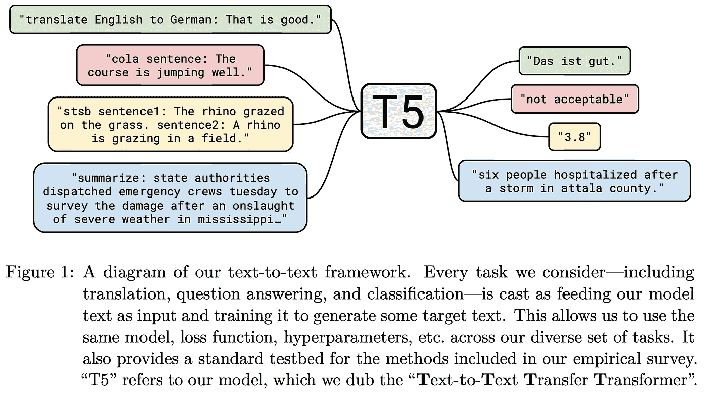
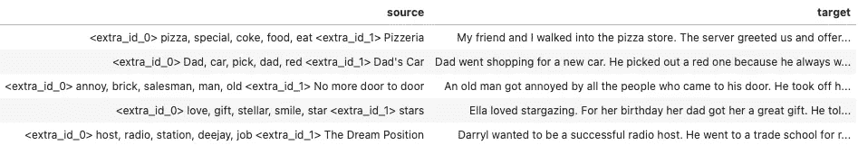
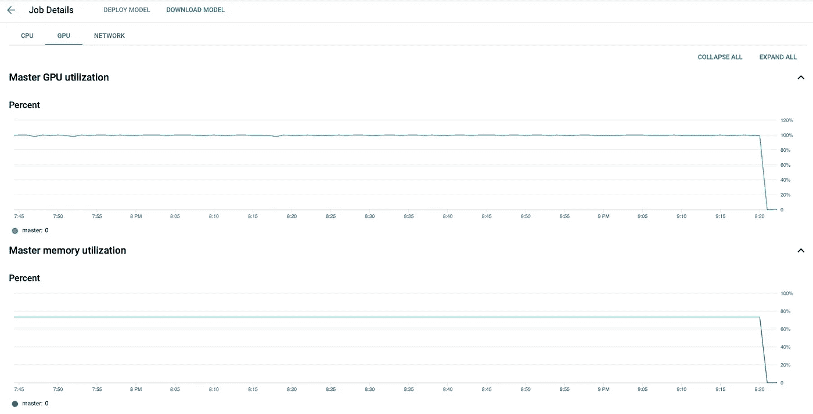
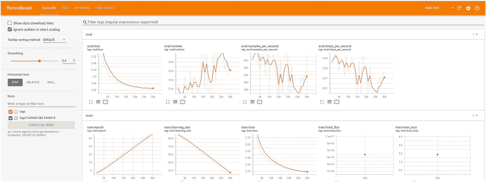

# 人工智能说书人的制作

> 原文：<https://towardsdatascience.com/the-making-of-an-ai-storyteller-c3b8d5a983f5?source=collection_archive---------8----------------------->

## [实践教程](https://towardsdatascience.com/tagged/hands-on-tutorials)

## 如何在 Google AI 平台上为故事生成准备数据和微调 T5 模型


照片由[弗雷迪婚姻](https://unsplash.com/@fredmarriage?utm_source=medium&utm_medium=referral)在 [Unsplash](https://unsplash.com?utm_source=medium&utm_medium=referral)

你还记得上一次学习一门新语言是什么时候吗？你有一长串的单词需要记忆，有时你并没有完全理解这些单词是如何使用的。你想读书，但大多数书都超出了你的水平，课本让你昏昏欲睡。

现在，想象一下，你有一个工具，可以在你的水平上制作无限数量的例句，甚至一口大小的故事。你玩不同的单词组合，学习它们是如何相互作用的。这些故事读起来也很有趣！

这是我对人工智能故事生成如何帮助语言学习者的看法。

在过去的几周里，我一直在做一个概念验证项目，从给定的单词列表中造出句子和故事。下面的屏幕记录显示了它的样子，使用实际训练的模型:


使用基于 T5 的微调模型，根据单词列表制作故事的演示

这个项目是受报纸的启发

*   [计划和写作:实现更好的自动讲故事](https://arxiv.org/abs/1811.05701v1)
*   [利用统一的文本到文本转换器探索迁移学习的局限性](https://arxiv.org/abs/1910.10683)

在本文的剩余部分，我将分享我为这个 POC 项目准备深度学习模型的经验。我将谈论模型训练的高级方法和一些技术方面，这是未来迭代的基础。我将特别介绍:

*   方法论
*   如何准备培训数据
*   如何使用拥抱脸的[变形金刚](https://huggingface.co/transformers/)库和[谷歌人工智能平台](https://cloud.google.com/ai-platform/docs/technical-overview)微调一个预先训练好的 [T5 模型](https://ai.googleblog.com/2020/02/exploring-transfer-learning-with-t5.html)
*   如何在一个(免费的)Google Colab 笔记本上监控进度
*   一旦有了模型，如何生成文本
*   由人(我)进行的模型评估🙋‍♂️)

剧透:像拥抱脸的变形金刚这样的库已经变得如此成熟和方便，以至于你甚至不需要知道 PyTorch 或 Tensorflow 或任何深度学习理论，就可以训练和使用最先进的深度学习模型，如 GPT，T5，BERT 等。相反，最耗时和最容易出错的步骤是正确设置培训管道。


继续读下去，这并不像预期的那么容易

如果你想了解更多关于谷歌人工智能平台、深度学习语言模型或人工智能故事生成的信息，你可能会在文章末尾找到一些额外的资源。

免责声明:我不隶属于谷歌。我正在探索谷歌的云服务，因为我在工作中主要使用 AWS，所以尝试其他平台进行辅助项目似乎很有趣。

# 方法学

我们的任务是制作一个模型:

```
**Me:** Hi Model, tell me a story about "Friday evening". The story must contain the words "Tom" and "dinner".**Model:** Tom was walking to his favourite restaurant on a Friday evening. He would have dinner with his family. When he arrived he found the door was closed.
```

我们可以将此表述为文本到文本的转换问题，其中输入源包含标题和所需的单词:

```
"<title> Friday evening <words> Tom, dinner"
```

输出目标是故事:

```
"<story> Tom was walking... was closed."
```

为了实现这一点，我们可能会创建和训练我们自己的深度学习模型架构，就像在[的规划和撰写](https://arxiv.org/abs/1811.05701v1)论文中那样。虽然这很有趣，并可能实现最佳性能，但对于 POC 项目来说，这需要太多的工作和成本(GPU 的使用)。

或者，我们可以微调一个预先训练好的最先进的语言模型，如[变形金刚](http://jalammar.github.io/illustrated-transformer/)或 [GPT-2](http://jalammar.github.io/illustrated-gpt2/) 。在拥抱脸的网站上，有数以千计的预先训练好的模特，有英语的也有非英语的。如果我们选择这条路径，我们将故事标题和要使用的单词作为写作提示，模型将继续完成故事。

顺便说一下，如果你对通用文本生成器会产生什么感到好奇，你可以试试[这个](https://bellard.org/textsynth/)和[这个](https://transformer.huggingface.co)。

在这个项目中，我选择了谷歌的 T5 型号，它是为任何文本到文本的转换任务而设计的。



[https://ai . Google blog . com/2020/02/exploring-transfer-learning-with-t5 . html](https://ai.googleblog.com/2020/02/exploring-transfer-learning-with-t5.html)

无论如何，如果在这个概念验证项目中，Transformer、GPT-2 或 T5 之间在输出质量方面存在巨大差异，我会感到惊讶。数据集和[解码方法](https://huggingface.co/blog/how-to-generate)的选择在这里可能会发挥更大的作用。

# 数据准备

在线词典、语言学习网站和儿童书籍可能是这项工作的理想来源:句子和故事将是最相关和最准确的语言学习。缺点是实现爬虫的额外工作和潜在的版权问题。

因此，在这个项目中，我使用了[故事完形填空和 ROCStories 语料库](https://cs.rochester.edu/nlp/rocstories/)来训练模型。这个数据集由 98，159 个五句话的故事组成:


ROCStories 数据集示例。来源:https://cs.rochester.edu/nlp/rocstories/

我选择这个数据集是因为它很小，故事也很有趣。请记住，我们的目标是为语言学习者制作一个故事生成器来掌握词汇和基本语法结构。像这样的小故事听起来很完美。

但是等等。

我们只有故事，我们希望我们训练过的模型能产生故事。培训的输入(提示)在哪里？


Miguel A. Amutio 在 [Unsplash](https://unsplash.com?utm_source=medium&utm_medium=referral) 上拍摄的照片

幸运的是，我们可以使用另外两种 NLP 技术:自动[文本摘要](https://en.wikipedia.org/wiki/Automatic_summarization)和[关键词提取](https://en.wikipedia.org/wiki/Keyword_extraction)。这个想法是，

1.  我们从原文中提取一个摘要或几个关键短语。
2.  在训练期间，模型学习扩展摘要或关键短语以恢复原始文本。

正如[计划和撰写](https://arxiv.org/abs/1811.05701v1)论文的作者所提议的，为了准备训练数据集，从故事的每个句子中提取一个单词；输入提示将是故事标题和五个单词(作者称之为故事情节)。例如，这个故事:

```
**Pizzeria**My friend and I walked into the **pizza** store.
The server greeted us and offered **specials** to choose from.
We decided to order a large pizza with **coke**.
After a few minutes, the server placed the **food** on the table.
We slowly **ate** it.
```

会有输入提示:

```
Storyline: pizza -> special -> coke -> food -> eat
Title: Pizzeria
```

以下是训练数据集的示例:



训练数据集(示例)

我使用 T5 的特殊标记`<extra_id_0>`和`<extra_id_1>`作为分隔符，但这不是严格要求的。

[RAKE 和 TextRank](https://medium.com/mlearning-ai/10-popular-keyword-extraction-algorithms-in-natural-language-processing-8975ada5750c) 等算法常用于从文章中提取关键词。然而，由于我们的故事很短，这些依赖于词频和共现的算法经常给大多数单词分配相同的分数。例如，在上面的比萨饼店故事中，RAKE 为所有这些单词返回 score=1:

```
walked, table, order, minutes, friend, food, decided, coke, choose
```

因此，为了从故事中提取关键词(故事线)，我使用库 [KeyBERT](https://github.com/MaartenGr/KeyBERT) ，它利用 BERT 嵌入来评估每个单词的重要性。这里我们可以看到所有的单词都有不同的分数:

```
('pizza', 0.6226), ('coke', 0.3874), ('food', 0.332),
('ate', 0.3044), ('decided', 0.2379), ('specials', 0.236),
('store', 0.2174), ('order', 0.2131), ('greeted', 0.212),
('friend', 0.1753), ('walked', 0.1696), ('minutes', 0.166), ('table', 0.1624), ('offered', 0.1551), ('large', 0.1443),
('server', 0.1185), ('choose', 0.1057), ('placed', 0.0816),
('slowly', 0.0454)
```

当然，这并不一定意味着分数更正确或者提取的顶部单词更适合训练我们的故事生成模型。也许如果我们在训练中随机选择单词，我们会有一个更好的模型？但至少现在，我不需要担心关系破裂。😅

不管怎样，下面是 Python 的源代码:

请注意，故事情节中的单词是词汇化的(例如，“游泳”变成了“游泳”)。这可能会给模型更多的自由来决定故事发生的时间。用户可以使用“昨天”或“明天”这样的词来控制时间。

# 模特培训

一旦我们准备好数据集，我们就可以训练我们的模型。您可以在这里查看我的 Python 脚本和其他相关的设置文件:

[](https://github.com/kenilc/finetune4textgen) [## GitHub - kenilc/finetune4textgen:一个 python 脚本，用于微调文本的预训练模型…

### 一个小 python 脚本，用于微调文本生成的预训练模型。该脚本大量使用了内置的…

github.com](https://github.com/kenilc/finetune4textgen) 

剧本很直白；它本质上是用于训练和参数解析的[拥抱脸函数](https://huggingface.co/transformers/)的包装器，以及一些下载和上传数据文件和模型检查点的辅助函数。

当你决定在[谷歌人工智能平台](https://cloud.google.com/ai-platform/training/docs)上训练你的模型时，乐趣就开始了。

当然，不可能在一个中帖里提供一步一步使用平台的指南。我要分享的是在我为我的故事生成模型建立培训工作的过程中遇到的阻碍。如果你对这个平台完全陌生，我强烈建议你遵循 Google 的官方快速入门指南，理解标准的项目结构和命令是如何工作的。

[](https://github.com/GoogleCloudPlatform/ai-platform-samples/tree/master/quickstart) [## 人工智能-平台-示例/master Google cloud platform/人工智能-平台-示例快速入门

### 如果这是你第一次使用人工智能平台，我们建议你看一下人工智能平台介绍文档…

github.com](https://github.com/GoogleCloudPlatform/ai-platform-samples/tree/master/quickstart) 

在 [Unsplash](https://unsplash.com?utm_source=medium&utm_medium=referral) 上由[micha Mancewicz](https://unsplash.com/@kreyatif?utm_source=medium&utm_medium=referral)拍摄的照片

## 墨菲定律

这是我第一次在人工智能平台上训练模型。当我在谷歌托管的 Jupyter 笔记本电脑上进行本地测试时，它开始得很好，但是当我转移到 GPU 时，这里那里都有障碍。

以下是一些可能出错的事情:

*   错误的存储桶权限。您需要为 ML 引擎设置一个服务帐户，并授予它读写您的 [GCS bucket](https://cloud.google.com/ai-platform/prediction/docs/working-with-cloud-storage) 的权限。bucket 将存储临时包，以及日志和您的模型检查点。
*   无法安装必要的软件包。我用`setup.up`尝试了默认的打包方式，但是库`pyarrow`和`datasets`有错误。经过多次尝试，我用一个定制的 docker 容器解决了这个问题(见下文)。


如果你知道如何解决这个问题，请留下评论。

*   即使作业在本地或 CPU 实例上运行良好，当您在 GPU 上运行它时，它仍然可能会失败。
*   并非所有 GPU 在所有地区都可用。查看 [GPU 区域和分区的可用性](https://cloud.google.com/compute/docs/gpus/gpu-regions-zones)。
*   一些地区的 GPU 资源比其他地区少。您可能会得到一个超时错误，说明当前没有可用的资源。
*   在训练期间，所有文件都存储在本地，除非它们被显式上传到 GCS bucket(或其他地方)。永远不要忘记这一点。
*   根据 docker 容器的创建方式，每当您更改训练脚本时，您可能需要创建一个新的映像。一个更好的解决方案是创建一个包含所有包依赖项的 docker 映像，然后使用`setup.py`打包您的源代码。

## Dockerfile 文件

设置很简单，除了我需要在 docker 容器中使用一个虚拟 Python 环境来避免一些警告。

同样，这可以通过仅将包依赖关系编译到 docker 映像中并使用`setup.py`打包训练脚本来优化。

使用定制 docker 容器的一个优点是，包安装错误会在编译时被发现。

## Docker 映像构建脚本

在使用之前，我们需要将自定义 docker 图像推送到 Google 容器注册表。为了减少[成本](https://cloud.google.com/container-registry/pricing)，不要忘记从注册表中删除不再需要的图像。

## 作业提交脚本

没有比在 GPU 上花费数小时，却发现我们忘记保存模型文件更令人沮丧的了。所以永远记得正确上传模型检查点和日志**和**定期**到 GCS 桶。每个文件，包括日志和输出目录，只存在于容器中，并且必须明确上传到远程作业目录中进行永久存储。**

**在我的脚本中，我用抱抱脸的[训练器回调](https://huggingface.co/transformers/main_classes/callback.html)类实现了常规上传(点击查看源代码[)。](https://github.com/kenilc/finetune4textgen/blob/74e819ab6f93531c718d0f03e751ee3ee3e4e77c/trainer/util.py#L65)**

**为了用 [TensorBoard](https://www.tensorflow.org/tensorboard/) 监控训练进度，我们需要添加参数`--report_to tensorboard`。TensorBoard 格式的登录由 Hugging Face 的 [TensorBoardCallback](https://huggingface.co/transformers/main_classes/callback.html#transformers.integrations.TensorBoardCallback) 类处理。它对 Tensorflow 和 PyTorch 都有效。**

**实现所有这些命令行参数似乎很乏味。幸运的是，拥抱脸为此专门提供了两个类: [TrainingArguments](https://huggingface.co/transformers/_modules/transformers/training_args.html) 和 [HfArgumentParser](https://huggingface.co/transformers/_modules/transformers/hf_argparser.html) 。更好的是，参数解析器是通用的，您可以将它用于任何需要命令行界面的 Python 程序。**

**[](https://python.plainenglish.io/how-to-automatically-generate-command-line-interface-for-python-programs-e9fd9b6a99ca) [## 如何为 Python 程序自动生成命令行界面

### 拥抱脸的 HfArgumentParser 是你的朋友。

python .平原英语. io](https://python.plainenglish.io/how-to-automatically-generate-command-line-interface-for-python-programs-e9fd9b6a99ca) 

## 最后的步骤

经过所有的努力，我们终于可以开始工作了！💪

```
# Step 1: Upload data to Google Cloud Storage
> gsutil cp -r ./data gs://storygen-bucket# Step 2: Build docker image and push to Google Container Registry
> ./build.sh# Step 3: Start the training process
> ./run.sh
```

# 作业监控

## 系统利用

用一个有几个训练步骤的作业来测试运行，并检查计算和内存利用率，这总是一个好主意。例如，您可以通过增加批处理大小来加速训练，直到 GPU 的内存得到充分利用。



在作业详细信息选项卡上检查 GPU 利用率

## 模型训练进度

我们可能会启动一个免费的 Google Colab 笔记本来监控培训进度。关于单元格 1、2 和 3 的进一步解释，请参见[如何从 Colab 笔记本的 Google 云存储中访问文件](https://medium.com/analytics-vidhya/how-to-access-files-from-google-cloud-storage-in-colab-notebooks-8edaf9e6c020)。TensorBoard 会自动下载日志文件，但我们仍然需要刷新以获得最新结果。

```
# Cell 1
from google.colab import auth
auth.authenticate_user()# Cell 2
!curl https://sdk.cloud.google.com | bash# Cell 3
!gcloud init# Cell 4
%reload_ext tensorboard
%tensorboard --logdir gs://bucket_name/job_dir/logs
```



在 Colab 笔记本上运行 TensorBoard 以监控训练进度

# 使用训练模型的文本生成

多么漫长的旅程啊！


最终模型检查点

给定一个经过训练的模型，我们仍然需要实验并决定如何使用它来生成文本。这就是所谓的解码，不同的解码方法和参数产生的结果大相径庭。

[](https://huggingface.co/blog/how-to-generate) [## 如何生成文本:使用不同的解码方法通过转换器生成语言

### 近年来，由于大规模语言生成的兴起，人们对开放式语言生成越来越感兴趣。

huggingface.co](https://huggingface.co/blog/how-to-generate) 

这是文本生成的函数。`**kwargs`包含所有可选参数，如温度、top-p、是否进行采样或光束搜索等。默认是贪婪解码:概率最高的单词一个一个输出。当语句结束标记或最大。已达到长度。

# 模型评估

[文本生成](https://arxiv.org/abs/2006.14799)模型和系统的评估是困难的，仍然是一个开放的研究问题。已经提出了度量标准，但是人类的判断仍然被广泛使用并被认为是黄金标准。有趣的是，最近有一篇[论文](https://arxiv.org/abs/2107.00061)指出，即使是人类的评价也经常是不一致和矛盾的。🤦🏼‍♂️

我将在未来发布其他配方、模型及其评估的更新。同时，以下是一些生成的故事(标题和故事情节作为输入):

```
Title: Joey's First Snowman
Storyline: snow, snowman, snowball, smile, JoeyJoey was excited to get his first snowman.
He decided to make a **snowman** for his birthday.
He sat down and watched the **snowballs**.
He **smiled** and screamed.
**Joey's** first snow man was a great day.* * *Title: Back in Class
Storyline: Lucy, basement, teacher, hour, laugh**Lucy** was back in class.
She was in the **basement**.
The **teacher** was a bit nervous.
Lucy had to wait for **hours**.
She **laughed** and sat down to watch the show.* * *Title: The Rock
Storyline: yard, stone, heavy, chisel, rockI was walking in my **yard**.
I saw a large **stone**.
It was too **heavy**.
I **chiseled** it.
I realized that the **rock** was too big.* * *Title: Playing video games
Storyline: Calvin, play, hard, start, beat**Calvin** was playing video games.
He wanted to **play** it.
He tried very **hard**.
He **started** playing it.
Eventually, he **beat** himself.* * *Title: Chicken Nuggets
Storyline: Lily, chicken, fry, cool, delicious**Lily** was cooking dinner.
She decided to make **chicken** nuggets.
She **fried** them in the oven.
When she **cooled** it, it was a good idea.
It was **delicious**!
```

你怎么想呢?

# 额外资源

我希望你喜欢这篇文章。以下是我发现对这个项目有用的一些文档、博客文章或论文。如果你也在做一些故事生成项目，请留下评论，分享你的作品。或者如果你对使用文本生成进行语言学习有任何想法，也请分享你的想法。😀

## 在谷歌人工智能平台上

1.  [GPU 定价](https://cloud.google.com/compute/gpus-pricing)
2.  [GPU 区域和分区可用性](https://cloud.google.com/compute/docs/gpus/gpu-regions-zones)
3.  [在 AI 平台上使用容器培训](https://cloud.google.com/ai-platform/training/docs/using-containers)
4.  【PyTorch 入门
5.  [培训概述](https://cloud.google.com/ai-platform/training/docs)
6.  [如何在 Colab 笔记本上访问谷歌云存储中的文件](https://medium.com/analytics-vidhya/how-to-access-files-from-google-cloud-storage-in-colab-notebooks-8edaf9e6c020)
7.  [在 GCP AI 平台上训练 PyTorch 变形金刚](https://medium.com/nordcloud-engineering/training-pytorch-transformers-on-gcp-ai-platform-e10ecb8a9e11)

## 论故事与开放式文本生成

1.  [人工智能故事生成简介](https://mark-riedl.medium.com/an-introduction-to-ai-story-generation-7f99a450f615)
2.  [计划和写作:实现更好的自动讲故事](https://arxiv.org/abs/1811.05701v1)
3.  [可控神经文本生成](https://lilianweng.github.io/lil-log/2021/01/02/controllable-neural-text-generation.html)
4.  [如何生成文本:使用不同的解码方法通过变形金刚生成语言](https://huggingface.co/blog/how-to-generate)
5.  [文本生成评估:一项调查](https://arxiv.org/abs/2006.14799)
6.  [人不一定是金子:评估人对生成文本的评估](https://arxiv.org/abs/2107.00061)

## 在数据集上

1.  [Story 完形填空和 ROCStories 语料库](https://cs.rochester.edu/nlp/rocstories/)
2.  [机器学习关键数据集 BookCorpus 的肮脏秘密](/dirty-secrets-of-bookcorpus-a-key-dataset-in-machine-learning-6ee2927e8650)

## 深度学习语言模型研究

1.  [用统一的文本到文本转换器探索迁移学习的极限](https://ai.googleblog.com/2020/02/exploring-transfer-learning-with-t5.html)
2.  [图示变压器](http://jalammar.github.io/illustrated-transformer/)
3.  [图文并茂的 GPT-2(可视化变压器语言模型)](http://jalammar.github.io/illustrated-gpt2/)

## 关键词抽取研究

1.  [使用 BERT 进行最小关键词提取](https://github.com/MaartenGr/KeyBERT)
2.  [自然语言处理中 10 种流行的关键词提取算法](https://medium.com/mlearning-ai/10-popular-keyword-extraction-algorithms-in-natural-language-processing-8975ada5750c)**