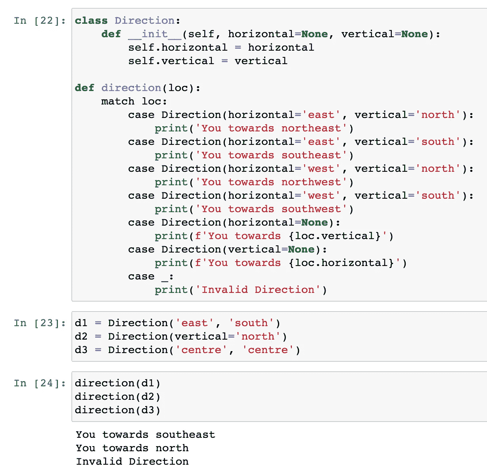

# Python 3.10 中的匹配情况没有那么简单

> 原文：<https://towardsdatascience.com/the-match-case-in-python-3-10-is-not-that-simple-f65b350bb025?source=collection_archive---------1----------------------->


图片来自 Pixabay

## 7 个示例说明“匹配大小写”不是“切换大小写”

在我的上一篇文章中，我已经介绍了 Python 3.10 中所有主要的新特性，它在两周前刚刚发布。最重要的特性之一是大小写匹配语法。

一些人仍然认为 Python 不需要“切换用例”语法。甚至 Guido 本人也不支持在 Python 中添加这种语法。但是，为什么还是在这个新版本中发布呢？在我看来，原因可以从名字中找到。它被称为“匹配大小写”,而不是像大多数编程语言那样的“切换大小写”。

在本文中，我将使用 7 个例子来展示新语法是多么灵活和“pythonic 化”。希望它能帮助你更容易地理解它。

如果你对 Python 3.10 中的其他特性感兴趣，可以参考我之前的帖子。

[](/python-3-10-five-new-features-and-considerations-f775c9432887) [## Python 3.10 五项新功能和注意事项

### 不仅仅是列表，还有例子和注意事项。

towardsdatascience.com](/python-3-10-five-new-features-and-considerations-f775c9432887) 

# 1.基础


图片由来自 [Pixabay](https://pixabay.com/?utm_source=link-attribution&utm_medium=referral&utm_campaign=image&utm_content=276014) 的 [Larisa Koshkina](https://pixabay.com/users/larisa-k-1107275/?utm_source=link-attribution&utm_medium=referral&utm_campaign=image&utm_content=276014) 拍摄

在任何有趣的东西之前，让我们从这个新语法的基本用例开始。假设我们正在编写一些代码来将 HTTP 状态代码转换成错误消息，我们可以使用如下的大小写匹配语法。

```
def http_status(status):
    match status:
        case 400:
            return "Bad request"
        case 401:
            return "Unauthorized"
        case 403:
            return "Forbidden"
        case 404:
            return "Not found"
```


实际上，对于这个特殊的例子，匹配用例并没有比 if-else 语法带来任何好处，如下所示。

```
def http_error(status):
    if status == 400:
        return "Bad request"
    elif status == 401:
        return "Unauthorized"
    elif status == 403:
        return "Forbidden"
    elif status == 404:
        return "Not found"
    else:
        return "Unknown status code"
```

如果它只能做这样的事情，我想它不会被添加。让我们继续用更多的例子来看看它能有什么样的灵活性。

# 2.默认情况


图片来自 [Pixabay](https://pixabay.com/?utm_source=link-attribution&utm_medium=referral&utm_campaign=image&utm_content=736886) 的[贝西](https://pixabay.com/users/bessi-909086/?utm_source=link-attribution&utm_medium=referral&utm_campaign=image&utm_content=736886)

这意味着它类似于大多数其他语言中的 switch-case 语法，因此它必须具有“默认大小写”。当没有定义的案例可以匹配时，将执行“默认案例”中的代码。

Python 的风格达到了这个要求。它使用代表匿名变量的下划线“_”。基本原理是匿名变量可以“匹配”任何东西。

让我们看看下面的例子。

```
def http_status(status):
    match status:
        case 400:
            return "Bad request"
        case 401:
            return "Unauthorized"
        case 403:
            return "Forbidden"
        case 404:
            return "Not found"
        case _:
            return "Other error"
```


在上面的代码中，我们添加了默认情况并显示“其他错误”。

# 3.合并案例


图片来自[皮克斯巴伊](https://pixabay.com/?utm_source=link-attribution&utm_medium=referral&utm_campaign=image&utm_content=6677883)

如果有时我们有多个应该合并的案例呢？换句话说，这些是不同的情况，但我们处理它们的方式应该是相同的。

在 Python 中，我们可以使用管道“|”将这些案例组合成一个案例。它也被认为是一种“或”关系。

```
def http_status(status):
    match status:
        case 400:
            return "Bad request"
        case 401 | 403:
            return "Authentication error"
        case 404:
            return "Not found"
        case _:
            return "Other error"
```


在上面的代码中，我们将 401 和 403 错误都视为身份验证问题，因此我们可以在匹配的情况下将它们合并。

# 4.列表中的通配符


图片来自[弗兰克·温克勒](https://pixabay.com/users/frankwinkler-64960/?utm_source=link-attribution&utm_medium=referral&utm_campaign=image&utm_content=192979)来自 [Pixabay](https://pixabay.com/?utm_source=link-attribution&utm_medium=referral&utm_campaign=image&utm_content=192979)

更有趣的东西来了。假设我们正在使用大小写匹配语法编写一个警报逻辑。它接受一个列表作为参数。第一个元素是一天中的时间。让我们保持简单，所以我们有“早上”、“下午”和“晚上”。第二个元素是我们需要闹钟提醒我们做的动作。

然而，我们可能希望闹钟提醒我们同时做多件事情。因此，我们希望在列表中传递多个动作，以便警报可以提醒我们逐一完成所有动作。

下面是实现这一要求的代码。

```
def alarm(item):
    match item:
        case [time, action]:
            print(f'Good {time}! It is time to {action}!')
        case [time, *actions]:
            print('Good morning!')
            for action in actions:
                print(f'It is time to {action}!')
```

在这个例子中，我们只有两种情况。第一种情况不需要解释太多，因为它只是试图匹配单个动作的情况。在第二种情况下，我们在变量“actions”前面加了一个星号，这样它可以匹配列表中的一个或多个动作！

让我们试一试。

```
alarm(['afternoon', 'work'])
alarm(('morning', 'have breakfast', 'brush teeth', 'work'))
```


# 5.子模式


图片来自 [Pixabay](https://pixabay.com/?utm_source=link-attribution&utm_medium=referral&utm_campaign=image&utm_content=770264)

有时，我们可能希望模式中有模式。具体来说，我们希望匹配案例将流分类到一个特定的“案例”中。然而，在这个模式中，我们想要添加更多的限制。

还记得我们已经定义了一天中的“时间”必须是“早晨”、“下午”或“晚上”吗？让我们将这个限制添加到匹配大小写代码中。如果“时间”与这三个中的一个不匹配，告诉用户时间无效。

```
def alarm(item):
    match item:
        case [('morning' | 'afternoon' | 'evening'), action]:
            print(f'Good (?)! It is time to {action}!')
        case _:
            print('The time is invalid.')
```

在上面的代码中，它显示了我们可以使用一对括号将我们想要匹配的“模式”括起来，并使用管道来分隔这些模式。

如果它与给定的 3 个“时间”中的一个不匹配，将执行默认情况。


为什么那里有一个问号？我故意添加它，因为我想强调解决方案。通常，匹配其中一个子模式，然后引用它精确匹配的模式并不容易。但是，我们可以在 Python 中有这个“引用”。

让我们添加一个“as”关键字，后跟一个变量，这个变量将是引用。

```
def alarm(item):
    match item:
        case [('morning' | 'afternoon' | 'evening') as time, action]:
            print(f'Good {time}! It is time to {action}!')
        case _:
            print('The time is invalid.')
```


# 6.条件模式


图片由来自 [Pixabay](https://pixabay.com/?utm_source=link-attribution&utm_medium=referral&utm_campaign=image&utm_content=585348) 的 [Michael Mürling](https://pixabay.com/users/pixcarraldo-656298/?utm_source=link-attribution&utm_medium=referral&utm_campaign=image&utm_content=585348) 拍摄

我们需要让这个闹钟更加“智能”。到了晚上，让我们显示一些消息来感谢用户完成了一天的工作。

```
def alarm(item):
    match item:
        case ['evening', action]:
            print(f'You almost finished the day! Now {action}!')
        case [time, action]:
            print(f'Good {time}! It is time to {action}!')
        case _:
            print('The time is invalid.')
```

因此，我们在上面的代码中增加了一个 case，只匹配“evening”。


嗯……第二个好像有点沮丧。让我们让这个闹钟更加智能，以鼓励用户“工作生活平衡”。因此，当用户想要在晚上工作或学习时，闹钟建议用户休息一下。(我希望:D 能有这样的警报)

```
def alarm(item):
    match item:
        case ['evening', action] if action not in ['work', 'study']:
            print(f'You almost finished the day! Now {action}!')
        case ['evening', _]:
            print('Come on, you deserve some rest!')
        case [time, action]:
            print(f'Good {time}! It is time to {action}!')
        case _:
            print('The time is invalid.')
```

为了实现这一点，我们在顶部添加了另一个案例。这是有条件的。也就是说，当动作是“工作”或“学习”时，显示一些不同的消息。


# 7.匹配对象


图片来自 [pasja1000](https://pixabay.com/users/pasja1000-6355831/?utm_source=link-attribution&utm_medium=referral&utm_campaign=image&utm_content=3667632) 来自 [Pixabay](https://pixabay.com/?utm_source=link-attribution&utm_medium=referral&utm_campaign=image&utm_content=3667632)

到目前为止，我们已经探索了很多。我猜你可能会有这样的感觉，它是一个“匹配盒”而不是一个“开关盒”，因为“模式”永远是关键。

让我们来看一个更复杂的例子——一个类实例。是的，让我们用大小写匹配一个对象。

我就编一个简单的用例。创建了一个名为“Direction”的类，用于保存水平(东或西)和垂直(北或南)轴上的方向。

```
class Direction:
    def __init__(self, horizontal=None, vertical=None):
        self.horizontal = horizontal
        self.vertical = vertical
```

现在，我们想使用 match-case 语法来匹配这个类中的一个实例，并根据属性显示一条消息。

```
def direction(loc):
    match loc:
        case Direction(horizontal='east', vertical='north'):
            print('You towards northeast')
        case Direction(horizontal='east', vertical='south'):
            print('You towards southeast')
        case Direction(horizontal='west', vertical='north'):
            print('You towards northwest')
        case Direction(horizontal='west', vertical='south'):
            print('You towards southwest')
        case Direction(horizontal=None):
            print(f'You towards {loc.vertical}')
        case Direction(vertical=None):
            print(f'You towards {loc.horizontal}')
        case _:
            print('Invalid Direction')
```

然后，让我们从类中创建一些对象进行测试。

```
d1 = Direction('east', 'south')
d2 = Direction(vertical='north')
d3 = Direction('centre', 'centre')
```

结果表明，match-case 可以根据这些对象的属性轻松地匹配它们！

```
direction(d1)
direction(d2)
direction(d3)
```



# 摘要


图片由来自 [Pixabay](https://pixabay.com/?utm_source=link-attribution&utm_medium=referral&utm_campaign=image&utm_content=6664622) 的 [Markus Kammermann](https://pixabay.com/users/makabera-6773476/?utm_source=link-attribution&utm_medium=referral&utm_campaign=image&utm_content=6664622) 提供

在本文中，我介绍了 Python 3.10 中引入的新语法“match-case”，以及它是多么灵活和强大。我相信钉住这个新语法将帮助我们在可读性方面写更好的代码。

[](https://medium.com/@qiuyujx/membership) [## 通过我的推荐链接加入灵媒-陶

### 作为一个媒体会员，你的会员费的一部分会给你阅读的作家，你可以完全接触到每一个故事…

medium.com](https://medium.com/@qiuyujx/membership) 

**如果你觉得我的文章有帮助，请考虑加入灵媒会员来支持我和成千上万的其他作家！(点击上面的链接)**