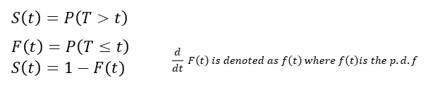
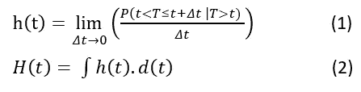
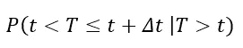
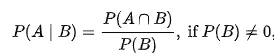
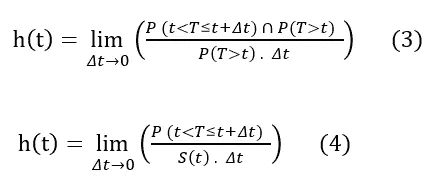
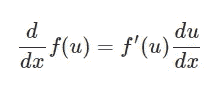
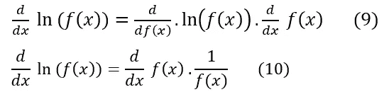
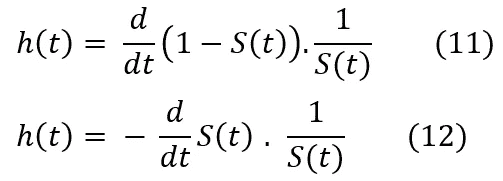
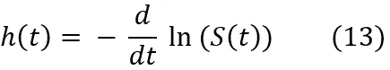
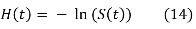

# 生存函数和风险函数之间的数学关系

> 原文：<https://towardsdatascience.com/the-mathematical-relationship-between-the-survival-function-and-hazard-function-74559bb6cc34?source=collection_archive---------10----------------------->

> 谁是这篇文章的预期读者？
> 
> **这篇文章是为那些至少已经熟悉生存(事件发生时间)分析和 Cox 比例风险模型的人准备的。**强烈建议那些不熟悉生存分析和/或 Cox 比例风险的人在掌握基本知识之前跳过这篇文章，否则很可能是在浪费你的时间。我还认为，为了有效地模拟生存数据，你不需要知道生存和风险函数之间关系的高级数学证明。因此，简而言之，这篇文章适合那些想深入研究数学的好奇者，但这绝不是生存分析的先决条件。

# 介绍

写这篇文章的动机是，我曾经花大量时间使用卡普兰-迈耶生存分析(KM 分析)和考克斯比例风险模型(CPHM)等方法对生存数据(事件发生时间数据)建模，但这两者之间的确切联系引起了我的兴趣。无论使用何种方法，存活分析中感兴趣的因变量是存活时间。然而，在 KM 分析(可能是最常用的方法)中，我们估计的是生存概率，而在 CPHM，估计是围绕着风险率和风险比的概念进行的。我对这两个相似但概念上和数学上不同的估计之间的确切联系并不十分好奇，但好奇心逐渐增加，因此试图从纯数学的角度深入挖掘这种联系。直觉是，如果 CPHM 是在估计风险率，而 KM 分析是在估计生存概率(存活率)，两者都是基于生存数据，那么这两个估计之间一定有明确的联系，对吗？我们将推导出生存函数和风险函数之间的基本数学关系，并表明这两者密切相关。

# **走进数学……**

事不宜迟，我将从符号开始…

设 **T** 是代表生存时间的随机变量，生存时间就是事件发生的时间

设 **S(t)** 为生存概率，一个事件直到时间‘t’才发生的概率。

设 **F(t)** 为故障概率，即事件在时间‘t’发生的概率

**S(t)** 和 **F(t)** 因此在数学上可以表示为:

注意,“T”是随机变量“T”感兴趣的特定值。

# S(t)只不过是生存函数(也称为幸存者函数)

**S(t)**的一些性质

*   S(t=0) = 1(每个人在时间开始时存活，通常是流行病学研究中的研究开始时间或索引日期)
*   S(t = Inf) = 0(没有人在无限时间存活)
*   0 ≤ S(t) ≤ 1
*   S(t)是非增函数。即 t1 ≤ t2 时 S(t1) ≥ S(t2)

在知识管理分析中，目标是估计 S(t)。这里的[记录了通过 KM 分析非参数化估计 S(t)的最好的文章之一](https://sphweb.bumc.bu.edu/otlt/MPH-Modules/BS/BS704_Survival/BS704_Survival_print.html)。CPHM 模型用在你有兴趣调整协变量的地方，就像多元回归模型一样。

## **危险率和危险比**

CPHM 的目的是估算危害比，即两个危害率之比。这里的“二”不在本文的讨论范围之内。危险率是在 t 和 t 之间的非常短的时间间隔 t 内发生事件的概率，*假定个人在‘t’之前没有发生事件。*

因此，h(t)是一个“瞬时”率或概率。现在出现了另一个相关概念，即**累积风险函数，通常用 H(t)表示。h(t)和 H(t)都可以用极限和积分学的概念用数学表示如下。**

等式(1)是危险率 h(t)定义的简单数学转换。它是一个事件在 t 和 that 之间的小时间间隔内发生的条件概率(注意“|”符号),假设个体存活到“t”。因此，将 h(t)对‘t’进行积分，就得到累积风险函数 H(t)。

> **我们的目标是找到 h(t)，H(t)和 S(t)之间的数学关系**

从(1)中，让我们忘记极限部分，专注于下面显示的分子

这个条件概率可以根据熟悉的条件概率定理进行转换

应用上述相同的变换，等式(1)变成

等式 4 确实是从两个基本事实中推导出来的。危险发生的概率 P(t <t and="" p="">t)实际上是 P(t <t also="" p="">t)只不过是我们之前定义的 S(t)！现在我们可以看到，当我们设法将 S(t)代入 h(t)的数学表达式时，有些东西已经被解开了，如等式 4 所示。</t></t>

我们现在要把等式 4 重新整理成更有用的东西…

每个方程都是从前面的方程推导出来的，我们还使用了之前定义的失效概率的概念。等式 8 给出了危险率和存活率之间一个美丽而简单的关系！但是我们还没有完成！我们能把方程 8 转换成只包含 h(t)和 S(t)的方程吗？是的，我们可以。为此，我们需要应用[微分链法则](https://www.toppr.com/guides/maths/continuity-and-differentiability/derivatives-of-composite-functions/)。

将上述规则应用于对数函数上的复合函数..

在自然对数函数上使用复合函数的链式法则示例

让我们暂时搁置方程 9 和 10，重写只有 S(t)的方程 8

如果你看看等式 12 和等式 10，它们似乎很相似，对吗？确实！因此，我们可以将等式 12 简化为:

危险率与存活率的关系

就是这样。我们现在可以从等式 13 中得知**风险率就是存活率(生存概率)的负自然对数对时间**的微分。哇！

还没完呢！我们还可以找到累积风险函数 H(t)和 S(t)之间的关系。根据等式 2，H(t)就是 h(t)对时间的积分。所以我们需要做的就是对方程 13 进行积分，这样我们就得到了一个漂亮简洁的方程:

累积风险函数与生存函数的关系

是的，**t 时刻的累积风险率(累积风险函数)是 t 时刻存活率的负对数！**这不是很美吗？我记得沃尔特·列文曾经说过‘这个等式太美了，它让你流泪。’