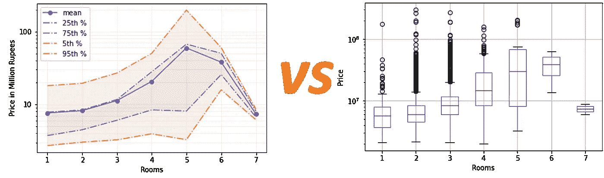
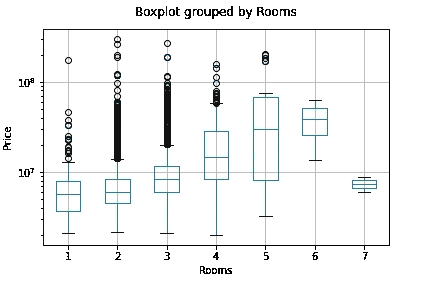
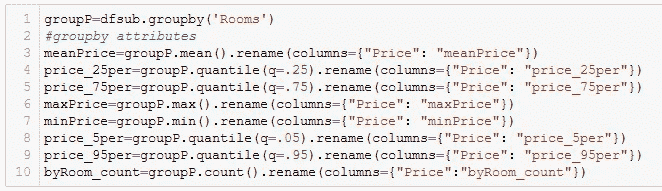
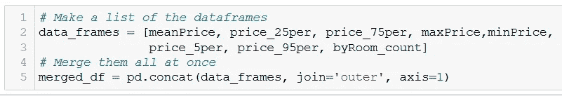
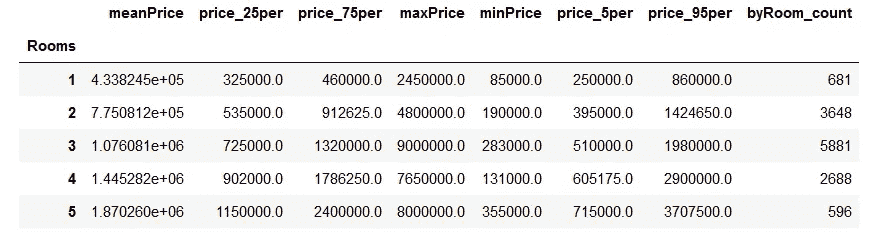
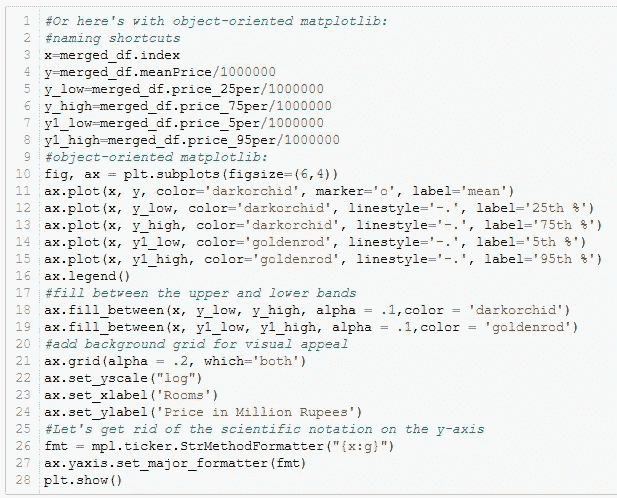
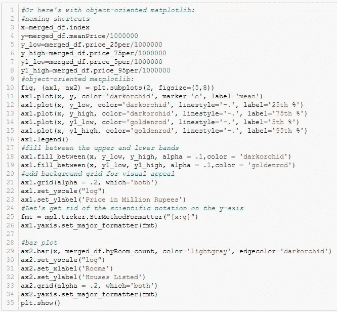
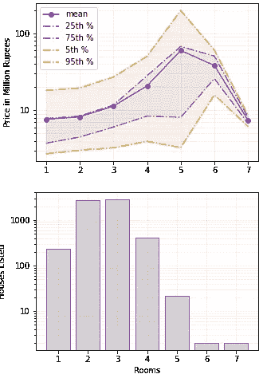

# 粉碎盒状图的 Matplotlib 线图

> 原文：<https://towardsdatascience.com/the-matplotlib-line-plot-that-crushes-the-box-plot-912f8d2acd49?source=collection_archive---------15----------------------->

## 直观地显示统计数据、误差线或自定义函数



作者图片

T 盒状图是一种快速便捷的方式来感受你的数据集——它可以给你一个范围、平均值、四分位数和异常值的快照。当然，它不像直方图或 kde 那样具有描述性，但是它对于观察我们的分布如何随着我们的变量而变化是很棒的。

虽然数据科学家和大多数技术人员对盒状图很熟悉，但对于非工程或统计领域的人来说，它们可能很陌生。这就是问题所在: ***你需要一种方法来显示你的数据趋势及其分布是如何以一种任何人都能理解的格式变化的。***

我将一步一步地向您展示如何制作一个折线图，以传达您想要分享的来自箱线图的尽可能多或尽可能少的信息——均值、中位数、范围、四分位数、标准差误差线或任何自定义值。

## 数据导入

我们将从导入函数和从 Kaggle 获取印度房价数据集开始，ka ggle 探索待售房屋的信息。我们将使用内置的熊猫功能`read_csv()`加载它，或者从本地保存的副本，或者为了方便起见，从我的 github ( `'https://tinyurl.com/4yx6p8hs'`)的网络链接。

```
import numpy as np
import pandas as pd
import matplotlib.pyplot as plt
from functools import reduce
import matplotlib as mpl### LOAD DATA ####
df = pd.read_csv('data/Bangalore.csv')
df.rename(columns={"No. of Bedrooms": "Rooms"}, inplace=True)
df.head()
```

快速浏览一下数据(`df.head()`)就能发现大量可供我们摆弄的变量。对于这个例子，我们只是要调查房价的分布与一个家庭的房间数量的关系。为了使我们的数据帧尽可能小(有助于计算速度和总体组织)，我们将首先创建一个仅包含这两列的子集数据帧:

```
dfsub = df[['Rooms', 'Price']]
```

## 方框图

首先，免责声明—如果您使用 pandas box plot 函数(而不是 matplotlib 函数)，非常非常容易做出 box plot 来评估房价与房间数量的关系。这里的区别是 pandas 版本提供了一个非常方便的`by`参数来定义我们如何在 x 轴上分割数据。在 matplotlib 中，我们必须拆分和合并数据，创建一个新的数据框架，每个房间的数量都是数据框架中不同的列。以下是我们在熊猫身上的做法:

```
df.boxplot(column=['Price'], by=['Rooms'])
plt.title("")
plt.xlabel("Rooms")
plt.ylabel("Price")
plt.yscale("log")
plt.show()
```



一个标准的熊猫方块图

同样，作为一名数据科学家，它是说明性的，并告诉我们许多关于我们的数据分布的信息——均值、四分位数、范围和异常值。这需要做一些工作，但我们需要以一种任何人都能理解的方式传达这一信息。

## 带分布的线形图

这里的主要目标是将各种级别(均值、范围等)作为线条叠加在一个图上。我们将从提取每个“房间”值的这些值开始。这正是熊猫的拿手好戏。现在，我们将执行一次`groupby()`，然后从那里调用这些方法，而不是多次调用这个`groupby()`并使用像`.mean()` 或`.quantile()`这样的内置方法询问不同的参数值——节省了一些繁重的计算，并节省了我们大约 25%的计算时间。

另一个技巧是，当我们用任何方法调用`groupby()`时，默认输出将是一个以‘Rooms’为索引的 dataframe 和一个名为‘Price’的列。您可以开始明白为什么这可能是一个问题——我们用`.mean()`、`.quantile()`或任何其他参数创建的每个新列都将被命名为‘Price’。呀！现在让我们用`.rename()`函数来解决这个问题。



使用 Groupby()设置我们的指标

很明显，我们可以继续下去，追求我们感兴趣的任何其他指标——标准差、四分位数范围、中位数，甚至是[自定义函数](https://sean-turner.medium.com/applying-custom-functions-to-groupby-objects-in-pandas-61af58955569)。这就是这种方法的主要好处之一— ***可调性！***

接下来，我们需要将这些新的微型数据框架合并在一起，这样我们就可以将所有数据保存在一起。这并不是 100%必要的，但是强烈建议在数据组织中使用，以防我们以后需要使用这些数据。首先，我们将列出数据帧，然后用`concat()`将它们连接起来。



合并微型数据框架



我们的合并数据框架

太好了！“房间”是我们的索引，我们的每个数学函数为“房间”的每个值提供了一个值。这正是线图喜欢使用的数据类型。

## 测绘

这里的一般概念是将单个的数学值作为线相加，然后在上下界之间填充。对于此图，我将仅使用平均值、第 25 个百分点、第 75 个百分点、第 5 个百分点和第 95 个百分点，但是，我鼓励您尝试使用此方法，并使用最大值/最小值或您想要创建的任何其他指标自定义您的图。

同样值得注意的是，为了代码和我们的绘图的可读性，我将为“x”和“y”变量赋值，并除以 1，000，000 以使我们的 y 轴可读性更好。

在制作图表时，我们首先为我们想要添加的每一行调用`ax.plot()`。我在这里保持简单，只是自定义颜色和线条样式，但还有许多其他方式来自定义这些。另外，增加了一个`label=`，它将直接馈入我们的`legend()`。这是 matplotlib 胜过 R 的 plot() 的一个地方——图例几乎是自动生成的。

接下来，我们使用`ax.fill_between()`填充线组之间，以帮助眼睛看到定义范围的每组线。接下来，我们添加一个带有`ax.grid()`的背景网格，alpha 设置透明度，`which='both'`给长轴和短轴都添加线条。我们还会给 x 轴和 y 轴起一个描述性的名字。

最后，由于房屋价值的绝对范围，该图在对数标度中使用 y 轴时可读性更好，否则较小的值会因为标度太大而看不到。不幸的是，matplotlib 默认将 y 轴值放在对数轴的科学符号中，这通常很难快速阅读(特别是对于我们的非技术读者)。为了克服这个问题，我们格式化数字并使用`set_major_formatter()`方法，这样我们的 y 轴将显示为简单的数字。



构建我们的线图

对于那些还不熟悉面向对象版本的 matplotlib 的人来说，基于状态的绘图代码(使用`plt.plot()`)在我的 github [这里](https://github.com/bamattis/Blog/tree/main/Matplotlib/Line%20plots%20as%20box%20plots)。


啊，好多了！

其结果是一个更具视觉吸引力和普遍理解的基本箱线图。更好的是，它是完全可定制的——它可以显示我们想要的任何线条或范围，这允许我们调整它的使用来衡量我们的观众熟悉的指标。

## 额外学分

知道四分位数和平均值是一回事，但知道这些值是否有分量总是很重要的——我们通常想知道这些计算中有多少数据点。显然，如果只有少数房屋售出，噪音可能会使我们的图表变得不那么有用。

看看我们的图，有点意外的是，一旦我们在一个房子里有 6 个房间，价格就开始下降……我们应该检查一下，以确保我们有足够的数据来知道这个趋势是否真实。之前我们用`.count()`生成了一个`groupby()`就是为了这种情况。虽然我们可以在数据框架上查看各自的列，但是直观地传递这些数据会有用得多。

为了实现这一点，我们可以创建一个带有条形图的子图，显示每个“房间”计数的数据点数量，镜像与之前相同的 x 轴，以帮助眼睛进行关联。



创建支线剧情



我们的箱线图带有数量细目表

我在这里绘制了一个对数标度，以帮助我们了解“房间”=6 和 7 组中只有两个住宅。与此同时，我们了解到，对于 4 个房间或更少的房子，我们受到 100 多个房屋列表的驱动，所以这些趋势和范围可能是可信的。

## 结论

你有它——心爱的箱线图可以被击败！我们使其更易于可视化，并且可以自定义数据。这里我们复制了通常在箱线图中看到的四分位数，但是我们也可以使用这种方法来绘制自定义函数的误差线或值。这需要更多的工作，但是最终的结果以一种非技术人员可以容易理解的方式传达了我们的结果。我已经把我所有的代码[贴在这里](https://github.com/bamattis/Blog/tree/main/Matplotlib/Line%20plots%20as%20box%20plots)，这样你就可以玩并定制你自己的方块剧情杀手。编码快乐！