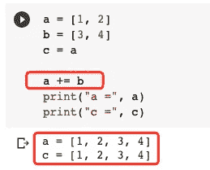

# “+=”可能不会像您在 Python 中期望的那样

> 原文：<https://towardsdatascience.com/the-may-not-do-what-you-expected-in-python-d46991992974?source=collection_archive---------14----------------------->


图片来自 [Pixabay](https://pixabay.com/?utm_source=link-attribution&utm_medium=referral&utm_campaign=image&utm_content=2789112) 的[Steve buiss NNE](https://pixabay.com/users/stevepb-282134/?utm_source=link-attribution&utm_medium=referral&utm_campaign=image&utm_content=2789112)

## 讨论和比较 3 种不同的“添加”功能

你以为`a = a + b`和 Python 里的`a += b`总是一样的吗？答案是否定的。像大多数其他 Python 开发者一样，我以前也在想同样的事情，直到我意识到 Python 中有 3 个不同的“加法”函数。

*   `__add__()`
*   `__radd__()`
*   `__iadd__()`

不认识他们？别担心。如果您知道双下划线包围的函数是“神奇”函数，您应该已经意识到这些函数应该以更直观的方式调用。确切的说，当我们有`a + b`的时候，函数`a.__add__(b)`在幕后被调用。

在这篇文章中，我将介绍这三个函数以及它们之间的区别。更重要的是，我会告诉你在哪个场景中`a = a + b`会和`a += b`不一样，以及为什么。

# 1.调用 __add__ 时。


图片来自 [Pixabay](https://pixabay.com/?utm_source=link-attribution&utm_medium=referral&utm_campaign=image&utm_content=3456736) 的 [Ulrike Leone](https://pixabay.com/users/ulleo-1834854/?utm_source=link-attribution&utm_medium=referral&utm_campaign=image&utm_content=3456736)

正如简介中提到的，每当我们进行求和计算时，都会调用函数`__add__()`。因此，我们可以说下面两个表达式总是相同的。

```
a + b
a.__add__(b)
```


我们可以通过定义一个自定义类来验证这一点。姑且称之为“X”类。然后，类“X”将接受一个数字进行初始化。同样，我们需要定义神奇的函数`__add__()`。为了方便起见，还定义了`__repr__()`函数，以便我们可以轻松地打印结果。

```
class X:
    def __init__(self, num):
        self.num = numdef __add__(self, other_X):
        print('I am called!')
        return X(self.num + other_X.num)def __repr__(self):
        return str(self.num)
```

现在，让我们从这个类“X”中实例化两个数字，并执行求和计算。

```
a = X(1)
b = X(2)print('a + b =', a + b)
```


在`__add__()`函数中，我添加了一个打印函数来打印一些东西。然后，当我们运行`a + b`时，它被打印出来。因此，这证明了我们已经成功地为这个定制类重写了`+`操作符。

# 2.__radd__ 和 __add__ 有什么不同？


图片来自 [Pixabay](https://pixabay.com/?utm_source=link-attribution&utm_medium=referral&utm_campaign=image&utm_content=2250932)

这个功能有点特别。它将颠倒两个组件的顺序，然后将它们相加。嗯，我们都知道`a + b = b + a`如果两者都是标量。因此，用除法比用加法来演示要容易得多。

好在有两个对应的功能`__truediv__()`和`__rturediv()`。参见下面的例子。

```
x = 10
y = 2x.__truediv__(y)
x.__rtruediv__(y)
```


因此，

*   `x.__truediv__(y) = x/y`
*   `x.__rtruediv__(y) = y/x`

同样的，

*   `x.__add__(y) = x + y`
*   `x.__radd__(y) = y + x`

如果你想知道有多少其他的运算符或计算具有这些特性，这里有一个官方文档的链接。

  

# 3.调用 __radd__ 时。


图片由 [Circ OD](https://pixabay.com/users/techphotogal-1739491/?utm_source=link-attribution&utm_medium=referral&utm_campaign=image&utm_content=1080088) 发自 [Pixabay](https://pixabay.com/?utm_source=link-attribution&utm_medium=referral&utm_campaign=image&utm_content=1080088)

现在我们明白了，表达式`a.__radd__(b)`等同于`b + a`。但是等等，当我们有表达式`b + a`时，它肯定会运行`b.__add__(a)`而不是前者。那么，什么时候会调用函数`__radd__()`？

还记得我们已经定义了一个定制的类“X ”,我们必须实现`__add__()`函数，以使运算符“+”能够在“X”实例之间使用吗？这意味着，有时我们可能在课堂上没有它。

让我们定义另一个类“Y ”,使它与“X”相同，但不覆盖函数`__add__()`。

```
class Y:
    def __init__(self, num):
        self.num = numdef __repr__(self):
        return str(self.num)
```

现在，我们再次定义`a`和`b`，但是分别使用 X 和 Y。然后，我们试着运行`b + a`。

```
a = X(1)
b = Y(2)print('b + a =', b + a)
```


因为`b`是 Y 的一种类型，但是没有实现`__add__()`，所以不存在`b.__add__(a)`。

我希望到目前为止你仍然明白。然后，让我们在类 X 中实现`__radd__()`函数，然后再次运行它。

在类 X 中，添加以下函数:

```
def __radd__(self, other_num):
        print('Reversed adding!')
        return X(self.num + other_num.num)
```


是的，你的想法是正确的。当一个对象没有`__add__()`但求和计算中的另一个对象实现了`__radd__()`函数时，该函数将被调用。

# 4.调用 __iadd__ 时。


图片来自 [Pixabay](https://pixabay.com/?utm_source=link-attribution&utm_medium=referral&utm_campaign=image&utm_content=1238598)

岸上的回答是，当我们使用`+=`操作符时会调用`__iadd__()`函数。然而，与`__radd__()`函数不同的是，即使我们不实现`__iadd__()`函数，运算符“+=”仍然可以工作。如果有功能的话，它将返回到`__add__()`功能。

让我们继续使用第 1 节中定义的例子。

```
class X:
    def __init__(self, num):
        self.num = numdef __add__(self, other_X):
        print('I am called!')
        return X(self.num + other_X.num)def __repr__(self):
        return str(self.num)a = X(1)
b = X(2)a += b
print('new a =', a)
```


当然，如果我们已经实现了函数`__iadd__()`并使用了“+=”操作符，它就会被调用。

让我们通过实现`__iadd__()`函数来证明这一点。

```
class X:
    def __init__(self, num):
        self.num = numdef __add__(self, other_X):
        print('I am called!')
        return X(self.num + other_X.num)def __iadd__(self, other_X):
        print('return myself')
        self.num = self.num + other_X.num
        return selfdef __repr__(self):
        return str(self.num)
```


# 5.“a=a+b”和“a+=b”的区别

在前面的例子中，您是否注意到了我实现`__iadd__()`函数的不同之处？是的，我让它返回`self`，而不是像`__add__()`那样返回一个新对象。换句话说，在这个操作中没有创建新的对象。

这也是官方对`__iadd__()`的定义。

> `object.**__iadd__**` ( *自我*，*其他*)
> 
> 这些方法应该尝试就地执行操作 ***(修改自身)并返回结果。***

这将在函数`__add__()`和`__iadd__()`之间产生差异，从而在某些情况下使运算符“+”和“+=”不同。

不要忘记，我们可以在任何 Python 列表上使用“+”操作符，所以让我们在列表上进行实验。

首先，让我们定义两个简单的列表`a`和`b`。

```
a = [1, 2]
b = [3, 4]
```

然后，让我们定义另一个变量`c`，给它赋值`a`。

```
c = a
```

再简单不过了，对吧？:)

现在，让我们添加`a`和`b`，并将其赋回`a`。

```
a = a + b
print("a =", a)
print("c =", c)
```


结果显示`a`和`c`不同。列表`c`仍然等于“原始”`a`。

现在，让我们试试“+=”操作符。

```
a = [1, 2]
b = [3, 4]
c = aa += b
print("a =", a)
print("c =", c)
```



这一次，因为`a`被修改，所以对象`c`被改变！

这正是因为功能`__iadd__()`的特性。它将就地修改对象，而不是新建一个对象，这将导致对象`c`的修改。

事实上，只有**可变**对象会受到这个“特性”的影响。如果我们试图求和的对象是不可变的，那么“+”和“+=”可以认为是相同的。

我们可以在元组上进行实验，因为 Python 元组被认为是不可变的对象。

```
a = (1, 2)
b = (3, 4)
c = aa += b
print("a", a)
print("c", c)
```


这一次，对象`c`没有改变。

也许再举一个整数的例子，因为我们可能总是认为“+”和“+=”是相同的，这是由于我们更经常地添加数字而不是列表。例如，Python 中的整数也是不可变的。


因此，在数字上使用“+=”是足够安全的，不要担心:)

# 摘要


图片来自 [Pixabay](https://pixabay.com/?utm_source=link-attribution&utm_medium=referral&utm_campaign=image&utm_content=776681) 的 [Gerd Altmann](https://pixabay.com/users/geralt-9301/?utm_source=link-attribution&utm_medium=referral&utm_campaign=image&utm_content=776681)

在本文中，我介绍了在 Python 中添加对象的三种方式。它们是“神奇的函数”,当我们使用操作符时就会被调用。现在你应该明白它们什么时候会被调用，它们会提供什么特性。

最重要的是，要知道`a = a + b`和`a += b`的区别。当对象是**可变的**时，它们会产生不同的结果。

<https://medium.com/@qiuyujx/membership>  

**如果你觉得我的文章有帮助，请考虑加入灵媒会员来支持我和成千上万的其他作家！(点击上面的链接)**