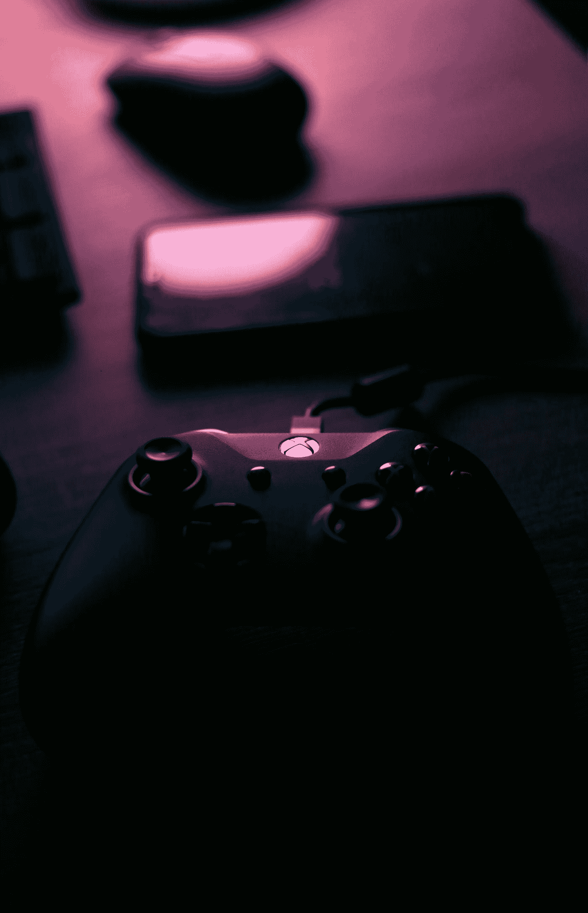
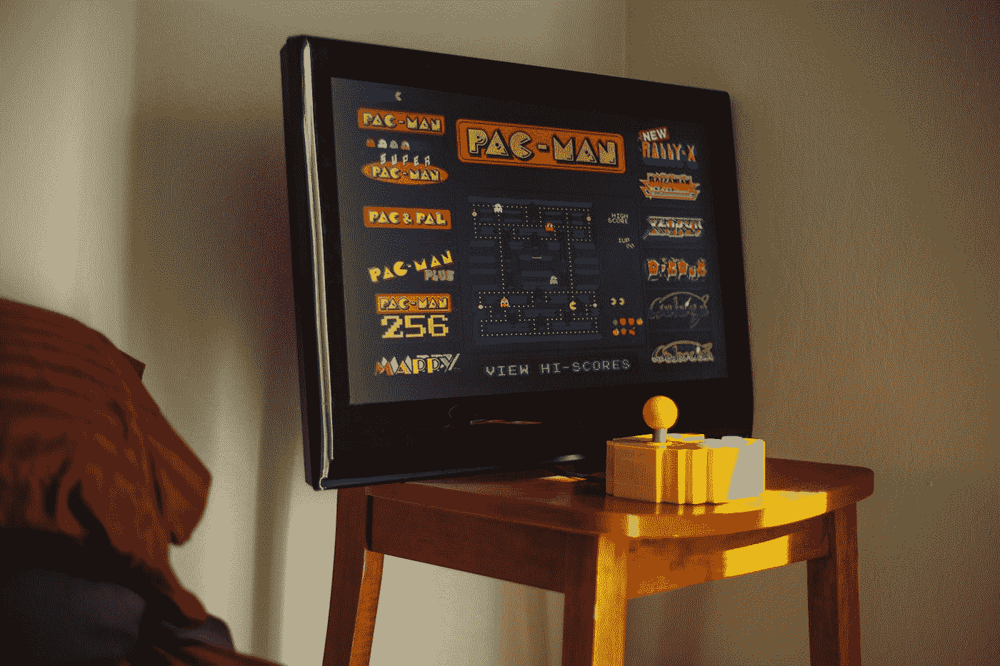
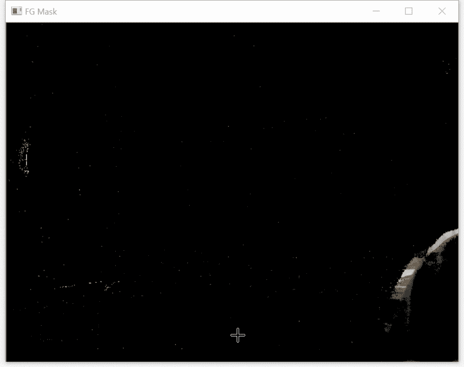
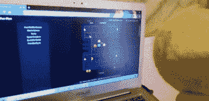

# 均值漂移算法和运动控制

> 原文：<https://towardsdatascience.com/the-mean-shift-algorithm-and-motion-controls-ee0005155943?source=collection_archive---------24----------------------->

## 或者，我如何用网球玩吃豆人



亚历克斯·埃斯库在 [Unsplash](https://unsplash.com?utm_source=medium&utm_medium=referral) 上的照片

在之前，我已经写过均值漂移算法[，但是我从来没有给出它的实际应用。我最终对这篇文章感到不满意，所以我想重温这个话题，并将其应用到现实世界中。](/mean-shift-and-cam-shift-object-tracking-f1c2c515b6bc)

均值漂移算法可以利用颜色实时跟踪物体。颜色与背景越明显，效果越好。虽然物体跟踪是计算机视觉中的一个大话题，但我想把重点放在游戏上。

运动控制，一种追踪玩家身体运动并将其转化为计算机输入的技术，已经在游戏中使用了好几次。虽然任天堂的 Wii 进入了大多数人的脑海，但它使用红外传感器与主机进行通信。相比之下，Xbox 的 [Kinect](https://en.wikipedia.org/wiki/Kinect) 和 Playstation 的 [Move](https://en.wikipedia.org/wiki/PlayStation_Move) 使用实际的摄像头来跟踪运动。

虽然控制台采用专门的硬件，但普通的消费级计算机或带摄像头的笔记本电脑也可以利用相同的原理。

# 均值漂移算法背后的理论

像所有聚类算法一样， [mean shift](https://en.wikipedia.org/wiki/Mean_shift) 试图在数据集中找到密集的区域。与更流行的 K-Means 聚类不同，mean shift 不需要估计聚类的数量。

相反，它为数据集创建一个[核密度估计(KDE)](https://en.wikipedia.org/wiki/Kernel_density_estimation) 。该算法将迭代地将每个数据点移动到更靠近最近的 KDE 峰值一小段距离，直到满足终止标准。最终结果将产生一组定义明确的分类。

显然，均值漂移算法对无监督学习很有效，但它在计算机视觉中的应用并不清楚。

本质上，图像中的每个像素都可以被认为是一个数据点。默认情况下，每个像素传达三条颜色信息:红色、绿色和蓝色通道，统称为 RGB 颜色空间(尽管大多数计算机视觉专家更喜欢使用 [HSV](https://en.wikipedia.org/wiki/HSL_and_HSV) 或 [CIELAB](https://en.wikipedia.org/wiki/CIELAB_color_space) ，因为它们在不同的光照条件下变化不大)。

当均值偏移算法应用于图像时，得到的聚类表示存在的主要颜色。例如，考虑下图:


在 [Unsplash](https://unsplash.com?utm_source=medium&utm_medium=referral) 上[paweczerwiński](https://unsplash.com/@pawel_czerwinski?utm_source=medium&utm_medium=referral)拍摄的照片

当应用时，均值偏移将产生红色、黄色、绿色、蓝色、紫色和白色的聚类。这个过程被称为[图像分割](https://en.wikipedia.org/wiki/Image_segmentation)。

然而，为了将它用于对象跟踪，需要获取初始图像的颜色配置文件，然后将其与聚类进行比较。感兴趣的区域被定义为最接近的匹配聚类中的点。

# 优势、劣势和其他考虑因素

如前所述，在视频帧内选择并跟踪与预定义颜色最接近的聚类。这就提出了如何选择预定义颜色的问题。

通常，在视频的第一帧中，围绕要跟踪的对象绘制感兴趣的区域。这种方法允许在视频的精确光照条件下获得对象的确切颜色。不幸的是，这意味着物体的位置和大小是预先知道的。

要跟踪的对象也需要是一种独特的颜色。例如，均值漂移算法将能够跟踪白色背景上的普通红球；然而，如果红球在红色背景上，算法将跟踪它。

最后，感兴趣区域的大小永远不会改变。当跟踪一个对象时，不管它离摄像机有多远和多近，跟踪框都保持相同的大小。

# 对运动控制器使用均值漂移



Giorgio Trovato 在 [Unsplash](https://unsplash.com?utm_source=medium&utm_medium=referral) 上拍摄的照片

对象跟踪有许多应用，但在这种情况下，它将用于将运动转化为计算机输入。均值漂移算法将跟踪一个网球，选择它是因为它无处不在，是单色的，并且[有独特的颜色](https://www.cnn.com/style/article/artsy-tennis-ball-design-artsy/index.html)，并将它的位置转换为模拟的箭头键按压。

最终用户必须将网球放在摄像机附近来校准算法。一旦完成，用户应该能够上下左右移动网球来控制屏幕。

虽然箭头键可以用来在任何程序中输入命令，但这次演示将玩[吃豆人](https://pacman.cc/)。

# 代码实现

```
import numpy as np
import cv2
```

在进行任何计算机视觉之前，需要导入两个库:处理高效计算的 NumPy 和处理计算机视觉任务的 OpenCV。

```
# Capture the current frame from the webcam
video = cv2.VideoCapture(0)
_, init_image = video.read()
```

VideoCapture 方法打开默认的网络摄像头，read 方法读取它捕获的第一帧。此时，用户应该将网球靠近摄像机。

```
# set up initial coordinates for the tracking window
x, y = 100, 100
# Set up initial size of the tracking window
height, width = 100, 100
track_window = (x,y,width,height)# set up region of interest (roi)
roi = init_image[y:y + height, x:x + width]
```

定义了 x 和 y 坐标对以及高度和宽度变量来创建感兴趣区域(ROI ),它只是网球的位置。

在这种情况下，ROI 从点(100，100)开始，向下和向右延伸 100 个像素。由于终端用户被要求将网球放在靠近摄像机的地方，这个 ROI 可能会捕获它的一个子部分。然而，如果用户没有适当地放置球，ROI 将捕获背景中某个物体的颜色，例如手或墙。

请注意，因为在均值偏移算法中跟踪窗口的大小不变，所以 ROI 将始终是一个 100 像素宽的正方形。根据相机的分辨率或用户与相机的距离，可能需要进行调整。

```
# Convert to HSV color space
hsv_frame =  cv2.cvtColor(init_image, cv2.COLOR_BGR2HSV)# Apply mask to make sure pixels are within range
mask = cv2.inRange(hsv_frame, np.array((0, 20, 20)), np.array((180, 250, 250)))
```

这个部分只是将图像转换到 HSV 颜色空间，并确保所有像素都在合理的范围内。任何欠饱和或过饱和的像素值都被排除。

```
# Calculate HSV histogram
hist_frame = cv2.calcHist([hsv_frame], [0], mask, [180], [0,180])
cv2.normalize(hist_frame, hist_frame, 0, 255, cv2.NORM_MINMAX)
```

为 ROI 计算直方图并进行归一化。该值将用于跟踪每个后续视频帧中最近的簇。

```
# terminate at either 10 iterations or move by atleast 1 pt
term_crit = (cv2.TERM_CRITERIA_EPS | cv2.TERM_CRITERIA_COUNT, 10, 1 )
```

如前所述，均值漂移算法反复筛选点，直到满足终止标准。这一行中定义的元组为算法停止并声明新的 ROI 创建了两个条件。如果 ROI 的质心没有移动，或者完成了 10 次迭代，均值偏移将完成。

前一个条件是直观的。如果网球不动，就不需要计算新的位置。后一种情况与处理时间有关。均值偏移的更多迭代将以时间为代价创建更准确的 ROI。将这个值设置得太高可能会产生滞后的结果，但是设置得太低可能会偏离 ROI。

最终，设置一个合适的终止条件就是[金发女孩问题](https://en.wikipedia.org/wiki/Goldilocks_principle#:~:text=The%20Rare%20Earth%20Hypothesis%20uses,called%20a%20%22Goldilocks%20Planet%22.)。

```
# Get the dimensions of the video 
frame_height = init_image.shape[0]
frame_width = init_image.shape[1]
```

这几行只是检索视频帧的宽度和高度。这些以后会用到。

```
from pynput.keyboard import Key, Controller# initialize keyboard controller
keyboard = Controller()# Alt + Tab over to another window
with keyboard.pressed(Key.alt):
    keyboard.press(Key.tab)
    keyboard.release(Key.tab)
```

运动控制器需要为设备创建输入。因此，模拟按键的 Pynput 库被导入并初始化。使用 with 语句时，在按下 tab 键的同时按下 alt 键。这模拟了激活另一个窗口的 alt + tab 快捷键。

在这个例子中，另一个窗口是 Pacman 的在线版本，它必须在运行代码之前*打开。虽然更好的方法可能涉及打开浏览器的代码或运行打开可执行文件的命令，但这提供了一些使用 Pynput 的额外实践。*

```
# Initialize background subtractor
subtraction = cv2.createBackgroundSubtractorKNN()
```

当背景噪音最小时，均值漂移效果最好。这一行初始化 OpenCV 的背景减法。虽然实现的细节可能需要另一篇文章，但基本思想是该算法将任何静止的东西视为背景，将任何移动的东西视为前景。假设运动控制器只需要观察移动的输入，这是理想的工作方式。

```
while True:

    ret, frame = video.read() if ret:
```

初始化一个无限循环，并读取视频馈送。ret 变量是一个布尔值，它指示摄像机是否正确地进行了流式处理。该帧是流中的当前视频帧。

如果 ret 变量为真，则代码继续执行。

```
 # Apply background substraction
        mask = subtraction.apply(frame)

        # Create 3-channel alpha mask
        mask_stack = np.dstack([mask]*3) # Ensures data types match up
        mask_stack = mask_stack.astype('float32') / 255.0           
        frame = frame.astype('float32') / 255.0 # Blend the image and the mask
        masked = (mask_stack * frame) + ((1-mask_stack) * (0.0,0.0,0.0))
        frame = (masked * 255).astype('uint8')
```

第一行将背景减法应用于视频帧，并创建一个简单的二进制蒙版。由于二进制掩码是一个二维矩阵，而视频帧是一个三维矩阵，因此在它们的维度一致之前，它们不能进行有意义的交互。

mask_stacked 变量只是将掩码乘以 3，并将掩码的三个实例“堆叠”在彼此的顶部。结果是可以与视频帧交互的三维矩阵。接下来，遮罩和视频帧都要进行一些必要的类型转换，然后将它们混合在一起。

如果显示生成的图像，它看起来会像这样:



```
 # Convert to HSV
        hsv = cv2.cvtColor(frame, cv2.COLOR_BGR2HSV) # Apply back projection
        dst = cv2.calcBackProject([hsv],[0],hist_frame,[0,180],1) # apply mean shift to get the new location
        track_window = cv2.meanShift(dst, track_window, term_crit)[1]
```

移除背景后，视频帧被转换为 HSV。对该帧应用反投影，然后应用实际的均值偏移算法。track_window 变量现在是跟踪窗口右上角的 x 和 y 坐标，以及它的宽度和高度。

```
 # Calculate the center point
        center = (track_widnow[0] + width/2, track_window[1] + height/2)
```

此行不使用右上角，而是计算跟踪窗口的中心。如果 mean shift 可以找到网球，并正确地以它为中心，这将允许程序根据球的中间移动的位置给出输入。这对最终用户来说更直观。

```
 if center[1] > (frame_height * 0.5):
            keyboard.press(Key.down)
            keyboard.release(Key.down)
            print("down")
        elif center[1] < (frame_height * 0.20):
            keyboard.press(Key.up)
            keyboard.release(Key.up)
            print("up")

        if center[0] > (frame_width * 0.5):
            keyboard.press(Key.left)
            keyboard.release(Key.left)
            print("left")
        elif center[0] < (frame_width * 0.2):
            keyboard.press(Key.right)
            keyboard.release(Key.right)
            print("right")
```

现在球被跟踪了，它的运动和位置可以被翻译成计算机输入。如果球的中心位于屏幕的上半部分，将按下向上箭头的模拟。同样，如果球的中心在屏幕的底部五分之一，将按下向下箭头的模拟。同样的逻辑也适用于左和右。

这些比例可能看起来很奇怪，但它们通常会比保持完美的比例带来更好的结果。不过，这些比例可能会根据特定的用户体验进行调整。

```
 else:
        breakvideo.release()
```

最后几行清理了代码。else 连接回 ret 变量，如果摄像机不能正确读取视频，它将中断循环。最后一行将简单地关闭相机。

# 结果和结论

这段代码的最终目标是用网球玩吃豆人游戏。这听起来像是一个有趣的、愚蠢的、听起来不可能的挑战，但事实证明是可行的。下面展示了我的演奏经验。



运行中的运动控制器。作者制作的视频

虽然没有明显的视觉线索，但均值漂移算法成功跟踪了网球的位置。通过 Pacman 相应移动的证据，该程序还将球的位置和移动转化为输入。因此，可以玩吃豆人游戏。

不幸的是，缺乏经验。在视频中有点明显，有时球的移动和屏幕上的输入之间有滞后。对于任何类型的游戏，滞后应该接近于零。同样，球的运动轨迹也不完美。好几次 ROI 会卡在一个角落里，Pacman 会卡在那里，直到一个幽灵结束游戏。

虽然这个程序提供了一个成功的概念证明，但在作为最终产品提供之前，它需要更多的改进。