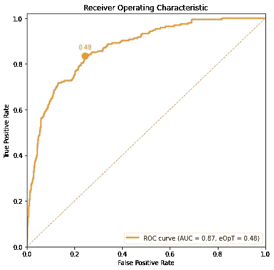
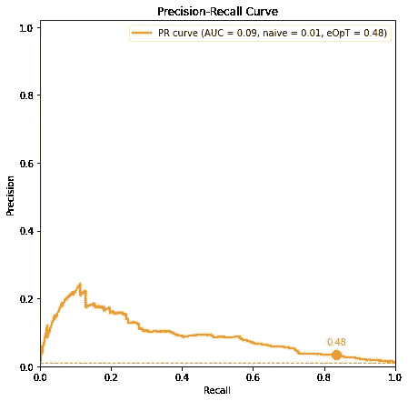
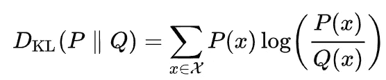
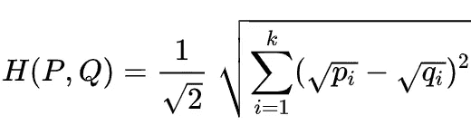
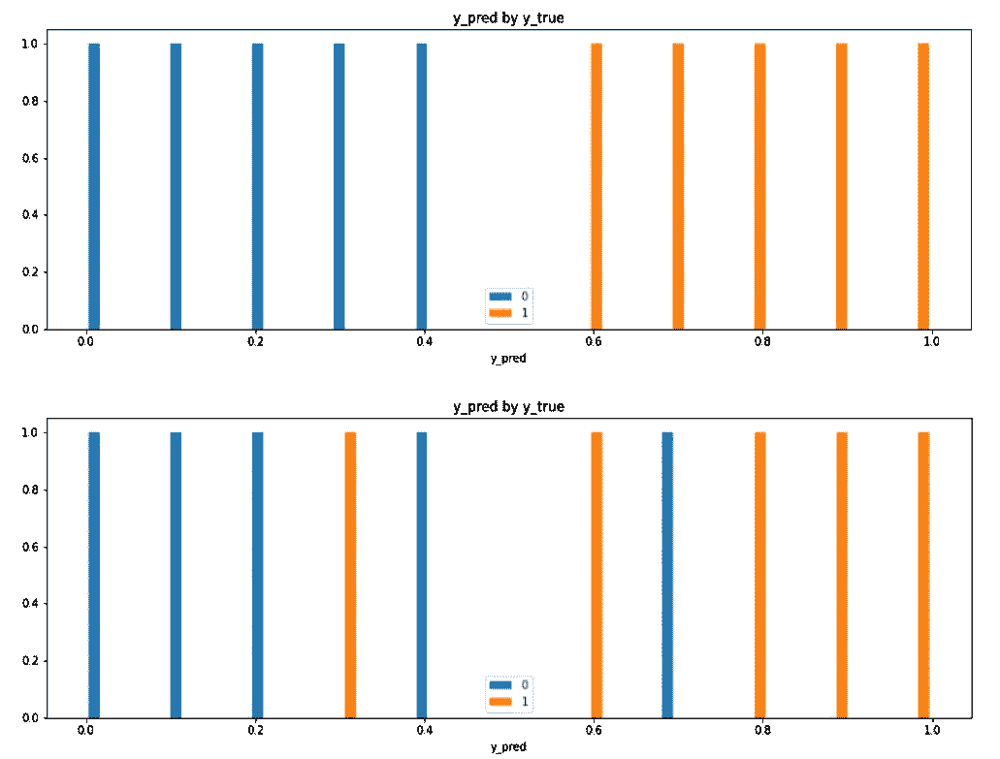
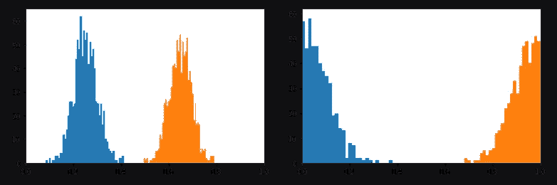
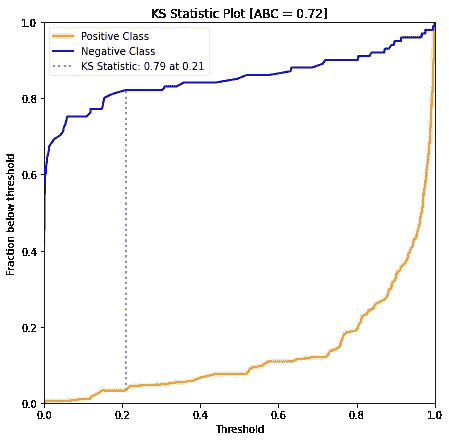
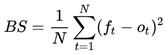

# 公制:如何正确测量你的模型

> 原文：<https://towardsdatascience.com/the-metric-system-how-to-correctly-measure-your-model-17d3feaed6ab?source=collection_archive---------19----------------------->

## 深入到模型评估指标的世界，你不知道你需要知道——直到现在

*本帖中用于生成图形和曲线间 KS 面积计算的代码是* `[dython](http://shakedzy.xyz/dython/)` *库*的一部分


图片来自 [Pixabay](https://pixabay.com/?utm_source=link-attribution&utm_medium=referral&utm_campaign=image&utm_content=1897778)

这是一个你作为数据科学家可能遇到的经典场景——你需要在一个相当小且不平衡的数据上训练一个二元分类器，比如一个简单的逻辑回归——例如:CTR 预测(点击率，意思是——用户是否会点击广告)。所以再一次，你没有很多数据，而且它是高度不平衡的，大约在 1000:1 的负/正比率附近。

那么，你的目标是在给定二进制标签的情况下预测点击发生的概率——换句话说，你将预测一个*连续的*数，而真正的标签是二进制类。没什么不寻常的——你可能已经知道你将如何实现它。但是你打算如何*衡量*你的分类器有多成功呢？您将使用哪个指标？我刚刚发现，这并不像我想象的那么简单。让我给你介绍一下我刚刚学到的东西。

取自 Giphy.com

# 明显的“不”

每当我们需要提出一个度量标准时，考虑准确性是我们人类的天性，准确性是由整个数据集中正确分类的样本总数来定义的。由于我们的数据集高度不平衡，该指标偏向于多数类，因此即使模型预测总是 0，准确性仍然非常高。

这里值得一提的是，不建议对这个特定数据集进行 1:1 的负/正比率的二次采样，因为我们已经说过数据集很小，这意味着我们无法承受丢失这么多有价值的数据。另一方面，对正类进行过采样是没有意义的，因为它与我们试图检查的东西——模型的概括能力——正好相反。因此，我们必须接受我们的数据是有偏差的这一事实，并找到一个可以处理它的度量标准。

精确度和召回率也不是我们要找的，因为它们只关注积极的一类，只能描绘出部分的画面。虽然有一些用例非常适合我们，但情况并非总是如此——如在 CTR 预测中——我们实际上关心这两个类，并希望对它们进行准确分类。F1 分数也是不可行的，因为它基本上是这两个指标的混合。

# 曲线下面积，以及为什么它不起作用

我上面提到的指标有一个隐含的问题，我们忽略了。所有基于混淆矩阵的指标都是针对二进制标签*和*输出的，也就是说，真正的标签是 0 和 1，输出也是如此。但是我们的模型预测的是*概率*，而不是二元类。为了将概率转换为二进制类，我们需要决定一个阈值，其中所有高于它的概率将被分类为 1，其余的为 0。首选阈值是 0.5，但这不一定是最佳选择(如果你不确定为什么，可以看看[我写的这篇博文](https://shakedzy.medium.com/hard-roc-really-understanding-and-properly-using-roc-and-auc-13413cf0dc24))。这意味着上述度量不仅偏向多数类，它们也可能因我们的阈值决定而有所偏差。不好。

这就是为什么 ML 世界中最常见的指标之一是 ROC AUC(曲线下受试者操作特征面积)。我假设你对它很熟悉，但如果你不熟悉的话，可以查看上面段落中的链接。现在，ROC 曲线帮助我们找到将概率转换为二进制类别的最佳阈值。但是，等等，我们说我们想要预测概率，为什么我们需要一个度量来帮助我们找到一种方法将其转换为二进制标签？



ROC 曲线。虚线标记了简单分类器的曲线，并且 *eOpT 标记了估计的最佳阈值*

答案是我们没有。但是我们还可以从 ROC 曲线中学到另一件事——分离。你看，模型越好——正样本围绕 1 的概率越多，负样本越接近 0。所以模型越好，就越能区分正负概率分布。我们实际上可以在 ROC 曲线中看到这一点——分离越好，曲线下的面积越大。因此，我们可以使用曲线下面积，或 AUC，作为帮助我们评估模型的指标。太好了！—但也不尽然。

正如 Jason Brownlee 的博客文章所清楚解释的，ROC 曲线实际上也受到数据不平衡的影响，因为两个轴上的指标混合了两个类别。因此，他建议使用另一条曲线:精确度-回忆曲线，我们在 y 轴上画出精确度，在 x 轴上画出所有阈值的回忆。



一条公关曲线。虚线标记了一个简单的(未训练的)模型的曲线

等一下。几段前我解释了为什么这两个指标在我们的案例中没有用。我改变主意了吗？不。我不是建议使用这两个指标，而是使用它们创建的曲线。因为，就像在 ROC 曲线中一样，这条曲线的 AUC 是对模型的类别分离的度量——越高越好，最大值为 1。所以我们可以用 PR AUC 来代替？嗯，是的——但是有一个问题。

当考虑 ROC AUC 时，我们可以肯定地知道一个简单的分类器，意思是一个没有学到任何东西的分类器，将总是有一个 AUC = 0.5。这意味着我们有一个固定的基线，这使我们能够随着时间的推移跟踪模型的 ROC AUC 得分，因为它定期在不同的数据集上进行训练。只要所有数据集都来自相似的分布，模型的 ROC AUC 得分应该大致相同。

但是对于 PR AUC，事情有点不同，因为一个简单模型的精度-召回曲线是一条固定精度的水平直线。价值是什么？它是整个数据集中阳性样本的比例。这意味着我们用来比较模型的基线是不固定的，取决于我们使用的数据集。如果我们总是使用相同的测试集，这不应该是一个问题，但在现实生活中从来不是这样。

我们如何解决这个问题？一种方法是使用模型的 PR AUC 和天真模型的 PR AUC 之间的比率(在完全相同的数据上测试)作为衡量标准，但随着时间的推移，这可能变得太不稳定，很难用于比较。因此，虽然有可能使用它，但我相信我们都想要一个不那么嘈杂的指标。

# 比较分布

最后一节的关键词是*分离*。想一想——我们在这里真正追求的是类别分离——或者换句话说，我们在寻找一个模型来预测两个类别的两种完全不同的概率分布。比较两个分布几乎等同于计算这两个分布的 KL 散度:



离散 KL-散度。摘自维基百科

但是，虽然 KL-Divergence 通常是这种情况下的首选指标，但在我们的情况下，它实际上不是一个好的指标，原因有两个:

1.  KL 散度的输入顺序很重要。如果 *P* 和 *N* 是正负概率分布，那么 *KL(P，N)*≦*KL(N，P)。这是导致灾难和错误比较的原因。*
2.  从技术上讲，我们并不真正知道分布，因为我们只持有从这些分布中抽取的值的列表。这意味着我们使用离散的 KL 散度。为什么这很重要？因为我们正在运行从 0 到 1 变化的概率预测值。碰到一个没有样本的空桶的可能性非常高，尤其是对于小数据集——当这种情况发生时，KL-Divergence 会爆炸(每当 *P* 或 *Q* 为 0 时，见上面的公式)。虽然我们可以通过添加一些足够小的常数 *ε* 到 *P* 和 *Q* 来从技术上解决这个问题，但是度量变得高度依赖于该常数的值，这使得它对手动配置过于敏感。

为了解决这两个问题，我们可以使用一个不太为人所知的分布比较指标:海灵格距离:



离散海灵格距离。摘自维基百科

分立外壳既对称又不会在撞击空桶时爆炸。但是这个标准显然也有问题。下面描述的两个分布具有相同的海灵格距离，满分为 1，这显然不是我们想要的。我们需要别的东西。



两种不同的分布，一种具有完全分离，另一种没有，都具有相同的海灵格距离 1

# 你只需要分离？

这整个分布比较的事情开始在我的头脑中制造混乱，所以我再次问自己——我真正想要衡量的是什么？再次，*分离。所以我决定给相关比率一个机会。我在[寻找分类相关](https://shakedzy.medium.com/the-search-for-categorical-correlation-a1cf7f1888c9)中简要讨论过它，所以让我跳到它做什么的底线:给定一组由连续数和类别组成的元组，它回答了这个问题:*我们能多好地知道某个连续数与哪个类别相关联？这正是我们在这里寻求的——给定一个预测的概率，它与正确的类别相关联的可能性有多大？相关比率正好回答了这个问题，因此它似乎是我们的完美衡量标准。差不多了。**

还有另一件我们关心的事情，我们无法从这个度量中得到——那就是*这两个分布是如何分布的*,而不仅仅是它们被分开的有多好。在第一段中，我提到最佳模型将有两个独立的分布，正分布和负分布的质心分别尽可能接近 1 和 0。换句话说，我们不仅要寻找分离，还要寻找*校准*——也就是说，预测与实际标签有多接近。这条信息很重要，正如我们在下图中看到的那样，然而相关比率以及我们迄今为止遇到的所有其他指标都没有考虑到这一点。



两组完全分离的正负分布。我们更喜欢右边的模型，因为质心是 0 和 1(即使方差是左边模型的两倍)。尽管如此，左侧和右侧模型的相关比率分别为 0.97 和 0.98，因此在这种情况下，这不是一个非常有用的指标

事实证明，我真正追求的度量标准是我必须在另一个分布比较测试(称为 Kolmogorov-Smirnov 测试)的基础上自己创建的。我将跳过 KS 测试的一般用途，而把重点放在我们如何用它来估计一个二元分类器上。与我们目前遇到的所有其他曲线不同，对于 KS 测试，我们在同一个图上绘制两条曲线。对于每个可能的阈值(就像在 ROC 中一样)，我们从正例的总数中，画出正确分类低于该阈值的正例的分数。然后我们做同样的事情，但是对于反面的例子。我们得到一个类似这样的图:



阈值下正负比值的 KS 检验曲线。估计的最佳阈值被绘制为灰色垂直线

上面的图告诉我们，例如，对于阈值 0.8，大约 20%的正面例子接收到低于该阈值的预测，并且大约 90%的负面例子也被发现低于该阈值。与 ROC 曲线一样，KS 曲线也允许我们找到分离的最佳阈值(由垂直线表示)，但与 ROC 曲线不同，KS 检验对数据不平衡具有弹性，因为它将阳性和阴性样本分离为两条不同的标准化曲线。

这看起来像是优化阈值的另一个指标，但这里还隐藏着其他东西。考虑一个完美的分类器——当标签为 1 时，它准确地预测概率为 1，当标签为 0 时，它准确地预测概率为 0。这些曲线会是什么样的呢？你答对了——正曲线将立即下降到 0，并保持在那里(至于任何恰好低于 1 的阈值，将没有正样本)。另一方面，负曲线将持续停留在 1(对于任何高于 0 的阈值，将找到所有负样本)。这将在两条曲线之间创建一个完美的正方形，任何偏离这个完美分类器的地方都会缩小曲线之间锁定的区域。因此，曲线之间的 KS 面积是我们寻求的度量，对于完美的分类器，最佳值为 1，对于任何其他情况，值都较低。是啊！这是我们非常需要的指标，它甚至有一个超级酷的缩写:ABC。完美！

想自己用？这很简单，因为:

```
from dython.model_utils import ks_abc
ks_abc(y_true, y_pred)
```

万岁！

取自 Giphy.com

# 在你走之前还有一个指标

KS ABC 指标在我们的特定情况下处理离散校准(即在秤的两个边缘发现真实标签的情况)，但在更一般的情况下，我们需要另一个指标进行离散校准。我遇到了这个我个人喜欢的指标，所以我想在这里提一下。它叫做欧石南乐谱，看起来像这样:



Brier 分数，其中 f 标记预测(预报)，o 标记真实标签(结果)。摘自维基百科

它与 MSE 的相似性使得它非常直观，并且由于它的平方性质，它自动对非常偏离的预测进行更严重的惩罚，而不是接近的预测。如果数据集是不平衡的，你可能会想使用一个*加权* Brier 分数，给予少数民族类更多的重视。这也可以用 4 行代码来完成:

```
from sklearn.metrics import brier_score_loss
positive_weight = (len(y_true) - sum(y_true)) / sum(y_true)
sample_weight = [positive_weight if i == 1 else 1 for i in y_true]
brier_score_loss(y_true, y_pred, sample_weight=sample_weight)
```

现在，你可能已经注意到我明确提到我们处理了*离散*校准，这意味着模型的预测围绕真正的标签有多好。另一个同样重要的校准是*连续*校准，或*概率*校准。在这种情况下，校准意味着对于模型预测概率为 0.8 的所有样本，80%确实来自阳性类别。但是这篇博文已经有点太长了，所以我们将在以后详细讨论这个问题。

# 最后的话

我们有时倾向于忽视，或者根本没有投入足够的精力去考虑如何度量我们的模型。就像 ML 世界中的每个问题需要不同的方法和算法一样，度量标准也是一样的——它们必须匹配数据和模型，以及你真正寻求模型实现的*。没有选择正确的度量标准会蒙住你的眼睛，让你意识不到模型中的问题，或者提醒你注意噪音。我只能希望你发现这篇文章对你有用，无论你决定用什么尺度或标准来衡量它:-)*

取自 Giphy.com