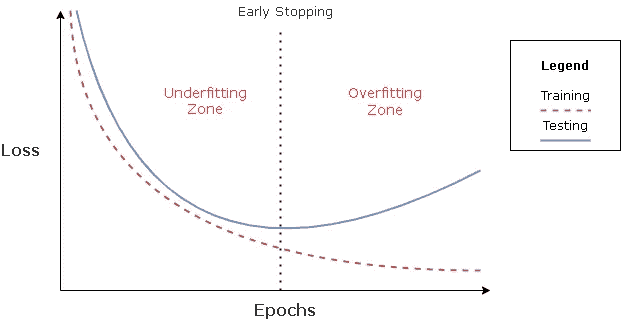

# 价值百万的问题:何时停止训练你的深度学习模型

> 原文：<https://towardsdatascience.com/the-million-dollar-question-when-to-stop-training-deep-learning-models-fa9b488ac04d?source=collection_archive---------7----------------------->

## 关于早期停止，或者如何通过知道训练你的神经网络多长时间来避免过拟合或欠拟合


[Icons8 团队](https://unsplash.com/@icons8?utm_source=medium&utm_medium=referral)在 [Unsplash](https://unsplash.com?utm_source=medium&utm_medium=referral) 上的照片

当训练深度神经网络时，首先要做出的决定之一是选择停止的时期。这并不容易。

如果训练在最佳时间之前停止，模型将没有时间从训练集中学习最重要的特征，因此为训练集和测试集提供不太适合的解决方案。

另一方面，如果在最佳时期之后停止训练，则在训练集中将实现高性能，但是当查看测试结果时，该模型将不会正确地概括，因为它已经过度调整到训练集。

幸运的是，有一种简单且广泛使用的方法可以避免这两个问题。它被称为**早期停止**，大多数深度学习框架都提供了一个开箱即用的接口来使用它。

> 几乎普遍应该使用早期停止。
> 
> — Ian Goodfellow 等人，深度学习。

# 提前停止

这种方法背后的思想在于训练集和测试集之间的比较，或者为了得到更可靠的结果[，训练集和验证集之间的比较。](/how-to-split-a-tensorflow-dataset-into-train-validation-and-test-sets-526c8dd29438)

通过分析随着时代的过去，训练和验证分裂中的错误或损失图，我们将看到最初两者都减少了。然而，验证误差将在某个时间开始变平或增加，而训练误差将继续减小。



说明欠拟合和过拟合区域以及最佳停止时期的训练示例。

验证集的目的是让我们了解我们的模型如何处理未经训练的数据。因此，当验证误差开始增加时，正好是模型过度适应训练集并且没有正确地概括新数据的时候。这是我们需要停止训练的时候。

## 观察哪个指标？

虽然验证损失是对模型应用提前停止时广泛使用的指标，但它并不总是最相关的。

有时候，根据用例选择一个代表模型性能的指标可能会更好。例如，它可以是准确度、精确度、召回率或度量的组合。

## 具体什么时候停止？

现在，我们知道了应该观察哪些指标，以及当验证指标不再随着培训指标一起提高或者开始表现得更差时，我们应该停止。

但是，观察到的指标可能会有多次起伏(由于神经网络的随机性)，这意味着在验证指标第一次变坏时就停止可能不是最佳解决方案(尽管这是最简单的方案)。

一些更复杂的停止训练的触发器如下(注意，它们也可以组合应用):

*   观察到的度量在给定数量的时期内没有改善(称为*提前停止* *耐心)。*
*   观察到的度量没有改善超过给定的被认为是改善的最小变化(称为 *min_delta* )。

> 请注意，当使用提前停止耐心时，当监控的精度没有超过在过去 X 个时期获得的**最佳结果**时，将执行触发。如果它提高了，但没有超过最好的结果，那就不算数。

## 如何在 TensorFlow 上使用？

[Keras](https://keras.io/) API 在 *model.fit()* 上提供了一个回调函数，用于在受监控的指标停止改善时停止训练。

*指标*参数接收您想要观察的指标的名称。在引用验证度量的情况下(更真实的结果，因为它近似于您的模型在生产中的行为)，名称必须以前缀“val_”开头。请注意，验证集必须传递给 *model.fit()* ，以便包含验证指标。

此外，您可以指定*耐心*和 *min_delta* ，如前一节所述。最后，*模式*参数指定所需结果是从高到低(最小模式)还是从低到高(最大模式)。例如，监控精度时，模式应为最大。

```
callback = [tf.keras.callbacks.EarlyStopping](https://keras.io/api/callbacks/early_stopping/)(
    monitor="val_loss",
    min_delta=0,
    patience=0,
    verbose=0,
    mode="auto",
    baseline=None,
    restore_best_weights=False,
)
```

> 这个回调还提供了一个参数`restore_best_weights`,用在性能最好的时期获得的模型权重来恢复结果模型。

要使用提前停止回调，我们只需将对象传递给 model.fit()中的 callbacks 参数，如下所示:

```
model.fit(train_images, train_labels, epochs=10, batch_size=1, callbacks=[callback], verbose=0)
```

## 如何观察多个指标？

根据您的使用情况，提前停止回调可能是不够的。例如，如果有一个带有多个输出的**模型**，并且想要监控一组指标而不是一个指标。或者诸如给定精度和召回率的 F-beta 分数的组合度量。

为了解决这个问题，你可以找到一个我基于 Keras 文档中的[可用实现](https://github.com/tensorflow/tensorflow/blob/v2.5.0/tensorflow/python/keras/callbacks.py#L1683-L1823)和一个 [StackOverflow 问题](https://stackoverflow.com/questions/64556120/early-stopping-with-multiple-conditions)开发的自定义回调。它接收一个*指标名称*参数，在这里，您可以指定一组指标，而不是单个指标。为了组合这些指标，[调和平均值](https://en.wikipedia.org/wiki/Harmonic_mean)的计算通常用于比率。

自定义提前停止回调，通过使用调和平均值计算将多个指标组合起来来监控它们。

在代码的最后，您可以找到一个示例，说明如何使用验证 f1 分数作为监控指标(即验证精度和召回率之间的调和平均值)来创建提前停止的回调。

## 有什么值得推荐的*耐心*？

大多数情况下，这个问题的答案在很大程度上取决于您使用的模型和数据集。

从我的经验来看，我建议首先运行一个具有大量历元的训练阶段，并从结果中直观地观察所监控的指标何时开始下降以及下降的速率。在那之后，我会用一些额外的时期运行下面的实验，直到它开始饱和，随着时期数量的减少，耐心会显著减少，同时记住，如果结果非常随机，耐心应该更大。

# 结论

在本文中，开发机器学习模型时最常见的挑战之一已经得到解决:何时停止训练。本文详细介绍了广泛使用的解决方案*提前停止*，解释了更高级的技术，如复杂的提前停止触发器以获得最佳结果，以及如何通过实现自定义回调来监控多个指标。

如果你想发现更多像这样的帖子，你可以在下面找到我:

*   [GitHub](https://github.com/angeligareta)
*   [领英](https://www.linkedin.com/in/angeligareta/)
*   [个人网站](https://angeligareta.com/)