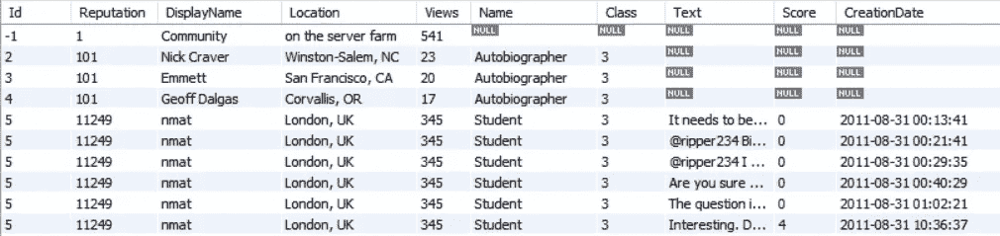
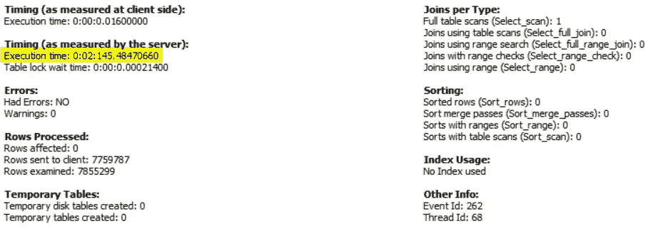
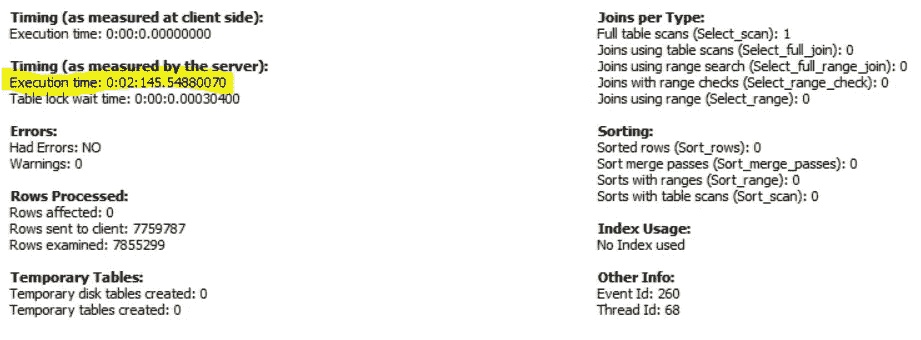

# SQL 中视图的误解

> 原文：<https://towardsdatascience.com/the-misconception-of-views-in-sql-92fa9fe8b89b?source=collection_archive---------16----------------------->

## *不是每个人都知道的 SQL 表的隐藏伪装*


**图片来自 Pixabay 由奇莫诺(**[https://pix abay . com/illustrations/question-mark-important-sign-1872665/](https://pixabay.com/illustrations/question-mark-important-sign-1872665/)**)**

I magine 您的团队领导告诉您，数据库管理员授予您从关系数据库(MySQL)访问特定表的权限，您可以使用这些表来执行数据分析或构建机器学习模型。后来，您意识到一些记录需要数据清理，您被分配了一个简单的任务，帮助您的团队领导直接在 SQL 上修改这些记录。当您使用像 UPDATE 和 SET 这样的关键字来执行简单的 SQL 更新操作时，您会遇到这个奇怪的错误，“**错误代码:1288。更新的目标表< table_name >不可更新**。

接下来您可能要做的事情是使用以下 MySQL 命令检查目标表是否不可更新:

```
SELECT table_name, is_updatable
FROM **information_schema.views**
```

当您发现该表不接受来自您这一端的更新操作时，您联系您的数据库管理员，请求更新该特定表的权限。稍后，数据库管理员回复如下:“**您的更新操作似乎不成功，因为您访问的表是一个不可更新的视图，这是由用于生成视图的后端查询决定的。**


**图片来自 Sammy-Sander 的 pix abay(**[)https://pix abay . com/photos/man-hearther-affective-flowered-5531026/](https://pixabay.com/photos/man-headache-frustration-frustrated-5531026/)**)**

如果您在与 SQL 数据库交互时第一次听到“view”这个词，那么这个响应可能会给您带来更多的困惑。作为一个在 SQL 中使用视图的初学者，我需要为您澄清一些误解，以便您在将来遇到视图时能够掌握使用视图进行数据分析。

## 误解 1:“视图”和“表格”术语是可以互换的。

SQL 中的视图和表不都意味着这些查询的输出是结构化的表格格式吗？虽然从最终用户的角度来看，这是不可否认的事实，但这两个术语之间存在微妙的差异，非 SQL 专家容易混淆。SQL 中的表是以结构化方式包含数据本身的数据库对象，而 SQL 中的视图是表示“虚拟”表中保存的选择查询的数据库对象。

你注意到这两个术语之间的重要区别了吗？视图与 SQL 中的表不同，因为视图不像表那样在内存中存储任何现有数据。每当您在 SQL 中与视图进行交互时，您实际上是在运行一个未知的后端查询，该查询获取存储在您可能无法直接访问的表中的相关信息。


**图片来自 Pixabay 由 openclippart-Vectors(**【https://pixabay.com/vectors/deceive-deception-lies-1299043/】**[)](https://pixabay.com/vectors/deceive-deception-lies-1299043/)**

大多数数据分析师和数据科学家在从 RDBMS(关系数据库管理系统)接收内部或外部数据时，应该意识到术语上的这种差异。有时，当您认为从 RDBMS 接收的数据源是真实的来源时，出于隐私或安全原因，该底层数据源可能有一些隐藏的真实情况。

SQL 中的视图可以方便地隐藏敏感信息或复杂的查询，这些查询用于生成其他利益相关者经常使用的结果。有时，对于进一步的数据分析或机器学习任务至关重要的属性存储在 RDBMS 的表中，但无意中被排除在视图之外。拥有从 SQL 视图中查询数据的附加信息，可以节省您与数据库管理员沟通以获取进一步数据分析工作所需信息的大量时间。

那么，您如何知道您查询的是视图中的数据而不是表中的数据呢？以下命令非常简单，您可以快速检查是否正在使用 SQL 表或视图:

```
SHOW FULL TABLES -- For MySQL only
```

请注意，不同的 SQL 工具可能使用不同的语法来检查数据库的表或视图的详细信息。快速的谷歌搜索会给你各种 SQL 工具使用的确切语法的答案。

## 误解 2: SQL 视图不可更新，因为数据库管理员不提供更新权限


**图片来自 Alpha Stock Images 的 Nick Youngson(**[https://www . thebluediamonggallery . com/typewriter/d/database-administrator . html](https://www.thebluediamondgallery.com/typewriter/d/database-administrator.html)**)**

与视图交互的 SQL 用户可能会误解视图不可更新，因为数据库管理员没有为他们提供更新记录的权限。这种说法是一种误解，需要进一步澄清。尽管数据库管理员允许您更新 SQL 中的记录，但是对于不可更新的视图，您无能为力。

由于视图通常会屏蔽后端的 SQL 查询，某些 SQL 视图规范是不可更新的，这是使用视图的一个缺点。关于最新 MySQL 版本中可更新的视图，您可以参考下面的 MySQL 官方文档:

[https://dev . MySQL . com/doc/ref man/8.0/en/view-updatability . html](https://dev.mysql.com/doc/refman/8.0/en/view-updatability.html)

不同的 SQL 软件可能有不同的限制，这些限制与随时间变化的视图有关，所以我强烈建议您查看您选择的 SQL 工具的官方文档，以了解更多详细信息。

## 误解 3:如果我的 SQL 查询运行非常慢，提高查询性能的解决方案是使用视图。


**图片来自 pix abay by 422737(**[)https://pix abay . com/photos/Google-www-search-online-seek-485611/](https://pixabay.com/photos/google-www-search-online-seek-485611/)**)**

这种情况在谷歌上是一个很常见的问题，尤其是在基于我自己的谷歌搜索的 StackOverflow 社区上。也许，这是我们需要讨论的关于 SQL 视图的最大误解之一。一些论坛已经从理论上澄清了这种误解，所以我想通过自己在 Stack Exchange 的“**比特币**”相关主题的数据转储源中进行测试来揭穿这一点。

感谢 Stack Exchange 社区为各种讨论主题编译了广泛的数据集。使用的以下数据集可以从下面的主页获得:[https://archive.org/details/stackexchange](https://archive.org/details/stackexchange)

包含将数据导入 MySQL 所需的 XML 文件的确切 zip 文件来自下面的直接链接:

[https://archive . org/download/stack exchange/bit coin . stack exchange . com . 7z](https://archive.org/download/stackexchange/bitcoin.stackexchange.com.7z)

为了将数据从 XML 导入 MySQL，需要使用下面的代码预定义实际数据库模式的子集:

```
**CREATE DATABASE bitcoin;
USE bitcoin;****CREATE TABLE Users**(
 Id int primary key,
 Reputation int,
 CreationDate datetime,
 DisplayName varchar(100),
 LastAccessDate datetime,
 WebsiteUrl text,
 Location varchar(100),
 AboutMe longtext,
 Views int,
 UpVotes int,
 DownVotes int,
 AccountId int
);**CREATE TABLE badges**(
 Id int primary key,
 UserId int,
 foreign key (UserId) references users(Id),
 Name varchar(100),
 Date datetime,
 Class varchar(10),
 TagBased varchar(100)
);**CREATE TABLE comments**(
 Id int primary key,
 PostId int,
 foreign key (PostId) references posts(Id),
 Score int,
 Text longtext,
 CreationDate datetime,
 UserId int,
 foreign key (UserId) references users(Id),
 ContentLicense text
);
```

使用 Windows 命令行界面，以下代码在登录后直接将 XML 文件导入 MySQL:

```
**LOAD DATA LOCAL INFILE ‘<file path>’ INTO TABLE <table name>**
```

假设下面的查询获得了图 1 所示的结果:

```
SELECT users.Id, users.Reputation, users.DisplayName, users.Location, users.Views, badges.Name, 
badges.Class, comments.Text, comments.Score, comments.CreationDate
**FROM users**
**LEFT JOIN badges** ON users.Id = badges.UserId
**LEFT JOIN comments** ON users.Id = comments.UserId
```



**图 1:上述 SQL 查询的结果(图片由作者提供)**

下面的图 2 显示了不使用视图的查询执行统计。



**图 2:不使用视图的查询执行统计(作者图片)**

为了验证视图提高 SQL 查询性能的神话，下面的 SQL 操作使用相同的查询创建名为 user_info 的视图，以获得上面图 1 所示的结果:

```
**CREATE VIEW user_info** AS
SELECT users.Id, users.Reputation, users.DisplayName, users.Location, users.Views, badges.Name, 
badges.Class, comments.Text, comments.Score, comments.CreationDate
FROM users
LEFT JOIN badges ON users.Id = badges.UserId
LEFT JOIN comments ON users.Id = comments.UserId;**SELECT * FROM user_info;**
```

下面的图 3 显示了对同一个问题语句使用视图的查询执行统计。



**图 3:使用视图的查询执行统计(按作者分类的图片)**

通过比较图 2 和图 3，执行这个 SQL 查询所用的时间非常相似(2 分 25 秒),只有毫秒的微小差异。通过这两个示例，使用 SQL 视图并不能提高 SQL 查询的性能，因为 SQL 视图只存储已保存的 SQL 查询，而不存储执行前生成的任何结果。您可以通过比较带有视图的 SQL 查询和不带视图的 SQL 查询来测试一下性能差异。

希望我已经澄清了一些您听说过的关于 SQL 视图的常见误解。视图是数据分析师和数据科学家在使用关系数据库时应该了解的一个基本概念。虽然视图是一种方便的工具，可以通过简单、频繁的查询提供更容易的数据读取访问，但是不应该在所有 SQL 查询中误用视图，因为它有其局限性。

下次再见，查询愉快！

*请随意查看我的其他一些关于在 SQL 中使用关系数据库的文章。*

</the-enemy-of-database-normalization-grouping-values-into-single-string-with-sql-2294f40bb4d9>  <https://selectfrom.dev/sql-performance-of-window-functions-vs-subqueries-on-big-data-3fa533fc64bf> 