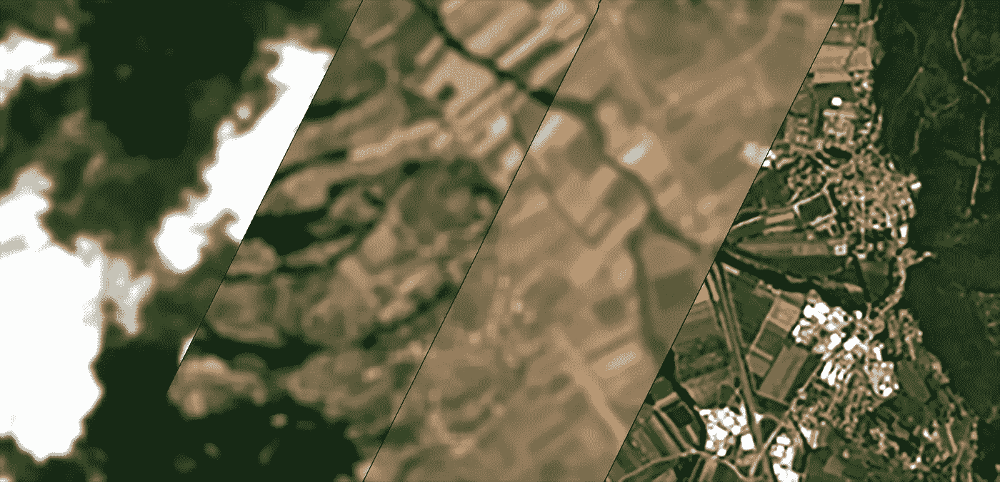
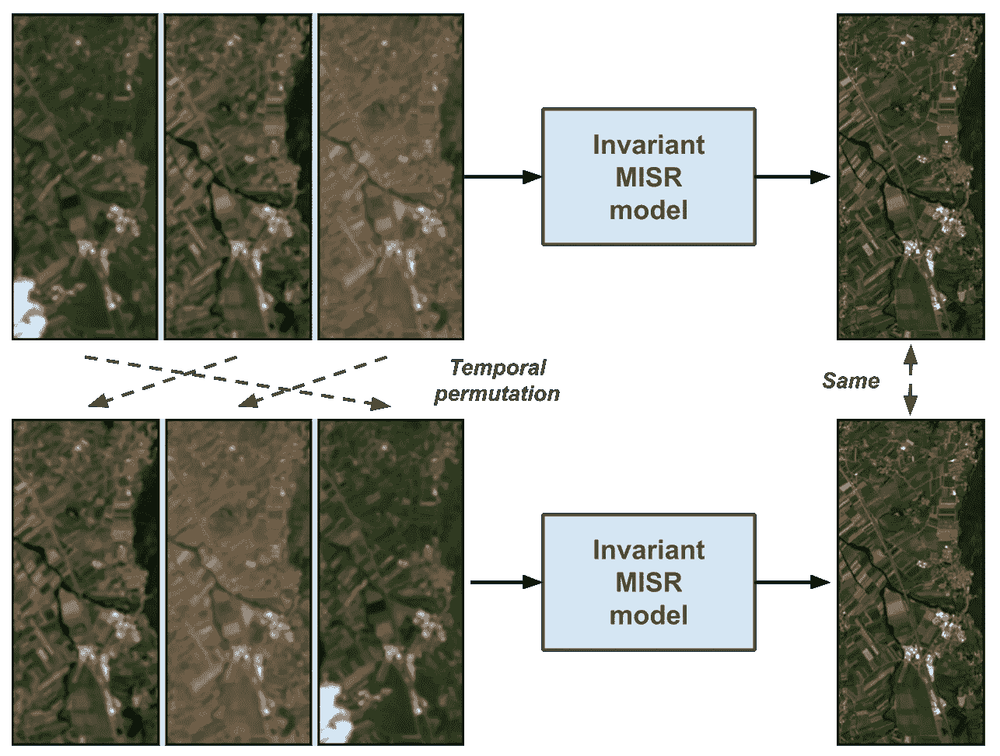
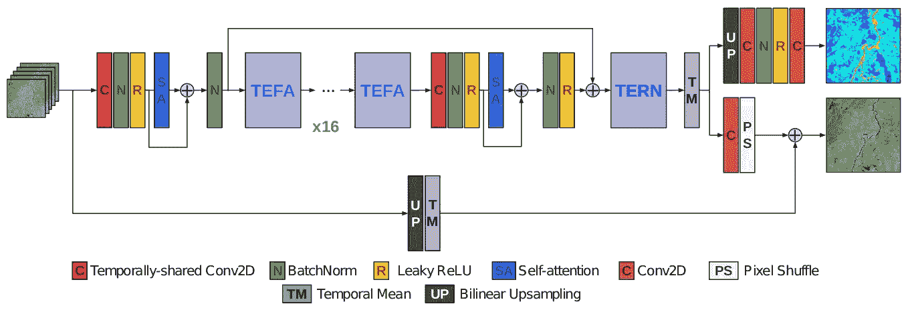
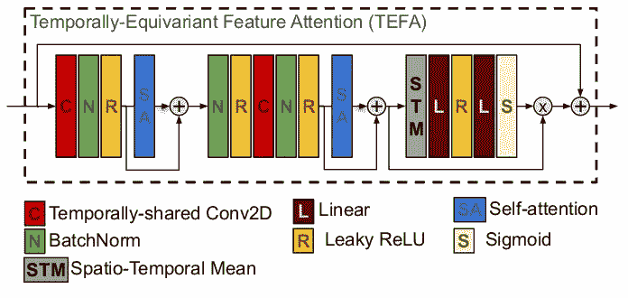
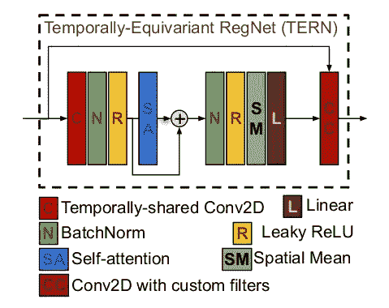
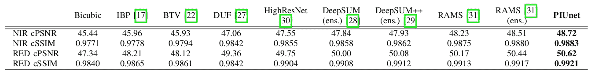
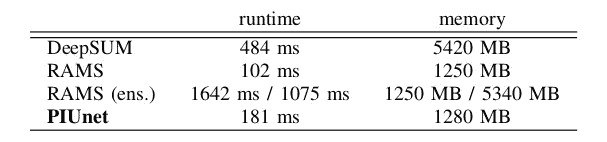
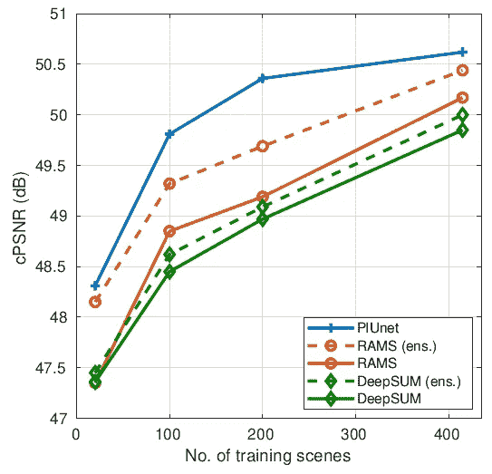
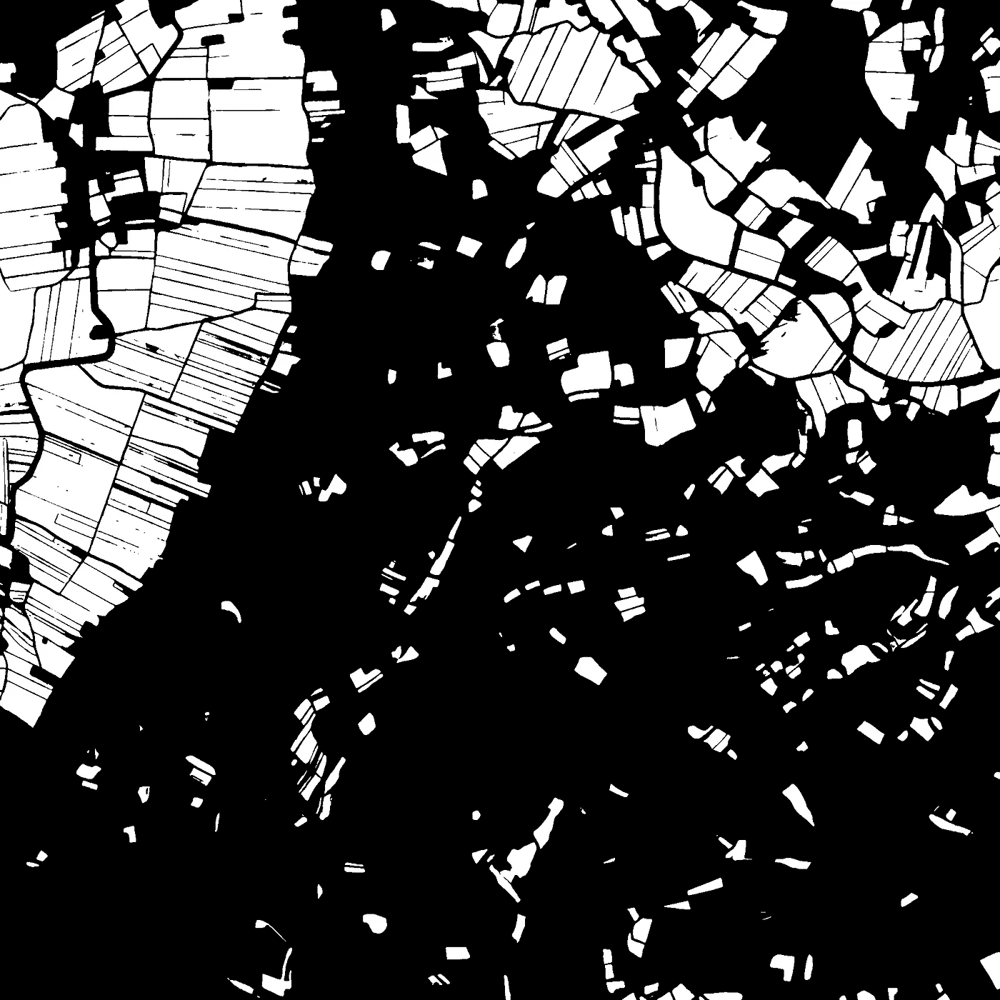

# 深度多时相卫星图像超分辨率中缺失的成分

> 原文：<https://towardsdatascience.com/the-missing-ingredient-in-deep-multi-temporal-satellite-image-super-resolution-78cac0f063d9?source=collection_archive---------19----------------------->

## [思想和理论](https://towardsdatascience.com/tagged/thoughts-and-theory)

## 置换不变性在单个模型中利用了集成的力量

多时相卫星图像实现超分辨率。修改欧空局哥白尼哨兵 2 数据，根据 CC BY-SA 3.0 IGO 许可。

由卫星获取的图像的**空间分辨率**永远不够，对于能够显示越来越精细的细节的图像，全球各地的精准农业、灾害监测和可持续发展等应用都有着持续的需求。

多时相图像是一个场景的快照，它是通过多次重访卫星获得的，可能需要几天或几个月的时间。正如我们在[上一篇文章](/enhancing-satellite-imagery-with-deep-multi-temporal-super-resolution-24f08586ada0)中解释的那样，多时相图像是提高图像分辨率的关键，但它们必须由复杂的深度学习模型仔细处理，以充分利用它们的信息，同时管理精确配准、场景内容变化等挑战。

受欧洲航天局 Proba-V 超分辨率挑战的刺激，卫星图像的多图像超分辨率(MISR)主题经历了一系列的研究活动，导致了几种有趣的深度学习方法，如 [DeepSUM](https://arxiv.org/abs/1907.06490) 、 [HighRes-net](http://www.classic.grss-ieee.org/earthvision2020/july_stuff/webpage/papers/Arefin_Multi-Image_Super-Resolution_for_Remote_Sensing_Using_Deep_Recurrent_Networks_CVPRW_2020_paper.pdf) 和 [RAMS](https://www.mdpi.com/2072-4292/12/14/2207/htm) 。

# 丢失的一块

时间顺序在卫星 MISR 中并不重要。我们需要对时间排列不变的模型。

然而，现有技术缺少有效深度模型的一个关键要素:**对时间置换的不变性**。动机是输入低分辨率多时相图像的特定顺序对于模型产生超分辨率产品并不重要。**时间排序不携带相关信息**，因为不存在作为时间函数的相关模式，该相关模式可以在一些训练数据上学习，然后在测试中发现和利用。事实上，时间变化更不可预测，因为它有许多来源(云、光照、季节变化、人类活动等)。)和多时态集合的收集中涉及的时间尺度，通常以天为单位。这与视频序列形成了鲜明的对比，在视频序列中，由于从一帧到下一帧的运动的因果演变，排序确实很重要，这是由于所涉及的时间尺度短得多(毫秒分隔连续的帧)。

当 RAMS 的作者通过随机改变输入图像的时间顺序，然后对超分辨率输出进行平均来测试他们的方法时，这种现象的暗示已经出现在文献中。据观察，这个**时间集合**提高了性能！然而，运行模型几次并希望一些随机抽取的排列能帮助你，这显然是非常昂贵的。

# PIUnet:完全不变的模型

问题的解决方案已经在最近一部名为 [PIUnet](https://arxiv.org/abs/2105.12409) (排列不变性和不确定性网络)的作品中介绍。

皮乌内建筑。图来自[https://arxiv.org/abs/2105.12409](https://arxiv.org/abs/2105.12409)。

PIUnet 为 MISR 重新定义了神经网络体系结构的构建块，从而通过设计使其对时间置换完全不变。这允许 PIUnet 保证对于输入的任何时间排列都返回相同的精确输出。PIUnet 的主要设计原理是通过使用**等变层**实现置换不变性，即当输入被暂时置换时，其输出仍然相同但被置换的层。如图所示，然后通过用平均操作折叠时间维度，将等方差转化为不变性。

更详细地，该架构在精神上类似于单图像超分辨率中使用的注意力网络，以及用于卫星 MISR 的 DeepSUM 和 RAMS 作品，但是在主要构建块中具有等变操作，这些是 **TEFA** (时变特征注意力)，以及 **TERN** (时变配准网络)。这些模块的核心是如何以等变方式提取时空特征。这是通过分离空间和时间维度来实现的。空间特征通过卷积来提取，卷积的核在时间上是共享的。然后，多个时刻的空间特征与自我注意操作相混合。**因《变形金刚》而流行的自我关注**，在设计上是置换等变的，因为它依赖于计算所有瞬间的成对互相关。顺便提一下，自我关注的等方差也是变形金刚需要某种位置编码的原因，如果他们想利用排序的话。

TEFA 街区。图来自[https://arxiv.org/abs/2105.12409](https://arxiv.org/abs/2105.12409)。

**TEFA** 然后修改经典的特征注意范式，以利用这种等变时空特征提取。

燕鸥街区。图来自[https://arxiv.org/abs/2105.12409](https://arxiv.org/abs/2105.12409)。

**TERN** 另一方面是 RegNet 的等变版本，在 DeepSUM 中提出，这是一种计算自适应滤波器的方法，即其内核作为输入函数计算的滤波器，可以执行图像之间的插值和微调配准。请注意，TERN 不依赖于选择参考图像来注册其他图像，而是允许所有图像同时彼此注册。

# 不错！有什么好的吗？

PIUnet 已经在现在经典的 Proba-V 数据集上进行了测试，并显示了一些令人印象深刻的结果，改善了最先进的技术。特别有趣的是，它如何在质量方面优于使用时态集成的其他方法的版本。这很有趣，因为这意味着 PIUnet 已经设法**捕捉到了其模型中集合**的丰富性。

这也意味着它可以比以前的模型**在计算上更加高效**，并且在利用可用的训练数据方面更加有效，因为它不会浪费数据来学习如何处理排序，而事实上，排序并不重要。

PIUnet 比运行临时集合模型要快得多。

PIUnet 处理训练数据的效率更高，仅用 25%的数据就达到了挑战赛冠军 DeepSUM 的质量。

除了在 Proba-V 挑战数据集上达到最先进水平，PIUnet 还在最近的 **AI4EO 挑战**中展示了其在增强 Sentinel 2 农业方面的实力。在这一挑战中，来自 Sentinel 2 的多时相图像可用于制作耕作区域的超分辨率分割图。虽然 Sentinel 2 的最大分辨率为每像素 10 米，但它被要求以每像素 2.5 米的分辨率制作分割地图。对 PIUnet 做了一个小小的修改，增加了一个分段头，使得**赢得了挑战**。

在 AI4EO 增强型农业挑战赛中，PIUnet 用于预测来自多个 1000 万 Sentinel2 图像的 2.5 米分割图。

# 结论和进一步阅读

置换不变性似乎是多时相图像超分辨率中的一个基本概念，利用它可以为该任务建立新一代深度学习模型。PIUnet 论文包含更多值得阅读的细节，例如量化任意不确定性(PIUnet 中的“U ”)对于可解释的人工智能模型的重要性，以及它与图像中时间变化的关系，但这可能是另一个时代的故事。

皮乌内纸:【https://arxiv.org/abs/2105.12409 

皮内代码:[https://github.com/diegovalsesia/piunet](https://github.com/diegovalsesia/piunet)