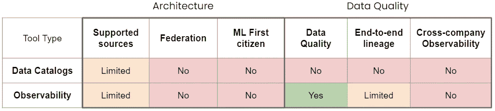
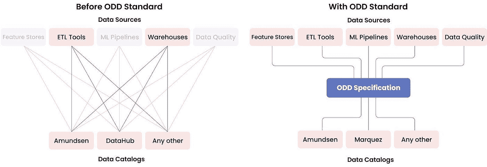
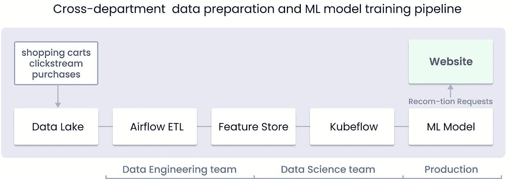
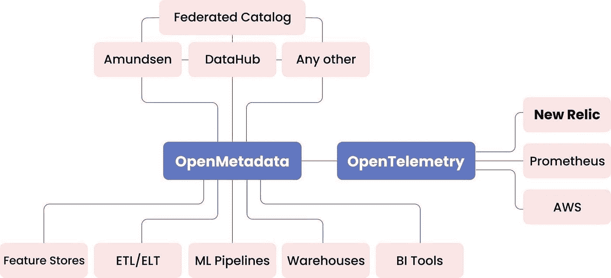
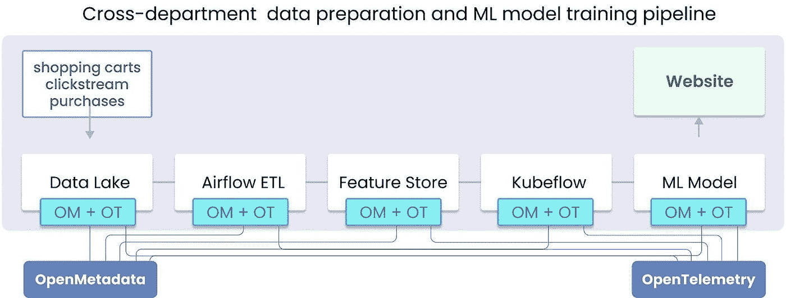
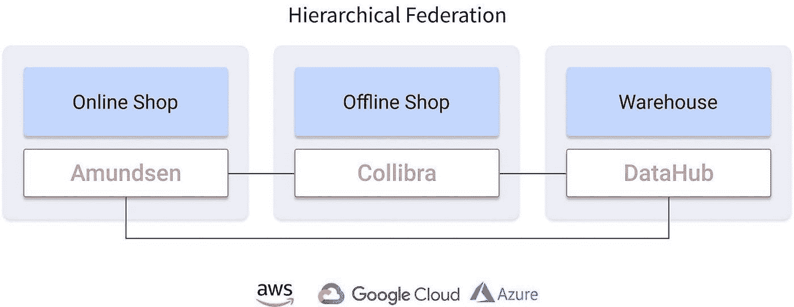
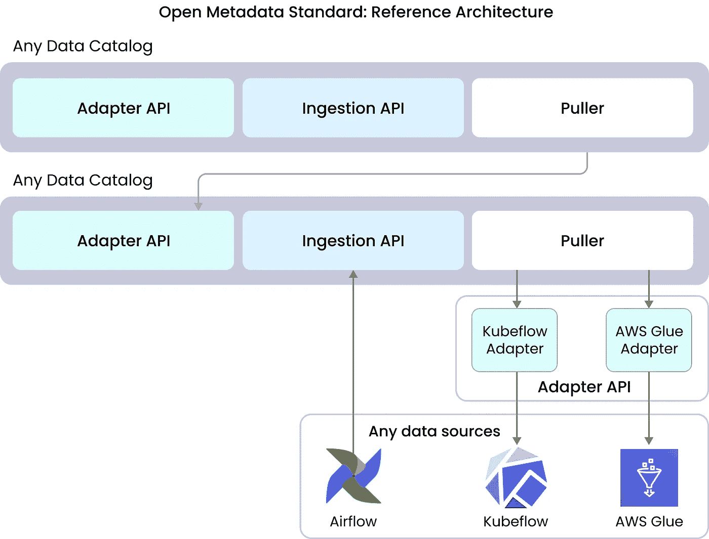
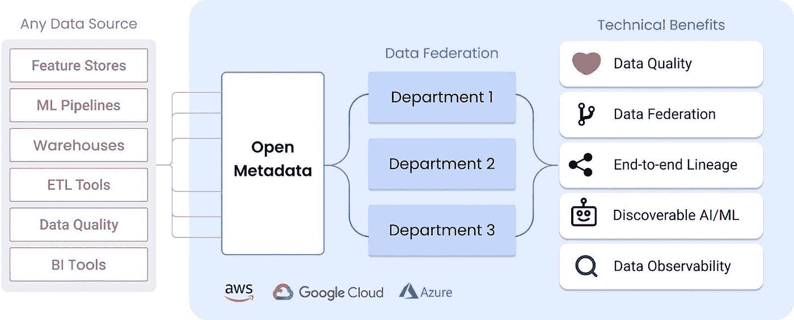

# 数据发现和可观测性平台的缺失部分:元数据的开放标准

> 原文：<https://towardsdatascience.com/the-missing-piece-of-data-discovery-and-observability-platforms-open-standard-for-metadata-37dac2d0503?source=collection_archive---------9----------------------->

## [行业笔记](https://towardsdatascience.com/tagged/notes-from-industry)

## 什么可以实现真正的大规模数据民主化？

图片由来自 unsplash.com[的](https://unsplash.com/)[迈克尔·泽兹奇](https://unsplash.com/@lazycreekimages)

数据是企业最重要但仍被低估的资产。公司如何决定他们的数据基础设施，决定了在未来的几十年里，谁将存活，谁将失败。

我们最近的文章“ [**功能存储作为机器学习的基础**](/feature-store-as-a-foundation-for-machine-learning-d010fc6eb2f3) ”涵盖了大数据工具领域的最新变化。作为传统**数据目录**的继承者**数据可观测性平台**和内部**全球数据目录**的出现是最深刻的转变之一。

在本文中，我们将讨论为什么传统数据目录越来越难以满足数据驱动型企业及其数据运营的关键需求，现代数据平台缺少哪些关键部分，以及现代下一代数据平台可能会是什么样子。

# 介绍

2010 年标志着数据目录的全盛时期。尽管如此，对数据驱动型企业的采访显示，90%的数据专业人员对数据发现不满意，他们报告说数据发现占用了他们多达 50%的工作时间(T21)。原因是什么？

大数据的爆炸式增长重塑了数据专业人员的需求以及他们对工具的期望。数据量、解决方案的数量以及数据管道的复杂性都在飞速增长。再加上组织中与他们打交道的人越来越多，这带来了一系列前所未有的全新基础架构挑战。

尽管在过去十年中付出了很多努力，但用于交换元数据和构建可扩展开放数据平台的基础设施仍处于起步阶段。孤立的元数据格式和工具无法通信，成为阻碍数据民主化和真正的端到端、企业范围的数据发现和可观察性的主要瓶颈。

虽然公司急于为其功能购买数据目录，而不关注他们如何收集、存储和管理数据，但集成解决方案的缺乏导致了复杂的数据管道，迫使组织跳过许多环节来整合一切，而不是获得可操作的见解。

缺乏统一和简化元数据收集的坚实基础层阻碍了许多重要的开发和可伸缩性。此外，为了使数据民主化并使其更加开放和可观察，我们转向倾向于锁定元数据的解决方案，这难道不是一个悖论吗？

# 数据目录的优势

数据优先的组织一直在寻求改善对其数据的理解和管理，数据是推动业务价值的关键资源。

在数据编目之前的很长一段时间里，知道数据在哪里并获得适当的上下文来评估数据一直是一个挑战。人们每次都得四处打听。因此，数据发现和评估花费了太多时间。公司需要将多个孤立的数据源置于公司范围内可访问的单一用户界面下，以实现数据民主化。

数据目录的出现解决了这一挑战，并成为更好的数据发现的重要一步。它们成为公司中任何人查找数据、评估数据以及了解谁在以何种方式使用数据的中心点。

如今，数据目录为数据驱动型公司提供了重要优势:

1.  收集和集中公司的所有元数据
2.  了解数据的相关性，谁以及如何使用数据
3.  提供信息以评估数据并决定它是否重要
4.  提供数据管理工具，如搜索、网络、社交功能
5.  更快的发现时间和价值实现时间

数据目录让数据优先组织的生活变得更加轻松。如果您需要组织数据，可以采用像 Amundsen 这样的开源数据目录，或者购买 SaaS 解决方案，使您的数据可以立即被发现。

# 当前趋势

数据发现解决方案领域目前正在发生三大转变:

1.  **从一般的数据目录到特意制作的。**数据目录正变得越来越专业化，越来越适合各种数据团队和用户组(数据科学、数据工程等)的需求。
2.  **从数据目录到数据可观测平台。**在过去几年中，数据质量和可观察性已经成为数据发现体验中不可或缺的一部分。光靠数据发现已经不够了，而且缺少很多重要的上下文。
3.  **从每个工具构建自己的元数据抓取器到一个共享的元数据标准。**孤立的元数据收集成为主要瓶颈，降低了集成速度，并使数据管道和平台变得不必要的复杂。每个工具都编写自己的解析器集，而这些工作可以为了更大的利益而优化。

这些并行发生的转变可以帮助我们了解大数据生态系统的发展方向，以及现有解决方案中存在哪些差距阻碍我们实现这一目标。

# 缺少哪些数据目录？

数据目录很难跟上这一新的现实，也很难满足现代对更好集成、更快和更透明的工具集的要求，这些工具集将有助于解决数据停机问题。

根据对现有数据发现和可观察性工具的[研究，这些似乎是数据目录难以跟上步伐的原因:](https://github.com/opendatadiscovery/awesome-data-catalogs)

1.  非标准化元数据集合
2.  数据目录不兼容(需要重新收集数据)
3.  有限，不是真正的公司范围的端到端数据谱系
4.  数据质量和可观察性缺失或不足
5.  不可发现的 ML 世界

现有数据目录和可观测性平台的常见高级缺点。图片作者。

缺乏一个通用的元数据标准阻碍了其他问题的解决。这个房间里的大象破坏了整个数据生态系统的集成可能性，并使数据发现效率低下。

让我们深入研究每个问题，然后看看如何解决它。

# 1.平台不兼容

在快速发展的数据和 ML 市场的热潮中，企业经常开始获取新的数据工具以保持领先。他们成熟了数据发现解决方案，部署了像 Amundsen 这样的数据目录，然后决定是时候提高可观察性，购买像 Monte Carlo 这样的产品，然后为他们的 MLOps 团队添加一个功能商店。

这种发光物体综合症可能非常适合立即灭火或做实验。但是，它会迅速扩大您的基础架构，并产生大量(通常是隐藏的)开销。当一家公司选择简单的短期解决方案，而不是长期的战略投资时，它就产生了[技术债务](https://martinfowler.com/bliki/TechnicalDebt.html)——返工的成本。您将不得不花费大量资源来部署这些工具，但是无法有效地使用它们，因为它们集成得不够好，并且需要继续重建，直到您有一个可持续的解决方案。

数据目录以及可观测性工具和要素存储分别收集数据。他们中的大多数使用不兼容的数据格式，并且倾向于供应商锁定元数据。当您想要切换到另一个目录或向现有基础架构添加一个目录时，您必须从头开始收集所有元数据。

向公司现有的数据网格中添加新的数据工具也是一件痛苦的事情。没有简单直接的方法可以做到这一点。您不能将一个数据目录作为数据源插入到另一个数据目录中，并在同一个 UI 中使用它们。

从数据网格的角度来看，大型科技公司越来越需要联合解决方案。中小型组织的自然增长不可避免地会让他们很快面临同样的问题。

随着大数据和 ML 行业的工具环境与日俱增，需要工作数据平台和真正数据民主化的数据驱动型企业不能将兼容性问题放在次要位置。

# 2.有限的数据血统

数据沿袭是数据可观察性的重要支柱。它提供数据管道事件的上下文，并通过显示相关的下游和上游资产来帮助定位问题。

数据目录在其特性中列出了端到端的数据谱系，这意味着公司管道的所有部分都存在于单个发现工具中。然而，随着现代数据环境复杂性的爆炸式增长，情况越来越不一样了。

真正的端到端血统只能存在于一个系统中，该系统包含一个组织在其所有发现解决方案中使用的所有数据实体。否则，它不能映射所有关键资产之间的依赖关系来提供可观察性。

现有数据目录提供的数据沿袭存在三个主要问题，阻碍了公司范围的可观察性和数据民主化:

1.  没有数据联合= **所有数据资产没有公司范围的沿袭**
2.  只包括**有限范围的数据实体**，而**没有 ML 实体**
3.  **元数据没有增加数据质量信息**

[OpenLineage](https://github.com/OpenLineage/OpenLineage) 规范对数据沿袭发现过程进行了标准化。然而，它没有涵盖数据湖和数据仓库世界之外的实体，如仪表板、ML 管道、ML 模型、特性存储，并且没有用关于数据剖析和数据质量测试的信息来丰富接收到的元数据。

# 3.无形的 ML/AI 世界

随着 ML(机器学习)的出现，相关实体(ML 管道、ML 实验、特征存储)已经成为数据领域不可或缺的一部分。然而，在现有的数据发现解决方案中，ML/AI 世界仍然不存在，也不可见。目前没有一个数据目录和可观测性平台将 ML 实体作为第一公民。

ML 世界完全不在当前的数据发现/可观察性生态系统中。图片作者。

不可发现的机器学习实体阻止了组织中的 ML 扩展到其全部潜力。他们的数据科学和数据工程团队不知道其他团队在做什么。

在 2021 年，数据驱动的公司在其数据发现生态系统中不能忽视 ML 世界。管理或扩展您无法发现和评估的东西是不可能的，并且在您的数据发现工作流中忽视 ML 是一个滑坡。

# 4.缺乏数据质量工具

如果您没有工具来监控您的数据管道中已知和不可预测的问题，那么您既不能控制数据停机时间，也不能进行伟大的数据发现。糟糕的数据会让机会远离你，即使你的渠道是完美的。

目前，大多数数据发现平台要么没有数据单元测试工具，要么难以正确实现。根据我们的研究，截至 2021 年，**%**55%的数据专业人员遇到数据质量问题的频率超过了他们认为可以接受的水平。

在两种类型的数据质量问题中，数据质量测试只能解决第一种问题:

1.  **已知的可预测问题**可以预测和测试
2.  **难以预测和检测的未知“黑匣子”问题**

使用像 [Great Expectations](https://greatexpectations.io/) 和 [Deequ](https://github.com/awslabs/deequ) 这样的工具进行数据单元测试有助于捕捉可预测的、众所周知的数据问题。同时，数据管道和团队日益增加的复杂性使得数据停机管理成为数据操作中的核心问题。焦点迅速转移到数据质量的新领域，这是为了处理黑盒数据问题——数据可观察性。

# 5.数据可观察性不足

可观察性的出现有助于开发团队管理应用程序停机时间。现在，它在数据运营领域巧妙复出，帮助数据运营团队应对数据宕机。

虽然数据质量测试说明了已知的可预测问题，但可观察性需要涵盖未知问题。它不仅可以帮助您发现已经发生的问题，还可以主动预防其中的许多问题。

这是一个黑盒问题有多危险的例子。

# 黑盒数据问题的例子:未被注意的时间偏移

在跨越几个部门或/和涉及 ML 的管道中出现的一个典型的黑箱问题是，由于缺乏跨部门协作和数据转移的微妙性质，错误的数据会被忽视数周。

比方说，一家公司使用 ML 模型向其在线商店的客户推荐衣服。当用户浏览该网站时，它会根据用户资料和购物车数据提供相关产品列表。这是他们的数据和 ML 管道:

用于推荐 ML 模型的数据准备和 ML 模型训练管道。图片作者。

管道的主要步骤:

1.  购物车上的数据、点击流和购买数据都在数据湖中
2.  数据工程团队使用气流来 ETL 和发布数据到功能存储
3.  数据科学团队使用来自功能商店的数据支持 Kubeflow 中的培训渠道
4.  生产 ML 模型为电子商务网站提供建议

**事件:数据迟到**

比方说，数据工程团队将一个新版本的气流 ETL 管道部署到生产中。它计划在每天上午 12:00 运行。ML 培训管道每天凌晨 1:00 运行。算法发生变化，气流管道执行时间从 1 小时增加到 1.5 小时。现在气流管道在 ML 管道启动后终止，并且滞后。模型最终会持续运行前一天的过时数据。因此，推荐引擎不再考虑客户购物车的相关状态以及他们在一天中所做的购买。

像这样的事件很难被发现，因为负责管道不同部分的团队通常对彼此的工作没有足够的了解。数据工程团队不知道 ML 模型使用什么特性，数据科学团队不知道数据部分。结果，该模型无声无息地失败了，企业以不正确的推荐和失去信任和收入而告终。通常，像这样的案件需要很多天才能弄清楚发生了什么/在哪里/为什么会发生。

# 下一代元数据平台=发现+可观察性+开放标准？

我们认为，为了解决我们所描述的问题，下一代数据平台应该检查以下选项:

1.  基于**开放元数据标准**
2.  采用**联盟策略来构建元目录**
3.  包括 **ML 生态系统的一等公民**
4.  提供**公司范围的数据发现和可观察性**
5.  **与其他开放标准集成**

努力应该从标准化元数据操作开始。与其将所有的工作分开处理，不得不像现在这样处理每一个新软件版本的中断，不如共同努力构建缺失的统一层。

该标准将确保由各种数据源产生的元数据的兼容性和一致性，允许快速和容易地集成任何源或目录。最重要的是，它将使整合工作共享，减轻所有利益相关者的负担，并加速整个大数据行业。

让我们设想这样一个开放的元数据标准。

# 1.综合数据质量

开放元数据标准可以利用与任何数据质量工具的集成，包括其他开放标准。例如，它可以使用 OpenTelemetry 作为数据质量监控和可观察性工具。

OpenTelemetry 将使用元数据来收集指标，监控它们的异常情况，并提醒数据资产所有者出现的问题。与此同时，开放元数据将使用元数据来建立端到端的血统，并以其他实体受影响的数据信息来丰富警报。

两个开放标准的集成:OpenTelemetry 和 Open Metadata。图片作者。

# 2.数据可观察性

下面是开放元数据+ OpenTelemetry 集成如何解决我们前面描述的推荐引擎的情况。

建议 ML 管道使用集成的 OpenMetadata 和 OpenTelemetry 标准来提供端到端的可观察性、数据质量和警报。图片作者。

OpenTelemetry 系统将向开放元数据传递警报。后者检查相关作业的计划，并用受问题影响的数据消费者的信息丰富警报。然后，OpenTelemetry 在第一次执行 ETL 之后——在新模型有机会对错误数据进行训练之前——将丰富的警报传递给受影响实体的所有者。

或者，管理员可以为开放元数据系统中的实体设置 SLA。它将提供端到端的沿袭，并从 OpenTelemetry 系统获取执行指标。受影响实体的所有者将收到 SLA 警报，其中包含管道执行的跟踪信息。有了它，他们将很容易确定他们的 SLA 发生了什么情况。

# 3.真正的端到端血统

为了促进数据产品上的端到端协作，沿袭需要是全公司范围的。只有这样，数据所有者才能全面了解数据如何在他们和其他所有者的资产之间流动，以及他们如何受到管道中其他地方的变化的影响。

我们认为，端到端的关系应该:

1.  包括组织的所有数据资产
2.  涵盖广泛的实体，包括 ML
3.  使用数据分析和数据质量信息丰富元数据
4.  显示数据资产从接收到最终产品(报告、模型等)的完整历史。)

这种沿袭将提供所有资产之间的连接和流动的完整上下文，并允许您知道当其他所有者的资产发生变化或中断时，您的资产会受到怎样的影响。

# 4.可发现的人工智能世界

在数据发现生态系统中包含 ML 基础设施是早就应该的。开放元数据标准将有助于在公司的数据目录和 ML 解决方案之间建立连接器，开始将用于训练 ML 模型的数据推入上游目录。

开放元数据标准允许从其他数据目录和 ML 解决方案(如功能存储)构建联合元目录。

开放元数据标准可以将 ML 实体作为数据发现基础设施的一等公民，使它们通过数据目录可见和可发现。

可发现的 ML 实体将极大地改善数据科学团队和它需要与之交换数据以构建 ML 模型的其他团队之间的协作。这将带来跨部门协作的新水平、数据发现的效率、质量以及数据产品的上市时间，这是很难高估的。

# 5.开放元数据标准

开放元数据是用于数据发现的开源行业标准。它提供了一套从云原生应用程序和基础架构中收集和导出元数据的技术，以供发现。该标准定义了元数据收集的模式，并通过端点与数据工具集成，以从它们接收元数据。

# 参考实现

开放元数据标准将允许构建具有分层或水平联合的全球联合数据目录。下面是这种元目录的参考架构示例。

实施开放元数据标准的参考体系结构联合了两个数据目录，并通过推和拉策略收集元数据。图片作者。

示例全局目录为每个数据源采用分层联合、推拉策略和 API 来提供元发现体验。它所包含的所有数据目录和数据源都集中在一个具有细粒度访问权限的用户界面下。该解决方案可以通过适配器或 API 端点插入任意数量的数据目录或数据源来轻松扩展。它使用推送策略从已经发现的实体中收集元数据。

这样的元目录将使用户在每次需要使用另一个数据目录时不必重新收集元数据。与让您使用 AWS 服务复杂环境的其他解决方案不同，该解决方案只需要部署 PostgreSQL。

基于开放元数据标准构建的全局数据目录，在单一用户界面下联合组织各部门使用的数据目录，以受益于真正的端到端沿袭、可观察性、数据健康监控和 ML 数据资产的包含。图片作者。

基于开放元数据标准构建的元目录可以包含我们在这篇文章中谈到的所有重要机会:联合、真正的端到端血统、数据质量保证、公司范围的可观察性，并带来可发现的 ML 资产。

# 结论

旧数据方法和架构的遗产仍然影响着现代数据发现和可观察性。虽然数据管道比十年前超前了好几光年，但数据团队仍然不得不处理孤岛式解决方案，这使得他们将大部分时间花在数据发现或消除数据停机上，而不是构建数据产品。数据工具之间低效的元数据交换是如此平常，以至于被认为是不可避免的。

但不一定要这样。

我们分享了如何通过共同努力解决这一问题的愿景。像 OpenTelemetry 这样的成功先例表明，这种方法非常成功，对所有参与者都有巨大的好处。

收集元数据的开放标准可能成为缺乏有效发现和可观察性的合理解决方案，并为下一代数据平台奠定坚实的基础。

您在缺乏跨公司数据发现和可观察性方面的体验如何？如果您的组织正在考虑构建一个内部元目录，我们想听听您在这个过程中遇到的挑战。