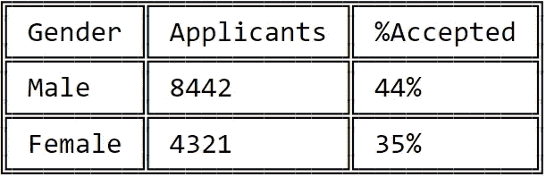
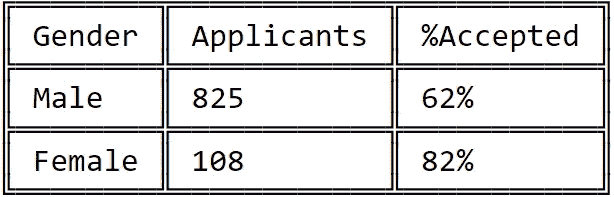
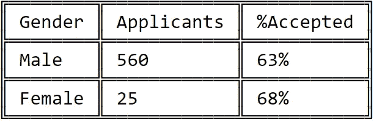
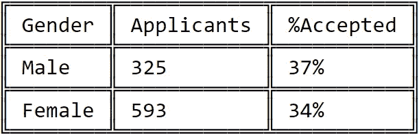
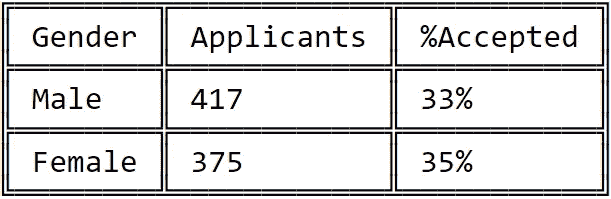
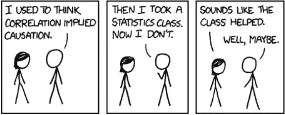

# 如何用数据撒谎

> 原文：<https://towardsdatascience.com/the-misuse-of-data-and-statistics-3282a594d508?source=collection_archive---------33----------------------->

## 数据并不总能说明全部情况

吉列尔莫·贝拉尔德在 [Unsplash](https://unsplash.com/s/photos/dice?utm_source=unsplash&utm_medium=referral&utm_content=creditCopyText) 上拍摄的照片

统计学是一个非常强大的工具。它允许我们通过从数据中得出模式来更好地理解我们周围的世界。在当今世界，几乎每个行业都在应用统计学——医学调查、广告、销售，甚至法律。

但是，统计和数字是可以用来骗人的。它们可以被用来夸大、夸大事件，并推动政治议程。

在我们今天生活的世界中，滥用统计数据的后果可能是灾难性的。错误信息可以像野火一样在互联网上传播，声称它们是由“科学证据”支持的。

你所需要做的就是挑选一张支持你的议程的图表，用一个误导性的标题发布到互联网上，这将立刻引发公众的愤怒。

在这篇文章中，我将向你展示一些统计数据如何被用来误导人们的例子。这些病例的严重程度各不相同。

他们中的一些人很傻，几天后被一笑置之并被遗忘。其他的后果很严重——让人们失去工作、名誉，在某些情况下甚至失去生命。

# 案例 1:操纵数据以适应叙述

数据可以用来向人们展示你想让他们看到的东西。它可以被操纵来讲述完整故事的不同版本。与事实相差甚远的版本。

在 [Unsplash](https://unsplash.com/s/photos/gender?utm_source=unsplash&utm_medium=referral&utm_content=creditCopyText) 上 [Dainis Graveris](https://unsplash.com/@dainisgraveris?utm_source=unsplash&utm_medium=referral&utm_content=creditCopyText) 的照片

1973 年，加州大学伯克利分校因性别歧视被起诉。这背后的原因是他们的录取过程，这表明他们对女性考生的录取率比男性考生低很多。

男性考生的录取率为 44%，而女性考生仅为 35%。

这显示了明显的性别差异，**伯克利成为首批因性别歧视被起诉的大学之一**。

然后统计学家通过检查每个系的学生录取率来研究这个问题。

经过检查，他们发现了一些有趣的东西。似乎伯克利的录取系统存在偏见。

## 然而，这种偏见似乎有利于女性，而不利于男性。

这与最初指控伯克利偏向男性候选人而不是女性候选人的说法正好相反。

诉讼自然不了了之。

这是怎么发生的？

为了更好地理解这种情况，让我们来看看这两种说法背后的一些数据:

## **权利要求 1**

伯克利的总体录取率是男性考生比女性考生高得多。有一种偏向男性的性别偏见。

## 权利要求 2

伯克利不同院系的录取率女性考生比男性考生高得多。有一种偏向女性的性别偏见。

这是支持第一种说法的数据。这是所有部门男女候选人的总体接受率:

作者图片

事实上，可以看出，男性候选人的接受率远远高于女性。

现在，让我们来分解这些数据。我们将看看伯克利每个系的男女考生的录取率。

*(在本例中，我只介绍了部门 A、B、C 和 d)。*

## **A 部**

作者图片

当看一看部门 A 时，我们看到与上面的主张完全相反的情况。

女性的接受率比男性高得多。另外，请记住，在 A 部门，女性申请人远远少于男性申请人。

## B 部门

作者图片

观察 B 系，男女录取率无显著差异。

此外，请注意，该部门的女性申请人要少得多。

## C 部门

作者图片

在 C 部，男女录取率没有显著差异。

注意，申请这个部门的女性比男性多得多。此外，注意到 C 系与之前的系相比，男女生的录取率都较低。

## D 部门

作者图片

再次注意，D 部门的接受率相当低。本系男女录取率无显著差异。

## 结论

当看一看每个部门的数据时，你可以看到男性和女性的接受率没有显著差异。

事实上，在一些部门，女性候选人的录取率比男性候选人高得多——这与一开始的说法正好相反。

男性的总体录取率更高，因为女性倾向于申请竞争更激烈的部门。

女性更多申请 C 和 D 等录取率较低的部门。

男性更多地申请像 A 和 B 这样的部门，它们的录取率更高。

因此，男性候选人的总体接受率高于女性。

有数据支持这两种说法:

*   声明 1:录取过程中存在有利于男性的性别偏见。
*   **声明 2:录取过程存在有利于女性的性别偏见**。

用数据来验证这两种说法是可能的。通过向人们展示整个故事的一部分，你可以让他们看到你想让他们看到的东西。

这种现象被称为**辛普森悖论**。

您可以观察单个数据组中的趋势，当这些组合并在一起时，趋势就会消失。

# 案例 2:相关性与因果性

图片来自 xkcd.com

你可能已经听过很多次了，相关性并不意味着因果关系。仅仅因为两个事件相互关联，并不意味着一个事件导致另一个事件。

让我们看几个例子来更好地理解相关性和因果关系。

## 示例 1

长发和一个人用洗发水的量是正相关的。

这是否意味着使用更多的洗发水会导致头发变长？

当然不是。

这意味着头发越长的人越倾向于使用更多的洗发水。

这是一个相当明显的例子，两个变量之间的因果关系对我们来说是显而易见的。

然而，情况并非总是如此。有时，变量 A 和 B 可能看起来相互关联。然而，还有第三个变量(变量 C)导致了这两者。

这被称为**第三因谬误**，下面举个例子来解释。

## 示例 2

照片由[帕特里克·福尔](https://unsplash.com/@patrickian4?utm_source=unsplash&utm_medium=referral&utm_content=creditCopyText)在 [Unsplash](https://unsplash.com/s/photos/ice-cream?utm_source=unsplash&utm_medium=referral&utm_content=creditCopyText) 拍摄

冰淇淋销售量的增加和森林火灾之间存在着正相关关系。

这是否意味着:

**a)冰淇淋引发森林火灾？**

运筹学

**b)森林火灾导致冰淇淋销量增加？**

这两种说法似乎都不正确。

事实上，还有第三个变量导致冰淇淋销量和森林火灾的增加。

**加热**。

当外面很热的时候，更多的人出去买冰淇淋。因此，冰淇淋的销量增加了。

当气温高的时候，森林火灾的数量就会增加。

因此，我们看到冰淇淋销售和森林火灾之间存在关联的原因是，它们都是由第三个变量——热量——引起的。

借助于统计检验，很容易找到两个变量之间的相关性。

然而，更重要的是要明白，当两个变量相关时，一个不一定会导致另一个。

有可能是第三个变量导致了这两种情况，或者这种相关性只是巧合。

以下是分析师和统计学家发现的一些奇怪相关性的例子:

*   食用人造黄油的夫妇往往离婚率更高。
*   美国小姐的年龄和使用蒸汽或热物体的谋杀数量。
*   尼古拉斯·凯奇在电影中的出现以及溺死在泳池中的人数。

如果你想了解更多关于虚假相关性的内容，我建议你访问这个网站。

# 案例 3:在法庭上滥用统计数据

由[大卫·维克斯列尔](https://unsplash.com/@davidveksler?utm_source=unsplash&utm_medium=referral&utm_content=creditCopyText)在 [Unsplash](https://unsplash.com/s/photos/court?utm_source=unsplash&utm_medium=referral&utm_content=creditCopyText) 上拍摄的照片

莎莉·克拉克案是一个臭名昭著的刑事案件，它说明了统计数据在法庭上的滥用。

1996 年 12 月，莎莉·克拉克独自在家带着她两个月大的婴儿。这个孩子似乎没有任何明显的健康问题。然而，一天晚上，人们发现他没有反应。她打电话叫了救护车，在多次抢救无效后，孩子被宣布死亡。

不到两年后，莎莉的第二个孩子在几乎相同的情况下被宣布死亡。

两个看似健康的婴儿在相似的情况下出生几个月后就去世了。因此，莎莉·克拉克因谋杀自己的婴儿而受到审判。

一位统计学家被召集到审判中，提供两个无法解释的婴儿死亡的可能性。

同一家庭中两个婴儿不明原因死亡的概率是 7300 万分之一。由于这种情况发生的可能性极小，萨莉·克拉克因谋杀她的两个孩子而被捕。

然而，在监狱度过三年后，克拉克的第二次上诉被维持。在审查证据时，她的新律师发现了一份病理学报告，显示她的第二个孩子感染了金黄色葡萄球菌。

此外，这两个事件(她两个孩子的死亡)不一定是独立的事件。

2002 年，数学教授雷·希尔得出结论，鉴于第一个婴儿死于婴儿猝死，第二个婴儿死于不明原因的概率可能高达 60 分之一。

莎莉·克拉克在监狱度过三年后被释放，但不久后被发现死在家中。

莎莉·克拉克案是误判的一个例子，是由法庭上滥用统计数据造成的。一位母亲被错判谋杀了她的婴儿，很快被发现死于酒精中毒。

统计是强大的，是帮助我们理解模式和更好地理解我们周围世界的工具。

然而，这些数字可以被操纵，可以用来误导和欺骗人们相信谎言。

由于这个原因，当你看到基于数字和图表的报告时，在下结论之前做适当的研究是很重要的。

最后，如果你想做一些关于这个主题的额外阅读，这里有一些资源:

1.  [统计数据的误用](https://www.datapine.com/blog/misleading-statistics-and-data/)
2.  [关联 vs 因果](https://idatassist.com/falling-victim-spurious-correlations-heres-stop/)
3.  [莎莉·克拉克案](https://forensicstats.org/blog/2018/02/16/misuse-statistics-courtroom-sally-clark-case/)
4.  [统计定罪](https://understandinguncertainty.org/node/545)
5.  [辛普森悖论](https://brilliant.org/wiki/simpsons-paradox/)

感谢阅读！