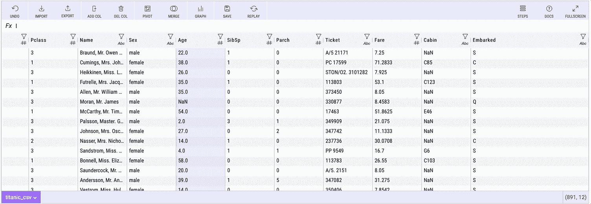
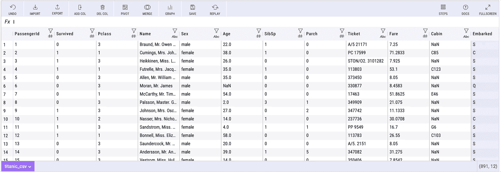
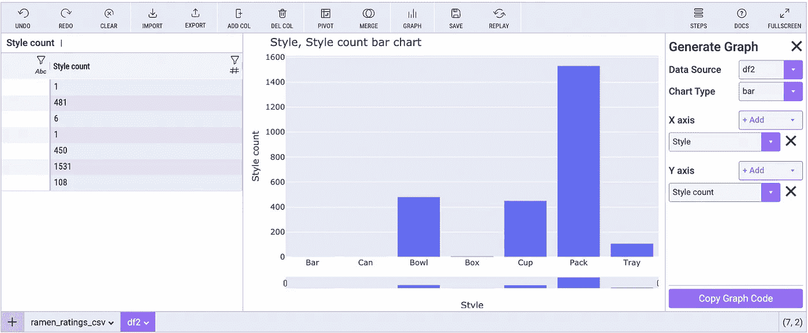

# 米托 JupyterLab 扩展—生成 Python 的电子表格

> 原文：<https://towardsdatascience.com/the-mito-jupyterlab-extension-a-spreadsheet-that-generates-python-b25d2c447d48?source=collection_archive---------7----------------------->

## 您可以将米托调用到您的 Jupyter 环境中，您所做的每个编辑都会在下面的代码单元格中生成等效的 Python。


约书亚·索蒂诺在 [Unsplash](https://unsplash.com/@sortino?utm_source=unsplash&utm_medium=referral&utm_content=creditCopyText) 上拍摄的照片

# 米托是 Python 的电子表格接口

米托允许您将数据帧或 CSV 文件传递到电子表格界面。它有 Excel 的感觉，但是每次编辑都会在下面的代码单元格中生成等效的 Python。在最好的情况下，这可能是一个真正快速完成数据分析的方法。



用米托进行探索性数据分析(可视化由作者制作)

**如果你错过了我关于米托的其他文章:**

*   [米托——生成 Python 的电子表格](https://romanorac.medium.com/list/mito-a-spreadsheet-that-generates-python-1df29fc67dff)

# 米托入门

这里是[完整的安装说明](https://docs.trymito.io/getting-started/installing-mito)。

要安装米托软件包，请在终端中运行以下命令:

```
python -m pip install mitoinstaller
python -m mitoinstaller install
```

然后在 Jupyter 实验室打开一个笔记本，调用一个 mitosheet:

```
import mitosheet
mitosheet.sheet()
```

在您的分析中，可以在任何时候调用 Mitosheet。您可以将数据帧作为工作表调用中的参数传递给 mitosheet。

```
mitosheet.sheet(df)
```

您可以使用“导入”按钮安装本地文件中的传入数据。

# 米托数据分析功能

米托提供了一系列功能，允许用户清理、争论和探索他们的数据。这些功能中的每一个都会在下面的代码单元中生成等效的 Python。

在米托，您可以:

*   过滤器
*   在枢轴上转动
*   合并
*   图表
*   查看汇总统计数据
*   使用电子表格公式
*   还有更多…

对于每一次编辑，米托在下面的代码单元中生成熊猫代码，用户可以在他们的分析中继续或发送给同事。

下面是用米托制作数据透视表的样子:



带有米托的数据透视表(可视化由作者制作)

示例生成的数据透视表代码如下所示(代码是自动记录的):

```
# Pivoted ramen_ratings_csv into df3
unused_columns = ramen_ratings_csv.columns.difference(set(['Style']).union(set(['Brand'])).union(set({'Style'})))
tmp_df = ramen_ratings_csv.drop(unused_columns, axis=1)
pivot_table = tmp_df.pivot_table(
    index=['Style'],
    columns=['Brand'],
    values=['Style'],
    aggfunc={'Style': ['count']}
)# Flatten the column headers
pivot_table.columns = [flatten_column_header(col) for col in pivot_table.columns.values]
```

下面是查看列的汇总统计信息的过程:


米托统计摘要(作者可视化)

# 生成可视化代码

为 python 数据可视化获取正确的语法可能是一个耗时的过程。米托允许你在一个点击环境中生成图形，然后给你这些图形的等价代码。

创建图表后，单击复制图表代码按钮:



用米托制作图表(图片由作者制作)

然后将代码粘贴到任何代码单元格中。米托允许再现可视化过程。


米托生成代码(图片由作者制作)

# 结论

米托是一种快速生成 Python 代码的方法，尤其是对于那些熟悉 Excel 的人来说。它节省了大量的时间去堆栈溢出或谷歌的正确语法。

米托绝对值得一试，尽管它更有价值，因为它引入了更多的图形类型和更好的批量编辑能力(批量删除列、重命名等)。).

# 在你走之前

*如果你喜欢看这些故事，为什么不成为* [***中等付费会员***](https://romanorac.medium.com/membership) *？每月 5 美元，你可以无限制地阅读 10000 个故事和作家。**[***如果你用我的链接***](https://romanorac.medium.com/membership)**注册，我会赚一小笔佣金。***

****

**照片由[Courtney hedge](https://unsplash.com/@cmhedger?utm_source=medium&utm_medium=referral)在 [Unsplash](https://unsplash.com?utm_source=medium&utm_medium=referral) 上拍摄**