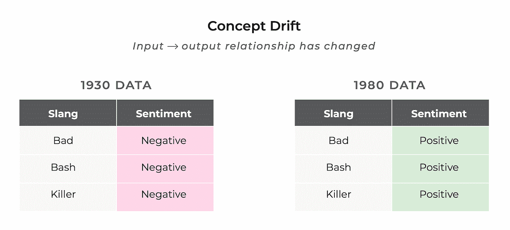
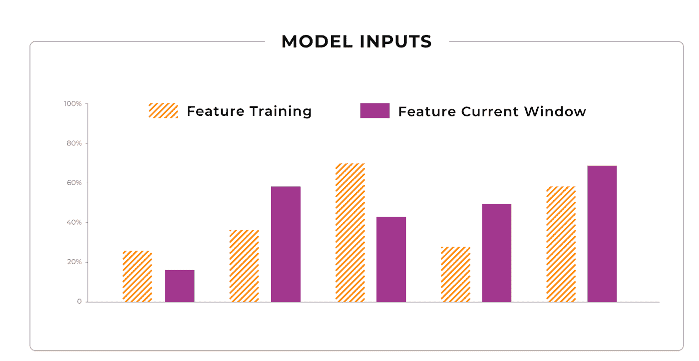
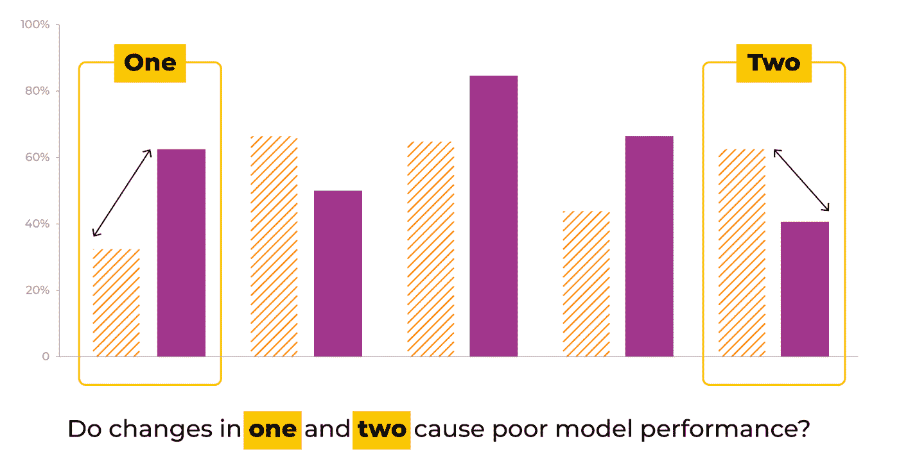
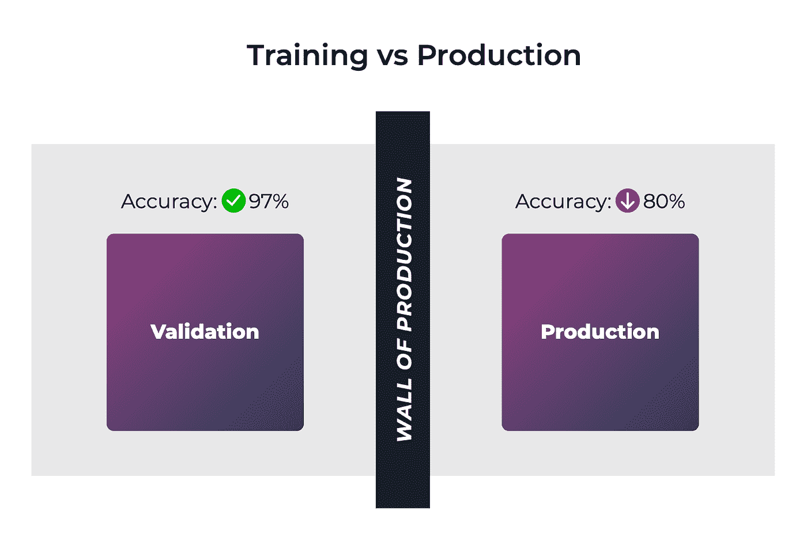
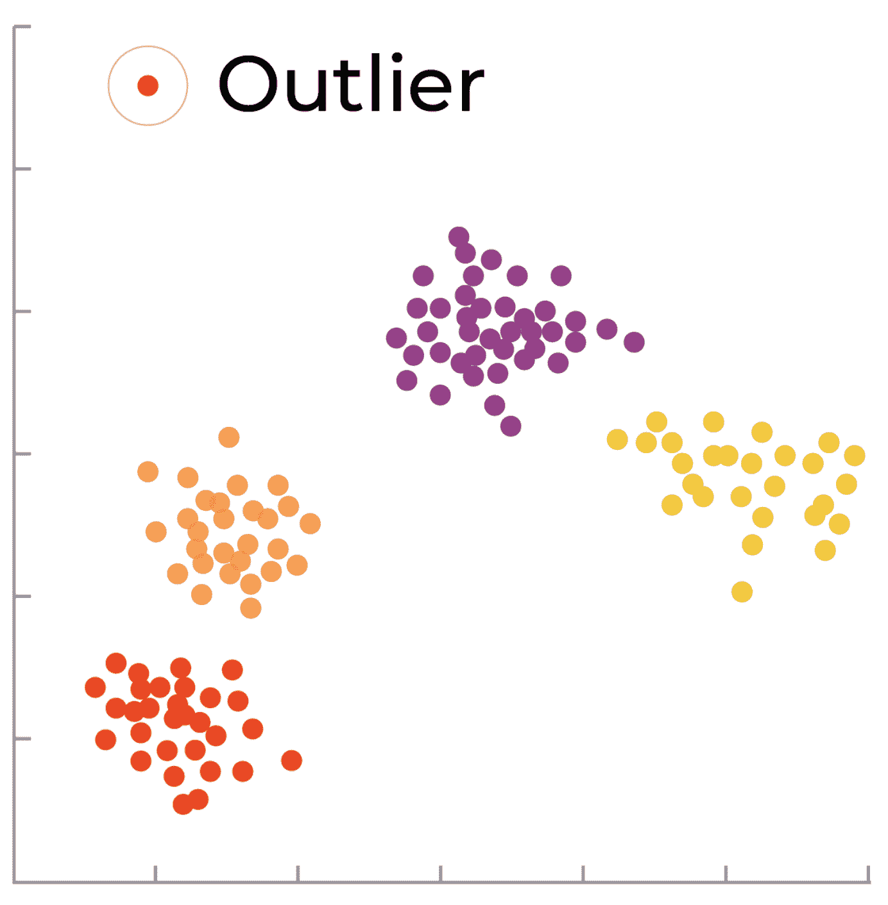
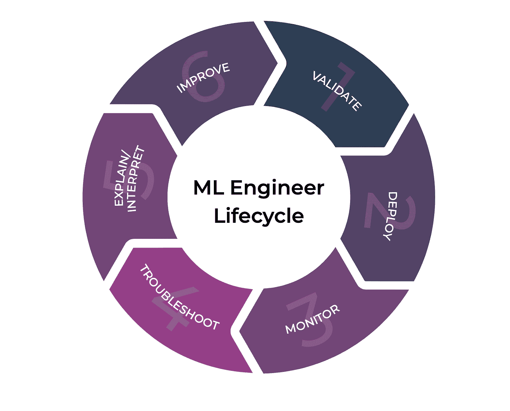

# 模型已经装船了。会出什么问题呢？

> 原文：<https://towardsdatascience.com/the-models-shipped-what-could-possibly-go-wrong-a657ad919868?source=collection_archive---------33----------------------->

## [ML 可观测性系列](https://towardsdatascience.com/tagged/ml-observability)

## 第 2 部分:模型故障模式

Staples 按钮，但使其成为机器学习，作者图片

[在我们的上一篇文章](/ml-infrastructure-tools-ml-observability-8e4d7df6db43)中，我们大致了解了模型的可观察性及其在机器学习工作流程中的作用。特别是，我们讨论了模型可观察性和模型监控工具在检测、诊断和解释已经部署到生产中的回归模型方面的前景。

这就引出了一个自然的问题:**我应该在生产中监控什么？**答案当然要看**能出什么问题**。

在本文中，我们将提供一些更具体的潜在故障模式示例，以及它们在您的生产模型性能中表现出的最常见症状。

# **模型/概念漂移**

与世界上大多数事情一样，模型的任务可能会随着时间的推移而改变。**概念漂移**或**模型漂移**是一种模型故障模式，由模型执行的底层任务的变化引起，这可能会逐渐或突然导致模型性能的退化。

概念漂移，作者图片

*概念漂移示例*

换句话说，*你的模型被训练去解决的任务可能不能准确地反映它现在在生产中所面临的任务。*

例如，假设您正在尝试预测特定电影评论的情绪，并且您的模型是根据 20 世纪 70 年代早期的评论训练的。如果你的模型是好的，它可能已经了解到评论，“哇，那部电影是*”带有负面情绪；然而，快进到 20 世纪 80 年代俚语的世界，完全相同的评论可能意味着这部电影太棒了。*

*所以模型的输入没有改变，但是结果改变了——发生了什么？自模型被训练以来，将自然语言映射到情感的基本任务已经发生了变化，导致模型开始在它过去预测正确的地方出错。*

*随着时间的推移，这种转变可能会逐渐发生，但正如这些天我们经常被提醒的那样，世界并不总是逐渐变化的。这种关于概念漂移何时会发生的根本不可预测性需要一套好的模型监控工具。*

*如果您注意到您的模型输入的分布没有太大变化，但是您的模型性能在退步，那么概念漂移可能是一个促成因素。*

# ***数据/特征漂移***

*数据是模型创建的核心，数据实践可以决定模型在生产中的表现。在现实世界中，您的模型输入的分布几乎肯定会随着时间的推移而改变，这导致了我们的下一个模型故障模式:**数据漂移**或**特征漂移**。*

**

*特征漂移，按作者分类的图像*

*特征偏离训练*

*让我们假设您刚刚部署了一个模型，该模型预测一张专辑在 Spotify 或 Apple Music 上的第一天将获得多少流量。既然您的模型已经部署到生产环境中有一段时间了，并且已经正确地预测了 Drake 的巨大成功，您开始注意到您的模型开始出现一些戏剧性的错误。*

**

*功能漂移对性能的影响，图片由作者提供*

*导致模型性能问题的特征漂移*

*经过一些检查，你注意到一些新的艺术家和时尚流派吸引了大多数的流，你的模型在这些专辑上犯了很大的错误。
那么，到底哪里出了问题呢？

模型输入中的分布在统计上不同于它被训练时的分布。换句话说，你的数据已经漂移，你的模型现在已经过时了。就像概念漂移一样，数据漂移可能会慢慢地爬上你的模型，也可能会很快地撞上它。*

*值得一提的重要一点是，将数据漂移与**训练-生产偏斜**混淆是很常见的。训练-生产偏差是指训练数据的分布与生产数据的分布有意义的不同。回到我们之前的例子，如果你只是用乡村音乐来训练你的专辑模型，当它看到一个新的爵士专辑点击发现标签时，它可能表现不好。*

**

*培训与生产绩效，作者形象*

## *培训-生产偏差*

*在数据漂移和训练-生产偏斜的情况下，模型正在经历训练时没有看到的生产中的模型输入分布，这可能导致比验证模型时更差的性能。那么，我们如何区分这两者呢？*

*如果您的模型在部署后无法达到接近其验证性能，您可能会面临**训练-生产偏斜**，并且您可能需要重新考虑您的数据采样技术，以挑选更具代表性的数据集；但是，如果您的模型匹配在过去表现出良好的生产结果，并且您看到性能缓慢或突然下降，那么您很可能正在处理**数据漂移**的影响。*

***级联模型故障***

*随着机器学习模型席卷全球，产品包含大量机器学习组件变得越来越常见。在许多情况下，一个模型的输出甚至被直接或间接地用作另一个模型的输入。*

*由于这些模型通常是在它们自己的数据集上单独训练和验证的，因此必然会出现令人头疼的故障模式。虽然这两个模型的离线验证性能都有所提高，但是在一起部署时，它们会使产品整体退化。*

*为了演示这个概念，让我们假设你在 Alexa 上工作。你的团队负责一个语音识别模型，将用户的语音转录成文本，而合作伙伴团队负责将这些转录的查询分类成 Alexa 可以为用户执行的动作。

有一天，你发现了一个突破，在验证数据集上，你的团队的语音识别结果提高了 10%；然而，当你在部署更新的模型后第二天回到办公桌时，你会看到 Alexa 在选择用户请求的动作的准确性方面出现了巨大的回归。*

*发生了什么事？在对语音识别模型进行这种改变时，转录的话语的输出分布以统计上显著的方式改变了。由于这些输出是动作分类模型的输入，这导致了动作预测的回归，导致你的用户在他们只是想设置一个定时器的时候，坐着听完一首糟糕的歌曲。*

*为了诊断这些级联模型故障，模型可观测性工具必须能够跟踪每个模型的输入和输出分布的变化，以便能够查明哪个模型引入了整体性能的回归。*

# ***离群值***

*在前面的章节中，我们主要关注的是围绕模型性能的组统计数据；然而，有时你的模型在几个例子上的表现更令人担忧。*

*在理想的情况下，当您将模型部署到生产中时，不会有任何意外。不幸的是，我们并不是生活在一个理想的世界里。您的模型可能会面临异常输入，偶尔会产生异常结果。*

*有时候找到这些例子就像大海捞针。如果你找不到模型中的潜在问题，你就无法解决它。*

**

*离群值，按作者分类的图像*

## *异常值:低维映射*

**了解异常值通常被视为对所有输入要素进行多变量分析，以找到异常值的单个预测。与上面的漂移描述形成对比，漂移描述实际上是一组预测中单个特征的一般统计。**

***漂移**:预测组——特征或模型输出的单变量统计*

***异常值**:单个预测或小组预测-跨特征的多元分析*

*模型所有者需要一道防线来检测和防范这些讨厌的输入。实现这一点的一种技术是采用无监督学习方法对模型输入和预测进行分类，从而允许您发现异常示例和预测的群组。*

*这就是模型可观察性工具在帮助您加强培训、评估、部署和监控循环方面的优势所在。*

**

*ML 工程师生命周期，作者图片*

*如果您看到一些不适合更典型的例子组的例子，这可能是您的模型从未见过的一些边缘情况的证据。在任何一种情况下，这些例子都可能是你在培训中包括和补充的很好的选择，以弥补这些差距。*

# ***对手***

*异常的例子可能只是偶然发生的，但也可能是试图欺骗您的模型的对手产生的。在许多业务关键应用程序中，尤其是在金融领域，模型所有者必须保持高度警惕，以监控旨在使模型以特定方式运行的敌对输入。*

*2018 年，谷歌引起了人们对机器学习图像分类模型的敌对攻击的关注，展示了人眼察觉不到的少量噪声如何添加到图像中，可能导致模型严重错误分类。*

*在每时每刻都很重要的应用程序中，您识别新攻击、修补漏洞和重新部署模型的速度可能会对您的业务成功产生重大影响。*

# ***总结***

*总之，有许多[模型故障模式](https://arize.com/blog/ml-model-failure-modes/)需要注意，它们很少孤立地影响你的模型。要拼凑出为什么您的模型的性能可能会下降，或者为什么您的模型在特定情况下表现不稳定，您必须有适当的测量来拼凑出正在发生的事情。模型监控工具填补了机器学习工作流中的这一角色，并使团队能够在模型发布后不断改进您的模型。*

## *联系我们*

*如果这个博客引起了你的注意，并且你渴望了解更多关于[机器学习可观察性](https://arize.com/platform-overview/)和[模型监控](https://arize.com/model-monitoring/)，请查看我们其他的[博客](https://arize.com/blog/)和 [ML 监控](https://arize.com/ml-monitoring/)上的资源！如果您有兴趣加入一个有趣的 rockstar 工程团队，帮助模型成功生产，请随时[联系](https://arize.com/contact/)我们，并在此处[找到我们的空缺职位](https://arize.com/careers/)！*