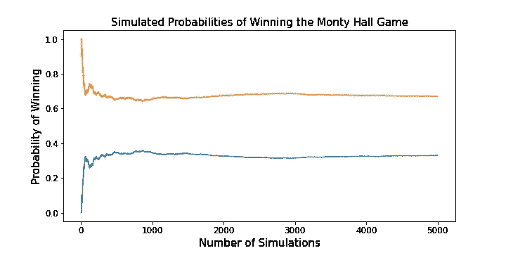
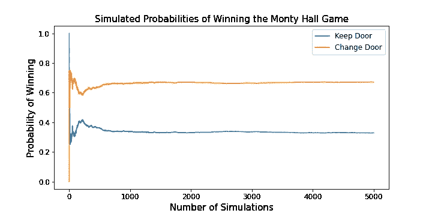

# 蒙蒂·霍尔问题

> 原文：<https://towardsdatascience.com/the-monty-hall-problem-388f71a73e1?source=collection_archive---------29----------------------->

## 频率主义者模拟和贝叶斯计算



蒙蒂霍尔游戏的两种策略的获胜概率。请继续阅读，寻找最佳策略。

## 项目存储库

[GitHub](https://github.com/jeffreyhwatson/monty_hall)

## 介绍

最近，在一堂贝叶斯统计课上，我被要求编写一个 Monty Hall 游戏的模拟程序。我觉得有趣的是，我被要求使用一种频繁主义的方法来研究概率，以洞察被解释为贝叶斯问题的东西。我决定进一步调查，并提出我自己对正在发生的事情的贝叶斯理解。

对于那些不熟悉这个著名智力难题的人，请允许我列出这个游戏的规则和关键假设。蒙蒂·霍尔问题是以“让我们做笔交易”游戏节目的主持人命名的，遵循与该游戏相似的规则。一名参赛者面前有三扇相同的门，其中两扇是山羊，另一扇是汽车。然后要求参赛者宣布他们选择了哪扇门，另一扇门就会打开。它的内容会显示给玩家，然后主机会询问玩家是否愿意在车显示之前切换他们选择的车门。无论玩家此时做出何种选择，如果车在他们选择的门后面，他们就赢了。你应该花点时间想想在这种情况下你会怎么做，并记下来。在文章结束时，你可能会感到惊讶，或者对你的一些假设提出质疑。

## 随机选择

根据[维基百科](https://en.wikipedia.org/wiki/Monty_Hall_problem)，虽然蒙蒂霍尔问题最初是在 1975 年提出的，但它在 1990 年作为一个问题被《游行》杂志的专栏作家提出后声名狼藉。这位专栏作家的正确解决方案引发了严厉的(而且很大程度上是不正确的)反弹。在深入研究模拟代码和数学解决方案之前，让我们先列出游戏的一些关键假设:

*   车是随意摆放的。
*   玩家随机选择他们的门。
*   主持人总是打开玩家没有选择的一扇门(里面有一只山羊)。此外，如果玩家在游戏开始时选择了包含汽车的门，主机会随机进行选择。
*   在装有山羊的门打开后，玩家总是可以选择更换门。

这些随机选择的假设在模拟代码中被大量使用，也是本文后面的数学计算的基础。如果这些假设发生变化，要么计算将采取不同的形式，要么潜在的概率将发生变化。维基百科的文章[蒙蒂霍尔问题](https://en.wikipedia.org/wiki/Monty_Hall_problem)深入讨论了这些场景，供那些希望更深入探索它们的人参考。

## 模拟蒙蒂·霍尔:一种频繁主义的方法

频率主义者对事件概率的定义是该事件在多次试验中的相对频率的极限。我们将使用这个定义来模拟使用 python 的 Monty Hall 游戏的获胜概率。本文假设了一些 python 编码的基础知识，但是旨在引导初学者完成制作模拟器的步骤。

## 代码和解释

代码是为在 juypter 笔记本中使用而编写的，首先导入必要的库并将`matplotlib`设置为内联绘图:

```
import numpy as np
import matplotlib.pyplot as plt
%matplotlib inline
```

初始化我们的`for`循环中使用的空列表:

```
keep_count = [] # count of simulated wins if door is kept
change_count = [] # count of simulated wins if door is changed
P_keep = [] # proportion of keep wins after each game 
P_change = [] # proportion of a change wins after each game
```

主`for`回路(这将在下面一条一条解释):

```
for i in range(number_of_games):
        doors = [1, 2, 3] # door labels
        # set the car door
        car_door = np.random.choice(range(1,4))
        # set the player door
        player_door = np.random.choice(range(1,4)) 
        # set the goats' doors given car door and player door
        goat_doors = [door for door in doors if\
                      door != car_door and door != player_door]
        # set the door Monty reveals given the goat doors
        revealed_door = np.random.choice(goat_doors)
        # set the change door given player door and revealed door
        changed_door = [door for door in doors if\
                        door != player_door and door\
                        != revealed_door]

        if player_door == car_door:  #  add one to keep wins
            keep_count.append(1)
        else:                        # keep one to losses
            keep_count.append(0)
        if changed_door == car_door: # add one to change wins
            change_count.append(1)
        else:                        # add one to change losses
            change_count.append(0)
        # proportion of keep wins in i games
        P_k_i = np.mean(keep_count[:i]) 
        P_keep.append(P_k_i)
        # proportion of change wins i games
        P_c_i = np.mean(change_count[:i]) 
        P_change.append(P_c_i)
```

在这个循环中有一些事情要做，所以为了清楚起见，我们将把它一部分一部分地分解。`number_of_games`将是一个整数，设置我们想要运行的模拟次数。对于每个游戏模拟，我们首先使用 numpy 的`random.choice()`将车门值随机设置为 1、2 或 3。

```
for i in range(number_of_games):
        doors = [1, 2, 3] # door labels
        # set the car door
        car_door = np.random.choice(range(1,4))
```

接下来，我们用同样的方法设置玩家门值。

```
# set the player door
player_door = np.random.choice(range(1,4))
```

我们现在使用一个列表理解前面两个步骤中的值来设置两个 goat door 值。我们正在形成一个包含两个值的列表，这两个值既不是汽车门值，也不是玩家门值。

```
# set the goat doors given car door and player door
goat_doors = [door for door in doors if\
              door != car_door and door != player_door]
```

现在，我们通过从两个山羊门值中随机选择来设置显示门值。

```
# set the door Monty reveals given the goat doors
revealed_door = np.random.choice(goat_doors)
```

接下来，我们根据玩家门值和显示门值设置更改门值。

```
# set the change door given player door and revealed door
changed_door = [door for door in doors if\
                door != player_door and door\
                != revealed_door]
```

我们的下一步是根据上面选择的值计算赢和输的次数。我们只是检查玩家门的值是否与汽车门的值匹配，或者改变门的值是否与汽车门的值匹配。从上面单元格中的代码我们看到，这些是互斥的数字，因此其中一个数字必须匹配车门值并获胜，而另一个数字则失败。

```
if player_door == car_door:  #  add one to keep wins
    keep_count.append(1)
else:                        # add one to keep losses
    keep_count.append(0)
if changed_door == car_door: # add one to change wins
    change_count.append(1)
else:                        # add one to change losses
    change_count.append(0)
```

最后，在我们玩的游戏的每一次迭代中，我们计算保持和改变的相对获胜频率。回想一下，频率主义者对概率的定义是一个事件在多次试验中的相对频率的极限。

```
# proportion of keep wins in i games
P_k_i = np.mean(keep_count[:i]) 
P_keep.append(P_k_i)
# proportion of change wins i games
P_c_i = np.mean(change_count[:i]) 
P_change.append(P_c_i)
```

## 结果

运行 5000 个游戏的代码揭示了以下内容:



为胜利而改变大门！！！

```
Simulated Probabilities:
Probability of Winning if Door is Kept:	 	          0.34
Probability of Winning if Door is Changed:	          0.66
```

我们可以从可视化中看到，相对频率相当快地达到一个极限值(大约 1000 场)，并保持稳定。这些是保持和改变策略的概率。在文章的最后，我将上面的代码封装在一个函数`monty_hall(number_of_games)`中，您可以复制它来运行您自己的模拟并方便地测试结果。

在文章的介绍中，当我问在天魔堂游戏中你的选择会是什么，你选择了什么？结果让你吃惊吗？如果他们这样做了，你是受人尊敬的公司。在 1990 年的争论中，许多博士级别的数学家和统计学家错误地计算了保持和改变的获胜概率为 0.5。在这个看似简单的游戏中，让业余爱好者和专家都感到困惑的幕后发生了什么？要解开这个谜团，需要一种贝叶斯概率方法。

## 计算蒙蒂·霍尔:贝叶斯方法

对贝叶斯概率的非正式理解是，事件的概率不是某个固定的、客观的量。对于贝叶斯来说，如果你从一个关于事件概率的先验假设开始，随后收到与该事件相关的新信息，你应该更新你对事件概率的理解。这个概念在贝叶斯定理中被形式化了:

P(A|B) = P(B|A)P(A)/P(B)

给定事件 A 的先验概率[P(A) ]，后验概率(由新信息 B 更新)[ P(A|B)]是先验概率[P(A)]乘以新信息 B 的可能性，给定事件 A 发生[P(B|A)/P(B)]。

从直觉上来说，这种方法是有意义的，我们每天都在进行这种类型的推理，同时在生活中导航。当走在拥挤的街道上或驾驶汽车时，我们下意识地根据一系列不断更新的信息评估和重新评估事件的可能性。我们将采用这种强大的推理技术，并将其应用于 Monty Hall 问题，看看我们是否能弄清楚正在发生的事情。

## 计算蒙蒂·霍尔问题的概率

鉴于蒙蒂霍尔问题的条件:

让我们的事件如下:

A =汽车在玩家选择的门后面的事件。

B =山羊出现在非玩家选择的门后的事件。

然后，

P(A) = 1/3，因为有三个门，一个门包含汽车。

P(A') = 2/3，因为 P(A) + P(A') = 1 由事件的补的定义。

P(B|A) = P(B|A') = 1，因为玩家没有选择的门后面的山羊总是会出现。

因此形式上，

P(B)= P(B | A)P(A)+P(B | A ')P(A ')= 1(1/3)+1(2/3)= 1

所以，

根据贝叶斯定理，P(A | B)= P(B | A)P(A)/P(B)= 1(1/3)/1 = 1/3。

因为，

P(A|B) + P(A'|B) = 1 根据事件的补的定义，

我们有 P(A'|B) = 1 — P(A|B) = 1 — (1/3) = 2/3。

## 结果

我们刚刚已经表明，汽车不在玩家原来的门后面的概率是 2/3，所以在蒙蒂大厅游戏中的最优策略是总是换门。这一发现与我们上面运行的模拟是一致的。在游戏中剩下两扇门的情况下，任何一扇门的概率都不会是 50–50，这似乎有悖常理，但我们必须考虑到当主人打开门并展示山羊时我们获得的信息。

由于 P(A|B) = P(A)，我们看到事件 B 的发生并没有更新事件 A 的概率。P(A)保持 1/3，A '的概率也保持 2/3 不变。然而，事件 A '已经被简化为玩家在游戏开始时没有选择的剩余门后面的汽车。因此，由于事件 b 提供的新信息，备用门包含汽车的概率从游戏开始时的 1/3 增加到 2/3。

## 结论

希望这篇文章能帮助你对 Monty Hall 问题及其背后的数学有所了解。我将模拟代码包装在一个函数中，以便快速运行多个测试。不过要预先警告，对于非常多的游戏，这个函数可能需要相当长的时间才能返回结果。

## 蒙蒂霍尔模拟器功能

```
def monty_hall(number_of_games):
    """
    A simulation of the monty hall game.

    Args: 
        number_of_games: An integer n specifying the number 
        of games  to be simulated.

    Returns: 
        Prints the simulated probabilities of winning
        for each strategy after n games, and a graph of the 
        simulated probabilities of winning for each strategy
        over n games.
    """
    keep_count = [] # count of simutated wins if door is kept
    change_count = [] # count of simulated wins if door is changed
    P_keep = [] # proportion of keep wins after each game 
    P_change = [] # proportion of a change wins after each game

    for i in range(number_of_games):
        doors = [1, 2, 3] # door labels
        # set the car door
        car_door = np.random.choice(range(1,4))
        # set the player door
        player_door = np.random.choice(range(1,4)) 
        # set the goats' doors given car door and player door
        goat_doors = [door for door in doors if\
                      door != car_door and door != player_door]
        # set the door Monty reveals given the goat doors
        revealed_door = np.random.choice(goat_doors)
        # set the change door given player door and revealed door
        changed_door = [door for door in doors if\
                        door != player_door and door\
                        != revealed_door]

        if player_door == car_door:  #  add one to keep wins
            keep_count.append(1)
        else:                        # keep one to losses
            keep_count.append(0)
        if changed_door == car_door: # add one to change wins
            change_count.append(1)
        else:                        # add one to change losses
            change_count.append(0)
        # proportion of keep wins in i games
        P_k_i = np.mean(keep_count[:i]) 
        P_keep.append(P_k_i)
        # proportion of change wins i games
        P_c_i = np.mean(change_count[:i]) 
        P_change.append(P_c_i) # graphing the results
    fig, ax = plt.subplots(figsize=(10,5))
    plt.plot(range(number_of_games), P_keep, label='Keep Door')
    plt.plot(range(number_of_games), P_change, label='Change Door')
    plt.ylabel('Probability of Winning', size=15)
    plt.xlabel('Number of Simulations', size=15)
    plt.title('Simulated Probabilities of Winning', size=15)
    plt.xticks(size = 12)
    plt.yticks(size = 12)
    plt.legend(prop={'size': 12})

    # printing results
    print('Simulated Probabilities:')
    print(f'Probability of Winning if Door is Kept’:\t \t\
          {round(np.mean(keep_count), 2)}')
    print(f'Probability of Winning if Door is Changed:\t\
          {round(np.mean(change_count), 2)}')
```