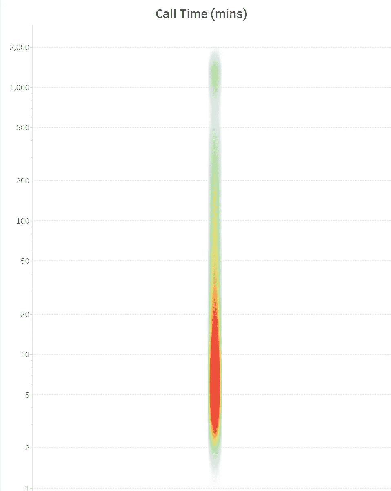
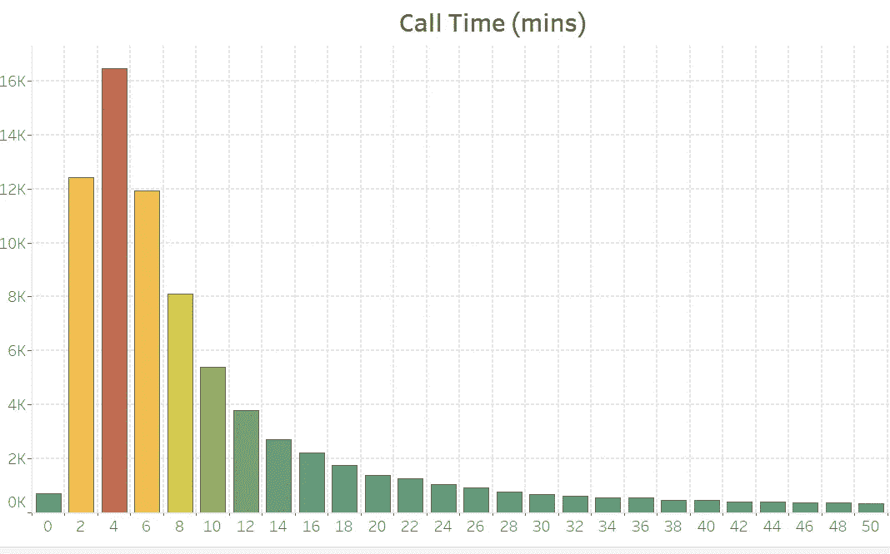
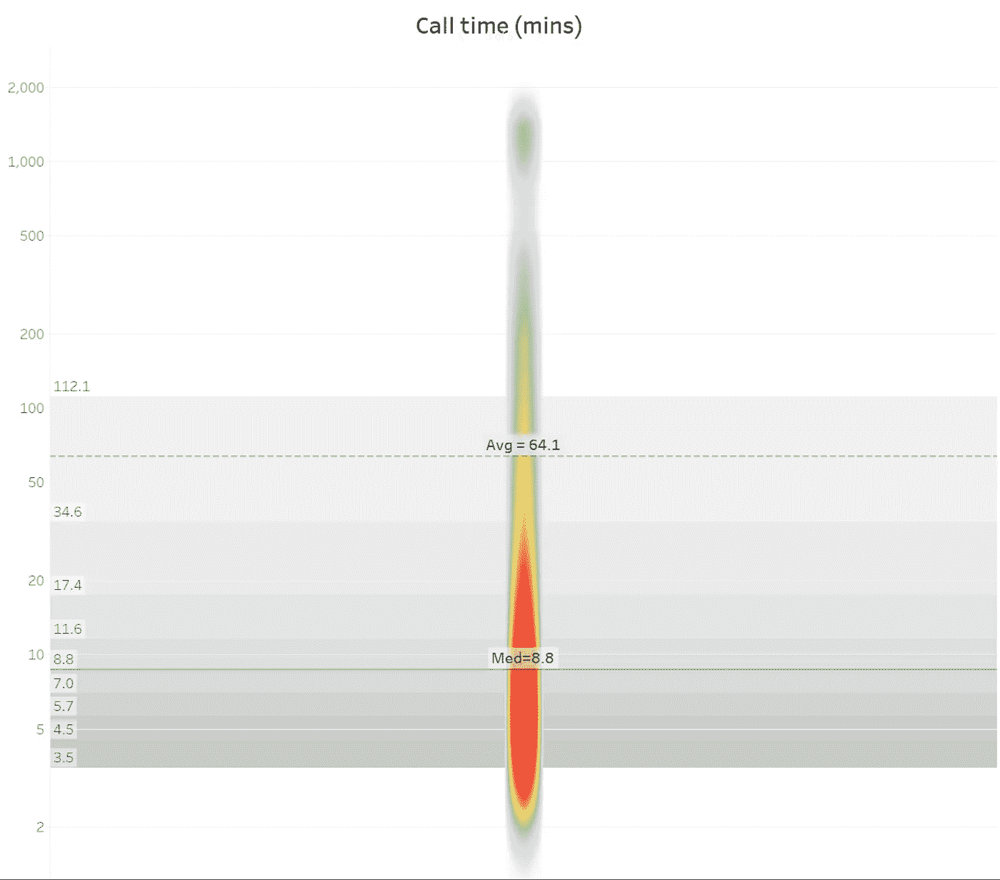
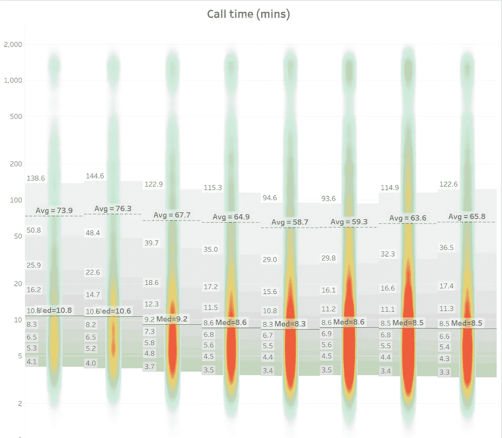
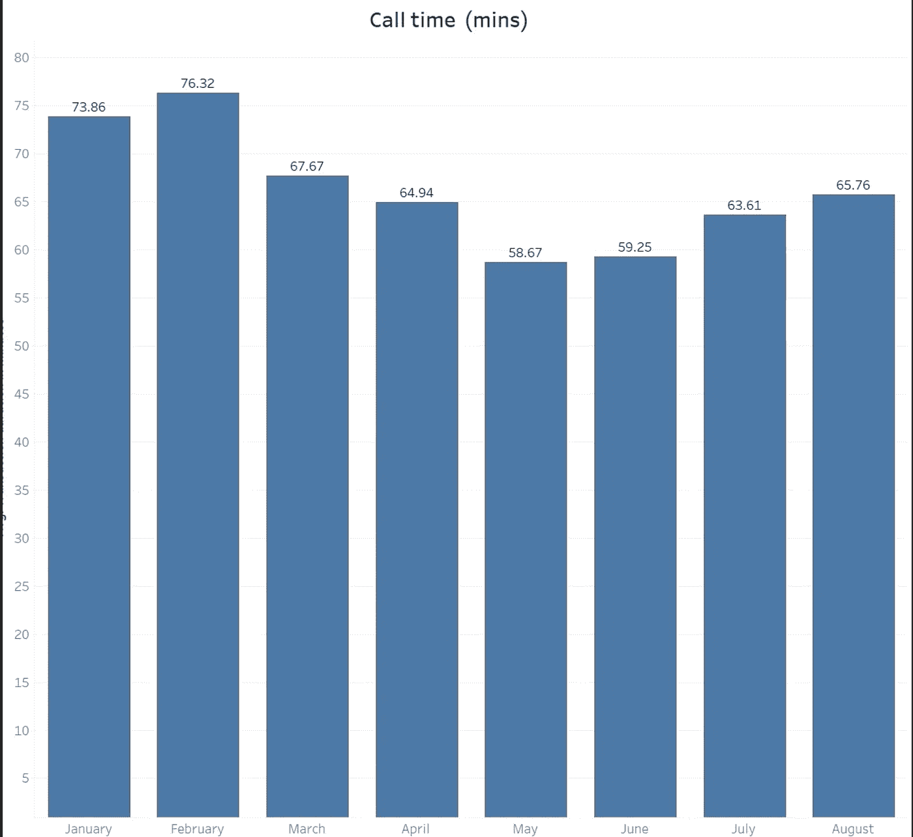

# 最惊艳的图表！

> 原文：<https://towardsdatascience.com/the-most-amazing-chart-a5d101119e81?source=collection_archive---------25----------------------->

## 为什么密度图表让一切更清晰

我在[之前的一篇文章](https://link.medium.com/VatECxIfkkb)中写道，我们试图解释大量数据的努力注定要失败:理想情况下，我们想要探索整个数据集，理解每一个数据点，但这当然是不可能的任务。因此，我们转而使用摘要描述符(平均值、百分位数、方差等)或图表来综合和理解大型数据集。我认为这总是一种不完美的努力——而且在平均值的情况下经常误导人:这就像试图用 300 字的摘要来总结一部伟大的文学作品，比如《战争与和平》:这可能会给人一种错觉，以为他们已经读过这本书，但当然，这只是一种错觉…

# 密度图

然而，有一个特殊的图表，接近于查看整个数据集，几乎就像阅读整部小说而不会在摘要中混淆:密度图表。事实上，密度图有效地显示了所有的数据点，因此没有信息损失。虽然肉眼在技术上无法看到每个单独的点，但该图表通过使用颜色阴影暗示了它们集中的位置(例如，较高浓度的较暖色和较稀疏数据集的较冷色，如下所示)。)

这适用于任何数量的大型数据集，有一个连续的衡量标准，无论是零售商店每个篮子的平均销售额，每个用户在网站上花费的时间，每个县每天的降雨量，每个标题售出的书籍数量，等等。

这是一个图表示例，展示了呼叫中心的大量呼叫。每个点代表呼叫中心的呼叫时间。

密度图表的图示—每个“点”代表一次呼叫，因此该图表有效地代表了所有数据点(图片由作者提供)

我喜欢说，我们看到的任何东西从技术上来说都是一种分布，密度图表的美妙之处在于它们向我们展示了分布的实际形状。颜色/密度取代了第三个维度(高度),第三个维度将使这成为一个实际的概率密度图。

# 如何创建此图表:

这很容易在 Tableau 这样的工具中通过…

*   选择“密度”标记，
*   确保您实际上绘制了所有单独的数据点(在这种情况下是单独的调用)
*   添加您想要的度量(在这种情况下，通话时间以分钟为单位)
*   选择合适的色标(我喜欢“温度”色标，因为我发现它的解释更通用)
*   注意 y 轴上的对数刻度。它通过散布点来提高可见性:在有大量离群值的大型数据集中，有一种风险是在规则的尺度上“挤压”底部的大多数数据点。对数刻度允许您扩展数据并获得更好的可见性。不过这也伴随着一个警告:距离不是线性的——两倍的距离实际上是 10 倍的增长——所以未经训练的眼睛可能会被欺骗

还要注意，密度图本质上是直方图上的一个不同旋转——或者顾名思义，是表示概率密度函数的另一种方式，如下图所示

显示每个“桶”中呼叫计数的等效直方图。我在这里排除了极端值(> 50 分钟)，以避免扭曲数据(图片由作者提供)

我喜欢将第一个图表与直方图结合起来，因为它让我了解每种颜色所代表的体积。

在 Tableau 中创建直方图可以很容易地完成，方法是在所需的度量(本例中为呼叫时间)上创建“箱”,并计算每个箱中的点数。

# II —介绍描述符

我们现在当然可以添加所需的摘要描述符:中值、平均值、百分位数(从 10%到 90%)、最小值和最大值。有了这种背景下的可视化，这些描述符现在比在真空中给出的描述符更能有力地表明正在发生的事情。有趣的是注意到:

*   像所有大型数据集一样，离群值是存在的，也是有意义的。这张图表把他们放在一个角度，因为你可以看到 90%的位置和最小值/最大值在比较中的位置。请记住，所有数据点都属于一个分布，根据数据中的分布，异常值可能有也可能没有更大的影响(例如，在以厚尾为特征的幂律/帕累托风格分布中，极值有显著影响)
*   中位数反映了人口“中心”的行为。记住平均值和中值之间的重要区别:平均值会受到异常值的强烈影响，而中值不会——这解释了图表中的差异。

向密度图表添加描述符(图片由作者提供)

您可以通过在轴上添加“参考线”来在 Tableau 中添加这些描述符。您需要为中间值添加一条参考线，为平均值添加一条参考线，为百分点添加一条参考线。

# III —尺寸简介

现在，当您引入一个您想要比较数据的维度时，事情变得更加有趣:这可以是一个时间元素(例如，每月呼叫时间的趋势)或任何其他类别(例如，西班牙语呼叫是否比英语呼叫更长)或按代理(某些代理是否比其他代理花费更长时间？)

添加比较维度(图片由作者提供)

要在 Tableau 中添加维度，只需将所需的维度拖到列中。

# 结论

将这些密度图与只看平均值提供的“差”信息进行比较

作者图片

没有任何迹象表明:

*   所涉及的数据点数量(上图显示一月和二月的观察值较少)
*   极端的行为(七月和辩论)实际上看到了底层 10%的改善——平均值是误导
*   平均值会受到高异常值的强烈影响…它绝不会反映“典型”/最频繁呼叫的行为—中值是一个更好的指标

密度图比直方图更方便，因为它更简洁:想象一下，必须每个月绘制一个直方图来比较不同的月份！

这方面的用例可以是任何一种分布，在这种分布中，您倾向于使用平均值来比较选项，或者您希望在不运行回归模型的情况下探索特定输入对您正在测量的结果的影响。请记住，这个图表的一个主要优点是，它们可以很容易地快速向您显示异常值，并且可以透视平均值和中间值，这是模型并不总是擅长的。这里仅举几个例子:

*   处理一项任务所需的时间(客户呼叫、网站加载时间、API 调用、制造小部件等)。然后你可以比较不同时间(几个月)，不同人(某些人天生比其他人快吗？)，一天中的不同时间(我们是否在特定时间超载>)
*   在零售中，每个顾客的平均购物篮价值:在这种情况下，每个数据点是例如超市中顾客的总购物篮价值。您可以与已知维度(一天中的时间、客户类型等)进行比较
*   销售人员效率:每个数据点都是销售代表为特定客户完成的单笔销售。然后，您可以在销售代表之间或客户之间进行比较。例如，您可以很快看到特定销售代表的高价值是否是由一些异常销售推动的。