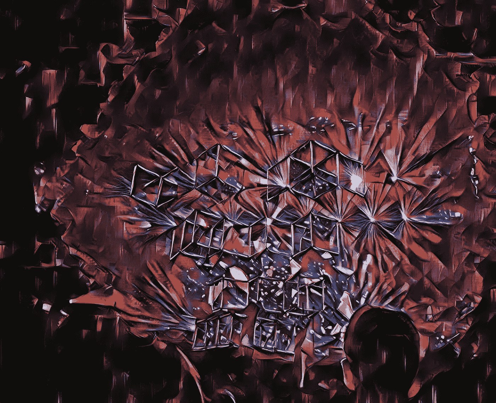
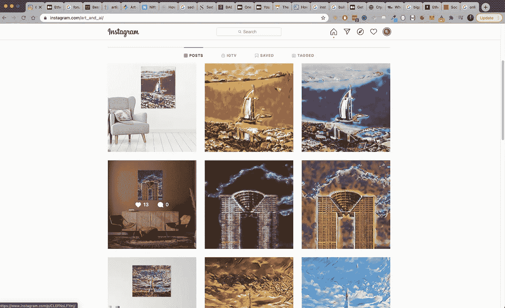
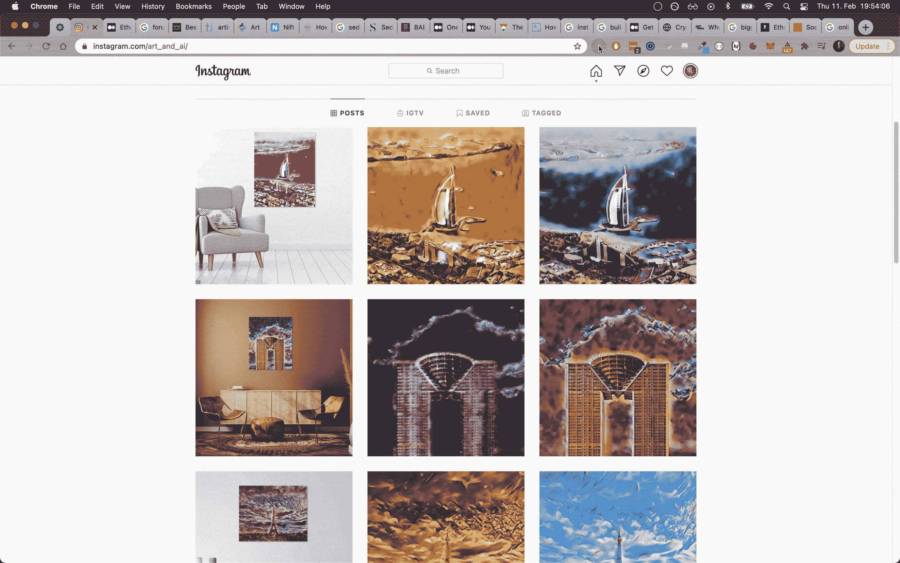
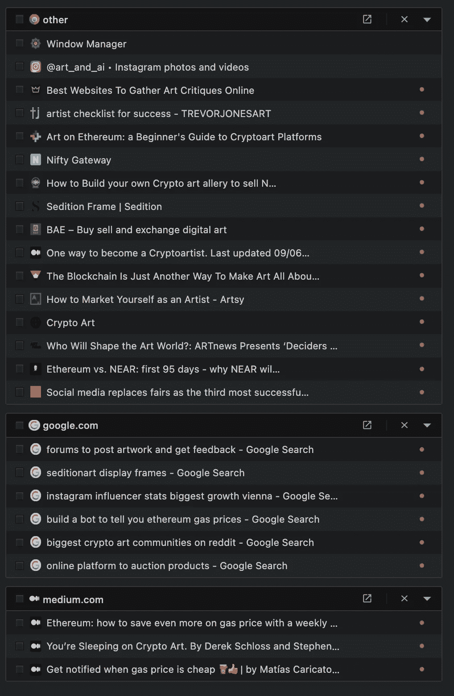
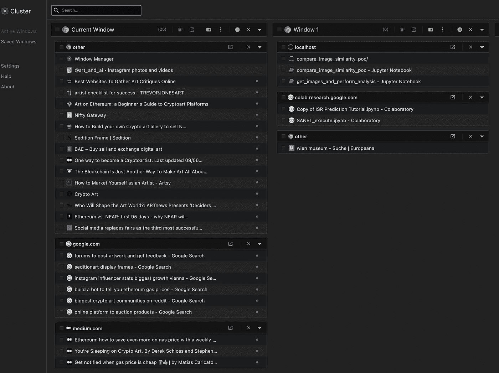
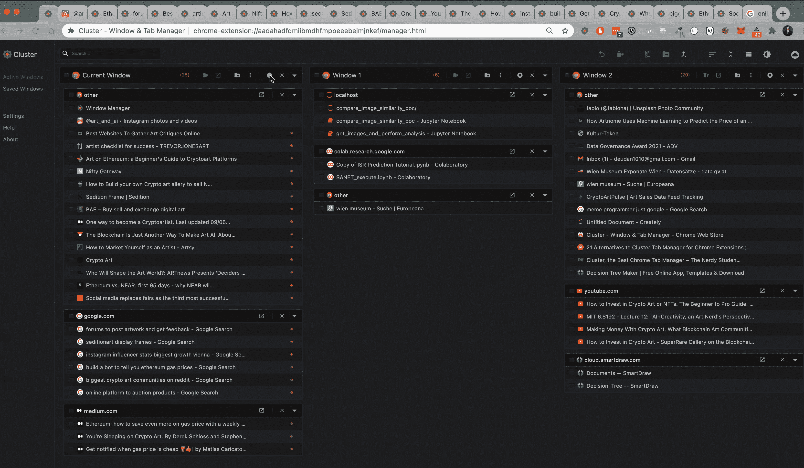
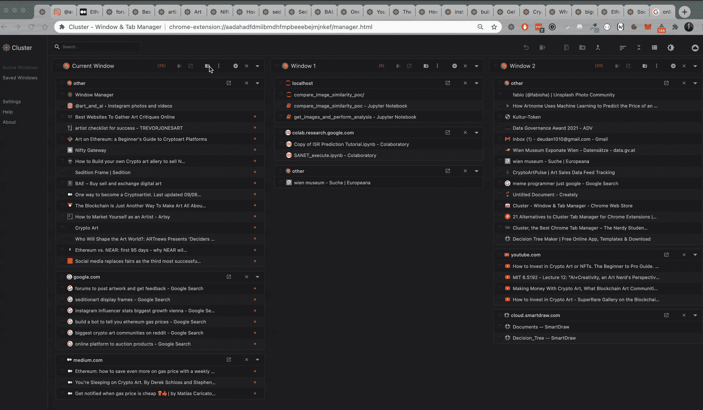

# 对数据科学家来说，最有效但最隐蔽的生产力工具

> 原文：<https://towardsdatascience.com/the-most-effective-but-hidden-productivity-tool-for-a-data-scientist-e2f65d98b7e7?source=collection_archive---------11----------------------->

艾通过作者创造艺术。更多例子上**；受法比奥哈关于*的启发[https://unsplash.com/photos/oyXis2kALVg](https://unsplash.com/photos/oyXis2kALVg)*

*我已经做了一段时间的开发人员了。几乎所有的职位和专业都在讨论什么是最好的工具。它与软件工具如 IDEs (VSCode，Webstorm，Vim 等)或硬件工具(mac，pc，linux)一起使用。讨论总是好的，然而，最终每个人都会发现自己的风格最适合自己的工作流程。因为每个人做的事情都有一点不同，所以这很有意义。有一个工具我到目前为止还没有讨论过，但是对我的工作有很大的帮助。*

# *目录*

*   *[生产力的关键方面](https://github.com/Createdd/Writing/blob/master/2021/articles/hiddenToolForProductivity.md#key-aspects-of-productivity)*
*   *[问题](https://github.com/Createdd/Writing/blob/master/2021/articles/hiddenToolForProductivity.md#the-problem)*
*   *[工作研究](https://github.com/Createdd/Writing/blob/master/2021/articles/hiddenToolForProductivity.md#research-on-the-job)*
*   *[解决方案](https://github.com/Createdd/Writing/blob/master/2021/articles/hiddenToolForProductivity.md#the-solution)*
*   *[标签聚类](https://github.com/Createdd/Writing/blob/master/2021/articles/hiddenToolForProductivity.md#clustering-of-tabs)*
*   *[悬浮标签/窗口](https://github.com/Createdd/Writing/blob/master/2021/articles/hiddenToolForProductivity.md#suspending-tabswindows)*
*   *[保存选项卡/窗口](https://github.com/Createdd/Writing/blob/master/2021/articles/hiddenToolForProductivity.md#saving-tabswindows)*
*   *[为什么我认为这很重要](https://github.com/Createdd/Writing/blob/master/2021/articles/hiddenToolForProductivity.md#why-i-think-this-is-important)*
*   *[免责声明](https://github.com/Createdd/Writing/blob/master/2021/articles/hiddenToolForProductivity.md#disclaimer)*
*   *[关于](https://github.com/Createdd/Writing/blob/master/2021/articles/hiddenToolForProductivity.md#about)*

# *生产力的关键方面*

*首先，我想说明为什么这个工具很重要。我正在做的主要工作是解决问题。作为一名数据科学家，我有一大堆问题要处理。它从理论和规划方法开始，经过实施过程，并以演示或部署结束。*

*从来没有什么都知道的完美的人。在一直处理不同的问题时尤其如此。每个数据集都有点不同。有自己的怪癖需要解决。机器学习(ML)实现也是如此。你总是有你喜欢的 ML 算法，但是你经常测试不同的方法以确保你得到最好的结果度量。*

*因此，每个问题都需要一种方法来以省时的方式解决，同时产生可靠的结果。*

*首选工具几乎总是浏览器(chrome)和谷歌。*

*我喜欢谈论谷歌搜索是程序员唯一真正技能的迷因。*

**

*作者图片*

*然而，随着年龄的增长，我越来越珍视它。事实上，我甚至在面试时把它视为一种技能。我不喜欢记忆算法。其实是反过来的。我重视快速和最好的实现，而不是死记硬背。*

*我不想谈论如何用谷歌搜索东西。大家过一段时间就对行业有感觉了。(但也有那方面的文章)。*

*我谈论浏览器和标签。*

# *问题是*

*如果我检查 TODOs 或研究某个问题，这并不重要。我总是以打开多个标签结束。*

*看起来是这样的:*

**

*多个标签打开；作者图片*

*在这个例子中，我想在 cryptoart 世界中继续工作。如你所见，它很快变得凌乱不堪。如你所见，我有各种各样的想法需要详细阐述。比如，出售你的作品的最佳平台是什么，如何获得更多的关注者，关于 crypto 开发的文章等等。这些都是在研究一个话题时需要考虑的必要因素。*

# *关于工作的研究*

*研究 ML 实现也是如此。我决定了一个算法，在研究过程中，出现了新的想法甚至更好的方法。*

*例如，这里我从实现决策树分类器的想法开始。在研究过程中，还有许多其他方面需要考虑。正如你在左边最后一页看到的。有一个问题是，如果需要进行太多的插补，不同的算法是否会更好。*

**

*用 [Smartdraw](https://www.smartdraw.com/) 完成；作者图片*

# *解决方案*

# *标签的聚集*

*是用一个叫做[集群——窗口&标签管理器](https://chrome.google.com/webstore/detail/cluster-window-tab-manage/aadahadfdmiibmdhfmpbeeebejmjnkef)的 chrome 扩展来管理标签。*

*它允许您将选项卡和浏览器窗口聚集在自己的选项卡中。*

**

*标签的聚集；作者图片*

*这可以让你对所有的标签页和窗口有一个完美的概览。*

*您可以将选项卡分类到相关选项卡聚集的域中。*

**

*集群标签；作者图片*

*在这种情况下，它被聚集到 google、medium 和 other。*

*这非常有帮助，尤其是当您在 Stackoverflow 上查找各种实现问题时。我经常发现我已经有了类似的问题。这种聚类帮助了我。*

*还有我读的文章。我经常阅读一些东西，在阅读的时候我会研究一个想法。这有助于我将阐述保持在相应文章的轨道上。*

# *暂停标签/窗口*

*这是一个巨大的好处。你可能已经意识到，当大量的标签被打开时，chrome 会占用相当多的内存。*

**

*Chrome 上的 Meme 需要内存；作者图片*

*这是一个性能问题。*

*不仅速度变慢，有时还会崩溃。在我的数据科学工作中，我会遇到这种情况，因为我研究内容，还打开了 jupyter 笔记本/实验室。或者谷歌 colab。所有这些都是在 chrome 中完成的，这导致了性能问题。*

**

*一个窗口研究，一个窗口笔记本；作者图片*

*如您所见，window 1 打开了与执行相关的笔记本。*

*为了有所帮助，你可以暂停不用的标签。*

*您可以使用单个选项卡或组来完成此操作。*

**

*暂停选项卡以提高性能；作者图片*

# *保存选项卡/窗口*

*最后一个很酷的功能是保存窗口和标签。如果你从事多项跨学科的工作，你将有多个窗口用于不同的工作组。这个工具可以帮助你保存标签页，并在不需要的时候关闭它们。如果您以后还需要它们，恢复既快速又简单。*

**

*保存标签；作者图片*

# *为什么我认为这很重要*

*我认为正确使用浏览器和谷歌是当今数据科学家最重要的技能之一。它经常被忽视，我已经看到在这方面出现了奇怪的问题。人们打开了数百个标签和窗口。浏览器多次崩溃。失去了宝贵的进步。*

*到目前为止，我发现这对我的工作很有帮助，希望对你也有帮助。*

*我还认为，生产力相关工作的未来会围绕这样的事情发展。*

> *有价值的不是信息量，而是质量。从重要的信息中分离出无意义的信息是目前你能拥有的最重要的技能。*

*在这方面还有很多要讨论的。让我知道你对此的想法。*

# *放弃*

*我与本文中使用的任何服务都没有关联。*

*我不认为自己是专家。我不是博主什么的。除了做其他事情，我只是记录事情。因此，这些内容并不代表我任何作品的质量，也不完全反映我对事物的看法。如果你觉得我错过了重要的步骤或者忽略了什么，可以考虑在评论区指出来或者联系我。*

*我总是乐于听取建设性的意见以及如何改进。*

*这写于 2021 年 2 月 12 日。我无法监控我的所有文章。当你阅读这篇文章时，提示很可能已经过时，过程已经改变。*

*如果你需要更多关于某些部分的信息，请在评论中指出来。*

# *关于*

*丹尼尔是一名艺术家、企业家、软件开发人员和商业法毕业生。他曾在各种 IT 公司、税务咨询、管理咨询和奥地利法院工作。*

*他的知识和兴趣目前围绕着编程机器学习应用程序及其所有相关方面。从本质上说，他认为自己是复杂环境的问题解决者，这在他的各种项目中都有所体现。*

*如果您有想法、项目或问题，请不要犹豫与我们联系。*

**

*作者图片*

*连接到:*

*   *[Allmylinks](https://allmylinks.com/createdd)*

*直接:*

*   *[领英](https://www.linkedin.com/in/createdd)*
*   *[Github](https://github.com/Createdd)*
*   *[中等](https://medium.com/@createdd)*
*   *[推特](https://twitter.com/_createdd)*
*   *[Instagram](https://www.instagram.com/create.dd/)*
*   *[createdd.com](https://www.createdd.com/)*

*艺术相关:*

*   *[中等/最先进的](https://medium.com/the-art-of-art)*
*   *[Instagram/art_and_ai](https://www.instagram.com/art_and_ai/)*
*   *[稀有](https://app.rarible.com/createdd/collectibles)*
*   *[开阔的海面](https://opensea.io/accounts/createdd)*
*   *[已知产地](https://knownorigin.io/profile/0xC36b01231a8F857B8751431c8011b09130ef92eC)*
*   *[魔鬼艺术](https://www.deviantart.com/createdd1010/)*