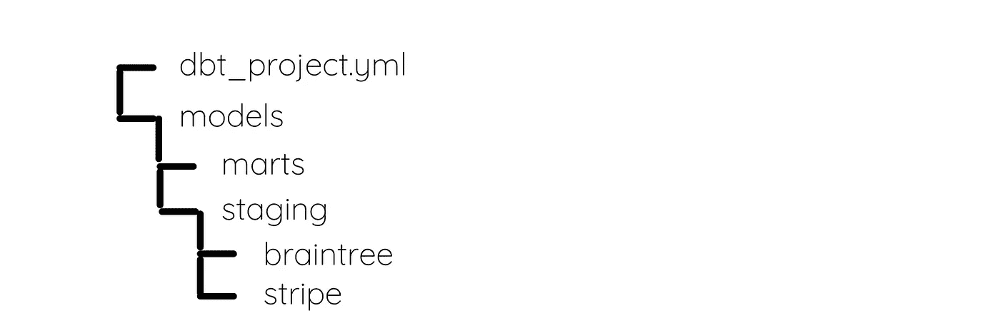
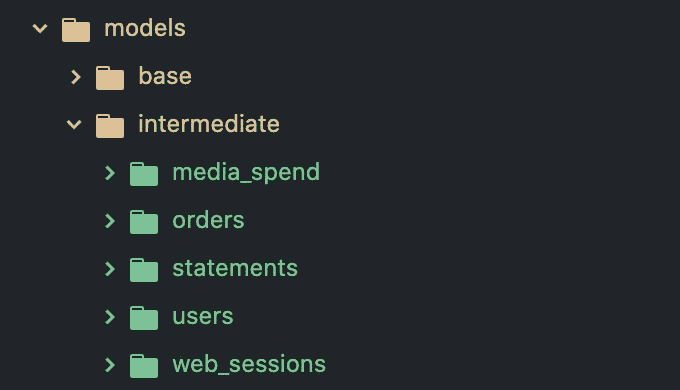
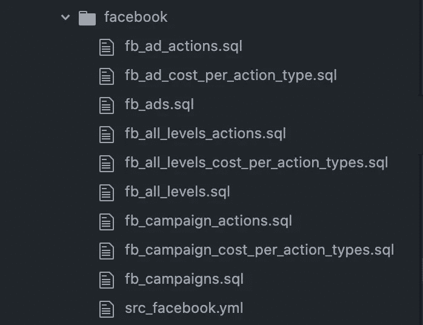

# 组织 Dbt 模型的最有效方式

> 原文：<https://towardsdatascience.com/the-most-efficient-way-to-organize-dbt-models-244e23c17072?source=collection_archive---------5----------------------->

## 命名约定、yml 文件和文件夹结构

[@shawnanggg](https://unsplash.com/@shawnanggg?utm_source=unsplash&utm_medium=referral&utm_content=creditCopyText) 在 [Unsplash](https://unsplash.com/s/photos/organization?utm_source=unsplash&utm_medium=referral&utm_content=creditCopyText) 上的照片

Dbt 是分析界的热门工具，而且只会越来越受欢迎。分析师和分析工程师都使用它来以更快、更可靠的方式运行模块化代码。

组织是以对团队有效的方式使用 dbt 的关键组成部分。它的用处取决于您的 dbt 项目结构的组织程度。

对于那些从未使用过 dbt 的人来说，这可能是相当吓人的。幸运的是，这个工具背后的团队已经彻底地[记录了](https://docs.getdbt.com/docs/building-a-dbt-project/documentation)他们用于个人客户的结构。

虽然我使用他们的结构作为建立我的模型的指南，但是组织的很多部分依赖于你自己的用例以及你所支持的团队。

一种制度不适合所有人。这在很大程度上是一门艺术，要弄清楚什么最适合你的分析团队。

## 文件夹结构

dbt 的团队建议将你的模型组织到两个不同的文件夹中- **staging** 和 **marts** 。

暂存模型是那些从原始数据文件中读取并涉及数据清理的模型。有时需要连接和更复杂的转换。

Dbt 建议在组织您的模型时，将阶段模型和基础模型包含在这个类别中。基本模型也从源数据中读取数据，但要简单得多，包括对列的转换和重命名。

集市模型是包含聚合、连接和复杂逻辑的更高级的模型。这实际上是包含最终产品的文件夹。

作者图片

当我使用这个文件夹结构作为设置模型的指南时，我添加了一些其他的文件夹来帮助保持事情更加有条理。我们的模型非常复杂，所以有许多中间模型组成了每个核心模型。如果没有额外的文件夹，文件会在风暴中丢失。

我为这些中间模型创建了一个单独的文件夹，这样当我需要它们时，我可以很容易地找到最重要的模型。在这个中间文件夹中是每个核心模型的文件夹(那些存在于 marts 文件夹中的)，所以我可以跟踪哪些模型与每个核心模型相关。

作者图片

您还可以遵循 dbt 文档中的建议，在 staging 文件夹下包含一个嵌套的中间模型文件夹。

`staging/<source>/intermediate/`

此外，我们只有一个用于基本模型的文件夹，而不是暂存文件夹。它们都相当简单，只需要转换和重命名，所以不需要阶段模型。

在基本文件夹中，每个数据源都有一个文件夹，其中包含每个数据表的 SQL 文件。这些 SQL 文件中的每一个都从不同的数据源和表中读取。

作者图片

此外，每个文件夹都有自己的 yml 文件，所以没有一个大的 yml 文件用于所有的基础模型。我想让东西尽可能地容易阅读和理解。有时候一个地方的信息太多会让人不知所措。

作者图片

下面是我遵循的结构的快速概述:

*   基础
*   媒介的
*   市场/核心

在基本文件夹中，它看起来像:

*   <data source="" name="">(文件夹)</data>
*   <data source="" table="" name="">(文件)</data>

在中间文件夹中，它看起来像:

*   <core model="" name="">(文件夹)</core>
*   <intermediary model="" name="">(文件)</intermediary>

最后，在 mart 文件夹中，它看起来像:

*   <core model="" name="">(档案)</core>

## 命名规格

既然我们已经讨论了文件夹结构，让我们深入实际模型的命名约定。

dbt 团队建议在您的模型名称中使用前缀。根据模型的类型，您应该遵循以下格式:

> <dbt folder="" name="" type="">_</dbt>

**暂存/基本型号**

Dbt 建议遵循格式 *stg_ <源> _ <对象>。用于所有暂存模型的 sql* 。就我个人而言，我发现在我们的基本模型中，给每个模型添加一个 base 前缀是非常多余的，并且会使模型名变得很长。

而是按照格式 *<来源> _ <对象>。基本模型的 sql* 。因为它们都被组织在基本文件夹下，所以从来没有混淆过。

在这种情况下，Source 是数据源，如脸书、Shopify、谷歌广告或 Snapchat。对象是 SQL 文件从中读取的数据表的名称。

**中介模式**

虽然 dbt 对于中间模型没有任何明确的命名约定，但这是我如何命名我的模型的。我发现这些是最重要的组织模型，因为它们太多了(至少当你有很多数据的时候)。

我有每个核心模型的简短版本，我用它作为中间模型的前缀。然后，按照 dbt 的建议，我将这些模型基于它们的功能。

> <core model="" short="" name="">_ <model function="">。结构化查询语言</model></core>

例如，我的一个核心模型名为 *order_details* ，因此它的一个中间模型名为*order _ margins _ calculated . SQL*。 *order_details* 的简称是 order，模型的功能是计算产品利润。

**集市型号**

Dbt 对 mart 模型有一些不同的建议。他们建议在这些模型中使用两种前缀选项:

*   *fct _ <动词>*
*   *dim_ <名词>*

dbt 文档将 *fct* 表定义为“一个又高又窄的表，表示已经发生或正在发生的真实世界的流程。这些模型的核心通常是不可变的事件流:会话、交易、订单、故事、投票”。

相比之下，他们将 *dim* tables 定义为，“一张又宽又短的桌子，每一行都是一个人、一个地方或一件东西；在识别和描述组织的实体时，这是事实的最终来源。它们是可变的，尽管在慢慢变化:客户、产品、候选人、建筑、员工”。

我们没有太多关于 *fct* 表格的应用，但是我们确实使用 *dim* 表格。然而，并非我们所有的型号都属于这一类别。我们只将 *dim* 表用于将几个不同的表连接在一起的更基本的模型。

例如，我们有一个模型 *dim_products* ，它将所有与产品相关的表连接在一起。这些类型的模型使我们的分析师的工作变得容易得多，因为他们不必担心每次需要编写分析时将所有的表连接在一起。

我们的其他核心模型是根据它们包含的数据命名的。我发现以它们所提供的功能命名它们，并使用后缀 *details* 很好地解释了模型*。*但这都是个人喜好！

## Yml 源文件

保持 dbt 模型有组织的最后一个关键部分是编写 yml 源文件。这些包含所有与您的模型相关的文档。它们详细描述了模型名称、描述和列。

这些文件中的完整文档是理解您的数据和传达您构建的每个模型的价值的关键。这将成为您所有 dbt 模型的数据字典(字面上的意思)。确保你正确使用它！

使用命令 *dbt docs serve 将这些 yml 文件[作为 dbt 文档](https://docs.getdbt.com/reference/commands/cmd-docs)提供。* Dbt 将以创建一个完整网站的方式组织这些文件，您的文档可以在该网站上保存，并且组织中的任何人都可以轻松访问。

我建议用它们所在的文件夹来命名这些 yml 文件。例如，如果文件位于核心文件夹中，它将被命名为 *core.yml* 。这个 yml 文件将包含核心模型的所有描述和列。

当您在每个 yml 文件中构建模型时，请确保完整地记录您的模型。构建时包含的细节越多，将来就越容易理解模型。

## 结论

请记住，您的 dbt 项目是按照您制定的约定来组织的。随着您的数据团队的成长以及多人开始访问您的模型，命名约定和文件夹结构变得越来越重要。

我强烈建议整理一份风格指南，详细介绍我们刚刚讨论过的所有信息。这不仅便于你将来参考，也便于你的团队参考。

请记住，如果您发现某些东西不工作，您可以随时更改这些东西。只是要确保在深入构建模型之前尽早这样做。当你认识到问题的时候，在问题开始的时候解决问题要比在问题已经造成太多损害的时候解决问题容易得多。

快乐大厦！

[通过订阅我的电子邮件列表，了解更多关于其他流行的现代数据堆栈工具的信息。](https://mailchi.mp/e04817c8e57e/learn-analytics-engineering)